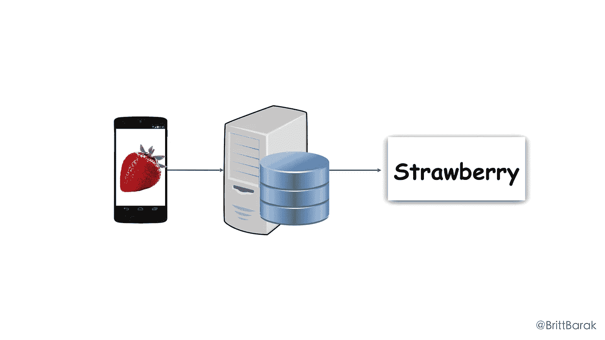
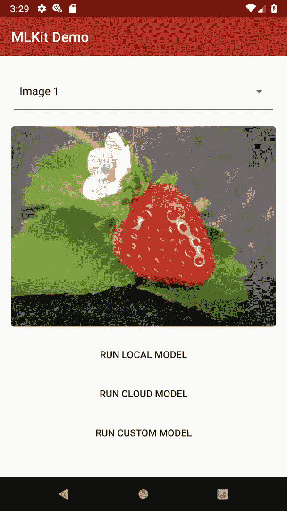

# 谁害怕机器学习？第 4 部分:走向移动！ML-Kit 为什么&如何？

> 原文：<https://medium.com/google-developer-experts/whos-afraid-of-machine-learning-part-4-going-mobile-ml-kit-why-how-200f245ef8f8?source=collection_archive---------5----------------------->

## 面向移动开发者的 ML & ML-Kit 简介

[Alexas_Fotos](https://pixabay.com/en/users/Alexas_Fotos-686414/)

以前的帖子给出了一些关于机器学习的想法，以及它是如何工作的。现在是作为移动开发者开始应用 it 的时候了！

对于一些定向，**在这一系列:**

1.  [第一部分:他们都在谈论什么？](/@britt.barak/https-medium-com-britt-barak-whos-afraid-of-ml-part1-e464264c3cf0)
2.  第 2 部分:如何创造一台学习的机器？
3.  [第三部分:关于学习](/@britt.barak/whos-afraid-of-machine-learning-part-3-about-that-learning-85a8bf336b5a)..
4.  第 4 部分:走向移动！ML-Kit 为什么和如何？ **(←你在这里**🍓 **)**
5.  第 5 部分:使用本地模型(即将在✨推出)
6.  第 6 部分:使用云模型(即将在✨发布)
7.  第 7 部分:使用定制模型(即将在✨发布)

# 为什么在设备上？

如果你看了我以前的帖子，你已经知道我喜欢草莓🍓。当然，我也喜欢手机应用程序📱！！

接下来，我将在一个移动应用程序中应用一个草莓探测器机器学习模型(如前所述)。在我们讨论如何做之前，有一个重要的问题:

> **为什么我们需要在设备上应用模型？**🤔

我的意思是，作为移动开发者，我们知道移动设备资源非常有限。我们经常倾向于让服务器端为我们做复杂的计算和繁重的工作。那么为什么不在这里做同样的事情呢？为什么不向服务器发送图像，让服务器进行处理，运行模型，然后将结果发送回客户端呢？

仅在云上以这种方式运行模型有一些缺点。仅举几个例子:

*   **延迟**:即使处理速度非常快，向服务器发送数据并等待响应也需要一些时间。如果需要实时处理呢？例如，一个用例可以是在视频通话期间检测面部特征。当我们向服务器发送一个帧并等待结果时，它可能与用户无关，因为该帧不再可见。
*   **带宽**:往往带宽很贵。如果我们发送的数据量很大，比如照片，就更是如此。
*   **离线支持**:移动设备经常漫游，网络质量参差不齐，而且经常掉线。没有互联网连接就无法运行的应用程序通常会提供糟糕的用户体验。
*   **性能**:大量的网络请求很可能是电池耗尽的原因。
*   **隐私和安全**:用户希望在本地保存私人数据，如个人照片、医疗信息、财务细节等，这是有道理的。否则，我们将需要考虑许多安全挑战

希望这些足以让你相信，寻找一个在设备上移动定制的解决方案是值得的。

from the [official website](https://firebase.google.com/products/ml-kit/)

# **进入 ML-KIt！**

对我来说，谷歌 I/O 2018 最令人兴奋的宣布之一是 [MLKit](https://firebase.google.com/products/ml-kit/) 。不久以前，ML 听起来像一个神奇的词🧞‍️.它能用来做什么，如何做，对我们许多人来说，有一段时间是相当模糊的。

MLKit 采用了一些常见的 ML 用例，并用一个漂亮的 API 将它们包装起来。此外，如果您有特定的用例，也可以使用定制模型。然后，我们将能够进行版本管理，并定义在何种条件下将模型更新下载到设备，而无需推出新的。 *apk* 。几乎不用说，它是跨平台的，因此可以在两个 Android & iOS 上使用。

MLKit 仍处于测试阶段，但使用起来非常酷和有趣！我强烈建议开始试验，找出哪些用例对你的产品有益。

在开箱即用的使用案例中，我们可以找到一些日常案例。目前，它们都与图像的处理和结论有关。因此，我们将在 *FirebaseVision* 库下找到它们。

每个模型都受设备上和/或云上的支持。

## MLKit 使用案例:

*   **图像标记**【在设备&云上】——差不多就是到目前为止所做的。拍摄图像，并检测其中包含的实体，如物体、动物、水果、活动等。您可以使用这些标签来执行内容审核、过滤或搜索。此外，能够处理元数据而不是整张照片可以帮助解决带宽、离线支持、隐私等问题，如上所述。例如，在聊天应用程序上，能够只发送标签而不是整张照片，可以受益匪浅。
*   **文本识别**【在设备上&云】—从图像中检测文本。它可以用于标志、标签、文档等的照片…除了上面提到的使用元数据而不是图像的好处，它对许多用例都非常有用。例如:为 a11y 配对文本到语音服务；执行 i10n 的翻译；或者使用情感分析服务来定制体验；这个 API 非常好，因为它允许我们知道每个单词的位置，所以你可以问:例如，第三句话中的第二个单词是什么？
*   **人脸检测**【在设备上】—不要和人脸识别混淆，人脸识别可以识别图像中的人是谁，或者知道我们在多张照片上看到的是同一个人。这是关于检测面部特征，他们在屏幕上的位置，他们的角度，嘴是否在微笑等等..处理是在设备上进行的，速度非常快，因此它可以很好地处理实时视频聊天或游戏的帧。
*   **条形码扫描**【在设备上】—从图像中提取条形码封装的字段。同样，只处理元数据而不是完整的图像对于许多用例来说是一个巨大的优势。
*   **地标识别**【云】——可以告诉你照片中著名地标的细节。
*   **定制型号**[在设备上] —您拥有的任何 TensorFlow Lite 型号。后面会讨论。

很高兴注意到“ ***检测*** ”通常指的是在照片上找到某个对象，以及该对象在照片上出现的细节(比如人脸检测，它识别人脸的特征以及它们在照片上的位置)。而“识别”意味着找到一个物体，并在特定照片之外的更广阔的背景下理解它。(就像地标识别一样，一张照片被赋予世界上某个地方的背景。或者 MLKit 不做的人脸识别，知道这张脸属于谁，或者在其他照片上匹配为同一个人)

让我们继续我们的草莓或不是应用程序的例子。让我们看看如何使用 MLKit 通过 3 种模式实现它:

*   本地模型，来自开箱即用的用例
*   基于云的模型，来自开箱即用的用例
*   自定义 TensorFlow Lite 模型

每个用例，无论是本地的还是云上的，都是由不同的模型实现的。也就是说，它需要不同的输入，产生不同的输出……它的工作方式也不同！所以期待不同的结果。

这听起来可能很可怕..但其实真的不是。使用每个模型基本上包括 4 个步骤:

> 1.设置检测器
> 
> 2.处理输入
> 
> 3.运行模型
> 
> 4.处理输出

## 我们的演示应用

在接下来的文章中，我们将探讨如何使用 MLKit 以 3 种不同的方式对图像进行分类:使用本地模型、云模型和自定义模型。我将在后面详细阐述每一个。我将通过一个简单的演示应用程序展示如何使用这些模型。

我们的应用程序将持有静态图像列表。选择图像后，单击下面的按钮将运行相应的模型，以便对图像进行分类。

该模型输出图像的可能标签，我们将显示概率最高的前 3 个标签。

为了让我们的思维有条理，让我们来谈谈我们将在接下来的帖子中写的演示应用程序的结构:

***UI***(*main activity*)将图像(*位图*)发送到***image Classifier***类，该类将图像发送到特定的分类器进行分类(***local Classifier***、***cloud Classifier***或***custom Classifier***)。每个*分类器*是唯一知道受尊重的 ML 模型的类。它将处理输入，运行模型，处理输出(如果需要的话)，然后将结果发送到***image classifier***以使其尽可能容易地在 UI 上显示。

*   *注意*:在这个演示中，用户要求运行一个特定的模型。通常，在真实的生产用例中， *ImageClassifier* 可以根据网络状态和其他因素来推断使用哪个模型。

完美！这是结构。在接下来的文章中，我们将使用不同的模型来实现图像分类。加入我吧！