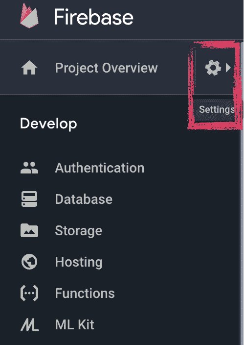
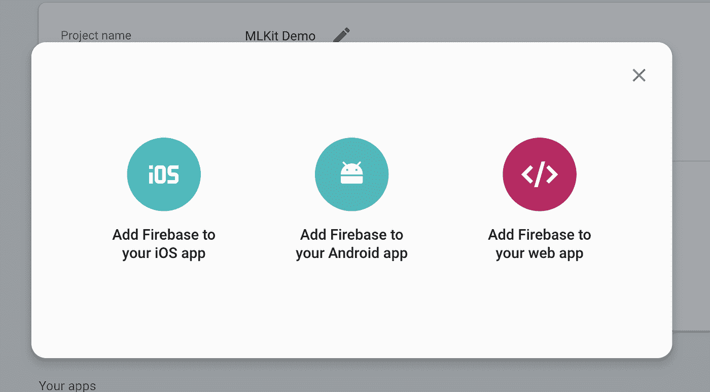
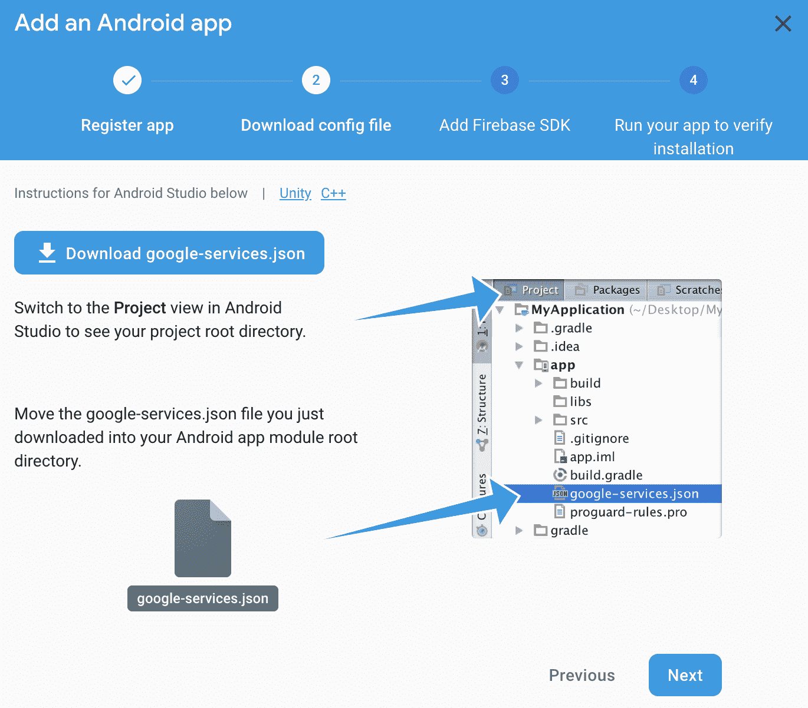
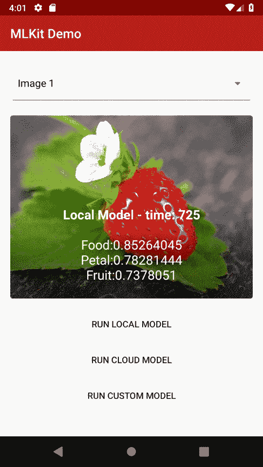

# 谁害怕机器学习？第 5 部分:在设备上运行 ML-Kit

> 原文：<https://medium.com/google-developer-experts/whos-afraid-of-machine-learning-part-5-running-ml-kit-on-device-394b6c19f00f?source=collection_archive---------5----------------------->

## 面向移动开发者的 ML & ML-Kit 简介

上一篇帖子给出了一个 [***介绍 ML***](/google-developer-experts/https-medium-com-britt-barak-whos-afraid-of-ml-part1-e464264c3cf0) ，to[***ML kit***](/google-developer-experts/whos-afraid-of-machine-learning-part-4-going-mobile-ml-kit-why-how-200f245ef8f8)，并讨论了为什么我们需要一个 [***移动的具体解决方案***](/google-developer-experts/whos-afraid-of-machine-learning-part-4-going-mobile-ml-kit-why-how-200f245ef8f8) 用于 ML 功能。


现在…是时候写一些代码了！

## 开始之前:

1.  克隆这个项目与代码开始，并执行每一步[https://github.com/brittBarak/MLKitDemo](https://github.com/brittBarak/MLKitDemo)
2.  将 Firebase 添加到您的应用程序:

*   登录消防基地控制台:【https://console.firebase.google.com 
*   创建一个新项目，或选择一个现有项目
*   在左侧菜单中，转到设置→



*   在*常规*选项卡下→在*你的应用*部分下，选择“添加应用”。



*   按照 Firebase 教程中的步骤，将 Firebase 添加到您的应用程序中。



3.将 *firebase-ml-vision* 库添加到您的 app:在您的 *app 级* `*buid.gradle*`文件上添加:

```
dependencies {
   // …

   implementation ‘com.google.firebase:firebase-ml-vision:17.0.0’
}
```

**如上所述，我们将使用一个本地、一个 on 设备和一个自定义检测器。每个都有 4 个步骤:**

**0.设置(不是出轨:)真的不算一步…)**

1.  **设置分类器**
2.  **处理输入**
3.  **运行模型**
4.  **处理输出**

*   ****注**:如果你更喜欢跟随 long 的最终代码，你可以在 demo 的 [repo](https://github.com/brittBarak/MLKitDemo) 的分支 [1.run_local_model](https://github.com/brittBarak/MLKitDemo/tree/1.run_local_model) 中找到。**

# **运行本地(设备上)模型**

**选择本地模型是轻量级和离线支持的选项。反过来，它的准确性是有限的，这一点我们必须考虑到。**

**`UI`取位图→调用`ImageClassifier.executeLocal(bitmap)` → `ImageClassifier`调用`LocalClassifier.execute()`**

## **步骤 0:设置**

1.  **通过 Firebase MLKit 为您的应用添加本地检测器:**

**在你的应用级`build.gradle`文件上添加:**

```
dependencies {
  // ... implementation 'com.google.firebase:firebase-ml-vision-image-label-model:15.0.0'
}
```

****可选，但推荐**:默认情况下，只有执行*检测器*后，ML 模型本身才会被下载。这意味着在第一次执行时会有一些延迟，并且需要网络访问。要绕过这一点，并在应用程序从 Play Store 安装时下载 ML 模型，只需将以下声明添加到应用程序的`AndroidManifest.xml`文件中:**

```
<application ...>
  ...
  **<meta-data
      android:name="com.google.firebase.ml.vision.DEPENDENCIES"
      android:value="label" />** <!-- To use multiple models: android:value="label,barcode,face..." --></application>
```

## **步骤 1:设置分类器**

**创建保存 ***检测器*** 对象的***local classifier***类:**

```
**public class** LocalClassifier {**detector** = FirebaseVision.*getInstance*().**getVisionLabelDetector**();
}
```

**这是基本的*探测器*实例。可以对返回的输出更加挑剔，增加 ***置信度阈值*** ，在 0–1 之间，默认为 0.5。**

```
**public class** LocalClassifier { FirebaseVisionLabelDetectorOptions **localDetectorOptions** =
            **new** FirebaseVisionLabelDetectorOptions.Builder()
                    .setConfidenceThreshold(ImageClassifier.***CONFIDENCE_THRESHOLD***)
                    .build();**private** FirebaseVisionLabelDetector **classifier** = FirebaseVision.*getInstance*().getVisionLabelDetector(**localDetectorOptions**);}
```

## **步骤 2:处理输入**

**`FirebaseVisionLabelDetector` 知道如何处理`FirebaseVisionImage`类型的输入。您可以从以下任一途径获得一个`FirebaseVisionImage`实例:**

*   *****位图***——这就是我们在这个演示应用程序中要做的。为了简单起见，我将图像作为静态文件保存在 assets 文件夹中。**

*   *******媒体*** [***图像***](https://developer.android.com/reference/android/media/Image.html)——如果我们从媒体中获得输入图像，例如，从设备摄像机中。****
*   *******字节数组*******
*   *******ByteBuffer*******

****由于我们使用的是 ***位图*** ，输入处理简单如下:****

```
**class **LocalClassifier** {
    //...

    FirebaseVisionImage **image**;
    public void **execute**(Bitmap bitmap) {**image** = FirebaseVisionImage.*fromBitmap*(bitmap);
    }
}**
```

*   *******提示*** :我们想使用局部模型的原因之一是因为它的执行速度更快。但是，执行任何模型都需要一些时间。如果您在实时应用程序中使用该模型，您可能需要更快的结果。**在移动到下一步**之前减小位图尺寸，可以改善模型的处理时间。****

## ****步骤 3:运行模型****

****这就是奇迹发生的地方！🔮由于模型确实需要一些计算时间，我们应该让模型异步运行，并使用侦听器返回成功或失败的结果。****

```
****public class** LocalClassifier { //... public void **execute**(Bitmap bitmap, **OnSuccessListener**     successListener, **OnFailureListener** failureListener) {
        *//...* **detector**.detectInImage(**image**)
                .addOnSuccessListener(successListener)
                .addOnFailureListener(failureListener); }
}**
```

## ****步骤 4:处理输出****

****检测输出在`***OnSuccessListener***`上提供。我更喜欢将`OnSuccessListener` 从`*ImageClassifier*`传递到`*LocalClassifier*`，处理`*UI*`和`*LocalClassifier*` *之间的通信。*****

****UI 调用 `***ImageClassifier.executeLocal()***` ***，*** 应该是这样的:****

****在`**ImageClassifier.java :**`****

```
****localClassifier** = newLocalClassifier();public void **executeLocal**(Bitmap bitmap, ClassifierCallback callback) { **successListener** = newOnSuccessListener<List<FirebaseVisionLabel>>() { public voidonSuccess(List<FirebaseVisionLabel> labels) {
            **processLocalResult**(labels, callback, start);
        } }; **localClassifier**.execute(bitmap, successListener, failureListener);}**
```

****`**processLocalResult()**` 只是准备输出*标签*显示在 UI 上。****

****在我的具体例子中，我选择显示概率最高的 3 个结果。您可以选择任何其他格式类型。为了完成这幅图，这是我的实现:****

****在`**ImageClassifier.java :**`上****

```
**voidprocessLocalResult(List<FirebaseVisionLabel> labels, ClassifierCallback callback) { labels.sort(**localLabelComparator**); **resultLabels**.clear(); FirebaseVisionLabel label; for(**int** i = 0; i < Math.*min*(*3*, labels.size()); ++i) { label = labels.get(i); **resultLabels**.add(label.getLabel() + **“:”** + label.getConfidence()); } callback.onClassified(**“Local Model”**, **resultLabels**);}**
```

****`*ClassifierCallback*`是我创建的一个简单界面，目的是将结果反馈给 UI 显示。当然，我们可以使用任何其他方法。****

```
**interface **ClassifierCallback** {
    void **onClassified**(String modelTitle, List<String> topLabels);
}**
```

## ****就是这样！****

****你用你的第一个 ML 模型对一幅图像进行了分类！🎉有多简单？！****

****让我们运行应用程序，看看一些结果！****

********

****相当不错！！！我们有一些通用的标签，如“食物”或“水果”，这肯定符合图像，但我希望模型能够告诉我这是什么水果..****

****在本演示的[回购](https://github.com/brittBarak/MLKitDemo)分支 [1.run_local_model](https://github.com/brittBarak/MLKitDemo/tree/1.run_local_model) 上获取该零件的最终代码****

****接下来:让我们在下一篇文章中，通过使用基于云的探测器，尝试获得一些更具指示性和更准确的标签！****