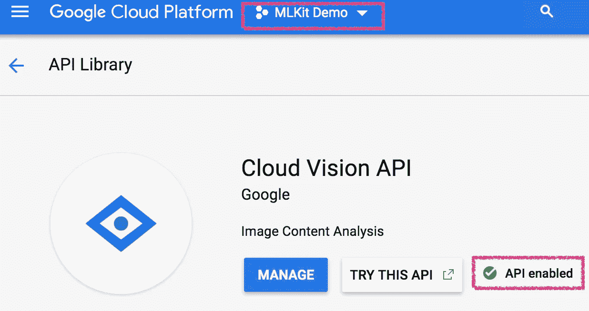
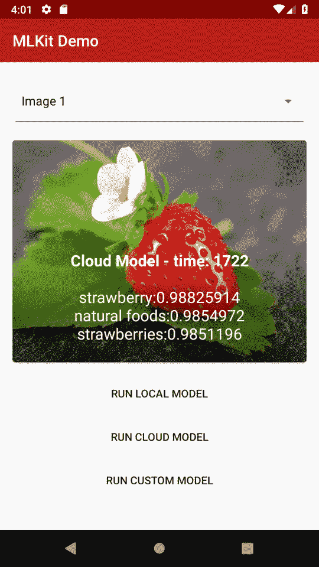

# 谁害怕机器学习？第 6 部分:在云上运行 ML-Kit

> 原文：<https://medium.com/google-developer-experts/whos-afraid-of-machine-learning-part-6-running-ml-kit-on-cloud-633343d80fd9?source=collection_archive---------9----------------------->

## 面向移动开发者的 ML & ML-Kit 简介

[上一篇文章中，我们运行了本地(在设备上)模型](/@britt.barak/whos-afraid-of-machine-learning-part-5-running-ml-kit-on-device-394b6c19f00f)来对图像进行分类。现在，是时候尝试通过运行基于**云**的模型来提高标签的准确性(同时允许更多的延迟)。☁


[Jéan Béller](https://unsplash.com/@jeanbeller) on Unsplash

## 开始之前:

如果你已经完成了上一篇文章，你就可以跳到下一部分了！

否则，您应该确保克隆这个演示的代码，并将 Firebase 和 MLKit 添加到您的应用程序中。如需指导，请在开始前查看上一篇文章的 部分的 ***。***

如您所知，对于每个模型，我们有 4 个实施步骤:

0.设置(不是出轨:)真的不算一步…)

1.  设置分类器
2.  处理输入
3.  运行模型
4.  处理输出

让我们开始吧:

# 运行基于云的模型

## 步骤 0:设置

基于云的模型属于*云视觉 API* ，您必须确保为您的项目启用该 API:

1.  使用基于云的模式需要支付超过一定额度的费用。出于演示和开发的目的，您不太可能接近那个配额。但是，你必须升级你的 Firebase 项目计划，这样理论上它可以在需要的时候充电。将免费的 *Spark* 计划项目升级为 *Blaze* 计划，这是一个现收现付的计划，使您能够使用 Cloud Vision APIs。你可以在 [Firebase 控制台](https://console.firebase.google.com/)中完成。
2.  在[云控制台 API 库](https://console.cloud.google.com/apis/library/vision.googleapis.com/)上启用*云视觉 API* 。在顶部菜单中，选择你的 Firebase 项目，如果还没有启用，点击**启用**。



*   **注**:开发用，这个配置就行。但是，在部署到生产环境之前，您应该采取一些额外的步骤来确保您的帐户没有进行未经授权的呼叫。在这种情况下，查看此处的说明[。](https://firebase.google.com/docs/ml-kit/android/secure-api-key)

## 步骤 1:设置分类器

创建***cloud classifier***类，保存 ***探测器*** 对象:

```
**public class** CloudClassifier {
    **detector** = FirebaseVision.*getInstance*().**getVisionCloudLabelDetector**();
}
```

除了*探测器的类型之外，它真的和上一篇文章的`LocalClassifier`几乎一样。*

我们可以在检测器上设置一些额外的选项:

*   *setMaxResults()* —默认情况下将返回 10 个结果。如果你需要更多，你必须指定它。另一方面，在设计演示应用程序时，我决定只展示前 3 名的结果。我可以在这里定义它，让计算快一点。
*   *setModelType() —* 可以是`[STABLE_MODEL](https://firebase.google.com/docs/reference/android/com/google/firebase/ml/vision/cloud/FirebaseVisionCloudDetectorOptions.html#STABLE_MODEL)`也可以是`[LATEST_MODEL](https://firebase.google.com/docs/reference/android/com/google/firebase/ml/vision/cloud/FirebaseVisionCloudDetectorOptions.html#LATEST_MODEL)`，默认为后者。

```
**public class** CloudClassifier {**options** =
        newFirebaseVisionCloudDetectorOptions.Builder()
             .setModelType(FirebaseVisionCloudDetectorOptions.***LATEST_MODEL***)
             .setMaxResults(ImageClassifier.***RESULTS_TO_SHOW***)
             .build();**detector** =
        FirebaseVision.*getInstance*().getVisionCloudLabelDetector(**options**);
}
```

## 步骤 2:处理输入

与`LocalDetector`类似，`*FirebaseVisionCloudLabelDetector*` 使用了一个`*FirebaseVisionImage*`的输入，我们将从一个`Bitmap`中获取，以方便 UI；

关于`FirebaseVisionImage`的更多解释可以在之前的帖子中找到。

```
**public class** CloudClassifier {
    //... FirebaseVisionImage **image**;
    public void **execute**(Bitmap bitmap) {

**image** = FirebaseVisionImage.*fromBitmap*(bitmap);
    }
}
```

## 步骤 3:运行模型

与前面的步骤一样，这一步与我们运行本地模型的步骤极其相似。

```
**public class** CloudClassifier {public void **execute**(Bitmap bitmap, **OnSuccessListener** successListener, **OnFailureListener** failureListener) {
        *//...* **detector**.detectInImage(**image**)
                .addOnSuccessListener(successListener)
                .addOnFailureListener(failureListener); }
}
```

## 步骤 4:处理输出

由于本地模型与基于云的模型不同，它们的输出也不同，因此我们在`OnSuccessListener`上得到的响应的对象类型根据*检测器*是不同的。然而，这些对象是完全相同的工作。

`**ImageClassifier.java**`上 *:*

```
**cloudClassifier** = newCloudClassifier();public void **executeCloud**(Bitmap bitmap, ClassifierCallback callback) { **successListener** = newOnSuccessListener<List<FirebaseVisionCloudLabel>>() {

        public void **onSuccess**(List<FirebaseVisionCloudLabel> labels) {
            **processCloudResult**(labels, callback, start);
        }
    }; **cloudClassifier**.execute(bitmap, successListener, failureListener);
}
```

同样，处理 UI 要呈现的结果取决于您对 UI 所呈现内容的决定。对于这个例子:

```
**processCloudResult**(List<FirebaseVisionCloudLabel> labels, ClassifierCallback callback) {
    labels.sort(cloudLabelComparator);    
    **resultLabels**.clear(); FirebaseVisionCloudLabel label;
    for (inti = 0; i < Math.*min*(***RESULTS_TO_SHOW***, labels.size()); ++i) {
        label = labels.get(i);
        **resultLabels**.add(label.getLabel() + **":"** + label.getConfidence());
    }
    callback.onClassified(**"Cloud Model"**, **resultLabels**);}
```

如上所述，`FirebaseVisionCloudLabel`和用于本地模型的`FirebaseVisionLabel`是不同的对象。它们都基于 [*谷歌知识图*、](https://developers.google.com/knowledge-graph/)，因此，它们的 API 是相同的:

*   `**getLabel()**` —人类可理解的文本，表示在图像上发现的对象。它将永远是英文的。
*   `**getConfidence()**`—0–1 浮点，表示图像中检测到的物体确实符合建议标签的概率。
*   `**getEntityId()**` —如果在[谷歌知识图](https://developers.google.com/knowledge-graph/)上找到该标签，该字段将为其返回一个唯一的 Id，该 Id 可以被[知识图](https://developers.google.com/knowledge-graph/) API 进一步查询，以获得对象的更广泛的上下文。

## 差不多就是这样！🎉

就是这样！让我们来看看一些结果:



太酷了！！

正如所料，模型返回结果的时间稍长。然而，现在它可以告诉我图像中是哪个具体的水果，而不仅仅是一个笼统的标题。此外，它对结果的信心超过 90%,而本地模型的信心为 70 %- 80%。

这种权衡是我们作为应用开发者要考虑的。

这个帖子的代码可以在回购上找到，分支[**2 . run _ cloud _ model**](https://github.com/brittBarak/MLKitDemo/tree/2.run_cloud_model)

希望你也能意识到使用 Firebase MLKit 是多么简单和有趣。使用其他模型:人脸检测、条形码扫描等..工程非常相似，我鼓励你尝试一下！

我们能得到更好的结果吗？在接下来的文章中，让我们也使用一个自定义模型来探索这个问题。再见！！