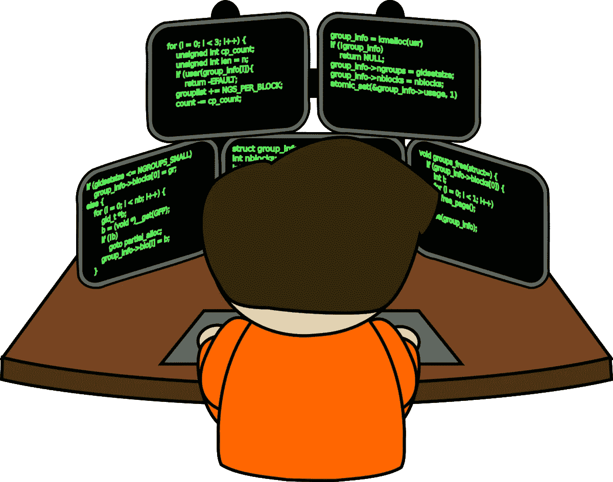

# 为什么以及如何学习一门新的编程语言

> 原文：<https://medium.com/globant/why-and-how-to-learn-a-new-programming-language-bf0bb089b94f?source=collection_archive---------0----------------------->

## 经得起未来考验的程序员

## 要做一个长期的程序员，你必须热爱编程。你不能只是容忍改变，你必须热爱它。

每年新年伊始，大多数科技网站、博客和我们最喜爱的技术专家都会发表文章，讨论新的一年里流行什么、不流行什么以及你应该学习什么。不要误解我的意思，这些文章在推动你为自己设定某种技术目标方面确实非常有价值。然而，所有或至少大部分文章都忽略了一个关键部分——即，为什么你应该做“学习新知识”的事情。


## ******开阔眼界******


学习一门新的语言会让你接触到更新的概念和编程范例。这种接触有助于通过提高编程知识来增加您的技术理解。

```
For instance, a developer with object oriented programming language knowledge learning a functional programming language.
```

## ******与加速的技术世界并驾齐驱******


一种新的编程语言学习帮助开发人员跟上不断发展、不断变化、从未放缓的技术世界。一个心态固定、对变化免疫的开发人员不仅会面临知识和技能的停滞，也会面临职业生涯的停滞。这样的开发者在未来会失去他的意义，并最终变得沮丧和不自信。

```
**"Innovation - the heart of technological change - is fundamentally a learning process."** - Peter Dicken
```

## ***相同的概念/问题，但不同的解决途径***


如果长时间使用相同的编程技巧，大脑会失去注入新思想的能力。由于需求和期望的变化，以前解决问题的解决方案可能不再有效。解决同样问题的新方法需要新的思维，这就是学习一门新语言发挥作用的地方。这同样适用于理解编程语言的成熟概念。简而言之，新的语言技能有助于引发解决问题的新方法。

```
Case in point, a Java developer on jumping into GoLang world would learn how a complex problem of multi-threading is handled in a simpler way using Go-Routines. Also, how inheritance concept exists in GoLang without explicit hierarchy declaration, unlike in Java
```

## ***欣赏/批评您现有的编程知识***


学习一门新的语言可能会让你更加欣赏你现在的语言。

```
**Java v/s GoLang,** learning GoLang might make a Java developer fall in love all over again with JAVA considering how mature the language has grown since its inception 25 years ago and how you can achieve practically anything you think of either via custom code or through innumerable plug-ins from the awesome and mammoth Java community.
```

另一方面，学习一门新的编程语言通常会让你思考为什么旧语言要采用这种新方法。接受吧，新的语言存在是因为旧的语言有需要改进的地方。

```
**Java v/s Dart,** Multi-threading - handled via thread in Java and via Isolates in Dart. Java carries that inherit risk of shared memory being accessible and modified by threads whereas Dart isolates multiple 'isolates' and manages communication only through messages and callbacks.Again **Java v/s GoLang,** learning GoLang would make a Java developer love the simpler, efficient Golang with a small learning curve. Also, GoLang's memory management is something which would make a Java developer go kill JVM for hogging system's RAM 😂
```

## ***职业发展***


他的答案应该是直截了当的。学习一门新语言会提升你在团队和同事中的地位，促进你的职业前景。新的语言技能将使你成为一个更好的软件设计师/架构师，通过决定正确的工具，以正确的方式用于手头的工作。新技能意味着你简历上的额外加分会打开新的机会。

```
As Proof, Increasing number of companies now prefer individuals who possess a secondary/tertiary skills along with their primary skills — You can be one of them too.
```

## ***因为你必须***


或者以程序员为职业的人，他们为什么不考虑学习一门新语言呢！！！请记住，十年或更久以前相关的东西很可能现在已经不相关了。

```
Mobile application development wasn’t relevant 2 decades back and hence languages like Kotlin, Dart, Swift dint exists but then the current scenario is well known.
```

## ***多语言程序员***



P olyglot 是双语的意思，即懂得和/或使用多种语言。成为一名通晓多种语言的程序员有两个方面:一个是能够根据需要在一个项目中使用多种编程语言——这意味着一名程序员会使用多种语言编程。二是掌握并流利使用一种以上的编程语言。成为一名通晓多种语言的程序员需要花费大量的时间，但是所取得的成果是值得的。请记住，仅仅拥有多种编程语言的知识并不能使你有资格成为一名通晓多种语言的程序员，但这将使你走上成为一名程序员的道路。

```
**"The only way to learn a new programming language is by writing programs in it."** - *Dennis Ritchie*
```


```
Assuming that you have read through the WHY part, I believe you’re inline now to pursue further on the journey to learn a new programming language — i.e., HOW to learn. Learning in a structured way helps not only in learning of the language but also provides an insight into it’s very existence (among the hundreds of other languages).
```

## ***做出选择***


语言的选择取决于一个或多个因素，其中几个因素是——现在流行什么？目前，哪种语言的薪酬最高？，TIOBE 认为什么语言有需求？，什么语言技能可以填补当前编程语言没有的空白？—等等……你为什么选择一门语言很少有人关心，然而，关于为什么选择应该基于你获得了什么知识而不是你得到了多少报酬的争论，但问题的关键是——你在学习一门新的语言。

```
**"If you want a new tomorrow, then make new choices today."** *- Tim Fargo*
```

## ***分析您的选择***


谈到技术，现在是时候分析学习编程语言的选择了。很好理解你的新语言属于什么[编程范式](https://en.wikipedia.org/wiki/Programming_paradigm)——*是* [***声明式***](https://en.wikipedia.org/wiki/Declarative_programming) *还是* [***命令式***](https://en.wikipedia.org/wiki/Imperative_programming) *？是* [***功能性***](https://en.wikipedia.org/wiki/Functional_programming) *还是* ***程序性*** *还是* [***面向对象*** *？如果你不知道刚刚提到的术语，那么那应该是你的起点。理解你所选择的编程范式有助于了解代码是如何组织的，语法和语法的风格是什么等等。深入了解这些之后，如果你发现你所选择的语言所属的特定范式不适合你，那么是时候回到“做出选择”这一步了。*](https://en.wikipedia.org/wiki/Object-oriented_programming)

```
**“May your choices reflect your hopes, not your fears.”** - Nelson Mandela**Programming Paradigm** is a bigger topic in itself. Constraining ourselves to the task at hand, it is suggested that you go through only the required details of the paradigm and not dig too deep into it and thereby loosing focus on the goal of learning a new programming language.
```

## ***工具和先决条件***


想知道你当前的工具集，比如 IDE，是否与你新选择的语言兼容。如果它做得很好，如果它没有找到适合你和你的选择。

每种编程语言都有一组先决条件。最好在开始阶段就思考它们，而不是一开始就学习然后遇到障碍。例如，安装 JDK 是学习 JAVA 的先决条件。

```
**"Man is a tool-using animal. Without tools he is nothing, with tools he is all."** - *Thomas Carlyle*
```

## ***心态* * *


T 他必须是 ***最*** 学习任何新东西所必需的重要技能，而不仅仅是一门编程语言。仅限于这个主题，这里的思维方式意味着知道并永远记住，学习一门新的编程语言并不是要知道语法——比如如何编写 for 循环、如何声明变量、使用的关键字等——而是要理解这门新语言如何以及采用什么不同的方法来解决现有的或手边的问题，以及它与你已经知道的编程语言有什么不同。在这方面进行自我教育将有助于在语言上建立一个据点，并为你成为一个更好的架构师和领导做好准备，你的后辈将会向你寻求帮助。

## **学习之路***


弄清楚你希望如何被引入你选择的新编程语言。很少有开发人员愿意遵循官方文档，大多数人愿意遵循在线教程(包括基于文本和基于视频的教程)。这里面没有对错。我个人认为官方文档，即使开始很好，也可能很快变得复杂——可能是由于语言特性本身，或者由于文档中使用的英语的复杂性和高级水平。

在这个时代，找到一个好的、负担得起的(通常是免费的)资源并不难。大量基于文本的免费资源是免费的，如果你选择的是视频，那么还有 Udemy、Coursera，还有免费且易于访问的 YouTube 资源。

## ***耐心和时间***


L 挣钱是需要时间的，时间往往考验耐心的程度。根据所做的选择，你可能会更快地掌握和理解新的编程语言，或者可能会比其他人花费更多的时间——记住，无论哪种方式都是可以的。从我的经验来看，学习一门新的编程语言是一项投资，一项至少值 5 到 6 个月的投资。

```
**"It’s hard to beat a person who never gives up."** *― Babe Ruth*
```

## ***保持动力***


如果你从学习一门新的编程语言的正确原因开始，这应该很容易。记住你为什么开始学习一门新的编程语言，也可以作为继续追求这门语言并最终征服它的动力。

```
**"All things are difficult before they are easy."** *- Thomas Fuller*
```

> *免责声明:* **以上文章中使用的所有图片均享有版权/属于其原始所有者。**

***感谢阅读。特别提及*** [***穆克塔***](https://medium.com/u/d3416645e87a?source=post_page-----bf0bb089b94f--------------------------------) ***和*** [***约格什【科卡雷】***](https://medium.com/u/e16ffb8ea6b9?source=post_page-----bf0bb089b94f--------------------------------) ***为他们的投入和点评。在*捣碎👏*按钮帮助传播爱&表达你的感激。***

# 😇点击下面的图片了解更多关于我的信息😇

[](https://www.linkedin.com/in/vinodh-n-5914874b/)