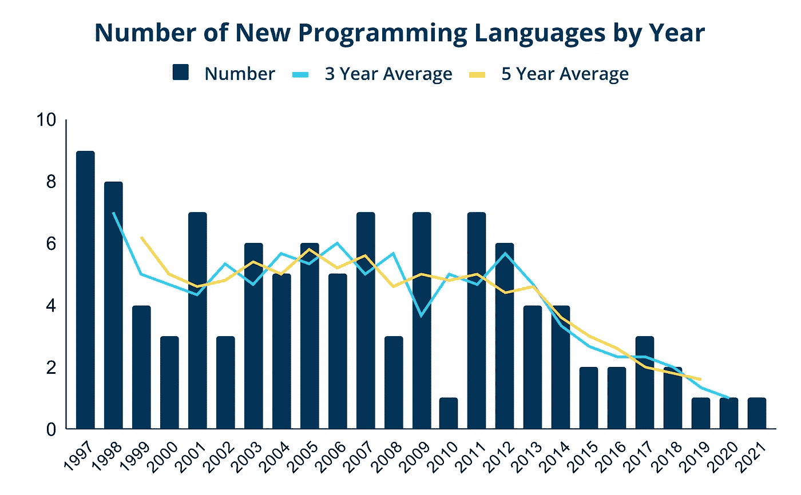

# 为什么新的编程语言这么少？

> 原文：<https://medium.com/compendium/why-are-there-so-few-new-programming-languages-4d6252dcba22?source=collection_archive---------3----------------------->

你最后一次听说一种新的编程语言是什么时候？我指的是引入一些新概念或试图以完全不同的方式做事的编程语言，而不是同一(C-)主题的另一种变体。我可能错过了一些东西，但在我看来，最后一件事是函数式编程和移动应用程序开发，以及一些尝试量子计算的编程语言。那是五年前的事了…

疫情会不会与此有关？当然，在我们的行业中，我们足够幸运，可以继续在家工作，所以我们不应该抱怨缺乏闪亮的新编程语言。但是，在家工作会不会扼杀了围绕饮水机或咖啡机讨论的一些创造力和灵感呢？视频会议对于产生新想法的非正式讨论来说并不奏效。

**自 2014 年开始下降**

但是，如果疫情与此有关，那么我们应该看到新的编程语言直到 2020 年初仍在涌现，其中一些语言现在应该已经准备好被更广泛地采用。然而，快速浏览一下维基百科页面，上面列出了按首次出版年份排序的[最重要的编程语言](https://en.wikipedia.org/wiki/Timeline_of_programming_languages)，可以发现事情在 2014 年左右已经开始放缓。

Number of new programming languages by year. Source: [https://en.wikipedia.org/wiki/Timeline_of_programming_languages](https://en.wikipedia.org/wiki/Timeline_of_programming_languages)

当然，很有可能这个维基百科页面在最近几年并不完全正确。毕竟，要弄清楚一种编程语言是否“重要”到足以在页面上列出来，还需要一段时间。另一方面，该页面包括像 [LOLCODE](http://www.lolcode.org/) 这样的编程语言，这可能仅仅因为它的存在就很重要，但可能不是你在找工作时在简历中提到的第一个语言。但是上图中的趋势证实了我的总体印象:与 21 世纪初相比，现在发布的编程语言要少得多。

**学习一门古老的编程语言！**

还有一件事也印证了我的印象:看看 [2021](https://www.google.com/search?q=programming+languages+to+learn+in+2021) 和 [2022](https://www.google.com/search?q=programming+languages+to+learn+in+2022) 推荐学习的编程语言列表。列表中充满了旧的编程语言！Swift 通常是最新的一个，它发布于… 2014 年—八年前。如果你将 2021 年和 2022 年的列表与 2015 年的列表进行比较，你会注意到它们几乎相同，除了 Swift 取代了 Objective-C。

**我们需要新的编程语言吗？**

也许真正的问题是我们是否需要新的编程语言。创建 Kotlin 和 Swift 是为了支持本地移动应用的开发。从那时起，Kotlin 开始向服务器端发展，并开始挑战 Java 的地位。原因是 Kotlin 的一些特性和概念对一些 Java 开发人员很有吸引力。但是，当您看到从本地到云的过渡时，您会注意到我们使用已经建立的编程语言很好地完成了这一过渡。

如果没有新概念，构建和组织编程语言的方式就会受到限制。您可以在花括号、关键字和缩进之间切换来分隔块，您可以选择强类型或弱类型，或者发明一种稍微平滑的方法来处理 lambda 表达式。但基本面保持不变。

也许基础设施即代码(IaC)是近几年来比较有趣的概念之一。但是不管怎样，Terraform 可能真的不属于*编程*语言的范畴，除此之外，它使用 YAML 作为它的基础。其他新概念，如区块链、机器学习和数据流，导致了许多新库的开发，但没有太多新的编程语言。也许我们只需要等待量子计算的重大突破，就可以看到新的编程语言的出现？

*本文原载于*[*kod e24*](https://www.kode24.no/)*I 挪威语标题为“*[*”-Hvorfor kommer det ingen Nye programmerings sprk？*](https://www.kode24.no/artikkel/hvorfor-kommer-det-ingen-nye-programmeringssprak/75837029) *”。*