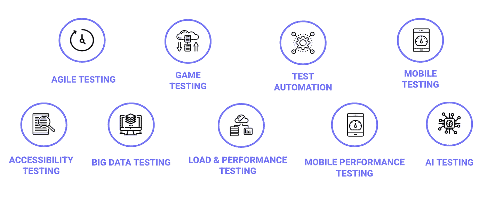
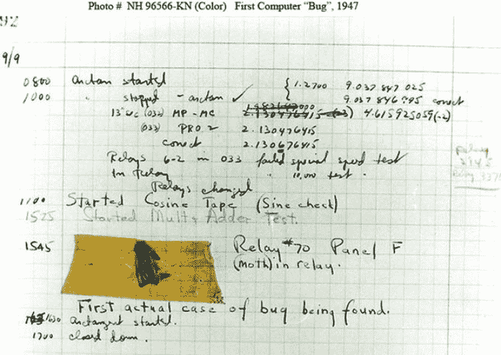

# 为什么选择软件测试作为你的职业？

> 原文：<https://medium.com/globant/why-choosing-software-testing-as-your-career-4ad77b66e09c?source=collection_archive---------3----------------------->

**作者** [戴安娜](https://medium.com/u/72d1b94bc03f?source=post_page-----4ad77b66e09c--------------------------------)[卡德娜**罗德里戈**](https://medium.com/u/54f29d938826?source=post_page-----4ad77b66e09c--------------------------------)**&**希尔德【奥斯皮纳】巴伦西亚

软件测试是一个一直在发展和成熟的职业。如今，有许多种类的测试、分支、技术、领域、范围和方法，这反过来使得这个世界变得复杂，有许多路径可供选择。

如果你是一个好奇的人，你喜欢详细分析，提高你在不同领域和技术的技能，与来自不同国家、文化的人一起工作，并有可能环游世界，那么这场比赛肯定适合你。

在这篇文章中，我们将解释什么是软件测试，它的发展，以及你将发展的技能。

**测试历史**

自人类历史开始以来，每一种需求都有解决方案。它通常伴随着某种类型的测试，以验证解决方案是否完全解决了这种必要性，从而产生一种产品，该产品随后成为针对更复杂需求的新解决方案的首创。

托马斯·阿尔瓦·爱迪生，白炽灯的发明者，有一种特殊的需要，他发明了一种制造灯丝的方法，这种灯丝可以在不熔化的情况下发出白炽光。为此，他必须对不同材料的细丝进行 1000 多次测试。

一旦测试被正式化，就可以发现在每个开发过程中都有错误、缺陷和失败。

**Bug 一词的由来**

1947 年，当**马克 2 号**被开发时，在计算机上运行一个测试周期后，在分析操作中发现了一个缺陷。这个缺陷源于一个保持打开的电磁继电器，它是由一个蛀虫(Bug)引起的。工程师在日志上记录了这个 bug，表明这是第一个发现 bug 的实际事件。

****哈佛马克 2 号*** *是哈佛大学在霍华德艾肯的指导下建造的机电计算机，完成于 1947 年。它是由美国海军资助的。**

**

*First computer bug [https://www.nationalgeographic.org/thisday/sep9/worlds-first-computer-bug/](https://www.nationalgeographic.org/thisday/sep9/worlds-first-computer-bug/)*

*从这一点开始，对测试在任何过程中的重要性的更大的认识开始产生，同样地，测试过程开始正式化和成熟，变得更加结构化，更加有组织，更加集中。*

*但一些高度相关的失败项目推动了这一职业生涯的发展。以下是一些例子:*

1.  *1986 年 4 月，一架 F-18 型喷气式战斗机进行机动测试时出现了失控的尾旋。这是“If-then”语句中代码缺陷的结果，该语句没有“else”错误控制。*
2.  *1988 年，美国银行投资 2300 万美元购买了一款名为 MasterNet 的软件，该软件负责信托的会计和报告工作，但要使该软件投入生产，还需要再投资 6000 万美元，从而产生了非常高的成本超支，导致银行取消了该项目。*

*既然我们已经了解了测试历史和 bug 的来源，我们有足够的信息进入**什么是软件测试？***

*让我们来探究一些官方定义:*

***ISTQB**([https://glossary.istqb.org/](https://glossary.istqb.org/))*

*   *测试是由所有静态和动态的生命周期活动组成的过程，涉及对组件或系统以及相关工作产品的计划、准备和评估，以确定它们满足规定的要求，证明它们适合目的，并检测缺陷。*

*IBM([https://www.ibm.com/topics/software-testing](https://www.ibm.com/topics/software-testing))*

*   *软件测试是评估和验证软件产品或应用程序是否做了它应该做的事情的过程。测试的好处包括防止错误、降低开发成本和提高性能。*

*测试有许多官方和非官方的定义，基于一组为了质量而应该执行的不同活动。我们认为这是一个深入而复杂的过程，专注于提高任何软件产品、应用程序、网站、服务等的质量。*

*质量的提高是通过避免出现尽可能多的错误、发现产品需求之间的差距、确保稳定性、降低项目成本以及提高用户体验满意度和客户的盈利能力来实现的。*

*虽然当你参与到这个角色中时，可能会面临一些迷思，还是开始讨论吧。*

***关于软件测试的神话***

*   ***软件测试只是执行测试和发现错误***

*正如我们从它的定义中所看到的，软件测试是一个需要清晰的愿景、计划、设计、执行、反馈和结束的过程。*

*我们不能说这是一个静态的过程，一个像运行测试和发现 bug 一样的单一任务。*

*   ***在项目开始时不需要，测试过程可以在软件开发过程之后开始***

*传统的级联模型允许公司开始软件测试过程，但是新模型已经发展到这样的程度，测试专家现在是产品规划和设计阶段的一部分。这允许整个团队与要开发的产品的质量方法保持一致。*

*在一个项目中，你越早开始谈论测试，就越有可能达到高质量的标准。*

*   ***增加工程费用。***

*与普遍的看法相反，从长远来看，测试过程可以为投资该过程的公司节省大量资金。由于一些进入生产的 bug 会产生很高的修正成本，新版本可能意味着更多的工作和失去用户的信任。*

*有无数的理由为什么它们被称为神话；忍受神话，继续前进。让我们跳到“必须”和“拥有技能很好”,这样你就有一个指南可以遵循了:*

***我将发展哪些技能***

*测试人员应该具备技术和非技术技能，就像任何其他角色一样，让我们来讨论一下:*

***非技术性:**分析、沟通、时间管理、激情。有一个好的英语水平是很好的，因为有可能与伟大/著名的公司和行业一起从事国际项目。*

***技术:***

*   *软件开发生命周期、测试的类型和级别等*
*   *数据库的基本知识(最基本的查询)。*
*   *如何安装一个 app，了解你的本地设置，终端命令，git 命令等。*
*   *测试管理工具，如吉拉，测试轨道，泽法，螳螂，x 射线，TFS 等。*
*   *一些自动化的基础知识来支持和补充这方面的策略。*

***不同的方法:***

*   ***功能测试:**我们可以测试 Web 或移动应用程序，以验证系统是否按预期运行，是否能被最终用户接受。可以在不同的浏览器、操作系统或范围内的任何类型的设备上执行。*
*   ***非功能性测试:**这和系统属性有关。系统在极端环境下的表现如何，如压力、性能和其他非功能性测试，如可访问性、可用性、可靠性、安全性等，避免漏洞、延迟响应时间和其他一些使用问题。*

*让我们更深入地了解一些技能:*

***Web & Mobile:** 针对网页或移动应用运行测试的过程。这个想法是为了确保它的功能和可用性满足需求，并且应用程序已经准备好启动。*

***性能:**是一个软件测试过程，用于测试一个软件应用在特定工作负载下的速度、响应时间、稳定性、可伸缩性、资源使用情况。*

***安全性:**这是一种软件测试，可以发现软件应用程序中的漏洞、威胁和风险，并防止入侵者的恶意攻击。安全测试的目的是识别软件系统的所有可能的漏洞和弱点，这些漏洞和弱点可能导致:组织的雇员或外部人员的信息、收入和声誉的损失。*

***自动化:**它是在很少或没有人工干预的情况下执行软件测试活动的过程，以实现更高的速度和效率。手动和自动化测试人员是相互支持的角色，例如:手动测试人员给出他们的观点，一个案例是否是自动化的候选者。Automation Tester 可以帮助手工团队运行回归，以避免人为错误和单调的任务。*

*展望未来，我们如何在软件测试员的职业生涯中成长。*

*作为一名质量工程师，你会问自己:我如何在这个职业生涯中成长？。职业生涯中的成长意味着大量的测试经验；体验功能测试、非功能测试、可访问性测试、验收测试、黑盒测试、端到端测试、集成测试等等。这个列表可能看起来很庞大，但是不要担心，不是每个人都必须知道所有的事情，测试也一样，你不需要知道所有的事情来在这个职业中成长，但是你会学到什么是必须的，什么是拥有技能的好处，并以此为基础来学习。*

*定义一个人在决定资历时必须呆多长时间不会有帮助，因为每个人都是一个不同的世界，所以我将尝试解释你在这个职业生涯中可能必须跨越的级别。这些问题可能因公司而异，但会试图解释行业中最常见的问题。*

*即使你还没有完成大学学业，作为一名新生开始将有助于你学习职业生涯早期的概念。你将被称为**受训者**(或实习生)，这个作为员工培训的机会是学习关于测试、测试设计、测试执行、bug 生命周期的技术知识以及其他迟早你必须实践的基本概念的最佳时机。*

*大学毕业后，你可以从初级质量工程师开始，利用实习期间获得的经验和知识，优化和提高你参与的每个项目的技能，还有一个非常好的建议是从这个职业中的一些重要认证开始，例如，“ [ISTQB 基础水平认证](https://www.istqb.org/certification-path-root/foundation-level-2018.html)将让你了解团队日常使用的常用测试词汇，并肯定会将这些知识运用到你的经验中，让你更上一层楼。作为一名**中级测试人员**你将执行不同类型的测试，功能性的，非功能性的，分析需求，设计测试计划，所有这些都在不同的项目管理方法下进行，比如 scrum，看板，瀑布等等。在这一点上，一个很好掌握和学习的技能将是自动化，即使这条道路有它自己的职业路线。继续扩大规模，你将成为**高级**，此时你将能够看到更大的画面，你将被要求开始领导小团队，设计测试策略，理解不同的框架，你的自我完善是关键，项目将期待一个解决问题的人，你也可以开始指导。*

*然后，随着时间和经验的积累，你将成为一名专家，你将不得不决定是从事管理工作还是专攻某些特定的技术技能。经验越多，知识水平越高，责任越大。你将被要求领导团队，指导你的下属，成为管理团队的一员，参与战略决策，为你的项目和跨项目提供解决方案。*

*一旦你完成了上述全部或部分内容，你将获得进行任何类型测试所需的技术知识，例如移动和网络应用、桌面应用、可访问性、自动化和相关工具、缺陷跟踪和测试管理工具等。除了基本的软技能，如领导力、沟通、积极倾听、创造力、积极性、说服技巧等。如今，适应变化、有效合作、创新和解决问题等其他技能也同样重要。*

*这个角色的职业机会对每个人来说都不一样。每个人都有不同的学习曲线和各自的技能，角色的成长基本上取决于你的表现。从我们这方面来说，我们也可以依靠运气(项目、领导者、机会、公司等)。*

***总结***

*如果你想通过每天学习新的东西来挑战自己，这是一个很好的角色，让你从你的角度继续写这个故事，并分享你的经验。旅途愉快！*