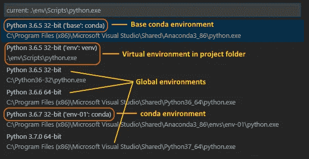

# 为什么使用虚拟环境在 Python 上编码？

> 原文：<https://medium.com/quick-code/why-code-on-python-using-virtual-environments-6f1bb327a84e?source=collection_archive---------0----------------------->

Python 现在已经被广泛应用于各种领域，从第一语言到向学生介绍编码世界，再到为自动驾驶汽车开发实时深度学习软件的逻辑。

但是他们中的许多人仍然不清楚如何真正开始从事 Python 项目。有些人在第一个项目中使用 PyCharm IDE，这让许多新手程序员感到困惑，因为他们会被大量可用的高级选项和设置所淹没，从而开始一个项目。让我试着让这些人明白如何进行。

首先:请安装目前世界上使用最多的轻量级编辑器。


因此，您可能知道每个 Python 项目都需要导入一些额外的库，如 numpy、pytorch、scipy 等。但是我们经常犯的最大错误是在我们的笔记本电脑中执行 python 的全局安装中的 pip 安装。

> *每个 python 项目都应该从创建一个虚拟环境(更常见的是 venv)开始，这将保持项目的需求*

接下来，我们通常做的是为我们的下一个项目“pip install”一堆库，并在项目需要扩大规模时跟踪我们需要的所有东西。那是因为项目没有在虚拟环境中初始化！

# 为什么我们需要虚拟环境？

虚拟环境的目的是有一个空间，我们可以安装特定于某个项目的软件包。比如说，假设你有很多 Django 网站使用 Django 版本 1，但是现在对于新的项目，你想使用 Django 版本 2。

那么，如果你只是为所有项目使用一个单一的全局环境，那么当你更新 Django 包时，它可能会破坏许多旧的项目，这将变得与新版本不兼容。因此，我们不希望我们所有的 Django 项目都指向一个包。所以每个项目都应该有自己独立的包，这样我们就不会破坏旧的代码库。

另外，每个项目都有一个独立的环境，更容易管理和维护它的依赖关系。所以让我们开始吧！

首先，让我向您展示我在 python 的全球安装中拥有的模块列表:


现在，我将导航到我的桌面，那里有我的项目文件夹，我们将在其中创建我们的虚拟环境。

我们将使用以下命令创建一个虚拟环境:

```
python -m venv <your virtual env name>
```


我已经创建了文件夹名为的环境。venv”。这是开发人员常用的术语(有些人甚至简单地称之为“venv”)。

记住要能执行这个命令，你需要先“光盘”到你的项目文件夹的根目录。

现在，为了激活这个新创建的环境，我们将在 powershell 中使用以下命令:

```
.venv\Scripts\activate.bat
```


所以现在我们可以看到环境名(。venv)出现在开头。这意味着您已经成功激活了您的第一个虚拟环境。因此，现在当您在这里安装一些软件包(pip install)时，您将只为这个特定的环境进行安装。

例如，我想安装两个名为 numpy 和 scipy 的 python 包，因为我将在这里做一个机器学习项目，所以我将简单地使用命令:

```
pip install numpy pip install scipy
```


因此，我们只在我们的环境中安装了 numpy 和 scipy，与我的其他项目甚至 python 的全局安装隔离开来。

此外，如果我们想要导出项目，使用虚拟环境还有另一个功能，您可以自动生成一个 *requirements.txt* 文件，其他开发人员可以在克隆您的项目时使用该文件，并安装您正在使用的所有相同的包和依赖项。为此，首先我们将使用:

```
pip freeze
```

这将生成您环境中已安装包的列表，但是使用了 *pip install* 所期望的输出。一个常见的开发人员惯例是使用以下命令将输出放在一个 *requirements.txt* 文件中:

```
pip freeze > requirements.txt
```

现在你会看到一个新的 txt 文件被创建在你的项目的根目录下。


# 让我们看看如何在 VS 代码中选择这个虚拟环境


默认情况下，VSCode 中的 Python 扩展会查找并使用它在系统路径中找到的第一个 Python 解释器。

要选择一个特定的环境，使用**命令面板**中的 **Python: Select Interpreter** 命令(Ctrl+Shift+P)。



在这里，我们可以看到 Python 的多个全局实例以及 VSCode 在项目根目录中自动找到的“env”文件夹。

然后可以将`requirements.txt`提交给版本控制，并作为应用程序的一部分发布。用户可以用`install -r`安装所有必要的软件包

现在我们知道了如何创建虚拟环境，如何将它导出到一个需求文本文件，让我们看看如何在克隆某人的项目时使用这个 requirements.txt 文件来安装所有的依赖项。

因此，初始步骤保持不变，即在将项目克隆到您的机器上之后，您在项目的根文件夹中创建一个虚拟环境，然后您将激活该虚拟环境。接下来，您执行以下命令:

```
pip install -r requirements.txt
```

因此，我们终于学会了如何创建虚拟环境，如何将包导出到 requirements.txt，以及如何安装某人的项目依赖项。

> *最后一个提示:请喝一杯*。git 忽略项目 repo 中的*文件，并添加虚拟环境文件夹的名称，这样您就不会无意中提交版本控制。*

*原载于 2020 年 4 月 25 日*[*http://madhureshgupta . home . blog*](http://madhureshgupta.home.blog/2020/04/25/why-code-on-python-using-virtual-environments/)*。*