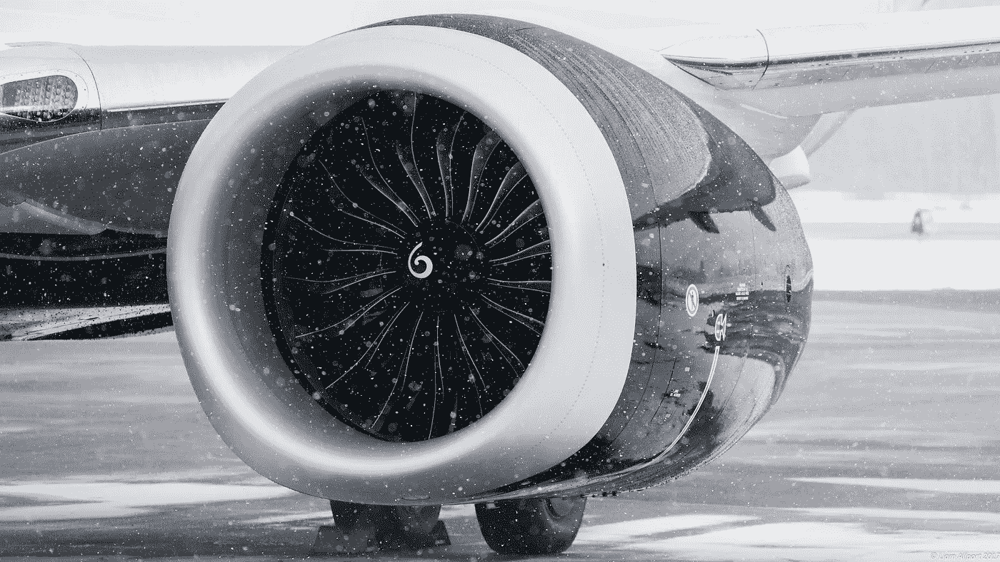
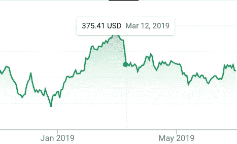
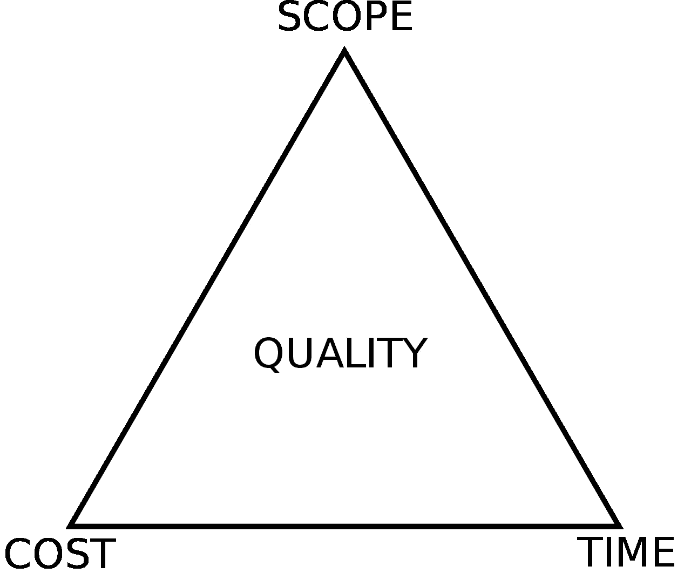

# 为什么削减成本是昂贵的:9 美元/小时的软件工程师如何花费波音数十亿美元

> 原文：<https://medium.com/javascript-scene/why-cutting-costs-is-expensive-how-9-hour-software-engineers-cost-boeing-billions-b76dbe571957?source=collection_archive---------0----------------------->

Photo by Liam Allport (CC-BY-2.0)

2018 年 10 月 29 日狮航 610 航班，一架从印尼雅加达飞往印尼槟城的 737 MAX 8 航班，在起飞 13 分钟后坠入大海，机上 189 人全部遇难。对坠机准确原因的调查仍在进行中，但调查人员认为，坠机可能是由于错误激活了来自[机动特性增强系统](https://en.wikipedia.org/wiki/Maneuvering_Characteristics_Augmentation_System) (MCAS)的命令，根据空速、高度和迎角传感器读数，该系统导致飞机低头以避免危险。

2019 年 3 月 10 日，埃塞俄比亚航空公司 302 航班，也是一架 737 MAX 8 飞机，在类似情况下坠毁，机上 157 人全部遇难。302 航班也报告了可能的错误和(飞机低头)指令。[据维基百科](https://en.wikipedia.org/wiki/Ethiopian_Airlines_Flight_302#Preliminary_report):

> 在接下来的 10 秒钟内，由于飞行员的输入，配平向后移动了 2.3 个单位，飞行员同意并执行了安定面配平切断程序，切断了由 MCAS 操纵的配平马达的电源。

第二次事故后，波音 737 Max 在全球范围内停飞，该公司市值一夜之间蒸发了 60 多亿美元。

Boeing Stock Ticker 2 days after the flight 302 crash. The price fell from $422 to $375 in 2 days.

然而，短期影响仅仅是个开始。如果波音公司不能有效地解决危机，恢复公众的信任，它可能会严重影响公司的长期稳定。据高盛公司称，[波音 737 的销售额占波音公司未来五年](https://www.cnbc.com/2019/03/13/737-max-groundings-put-a-major-source-of-boeings-revenue-at-risk-wall-street-warns.html)预计销售额的 33%。

好消息是，[据一名波音官员对 CNN 财经](https://www.cnn.com/2019/06/29/business/boeing-737-max-outlook/index.html)说:

> “我们相信这可以通过软件修复来更新。”

看来 MCAS 系统可能会失灵，导致飞机急剧俯冲，飞行员无法恢复。

无论这个缺陷是软件还是微处理器硬件，它都是一个[生命关键系统](https://en.wikipedia.org/wiki/Safety-critical_system)的计算系统故障。通常，对于这样的系统，为了保证质量控制，采用许多防线并不罕见。

软件开发中一些常见的防线包括:

*   [需求收集](https://en.wikipedia.org/wiki/Software_requirements)
*   [需求说明书&评审](https://en.wikipedia.org/wiki/Software_requirements_specification)
*   [风险分析](https://en.wikipedia.org/wiki/Risk_assessment)
*   [测试驱动开发(TDD)](https://en.wikipedia.org/wiki/Test-driven_development)
*   [软件林挺](https://en.wikipedia.org/wiki/Lint_(software))
*   [静态分析](https://en.wikipedia.org/wiki/Static_program_analysis)
*   [软件检查/代码审查](https://en.wikipedia.org/wiki/Software_inspection)
*   [模型模拟](https://en.wikipedia.org/wiki/Modeling_and_simulation)
*   [形式方法](https://en.wikipedia.org/wiki/Formal_methods)
*   [验收测试](https://en.wikipedia.org/wiki/Acceptance_testing)

我主要为数百万用户编写管理非生命关键的 T21 系统的消费者应用程序。我最近领导或参与的所有团队都使用系统进行需求收集、规格审查(使用技术[自述驱动开发](https://tom.preston-werner.com/2010/08/23/readme-driven-development.html)和同行审查)、TDD、使用持续集成的生产模拟/ [持续交付](https://en.wikipedia.org/wiki/Continuous_delivery) (CI/CD)以确保软件将在生产环境中工作、林挺、静态分析、代码审查(软件检查的精简版本)和验收测试。

我们在软件质量上投入了大量资金，即使是我们最初级的工程师，不管他们住在世界的什么地方，我们每年也至少支付 10 万美元，以吸引我们能找到的最好的软件工程师来生产易于维护的高质量软件。

我们确实雇佣初级开发人员，但我们确保总有足够的高级工程师来提供指导、代码审查和支持。我们还在培训和指导方面进行了大量投资，以确保我们团队中的每个工程师都能理解构建可靠的软件系统所需的知识。

如果我负责一个生命攸关的系统，我会加倍关注质量，并考虑增加更全面的培训、指导、需求收集、风险评估、软件检查(例如，使用 NASA 的 [Power of 10 rules](https://en.wikipedia.org/wiki/The_Power_of_10:_Rules_for_Developing_Safety-Critical_Code) 的语言相关和数据支持变体作为代码检查清单)、静态分析，甚至是关键系统的正式方法，以数学方式证明我们的算法是正确指定的。

如果我有波音公司的预算，我也会投资研究，看看编程语言的选择是否会有所不同。以我的经验来看，投资导师和我已经讨论过的其他质量措施比语言选择产生的影响要大得多，但对于至关重要的系统来说，一个数据驱动的决策即使能减少一点点缺陷的可能性，也可能是生死之差。我们需要对软件质量进行更好的研究，并且要保护超过 2000 亿美元的市场资本，我认为资助这种研究对波音来说是显而易见的。

我们不会在软件质量上投入太多，因为我们的团队有很大的预算(与波音的工程预算相比，这只是沧海一粟)。我们在软件质量上投入了大量资金，因为从长远来看，这有助于我们更快地前进并节省资金。

> 在软件中，慢就是快。

# 快就是慢，便宜就是贵，那为什么那么多管理者都是便宜的呢？

为了削减成本，工程经理经常催促开发人员，强加武断的不切实际的期限，或者在波音公司的情况下，将工程外包给廉价的承包商，试图增加生产带宽。

波音公司强调节约成本的文化似乎已经渗透到了 737 的工程师身上。波音外包给印度公司 HCL 的一名 737 合同软件工程师[在他的简历中展示了削减成本的文化](https://www.bloomberg.com/news/articles/2019-06-28/boeing-s-737-max-software-outsourced-to-9-an-hour-engineers):

> “为解决生产问题提供了快速解决方案，导致 737-Max 的飞行测试没有延迟(每次飞行测试的延迟将为波音公司带来巨大的成本)。”

不管这些工程师在哪个系统上工作，如果你培养了一种工程文化，在这种文化中，开发人员感到管理重视快速和廉价，而不是持续的进展和高质量的软件，这将对软件的质量和及时交付产生巨大的负面影响。有缺陷的软件需要更长的时间来构建。

当管理层过度强调节约成本时，开发人员会感到匆忙。当开发人员感到匆忙时:

*   指导和评论暂停
*   虫子堆积起来
*   测试被跳过
*   交流受到影响
*   开发人员精疲力尽
*   生产力受损

马克·拉宾曾在一个支持 737 Max 的波音飞行测试小组工作，[告诉彭博](https://www.bloomberg.com/news/articles/2019-06-28/boeing-s-737-max-software-outsourced-to-9-an-hour-engineers)将工程外包给 HCL 的决定是“有争议的，因为这远不如波音工程师只写代码有效率。[……]因为代码做得不对，来回跑了很多圈。”

据拉宾说，一位经理在全体会议上说，波音不需要高级工程师，因为它的产品已经成熟。那则轶事是促使我写这篇文章的原因。如果有任何疑问，让初级工程师在没有高级工程师审查他们的工作并指导他们的情况下编码，就相当于在整个代码库中埋下定时炸弹。

说到工程，快就是慢，便宜就是贵。

“慢就是快”这句话在工程界是众所周知的。它起源于军事用语“慢即是顺，顺即是快”，是*的一种不寻常的感觉。*似乎每个人都知道这是真的，但很少有公司擅长将其付诸实践:尤其是在他们面临压力、最需要它的时候。

波音公司正面临来自其对手空中客车公司的严重的[竞争威胁。2010 年，空客宣布了新的 A320neo，它的燃油效率提高了 7%，一周内的销量超过了波音 737 2010 年全年的销量。](https://www.theverge.com/2019/5/2/18518176/boeing-737-max-crash-problems-human-error-mcas-faa)

波音公司需要迅速回应。为了吸引航空公司，他们决定将现有的 737 作为他们的答案，这不仅节省了从头设计新平台的时间，还将他们锁定在一个与所有先前型号类似的控制和仪表的遗留平台上，可以追溯到 20 世纪 60 年代。这一选择也是航空公司的一个重要销售话题，如果他们做出太多改变，需要重新认证飞行员。这将是一个严峻的工程挑战。

为了避免让空客失去太多市场，他们决定在空客交付 A320neo 后几个月就推出新的 737。他们给了自己 6 年的时间来交付新机型，这比他们交付 787 和 777 的时间缩短了一年多。

换句话说，他们带着乐观的截止日期开始了这个项目，但是他们没有让它变得有抱负，而是努力地去做。在他们开始之前，他们已经锁定了项目管理三角形的所有约束。

Project Management Triangle

范围受到竞争对手预设的宏伟工程目标的限制。时间被锁定，以避免空中客车公司违约获胜。这意味着他们确保质量的唯一手段就是确保项目有足够的预算。但是波音公司的文化已经被锁定在削减成本的命令上。唯一剩下的就是质量了。

削减成本文化的问题在于，像波音这样的公司过于沉迷于此，以至于最终花费的成本远远超过节省的成本。波音公司最初对 737 Max 的预算是 30 亿美元。尽管努力节省时间和金钱，他们还是比预算多花了几十亿美元，而且交货也晚了。

接下来的灾难让他们损失了数百亿美元的市值，300 亿美元的航空订单取消威胁，以及对波音品牌不可估量的损害。他们本可以多投资数十亿美元来遵循更好的工程实践，并且仍然遥遥领先。

这对所有软件经理和工程师来说都是一个很好的教训:在软件领域，快就是慢，便宜就是贵。

> 对质量的投资就是对生产率、成本节约和更高销售额的投资。

如果波音公司没有沉迷于削减成本，那么这本来是一个巨大的胜利，但却变成了一场大灾难，对波音品牌造成了伤害。

不要重蹈波音的覆辙。

## JavaScript 开发人员的相关文章

如果您是 JavaScript 开发人员，这些资源可以帮助您改进软件质量过程:

*   [TDD 改变了我的生活](/javascript-scene/tdd-changed-my-life-5af0ce099f80)
*   [TDD 日——专门进行 TDD 培训的一天](https://tddday.com)
*   [使用 ES Lint 和更漂亮的工具简化代码审查](/javascript-scene/streamline-code-reviews-with-eslint-prettier-6fb817a6b51d)
*   [建立平衡开发团队的基本指南](/javascript-scene/the-essential-guide-to-building-balanced-development-teams-b051a62acc80)

***埃里克·艾略特*** *是一位科技产品和平台顾问，《 [*【作曲软件】*](https://leanpub.com/composingsoftware)*[*【EricElliottJS.com】*](https://ericelliottjs.com)*[*devanywhere . io*](https://devanywhere.io)*的联合创始人，以及 dev 团队导师。他曾为 Adobe Systems、* ***、Zumba Fitness、*** ***【华尔街日报、*******【ESPN、*******【BBC】****等顶级录音艺人和包括* ***Usher、【Metallica】********

*他和世界上最美丽的女人享受着与世隔绝的生活方式。*