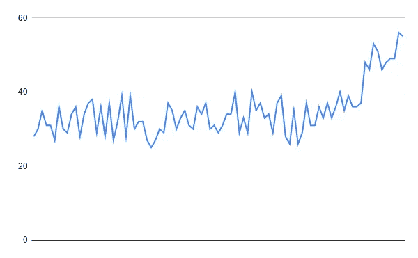
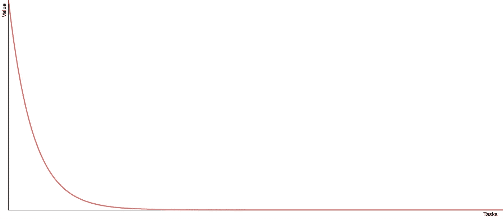

# 为什么开发团队很慢

> 原文：<https://medium.com/javascript-scene/why-development-teams-are-slow-89107985c75c?source=collection_archive---------0----------------------->

## 常见软件堵塞及解决方法

Image: Smoke Art Cubes to Smoke — MattysFlicks — (CC BY 2.0)

> 这篇文章是管理软件系列的一部分。
> [<上一个](/javascript-scene/the-hardest-part-of-being-a-software-manager-5293b1b02f94) | [下一个>](/javascript-scene/demos-over-deadlines-8ed8dcdecb6)

让我们来看看是什么导致了软件装配线的堵塞，以及作为一名经理你能做些什么。原因有很多，所以我们不打算一一列举。相反，我们将集中讨论几个最常见的问题:

*   不切实际的期望
*   太多未解决的问题
*   难以管理的任务规模
*   代码审查堆积如山
*   训练不足
*   开发者倦怠
*   疯狂的
*   员工保留率低

“开发商太慢”不是原因。这是其他原因的症状。100%的时候，如果一个开发团队“太慢”，那是经理的错。好消息是经理有很大的权力去纠正它。让我们更好地理解这些问题，这样我们就能想出我们能做些什么。

# 不切实际的期望

开发人员生产力最常见的问题根本不是开发的问题。相反，这是我们作为管理者和利益相关者对软件开发的看法的问题。

作为一名软件经理，最难的部分是理解软件需要花费时间，匆忙会使它变慢并出错。耐心就是一切。

软件生产率滑坡最常见的问题不是团队速度慢，而是团队在处理不切实际的期望。这完全是你的责任。如果压力来自你的头顶，你就不能恰当地管理期望。如果压力来自你，继续读下去。

我们经常忘记我们以前从未开发过这个软件。如果已经有软件可以完成这项工作，就购买、使用、导入模块等。不要从头开始构建。新开发的软件通常是独一无二的。它是做一些新的事情或者做一些不同的事情。这就是为什么你必须首先建立它。因为你以前从未建造过它，所以你不知道要花多长时间。与建筑业不同，建筑业可以预测地以恒定的速度建造预制墙，并可以使用这些数据来为他们的估计提供信息，而软件业没有这样的可靠数据来源。更糟糕的是，开发人员之间的性能存在数量级的差异。引用史蒂夫·麦康奈尔(作者，《代码完成》):

> “程序员之间存在数量级差异”这一普遍发现已经被许多其他对职业程序员的研究所证实(Curtis 1981，Mills 1983，DeMarco 和 Lister 1985，Curtis 等人 1986，Card 1987，Boehm 和 Papaccio 1988，Valett 和 McGarry 1989，Boehm 等人 2000)。

我们缺乏必要的数据来预测建设我们的项目需要多长时间。我们在构建软件的过程中，会发现范围和复杂性，这是一个经常会有很多惊喜的过程。软件既是一个计划，也是一个探索，不管我们如何努力去计划。

> “前 90%的代码占用了前 90%的开发时间。剩下的 10%代码占用了另外 90%的开发时间。”~汤姆·卡吉尔，贝尔实验室

不切实际的期望有一些原因是管理者可以控制的。一个根本原因是衡量错误的东西。

你可能熟悉彼得·德鲁克的名言:

> “可测量的东西会得到管理。”

当然，这是很好的建议。我们当然应该衡量事物！但这忽略了引用的要点。不仅如此，它完全曲解了这句话的意思。完整的引用是:

> “被度量的东西会得到管理，即使度量和管理它毫无意义，即使这样做会损害组织的目的。”

简而言之，有些事情我们绝对不应该衡量。这里有两个例子:

*   预测燃尽图—显示当前未结票据数量的折线图的图表，根据最近的速度测量值绘制预测完成日期。
*   按开发人员列出的已关闭票证—针对单个开发人员完成的作业数量收集的指标。

衡量这两件事已经让无数的企业在生产力损失、员工流失和机会成本上损失了数十亿美元。

# 预测燃尽图

许多软件工具试图根据当前的范围和历史速度来预测你何时完成一个项目。问题是，预测性燃尽图无法准确说明未发现的范围。不可能考虑未发现的范围，因为完成一个工作单所需的时间长度可能会有数量级的变化，这可能会严重扭曲历史平均值对当前范围的应用并使其无效。

如果你根据燃尽图中的日期设定了一个截止日期或期望，你已经错过了这个日期。唯一能拯救你的是，你尽可能地缩小你发现的范围。

当你基于不完整的信息进行评估时，这种评估会反过来伤害你和你的团队。不切实际的估计会产生不切实际的期望。如果你错误地与营销团队分享这些错误的预测，然后对客户和媒体设定不切实际的期望，事情会变得更糟。

但并不是所有的燃尽图都是邪恶的。非预测性燃尽图给了我们有用的见解。当您看到范围内的开放票证数量持续增长而不是减少或横向移动时，它们可以为我们提供范围蔓延和复杂性爆炸的早期警告。一个有用的燃尽图跟踪实际的成交数字，而不是预测未来的数字。例如，该图表跟踪一个项目从开始到完成的全过程。对于项目的大部分，运动有起有落，但大部分是横向运动，直到我们到达项目的最后阶段，我们最终可以在新发现的范围上获益。

A burndown chart illustrating a downward curve.

遭受范围蔓延的项目将向上弯曲而不是向下弯曲，或者在项目的最后几周不能向下弯曲。

A burndown chart illustrating a scope explosion.

请记住，观察图表形状的目的不是操纵图表形状，而是识别和修复潜在的问题。您不希望您的开发人员试图通过未能打开工作单来记录发现的范围来操纵图表形状。目标是过程的可见性，而不是图表上的直线或下降线。

小心古德哈特定律:

> "当一个度量成为目标时，它就不再是一个好的度量."

并非所有的预测都是邪恶的。当你有一个明确的截止日期时(例如，试图在黑色星期五之前发布你的新游戏)，你可以根据平均速度明智地预测未来，以便在你需要缩小范围时获得早期警告。如果历史速度预测告诉你要到 12 月才能完成，相信它。是时候分清轻重缓急，切了。

软件生产预测的经验法则:

如果一个预测告诉你你可以在某个日期做某事，不要相信它。如果一个预测告诉你你不能在某个日期做某事，相信它。

# 开发商关闭的票证

作为一名经理，计算每个开发人员正在关闭的工作单的数量，然后将其与团队平均水平进行比较，这是非常诱人的。我劝你抵制诱惑。有许多更好的方法可以让我们深入了解开发人员的生产力。

封闭式计票有两个基本缺陷。首先，不是所有的票都代表相等的工作或相等的价值，事实上，完成的工作的价值落在幂律曲线上。一小撮门票的价值比“平均”高出许多数量级:摩天大楼的地基和最后一颗钉子之间的区别。所以一个简单的关闭票的计数不能准确地告诉价值交付故事。

Task Value Power Law

几年前，我在一家世界领先的零售商的购物车上工作。有一天，我停止了在吉拉写代码和关闭车票(当时选择的车票追踪器)。我加了一张票:“可用性研究。”

一年多来，我们一直致力于重新设计我们的购物车，新版本的发布时间很快就要到了。到目前为止，我们还没有对新的结账体验进行任何最终用户可用性测试:所以我花了一周时间。我们提前接触了 1000 名最忠实的支持者，并对他们进行了调查以收集反馈。我分析了结果，注意到注释和日志文件中有一个令人不安的模式:

购物车放弃率高达两位数。一场即将到来的灾难！因此，我开始计划亲自录制可用性测试的视频。我把新手放在新的购物车前，给他们一些要完成的任务，然后让他们开始工作。我什么也没说。只是看着他们用推车。

我注意到在结账时，人们很难接受结账表单中的错误反馈。有了这些数据，我对 GitHub 上的一个开源项目做了一些微小的修改(注意:是在 GitHub 上记录的，而不是在我们的问题跟踪器中)。过了一会儿，我又做了和以前一样的分析。购物车放弃率降低了两位数:每月的差额超过 100 万美元。

与此同时，我的队友们每人都完成了 10-15 张票。你可能会说，我本可以开更多关于可用性研究的罚单，但是为了让它更准确地反映价值，我需要开一千或更多的罚单，这只会制造噪音和浪费大量时间。

关闭的票证计数具有误导性的另一个原因是，您最有生产力的开发人员也是团队中其他人寻求帮助的人。他们最了解代码库，或者他们只是优秀的开发人员、合作者或沟通者。他们帮助你处理拉式请求积压，审查其他开发人员的代码，并且教导和指导你团队中的其他开发人员。他们是团队中生产率最高的开发人员，因为他们帮助团队中的其他成员将生产率提高一倍。也许他们关闭的票证是使整个团队更有生产力的库或框架。他们得到了所有的助攻，而其他的开发者得到了扣篮的荣誉。

如果你不小心，很容易忽略你最有生产力的开发人员的贡献。了解您的开发人员如何对项目做出贡献的最佳方式是询问他们。然后请其他开发人员提供反馈，告诉他们谁是团队中最有帮助的成员。

通常，这些讨论中反映的价值与票计数中反映的价值大相径庭。

一定要从总体上监控价值交付，但是不要试图用同样简单的标准来判断每个开发人员的贡献。软件是一项团队运动，团队中的每个成员都扮演着不同的角色。没有一个神奇的标准可以告诉你开发人员的生产力。

# 太多未解决的问题

很容易得到一个想法，在你的问题跟踪器中打开一个问题，然后继续你的一天，但是你的问题跟踪器中的每个问题都代表一个返工周期。在开发人员开始工作之前，每个问题都需要进行分类、区分优先级和分配。几乎每次开发人员完成任务并选择另一个任务开始时，这项工作都会重复。如果你有一个项目经理或 scrum master 为开发人员分配工作，他们每次重新排列队列的优先级时都会重复这项工作(通常每个 sprint 或每隔几周至少会发生一次)。

然后，开发人员需要吸收问题的背景，发展对问题的理解，将复杂的问题分解成更简单的问题，所有这些都是在他们开始开发解决方案之前。

门票是一个很大的工作，但不仅如此，他们不是真正的工作。它们是元工作——关于工作的*工作。门票本身的内在客户价值为零。每次开发人员需要弄清楚下一步要做什么时，他们都要重复工作。为了找出答案，你需要整理的票越少越好。待办事项中低优先级问题越少，开发人员选择高优先级、高价值票据的机会就越大。*

如果软件中有一个 bug，只有一个客户提到过，这个 bug 有关系吗？当然，它困扰了一个人，但是队列中的其他 bug 影响了更多的用户吗？有没有比修复这个 bug 更有价值的新特性？

大概吧。减少问题积压中的噪音。删除那些你不打算马上开始的东西。如果真的很重要，你会在更合适的时候再补充。

# 难以管理的任务规模

总的来说，我喜欢让我团队中的开发人员将他们的工作分解成他们可以在一天内完成的工作单。这比听起来要难，因为这意味着学习如何将复杂的问题分解成更简单、更容易解决的问题，这些问题可以独立于应用程序的其余部分进行测试。例如，如果您正在构建一个新的购买流程，您不必将 UI 组件、状态流程和服务器通信混合到一个涉及 13 个不同文件的大提交中，所有这些都与现有的代码库紧密耦合。这是有问题的，因为它会导致很大的拉请求(PRs ),很难检查和合并。

相反，从客户端代码的可独立测试的购物车状态模块开始，并对其发出拉请求。然后构建服务器端结帐 API，并为此创建一个单独的 PR。然后构建一个 UI 组件，它导入客户端状态模块并连接到服务器端 API。他们中的每一个都可以被分解成他们自己的工作单和他们自己的提交，即使任务实际上是一个很大的特征。额外好处:你可以分配多个开发人员，通过更好地利用你的开发人员总数，更快地完成特性。

一个[功能切换系统](https://www.oreilly.com/library/view/programming-javascript-applications/9781491950289/ch09.html)允许您关闭功能，直到它们完成并准备好在生产中启用，从而使这个过程更加安全和简单。

> 警告:如果没有良好的冒烟测试覆盖率，不要试图这样做，以确保你没有通过将半成品功能交付给生产而破坏应用程序中的任何关键工作流。确保测试功能切换的两种状态。

# 代码审查堆积如山

当开发人员在一天之内做了超出他们能力范围的事情时，结果通常是对代码审查的巨大拉动请求。这是“持续集成”(CI)的“集成”阶段。问题是，一个 PR 打开的时间越长，你在它上面花费的时间就越多，因为好奇的开发者打开它，看看他们是否能帮助合并它。然后，他们提供一些反馈，请求一些更改，然后回到作者那里，对更改请求做出响应，并希望解决所有的问题，这样它就会得到批准。

当几个开发人员养成了创建非常大的提交的习惯时，您就可以开发一个提交的积压，集成就开始漂移了。鲍勃对 JSC 已经编辑过但尚未合并的文件进行了更改。鲍勃的公关得到批准和合并第一，让 JSC 仍然开放的公关从主漂移。她不能合并她的分支，直到她修复了由 Bob 的代码更改引起的任何合并冲突。用这个 PR 堵车乘以`n`开发人员，其中`n`是你的项目中有重叠工作的开发人员数量。这些交通堵塞导致更多的客户流失。让我们跟踪一个常见场景中的搅拌总数:

1.  鲍勃和 JSC 检查了同一家总分行。流失:0
2.  Bob 从主分支做出他的更改，并提交到他的分支。JSC 从主分支进行更改，并提交到她的分支。流失:2
3.  Bob 的更改首先合并。JSC 然后合并鲍勃的变化和她的，并发现一个冲突。她解决了冲突，并将变更提交到她的分支。流失:3
4.  JSC 打开一个拉取请求。鲍勃向 JSC 提到，她对他的代码所做的更改会破坏一些她没有考虑到的东西。JSC 采纳了鲍勃的建议，再次提交了代码。流失率:4
5.  JSC 的公关被批准和合并。总流失率:4

或者，如果提交较小，并且 PRs 被快速合并，则相同的流程可能看起来像:

1.  Bob 做了一点小小的改变，很快就掌握了。流失:1
2.  JSC 检查出主人与鲍勃的变化已经纳入，并使她的变化与鲍勃的变化已经集成:流失:2
3.  由于 JSC 的变化也很小，它很快就被合并到 master。总流失率:2

通过保持 PRs 较小并保持在它们之上，我们可以显著地减少由代码变动和集成冲突引起的返工。

# 训练不足

软件行业在培训和支持开发人员方面很糟糕。大学训练我们使用的标准库中已经内置的算法，很少有开发人员应该从头实现，而忽略了软件开发基础，如抽象原则、耦合原因、模块化与整体设计、模块工作、功能组合、对象组合、框架设计、API 设计和应用程序架构。由于相对年轻的软件行业的爆炸式增长，[将近一半的软件开发人员只有不到五年的经验](https://insights.stackoverflow.com/survey/2019)，而 [88%的员工认为他们需要更多的培训](https://www.spherion.com/ugc/documents/Spherion_2018_Executive-Summary.pdf)。

团队行动缓慢是因为他们不知道自己在做什么，也没有人费心去教他们。作为经理，我们的工作是聘请资深导师来指导我们的团队，然后给他们专门的时间来做这件事。以下是一些策略:

*   代码审查——开发人员从互相查看代码中学到了很多东西。
*   将高级工程师与初级开发人员结对——这些结对不需要全职。我发现临时配对很好。
*   专门安排时间参加辅导会议——聘用热爱教学、擅长沟通的高级工程师，然后给他们时间与初级开发人员进行一对一的交流，帮助初级开发人员找出他们下一步需要学习的内容，以发展他们的技能。

# 开发者倦怠

比错过最后期限更糟糕的是，经理可能收获的最大耻辱是耗尽团队的精力。

开发人员倦怠是一个严重的问题，可能会导致团队中开发人员的流失，导致员工流失、业务因素风险和巨大的业务支出，但更重要的是，开发人员倦怠可能会导致开发人员严重的健康问题。这些问题会导致长期残疾，甚至因心脏病发作或中风而死亡。在日本，这种现象非常普遍，日本人用一个词来形容它:。

一个经理可以一下子耗尽整个团队的精力，让团队的生产力陷入停滞。整个团队筋疲力尽的问题在视频游戏行业尤为普遍，黑色星期五几乎总是最后期限。不幸的是,“去死吧”在实践中经常是字面意思，但很少被理解为字面意思或字面意思。

管理人员不应该让开发人员更加努力地工作，而是需要认识到，按时完成任务的责任 100%落在管理人员身上，而不是开发人员。我们可以使用替代策略更好地完成截止日期:

*   更好地确定优先级并缩小范围
*   使用更高效的流程(例如，实施更好的 bug 控制措施)
*   识别并重构代码中的流失源

# 员工保留率低

LinkedIn 2018 年的数据显示，软件行业的人才流失率[是所有行业中最高的](https://business.linkedin.com/talent-solutions/blog/trends-and-research/2018/the-3-industries-with-the-highest-turnover-rates)。这很糟糕，因为这会导致异常高的[总线因素风险](https://en.wikipedia.org/wiki/Bus_factor)——你会失去团队关键技术专家的风险。

行业中的许多公司没有给予足够的重视或重视留住人才。让我们仔细看看开发人员流失的成本。招聘人员通常收取 1.5 万到 3 万美元的安置费。在美国，一名工程师的平均时间成本为每小时 90 美元。乘以 50 来面试潜在的开发者，然后再花更多的时间来回答问题和招募新成员。我们已经轻松进入$50k 的领域，但还有更多。新的开发人员可能需要一年或更长时间的工资才能达到他们取代的员工的生产力水平，并且可能会在早期犯很多错误并导致很多返工。

总的来说，招聘、面试、入职、培训和与流失员工相关的机会成本以及需要填补空缺的开发人员的生产力损失加起来可能超过流失员工工资的 90%。替换可能需要几个月的时间，开发人员通常要花几个月的时间进行升级。

所有这些都非常耗时，大型团队通常会遭受持续的拖累，因为正如 2019 年 Stack Overflow 调查所指出的那样， [60%的受访开发人员在不到 2 年前换了工作](https://insights.stackoverflow.com/survey/2019)。

当一个开发者真正成长起来的时候，你已经失去了他们。

你如何避免这种情况？合成来自 [的](https://www.predictiveindex.com/blog/remote-work-improves-employee-productivity-happiness-retention/) [a](https://insights.stackoverflow.com/survey/2016) [品种](https://insights.stackoverflow.com/survey/2017) [的数据来源](https://www.spherion.com/ugc/documents/Spherion_2018_Executive-Summary.pdf):

*   公平支付
*   定期加薪
*   提供充裕的假期
*   提供远程工作
*   保持你的期望现实
*   提供符合工程师兴趣的工作
*   不要让你的技术落后太多
*   提供良好的培训和职业发展机会
*   提供极好的健康益处
*   不要要求开发人员每周工作超过 40 小时
*   提供当前设备

# 疯狂的

如果你认为你没有时间实现一个高质量的软件开发过程，你真的没有时间跳过它。

根据[《评估软件工程技术》](https://www.computer.org/csdl/journal/ts/1987/07/01702295/13rRUIM2VIx)(大卫·n·卡德，弗兰克·e·麦克加里，杰拉尔德·t·佩奇，1978)，质量过程在不增加成本的情况下减少错误。其中一个原因是，根据[“软件评估、基准和最佳实践”](https://amzn.to/2SK8WfI) (Caspers Jones，2000)，软件缺陷去除是软件工作中最昂贵和最耗时的形式。

众所周知，bug 会导致返工和代码变动，而且你越晚发现它们，修复它们的代价就越大。当一个开发人员被分配了一个已经在生产中的 bug 的高优先级修复时，它通常会中断该开发人员正在为客户快速修复问题的工作。根据[“任务切换和中断的日记研究”](https://dl.acm.org/doi/10.1145/985692.985715) (Mary Czerwinski，Eric J. Horvitz，Susan Wilhite)，一个中断的任务可能需要两倍的时间，包含两倍的错误，这意味着高优先级的 bug 是会传染的。在解决一个问题的过程中，你可能会引发另一个问题。

生产中的错误还会导致客户支持需求的增加以及客户流失，这两者都可能会让您损失金钱。然后，你必须考虑修正错误的机会成本，而不是为客户创造新的价值。在实现时发现的 bug 通常可以在几分钟内修复，但是如果在生产中发现 bug，它将经历额外的开发阶段，包括 bug 报告、分类、优先级排序、分配，以及最终的开发。但是我们还没有完成减速。一个 bug 修复通常有自己的提交、自己的代码审查、自己的集成，在某些情况下，还有自己的部署，在这个过程的任何阶段，一个测试都可能失败，从而触发另一个开发 CI/CD 周期的重新开始。

总的来说，在产品中发现的一个 bug 比在开发过程中发现的一个 bug 要多花费几个数量级来修复，甚至在你计算客户服务和用户流失成本之前。

这里有一些你可以做的事情来提高你的质量过程。

*   减速加速。*慢则顺，顺则快。*
*   实践设计评审。设计和代码检查的结合可以捕获 70%的软件缺陷。[“测量缺陷潜力和缺陷去除效率”](https://citeseerx.ist.psu.edu/viewdoc/download?doi=10.1.1.170.4926&rep=rep1&type=pdf)，(Caspers Jones，2008)
*   实践准则审查。[受检软件维护成本降低 90%](https://amzn.to/3cGDxT8)。[一小时的检查节省了 33 小时的维护](https://ieeexplore.ieee.org/document/62929)。检查代码的开发人员的工作效率至少提高了 20%。
*   使用 TDD。 [TDD 可以减少 40% — 80%的 bugs】](https://www.researchgate.net/publication/3249271_Guest_Editors'_Introduction_TDD--The_Art_of_Fearless_Programming)
*   使用持续集成/持续部署(CI/CD)。CI/CD，统称为连续交付，是一个结合了代码审查、自动化测试(单元和功能测试)、自动化测试部署以及最终自动化生产部署的自动化过程。因为整个流程是自动化的，所以在这个非常容易出错的过程中的任何一步都没有出错的机会，并且自动化可以为每个开发人员每次交付节省几十甚至几百个小时的手工工作。如果您没有使用 CI/CD，请从今天开始。
*   提高测试覆盖率。您的持续集成/持续部署(CI/CD)过程应该运行一套自动化测试，如果这些测试中的任何一个失败，就应该停止。这可以防止 bug 被发布到产品中，并在这个过程中节省大量的时间和金钱。如果你没有从足够好的测试覆盖率开始，连续交付是一个坏主意。在自动化交付之前，以最低 70%的代码覆盖率为目标，并努力保持这个数字在 80%以上。之后，当你接近 100%时，你会看到收益递减。在那个阶段，你最重要的用户工作流的功能测试用例覆盖将比增加单元测试覆盖交付更多的价值。

# 结论

经理可以通过多种方式影响团队的表现。其中包括:

*   设定现实的期望(在报告链的上下游)
*   监控和控制当前未解决问题的数量
*   管理任务大小
*   不要让代码评审堆积如山
*   培训开发人员
*   为开发人员提供良好的工作/生活平衡
*   实施有效的软件质量过程
*   注意留住员工

# 后续步骤

DevAnywhere 为软件开发团队的领导者提供指导。您可以就以下主题为您的团队提供一对一的个性化建议:构建卓越的质量流程、培养学习和指导文化、与产品团队合作以及构建高效的 CI/CD 流程。为了了解**我们如何帮助您的团队更快地交付高质量的软件，** [告诉我们您的团队和您的需求](https://devanywhere.io/help)。

想让你的团队跟上 TDD 的速度，并且**减少 40% — 80%的生产错误吗？**[EricElliottJS.com](https://ericelliottjs.com/premium-content)包括迪士尼互动、Spotify、网飞、PayPal 和亚马逊的员工用于提高质量实践的 TDD Day 5 小时培训。它还包含了 JavaScript、TDD、函数式编程、React、Redux 等课程。想为你的整个团队购买通行证？让我们知道你想买多少，我们会寄给你一张发票，你可以一次付清。一旦你付款，我们将向你发送一个神奇的链接，你的员工可以使用它来设置他们的帐户。

***埃里克·埃利奥特*** *是一位科技产品和平台顾问，著有* [*【作曲软件】*](https://leanpub.com/composingsoftware) *，*[*EricElliottJS.com*](https://ericelliottjs.com)*和*[*devanywhere . io*](https://devanywhere.io)*，以及 dev 团队导师。他为 Adobe Systems、* ***、Zumba Fitness、*** ***【华尔街日报、*******【ESPN、*******【BBC】****和顶级录音艺术家包括* ***Usher、弗兰克·奥申、金属乐队、*****

**他和世界上最美丽的女人享受着与世隔绝的生活方式。**