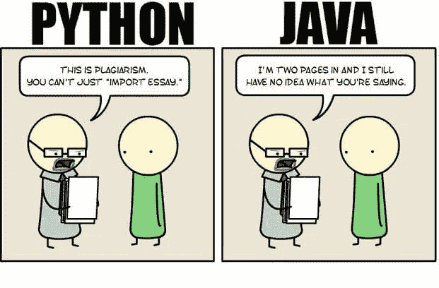

# 为什么数据科学家更喜欢 PYTHON 而不是 JAVA？

> 原文：<https://medium.com/quick-code/why-do-data-scientists-prefer-python-over-java-d570499a1fcd?source=collection_archive---------2----------------------->

在 StackOverflow 调查中，Python 被称为最受欢迎的语言，今年它甚至击败了 C#。StackOverflow 记录了 Python 令人难以置信的发展，并将其标记为机器学习应用程序的首选语言。

DATA SCIENTISTS PREFER PYTHON OVER JAVA?

事实上，根据调查结果，Python 是 StackOverflow 上访问量最大的标签之一，也是 2018 年增长最快的标签之一。自 2013 年以来，它还实现了同比增长。Hackerrank 2019 年开发者调查表明，尽管 JavaScript 是雇主最需要的语言，但根据他们的爱恨指数，Python 赢得了所有年龄段开发者的心。

# 为什么 Python 是机器学习中最受欢迎的语言？

**功能强大且易于实现:**使用 Python，学生和研究人员需要在进入机器学习或人工智能之前了解这门语言。由于 Python 被认为是初学者语言，所以它没有陡峭的学习曲线，即使是具有基础知识的开发人员也可以使用它。除此之外，开发人员也不需要考虑软件工程的限制或者花在调试 Python 代码上的时间。与 C、C++或 Java 等语言相比，所消耗的时间更少。因此，开发人员可以花更多的时间在他们与 AI 和 ML 相关的算法和启发式算法上。

**库的易用性:** Python 自带了大量用于机器学习和人工智能的内置库。最受欢迎的一些库有 Pytorch、TensorFlow(用于深度学习的高级神经网络库)、scikit-learn(用于数据挖掘、数据分析和机器学习)、matplotlib、seaborn、scikit(数据可视化)等。由于 Python 的流行，有大量的资源——机器学习和数据科学教程——可以利用 Python 库。大量的教程也很容易在网上找到。

大多数时候，研究人员建立自己的库，并上传到 GitHub 或类似的平台上，以便他人使用。开发者社区的支持和丰富的特性使得 Python 适合机器学习应用。另一方面，Java 主要是为一般编程而构建的，而不是数字运算，在数字运算领域，R 和 Python 更受青睐。

# 速度:Java 比 Python 快

由于 Java 是最古老的语言之一，它附带了大量用于 ML 和数据科学的库和工具。然而，与 Python 和 C#相比，它也是初学者很难掌握的语言。就工具集而言，Java 有许多库和工具，其中一些流行的是 Weka、Java-ML、MLlib 和 Deeplearning4j，它们被用来解决大多数前沿的机器学习问题。此外，Java 被认为比 Python 快 25 倍。在并发性方面，Java 打败了 Python。

在扩展应用程序方面，Java 非常出色，这使得它成为构建大型和更复杂的 ML 和 AI 应用程序的最佳选择。研究人员断言，如果你打算从底层开始构建你的应用程序，选择 Java 作为你的编程语言是很好的。

# 为什么 Python 在数据科学界如此受欢迎

Python 在科学和研究社区中被广泛使用的主要原因之一是因为它的易用性和简单的语法，这使得它很容易被没有工程背景的人采用。它也更适合快速原型制作。另一个可以解释 Python 流行的原因是，大多数关于数据科学和机器学习的在线课程都在推广 Python，因为它对初学者来说很容易使用。

由于其多功能性，大多数开发人员将 Python 称为数据科学社区中的瑞士军刀。这背后的原因很容易理解，Python 仍然是这些公司在数据科学和分析专业人员中最受欢迎的技能之一。

根据工程师的说法，除了来自学术界和工业界的科学包之外，深度学习框架可与 [**Python 在线培训**](https://onlineitguru.com/python-training.html) 一起使用，使 Python 变得非常高效和通用。据《走向数据科学》报道，在过去的两年里，深度学习 Python 框架有了很大的发展，我们看到了 TensorFlow 的发布。正如一个开发者在一个论坛上指出的，人工智能需要大量的研究，而使用 Python，人们甚至可以用三十行代码来验证他们的想法。

就应用领域而言，ML 科学家也更喜欢 Python。当涉及到构建欺诈检测算法和网络安全等领域时，开发人员倾向于 Java 而对于自然语言处理(NLP)和情感分析等应用程序，开发人员选择了 Python，因为它附带了大量的库。