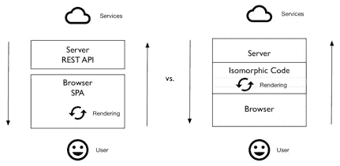

# 为什么每个人都在谈论同构/通用 JavaScript，为什么它很重要

> 原文：<https://medium.com/capital-one-tech/why-everyone-is-talking-about-isomorphic-universal-javascript-and-why-it-matters-38c07c87905?source=collection_archive---------0----------------------->


最初应用于数学的术语“同构”是由 Airbnb 的 [Spike Brehm 在 Javascript 开发中首次推广的。从一开始，许多开发人员就反对这种用法，最近，随着竞争术语“通用 Javascript”作为“同构 Javascript”的替代物出现(最引人注目的是在](http://nerds.airbnb.com/isomorphic-javascript-future-web-apps/)[迈克尔·杰克逊的帖子](/@mjackson/universal-javascript-4761051b7ae9))，这种用法已经成为新闻为了简单起见，我将坚持使用更吸引人的词同构，因为这是第一个，也是为了避免陷入技术领域如此普遍的术语之争。在这篇文章中，我们将更深入地探讨同构的概念，并揭示为什么它对 web 开发如此重要——不管用来描述它的流行语是什么。

**同构**应用于 web 开发意味着在服务器端和客户端都呈现页面。这通常意味着使用 JavaScript 和 Node.js/Io.js，因为它们允许库的重用，允许浏览器 JavaScript 代码在 Node.js/Io.js 环境中运行，只需很少的修改。由于这种可互换性，Node.js 和 JavaScript 生态系统支持多种同构框架，例如 [React.js](http://reactjs.net/) 、 [lazo.js](http://lazojs.org/) 和 [Rendr](http://rendrjs.github.io/) 等等。



开发人员热衷于同构的三个主要原因是:

*   更好的搜索引擎优化(SEO)
*   更好的性能
*   更好的可维护性

在我们谈到这些好处之前，让我们后退一步，看看 web 的历史以及它与同构的关系。

# Web 开发快速概述

在网络的早期，服务器呈现所有的 HTML 页面，网络体验比桌面应用差得多。每次用户与页面交互时，页面都必须刷新，大多数交互都是像提交一些数据或更新记录这样的单一操作。再加上用户体验意识差(UX)和连接慢，你就明白了…

到 2000 年底，所谓的单页应用程序(SPAs)变得更加流行，因为这种架构允许更快、更用户友好的应用程序，其性能更像桌面应用程序。(如今，桌面应用程序是使用 web 技术构建的，使用了像 Electron 或 Adobe Air 这样的包装器，所以桌子是反过来的！)SPAs 的定义特征是它们不需要页面重载，异步加载数据，因此用户可以在数据加载时做其他事情。例如，您可以在 Gmail 中并行标记多封电子邮件，而无需等待标记电子邮件的第一个过程成功完成。这改善了用户体验，因为 spa 的功能更像桌面应用程序。这就是为什么你可能会使用很多 spa——谷歌文档就是一个很好的例子——或者甚至已经开发了一个。

SPAs 的另一个特征是 HTML 在客户端，即浏览器上呈现和操作。这减小了有效负载的大小，因为服务器只返回 JSON，而不是 HTML。然而，这种方法也有一些缺点:

*   大部分搜索引擎在抓取网站时不支持客户端渲染。甚至谷歌也声明[代码必须足够简单，让它的爬虫能正确解释](http://www.capitalone.io/blog/why-is-everyone-talking-about-isomorphic-javascript/)。
*   随着 spa 变得越来越大，它们要求用户下载越来越多的前端 JavaScript 代码，导致应用程序可以使用之前的等待时间增加(“正在加载…”消息)。
*   用户必须打开 JavaScript。
*   页面框架加载后，用户必须等待数据通过 JSON 中的 AJAX/XHR 返回。

用非同构的策略来修补这些问题是非常麻烦的。例如，在同构 JavaScript 成为流行术语之前很久，在服务器端呈现页面就是一种实践。然而，沿着 SPAs 呈现服务器端通常需要使用不同的模板和逻辑，因为服务器端平台使用像 Ruby、Java 或 PHP 这样的语言。同样，另一个重要的策略是将爬虫重定向到运行类似 Phantom.js 的无头浏览器的[独立机器上。](http://www.capitalone.io/blog/why-is-everyone-talking-about-isomorphic-javascript/)

随着 Node.js 的出现，编写在浏览器和服务器上呈现的代码成为可能。不用说，从可维护性的角度来看，只有一套代码要好得多，并且开始超越其他 web 开发策略。那么同构如何解决 SEO、性能和可维护性的问题呢？

# 搜索引擎正确索引页面的能力

用 Backbone.js、Angular.js、Ember.js 等框架构建的单页面应用。广泛用于编写受保护的应用程序，即需要用户名和密码才能访问的应用程序。大多数 spa 提供受保护的资源，并且不需要 web 索引，因为它们没有公共仪表板。例如，从 Capital One 网上银行到 Gmail 再到 Evernote.com，每个人都要求用户在看到实际应用程序之前登录。

然而，绝大多数网站在登录后并没有受到保护。对于这些公共应用和页面，SEO 实际上是强制性的，因为他们的商业模式严重依赖于搜索索引和有机流量。最近，谷歌为他们的爬虫添加了 JavaScript 渲染功能。理论上，这意味着谷歌将像普通浏览器一样呈现 SPA，并索引其内容。然而，谷歌自己说，“有时在渲染过程中事情并不完美，这可能会对你网站的搜索结果产生负面影响。”— [更好地理解网页](http://www.capitalone.io/blog/why-is-everyone-talking-about-isomorphic-javascript/)。所以为了安全起见，SPA 开发者**仍然需要将他们的非 JavaScript 渲染**尽可能地镜像到支持 JavaScript 的(浏览器或 SPA)渲染，以避免被爬虫忽略。例如，Capital One 的主页必须被搜索引擎编入索引，以便我们的客户能够轻松找到公开访问的页面。

虽然有些应用程序优先考虑正确的搜索引擎索引，但其他应用程序则依赖于快速的性能。像 mobile.walmart.com([文章](http://www.walmartlabs.com/2014/06/in-search-of-the-holy-grail-again))和 Twitter.com([文章](https://blog.twitter.com/2012/improving-performance-on-twittercom))这样的网站做了研究，表明提高第一页(第一次加载)的速度可以提高网站的整体性能。

这项研究证实了服务器端渲染需要尽可能快地显示第一页，而其他代码可以在用户浏览页面时加载。因此，当用户加载第一页时，他/她不会看到*“正在加载…”*消息；他们会看到一个功能页面，从而有更好的用户体验(UX)和更好的应用体验。

# 更好的代码可维护性

代码是一种负担。越多，你和你的团队需要支持的就越多。因此，您通常希望避免对同一页面使用不同的模板和逻辑。幸运的是，Node.js/Io.js——以及手柄、小胡子和灰尘等模板引擎——使得在服务器上使用前端/浏览器模块变得毫不费力。

除了重用模板，开发人员还可以在服务器和浏览器上重用相同的库和实用程序，从而进一步减少对多余代码的需求。由于这个原因，像下划线. js、lodash、Request 和 SuperAgent 这样的库非常受欢迎。在服务器和浏览器上拥有相同的库允许更好的开发和代码重用，这使得软件工程师更快乐，花费在维护代码上的时间更少。如果我们更进一步，我们甚至可以开发自己的内部模块，在浏览器和服务器之间共享。我们在 Storify 用 jade-browser 做到了这一点。该模块允许您的 Node.js 和 Express.js 驱动的应用程序向浏览器公开 Jade 模板，浏览器 JavaScript 代码可以使用这些模板(我们在浏览器上使用了 Backbone 和 jQuery)。

同构 JavaScript 的另一个优势是数据模型可以在浏览器和服务器之间共享，例如 Meteor 或 [Falcor](http://netflix.github.io/falcor) 。这最大化了浏览器和服务器之间的一致性。在 DocuSign，我们调整了 Backbone.js 模型(一个浏览器框架)以在服务器上工作。这允许我们在 AJAX/XHR 请求之前获取 DocuSign web SPA 的数据，从而提高了应用程序的性能。

# 选项:React.js、Lazo.js 和 Rendr

所以你想在你的 web 开发中使用同构？虽然有各种各样的库和框架允许开发人员在 JavaScript 中使用同构，但一些最受欢迎的选择是 React.js、Lazo.js 和 Rendr。下面是这些库的快速比较。

# Rendr

Rendr 是 AirBnb 开发的一个库，用于解决首页加载缓慢的问题。它被设计成在服务器上利用 Backbone.js 架构。Rendr 也与 Express.js 一起工作。如果我们仔细研究 Rendr，您会发现路由的设置与 Backbone.js 中的相似:

```
module.exports = **function**(match) {
    match('',                   'home#index');
    match('repos',              'repos#index');
    match('repos/:owner/:name', 'repos#show');
    match('users',              'users#index');
    match('users/:login',       'users#show');
};
```

Rendr 应用程序将拥有自己的 Express.js 实例，我们将它装载到主服务器上:

```
**var** server = rendr.createServer({
    dataAdapterConfig: dataAdapterConfig  // Some configurations
});//...app.use('/', server.expressApp); // Mount Rendr app to the main app
```

更多 Rendr 示例可在 https://github.com/rendrjs/rendr-examples 的[获得。有很多类似的项目利用主干库来编写可以在服务器上运行的代码，或者设计在客户机和服务器之间共享的组件。这里可以找到一些这样的项目:](https://github.com/rendrjs/rendr-examples)[主干-服务器端](http://www.capitalone.io/blog/why-is-everyone-talking-about-isomorphic-javascript/)和[预览 cod](http://www.capitalone.io/blog/why-is-everyone-talking-about-isomorphic-javascript/) 。

# Lazo.js

Lazo 与 Rendr 的相似之处在于它利用了 Backbone.js，此外，它还利用了 RequireJS 和 jQuery 前端 JavaScript 库。Lazo 路由存储在 JSON 文件中:

```
{
    "routes": {
        "":             { "component": "todos-single" },
        "multiple(/)":  { "component": "todos-multiple" },
        "single(/)":    { "component": "todos-single" },
        "layout(/)":    { "component": "main", "layout": "todos-layout" },
        "header(/)":    { "component": "header" },
        "main(/)":      { "component": "main" },
        "footer(/)":    { "component": "footer" },
        "hello(/)":     { "component": "hello", "layout": "todos-layout" }
    },
    "css": ["/app/client/base.css"]
}
```

模块以 RequireJS 样式定义:

```
define(['lazoBundle'], function (LazoBundle) {...})
```

# React.js

React.js 不是模型-视图控制器(MVC)框架；它只有 MVC 的视图层。这意味着它可以用于大多数其他库前端库，如 backbone . js。react . js 通常用于 JSX 语言，这是 JavaScript 和 XML/HTML 的混合。在这种情况下，JSX 代码在浏览器中执行之前被编译成本机 JavaScript。与其他库相比，使用 React.js 的主要优势在于它使用虚拟 DOM 进行呈现，这意味着只有变化的增量会呈现在页面上，而未改变的元素保持不变。

下面是 React 前端代码的一个例子:

```
**var** Header = React.createClass({
    render: **function**(){
        **return** (<**h1**>Message Board</**h1**>)
    }
})
//...
```

React 的高明之处在于它没有模板——所有的 HTML 元素都是由 JavaScript 代码呈现的。类似 XML 的语法只是糖衣，因为功能是在 JS 和 HTML 之间分开的，这种方法有助于防止不断地从 JS 跳到 HTML，再从 JS 跳到 HTML，等等。当它编译成同构时，React 毫不费力地呈现在服务器上，支持我们前面讨论的更快的第一页加载，而后面的交互由浏览器 React 支持。

让我们看一下在用 Express.js 构建的服务器上呈现的相同组件头。public/js/app.js 是带有 React 组件的浏览器文件，我们将在服务器上重用它:c

```
**var** React = require('react/addons'),
    components = require('./public/js/app.js'),
    Header = React.createFactory(components.Header)
    //...
    app.get('/', **function**(req, res, next) {
        req.messages.find({}, {sort: {_id: -1}}).toArray(**function**(err, docs){
            **if** (err) **return** next(err)
            res.render('index', {
                header: React.renderToString(Header()),  props: '<script type="text/javascript">var messages='+JSON.stringify(docs)+'</script>'
            })   
        })
    }
```

在 props 中传递的数据将在客户端/浏览器上公开。视图的服务器端模板(手柄模板引擎)如下所示:

```
{{{props}}}
<**div** id="header">
    {{{header}}}
</**div**>
```

一旦客户端 React 代码从数据存储中获得数据(回流、jQuery、主干等)。)，它将检查服务器呈现的元素的校验和。它们将匹配，因为数据是相同的，并且不会有不必要的重新渲染来降低页面速度。这个页面的第一次加载将会非常快，因为渲染发生在服务器上，随后部分 DOM 更新发生在浏览器上。

随着 SPAs 变得越来越普遍，对支持 SEO、非 JavaScript 客户端、更好的 UX 和快速首页加载的单一客户端/se 代码库的需求越来越大。简而言之，同构 JavaScript 就是这个 web 开发问题的答案。

同构方法通过使用一组在后端和前端都呈现的代码(通常是 JavaScript/Node.js)来解决这些问题，从而实现更好的可维护性、搜索引擎索引和用户体验。虽然这是一个有争议的术语，但这个概念的实用性是稳固的。Node.js/Io.js 使同构开发变得更容易和更容易，允许它越来越受欢迎，并扩展到多个框架。

JavaScript 已经是统治所有这些的第一语言了——如果你说的“所有”是指从浏览器到服务器到数据库的网络技术栈的每一层。如果同构 JavaScript 代表了 web 开发的下一次发展，消除了跟踪一千个移动的代码位的复杂性，会怎么样？如果所有那些 crowd web developer 恢复的缩写——HTML、CSS、HTTP、SQL、RoR、J2EE、PHP——都可以用一个漂亮的 JavaScript 同构方法来替换，会怎么样？这难道不是普遍的好事吗？

*欲了解更多关于 Capital One 的 API、开源、社区活动和开发者文化，请访问我们的一站式开发者门户 DevExchange。*[](https://developer.capitalone.com/)