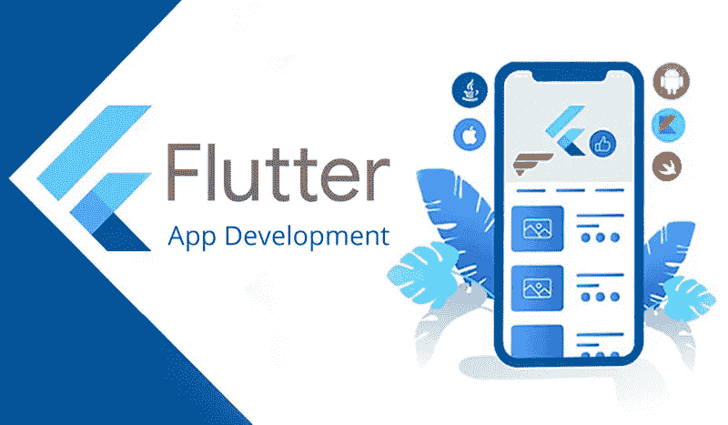

# 为什么 Flutter 让移动 app 开发更快？

> 原文：<https://medium.com/quick-code/why-flutter-makes-mobile-app-development-faster-4da81b208149?source=collection_archive---------6----------------------->

你可能想知道为什么你应该在你的下一个项目中使用 Flutter，你的公司会得到什么好处。无论你是首席技术官、技术主管，还是需要对公司的技术使用做出战略决策的任何其他角色，这篇文章都很有帮助。

具体来说，我将解释什么是 Flutter，为什么它是最好的跨平台框架。您将了解 Flutter 与其他跨平台解决方案相比的优势，以及这些优势如何影响开发和业务运营。

# **什么是颤振？**

谷歌的 Flutter 是一个免费的开源 SDK(软件开发工具包),用于创建在多个平台上运行的移动应用程序。Flutter 是一个开源框架，允许程序员使用单一的、平台无关的代码库为 Android 和 iOS 创建高性能、可扩展的应用程序，这些应用程序具有漂亮的功能性 ui(用户界面)。有了 Flutter 的预建小部件库，即使是那些只有最低限度编程或开发技能的人也可以快速发布移动应用。

谷歌在 2018 年首次宣布的应用开发框架 Flutter 已迅速成为事实上的标准。旋舞是现在最流行的 [**手机 app 开发**](https://jumpgrowth.com/mobile-apps) 框架，据 Statista 称，废黜了以前占主导地位的 React Native。

# **颤振是用来做什么的？**

开发 Flutter 是为了适应跨平台的 Android 和 iOS 应用程序以及基于 web 和桌面的交互式应用程序。

Flutter 非常适合需要在所有设备上提供一致视觉品牌的应用。另一方面，Flutter 允许你做出与 Android 和 iOS 设计语言像素级完美匹配的体验。

由于软件包生态系统(如支付、云存储、认证和广告)，大量设备(相机、GPS、网络和存储)和服务可以与 Flutter 集成。

# **Flutter 基于什么编程语言？**

Flutter 应用程序是用 Dart 开发的，它利用了该语言的一些更高级的特性。

这是因为 Flutter 根本不是一种语言。它是一个预先编写的 SDK(软件开发工具包),具有现成的和可定制的小部件、库、工具和文档，用于制作跨平台软件。

Flutter 基于 Google 的跨平台编程语言 Dart 构建，不需要桥来与原生层(如 Android 或 iOS)对话。因此，应用程序加载时间缩短，性能问题得到缓解。

Flutter 要求开发人员精通其编程语言 Dart 来构建您的项目。Dart 的易学性可与其他流行的编程语言相媲美，如 Java、Net、Kotlin、Swift 和 JavaScript。

# **都是小部件:颤动原理**

Flutter 背后的基本思想是一切都可以被认为是一个小部件。简而言之，小部件是 Flutter 应用程序的 UI(用户界面)的原子单位，充当 UI 的一部分的静态定义。换个说法；它们指定了用户界面的外观。

因此，小部件是构建所有 Flutter 应用程序的基础。核心概念是使用小部件构建 UI。它们的配置和状态指定了小部件的外观。有几种类型的小部件可用，比如文本小部件、行小部件、列小部件、容器小部件等等。

Flutter 应用程序和移动平台之间的来回切换更少，因为它绘制其小部件并使用 Skia 库来呈现 UI，而不是依赖于特定于平台的组件。因为 Flutter 有自己的渲染引擎，所以用它开发的用户界面几乎可以在任何设备上运行。该应用程序的用户界面将在所有支持的系统中保持一致。

Flutter 应用程序中的窗口小部件以树形结构组织，每个窗口小部件由其他窗口小部件组成，并继承它们的属性。因此，窗口小部件是分层结构的，父窗口小部件和子窗口小部件相互嵌套。

Flutter 广泛的预建部件集合简化并加速了 UI/UX 设计过程。也可以开发定制的小部件。

图标、图标按钮和文本是无状态小部件的例子，而复选框、单选按钮、滑块、墨水瓶和表单是具有动态特征的有状态小部件。

此外，Flutter 还具有特定于平台的小部件，如 Android 的 Material Design 和 iOS 的 Cupertino。

# **为什么要颤动框架？**

## **1。快速发展**

与竞争对手相比，Flutter 是一个快如闪电的应用程序框架。它的“热重新加载”功能允许开发人员快速尝试创新的想法，创建用户界面，修改现有的界面，添加和删除功能，以及发现和修复错误。因此，开发一个应用程序所需的时间更少。

## **2。富有表现力和灵活性的用户界面**

Flutter 允许创建令人惊叹的应用程序。最终产品可与用户的原生应用相媲美。Flutter 的分层架构让您可以完全控制显示器的内容。既然是这样，Flutter 修饰微风。由于其强大的合成功能，图形，文本，视频和其他控制可以覆盖和动画没有限制。

还包括一系列小工具，当与 Android 或 iOS 设备配合使用时，可以提供近乎完美的用户体验。它使材料设计发挥其全部潜力成为可能。Material.io，如果你不知道的话，是谷歌通过鼓励基于该公司的材料组件开发有吸引力的功能性产品来提高数字体验质量的努力。

## **3。原生性能**

Flutter 中的小部件解释了平台之间的基本差异，包括滚动、导航、图标和字体。这意味着 iOS 和 Android 用户将受益于该应用的原生性能。

## **4。飞镖语言**

Google 的 Dart 语言是为各种软件设计的，包括移动、桌面、后端和在线应用。它是一种平台无关的、以客户端为中心的语言，专为高性能应用程序开发而设计。

Flutter 的所有代码都可以用 Dart 编写，因为它是 AOT(提前)编译成快速、可预测的本机代码。既然是这样，那么 Flutter 就是闪电般的速度，适应性非常强。关于个性化，一切(包括每一个小部件)都是公开的。

## **5。重要的颤振工具**

许多开发环境都与 Flutter 框架兼容。此外，它有助于通过命令行开发应用程序。这个新的调试工具 Dart DevTools 适应性更强，甚至允许在运行时进行检查。Flutter 应用程序开发将使您能够查看日志、调试程序和检查小部件。

1.  widget 检查器有助于查看树结构并进行导航。Flutter 依靠它来呈现用户界面。
2.  时间线视图有助于逐帧跟踪节目。时间轴视图还可以将渲染和计算任务分开。
3.  调试器可以访问源代码，允许您逐句通过它，设置断点，并检查调用堆栈。
4.  Dart 运行时、应用程序框架和应用程序级日志事件都可以在日志视图中查看。

# **结论**

一个跨平台的应用程序开发框架对于用一个代码库为多个平台创建应用程序来说是无价的。对于 [**从头开始创建一个可以在多个平台上运行的应用**](https://jumpgrowth.com/how-to-create-an-app-from-scratch/) 来说，Flutter 是一个很好的选择。它的多重优势和独特的品质使它迅速走红。此外，以合理的价格创建一个跨平台应用程序，同时满足客户的雄心勃勃的标准，这是最佳选择。