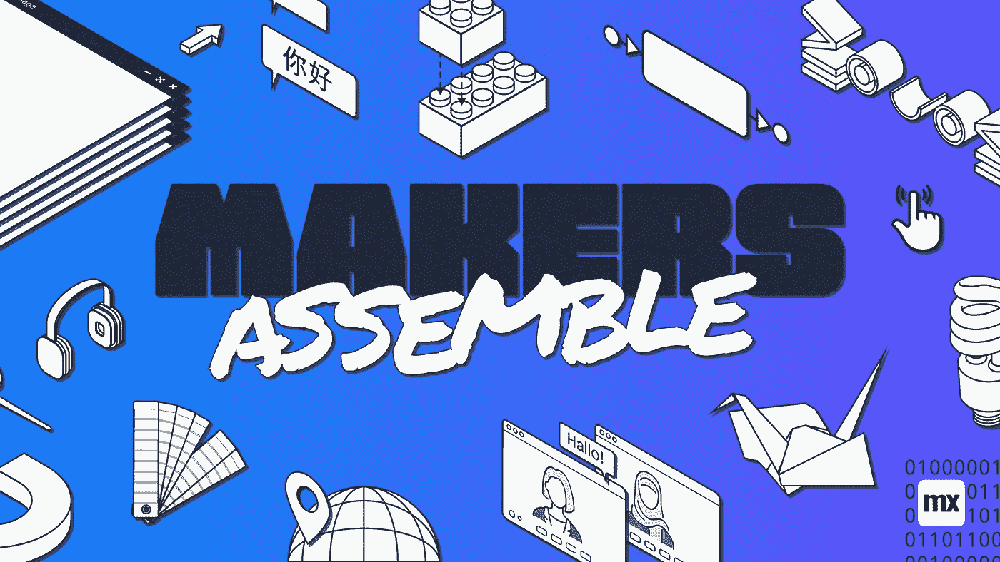

# 为什么我对 Mendix World 2021 感到兴奋！

> 原文：<https://medium.com/mendix/why-i-am-excited-for-mendix-world-2021-8cb1a6ccbe45?source=collection_archive---------8----------------------->

# 你知道门迪克斯今年计划了一个新的门迪克斯世界吗？Mendix World 2021 将于 9 月 7 日(星期二)至 9 月 9 日(星期四)举行。这是三天的低代码信息，网络和其他恶作剧。虽然还有几个月的时间，但是现在已经是开始兴奋的时候了，我想在这个博客里告诉你为什么！

所以，首先要做的是。Mendix World 2021 将是一项在线活动。是的，我知道，我很想在现实生活中看到你们所有人，一起喝一杯，开怀大笑，但在这些时候这不是一个选项，我很感激也很高兴网上活动带来的机会！

与去年一样，一些会议将进行现场直播，一些会议将在您空闲时观看。这是成为实际活动的一部分和能够随时休息的完美结合。你可以随时观看其中的一些会议，这一点很棒，因为你不必等待会议开始。对工作流程感兴趣？观看关于工作流程的会议！您更愿意了解新的本机功能吗？看一个关于 native 的会话！你明白了。

对我来说，作为一个 Mendix 世界的老手，我可以保证主题演讲总是一种享受。这些会议可以让我们一窥低代码未来的发展趋势。去年，我们在 TimeSeries 做了一件大事。我们聚在一起观看，分享我们对潜在的新功能的热情，并为我们的客户和我们自己带来快乐！我等不及这种事再次发生了。

在过去几个月 MX live(mendix.com/live)的一些现场会议上，已经有关于 Mendix World 的新功能和值得期待的东西的暗示。我可以向你保证，如果你正在用 Mendix 开发应用，你一定不想错过 Mendix World 2021 上的公告！

[https://bit.ly/MXW21](https://bit.ly/MXW21)

感谢你花时间阅读这篇博客。我希望能够激发你的热情，并说服你(如果你还没有的话)参加今年的 Mendix World。请务必加入对话，成为 mendixcommunity.slack.com Mendix 社区 Slack 上 Mendix World 的一部分

我想通过提及门德克斯世界的推荐项目来结束这篇博客。让你的同事、朋友和网络中的其他人使用你的个人链接注册，你可能会赢得一个惊人的大奖！主要奖品是一台 Oculus Quest 2。不错吧！？现在就点击[注册吧！](http://www.mendix.com/mendix-world/?utm_medium=partners&utm_campaign=GL-CE-2021-09-06-Mendix-World&mxworld=PAREMETim)

## **阅读更多**

 [## Mendix World 2021 |将您的应用开发团队聚集在一起 2021 年 9 月 7 日至 9 日

### 好像你需要说服似的...在全球制造商社区中，他们希望通过探索什么来相互学习…

bit.ly](https://bit.ly/MXW21)  [## 曲目|门迪克斯世界 2021

### 在今年 Mendix World 开幕之前，手工制作您的议程。浏览专为您量身定制的 8 个专题讲座中的 85 个以上专题讲座…

www.mendix.com](https://www.mendix.com/mendix-world/tracks/) 

*来自发布者-*

*如果你喜欢这篇文章，你可以在我们的* [*媒体页面*](https://medium.com/mendix) *或我们自己的* [*社区博客网站*](https://developers.mendix.com/community-blog/) *找到更多类似的文章。*

*希望入门的创客，可以注册一个* [*免费账号*](https://signup.mendix.com/link/signup/?source=direct) *，通过我们的* [*学苑*](https://academy.mendix.com/link/home) *即时获取学习。*

有兴趣更多地参与我们的社区吗？你可以加入我们的 [*Slack 社区频道*](https://join.slack.com/t/mendixcommunity/shared_invite/zt-hwhwkcxu-~59ywyjqHlUHXmrw5heqpQ) *或者想更多参与的人，看看加入我们的* [*遇见 ups*](https://developers.mendix.com/meetups/#meetupsNearYou) *。*