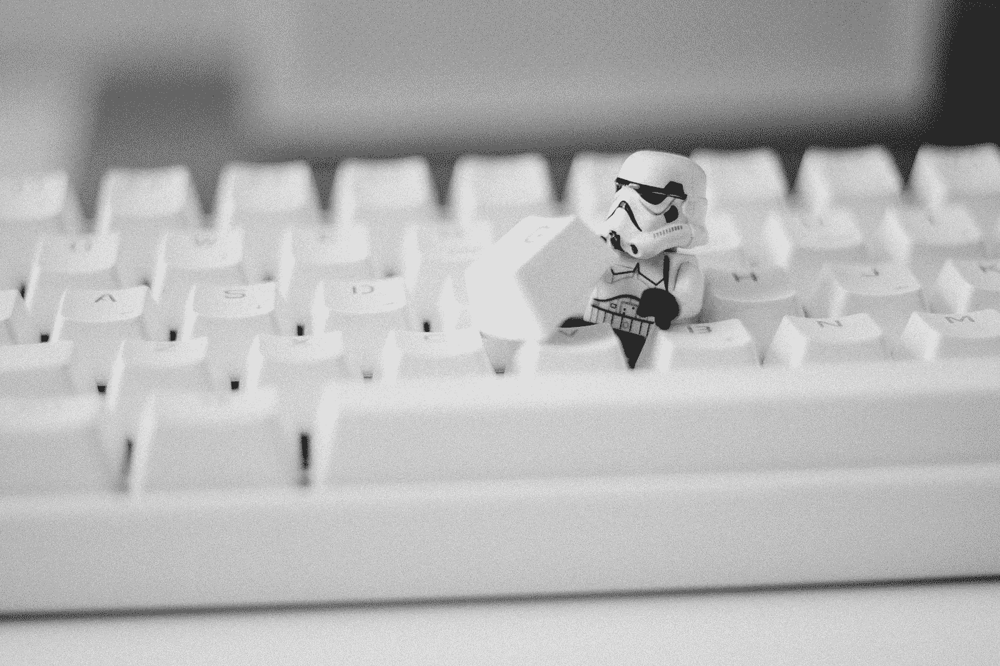
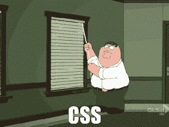
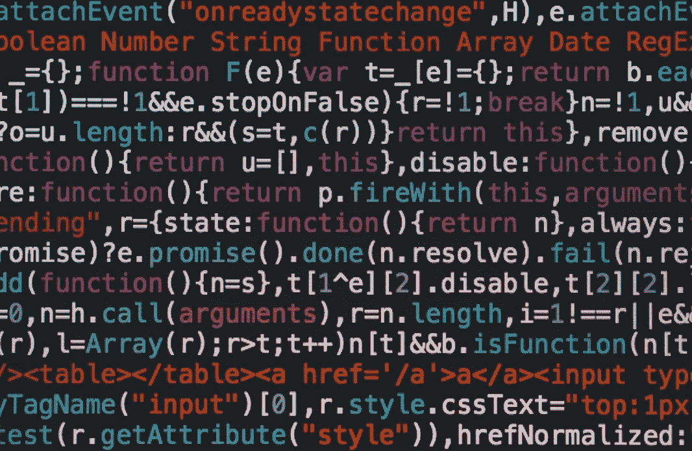

# 为什么我不再喜欢 UI 套件了

> 原文：<https://medium.com/quick-code/why-i-dont-like-ui-kits-anymore-d3fa2916d2ca?source=collection_archive---------7----------------------->

Photo by [James Pond](https://unsplash.com/photos/riEYPSKxoTw?utm_source=unsplash&utm_medium=referral&utm_content=creditCopyText) on [Unsplash](https://unsplash.com/search/photos/lego?utm_source=unsplash&utm_medium=referral&utm_content=creditCopyText)

## 这一切是如何开始的

但是首先…让我们暂时回到过去。我从 React 开始。我有点知道它是什么，以及如何利用它来实现我的目标。我的目标是创建一个能以某种方式工作的网站。部署它，让每个人都能看到它。我真的很喜欢学习反应。我喜欢它的生态系统，一切看起来都那么简单和灵活。

实际结果是有效的，但看起来并不那么令人满意。那时候我真的很讨厌 CSS。我在一个问题上花了很多时间，最后通过增加一个属性解决了这个问题。说真的…如果我年纪轻轻就秃顶了。我知道该责备什么。你可以想象，我开始寻找让我的网站看起来很棒的选项。

## UI 套件助您一臂之力！

可能每个人都在某个时候用过它们。它们很容易管理，我们不必再关心 CSS 了。但是它们是有代价的。这个应用看起来太普通了，说实话它们看起来都一样。所以我，年轻，充满希望，使用 UI 套件…

直到有一天，我有一个作业，禁止使用任何 UI 套件。我很害怕，但也有点兴奋。所以我换了裤子，坐在电脑前的椅子上，开始了我的研究。我真的很惊讶。我真的很喜欢编写自己的组件。这似乎是一个快速而简单的任务。但实际上相当复杂。而且你在发展过程中面临很多问题。它基本上迫使你提前思考。在我看来，这是一个很好的实践。

## 从未回头

从那天起，我就一直更喜欢自己写组件。我在控制中。如果我想的话，我可以调整它们。毕竟，这是我的准则。所以做改变不会花太多时间。我花了相当多的时间编写可重用的 React 组件。现在我觉得我学到了一些有价值的教训，我可以提供。这就是为什么我要开始一个新的系列，叫做…鼓声…

**如何编写自己的 React 组件**

我知道。并不是真的有创意。嗯，我也不是很有创造力。所以这在某种程度上和我有关。该系列的目的是:

*   学习编写可重用的 React 组件
*   介绍我正在使用的工具，我相信是真棒！
*   学会未来派思维。我不知道。这是正确的(真实的)词吗？
*   最后但同样重要的是。玩得开心！

## 抱歉。今天没有代码！

如果你还在阅读这篇文章并期待任何代码。很抱歉让你失望了，但是不会有了。但你一定要保持关注。下周我将出版这个系列的第一个故事。在这个故事中，我们将写出自己的选择。正如你所猜测的那样，我们将使用 React，此外，我们将使用几个非常酷的库。

## 奖励那些值得的人

如果你还在读这篇文章，还在期待任何代码。你很幸运，因为你会得到一个。毕竟是你应得的，哥哥还是姐姐！敬请期待，下期再见！

[https://unsplash.com/photos/cvBBO4PzWPg](https://unsplash.com/photos/cvBBO4PzWPg)