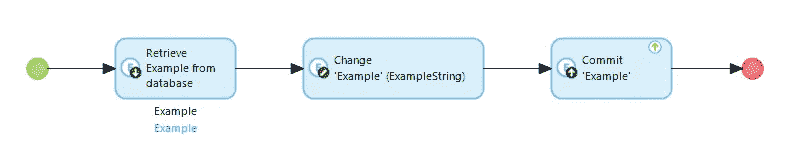

# 为什么我喜欢做 Mendix 开发人员

> 原文：<https://medium.com/mendix/why-i-love-working-as-a-mendix-developer-f925138e19a4?source=collection_archive---------1----------------------->

Why I love working as a Mendix Developer

## 一个有经验的开发者的想法。

事情是这样的:你 20 多岁，刚从大学毕业。也许你过去也曾尝试过编程，或者在一些网站上闯出了一条路，一般来说，你对现代技术有着浓厚的兴趣。或者你可能是一名喜欢与统计数据打交道的心理学学生，你开始意识到你最终必须支付这些账单。

**迟早，你需要给自己找一份“技术工作”。**

在我开始作为一名 Mendix 开发人员工作之前，我对自己未来的职业道路有严重的疑虑。我喜欢写代码，但是我没有看到自己每天都这样做。但我确实喜欢建造东西。我喜欢回顾一天的工作并看到结果。这就是构建软件。直到我以前的雇主找到我，向我解释了 Mendix 平台，我才知道 Low-code。

作为 Mendix 开发人员，您无需编写传统代码即可构建数字应用程序。相反，您正在使用预构建的部件构建应用程序。你设计称为微流的逻辑，一旦你启动应用程序，Mendix 就会将其翻译成计算机可以理解的东西。微流看起来像传统的工作流程图。它有一个开始和一个结束，并执行中间的逻辑部分。

*A traditional microflow retrieves an object from the database, does something with it, and returns it to the database.*

因为这些部分是预先构建好的，随时可以使用，所以开发逻辑的速度比传统的编码方法快十倍。因为学习曲线没有编码那么陡峭，所以更容易进入。你不需要计算机科学学位来从事低代码技术。事实上，大多数 Mendix 开发人员来自完全不同的学术领域。我有幸与具有不同学术背景的 Mendix 开发人员一起工作，比如生物医学、心理学和工业工程。虽然 IT 部门仍然是一个[男性主导的世界](https://en.wikipedia.org/wiki/Gender_disparity_in_computing)，但这种刻板印象在低代码领域并不成立。在我的团队中，女性人数甚至一度超过了男性。

背景的多样性导致低代码开发人员经常承担更多不同的责任。低代码开发人员经常被称为业务工程师，这并不是巧合，尽管我仍然更愿意称我们为开发人员。商业工程师是商业管理专家和软件工程师的混合体。这意味着他们可以理解业务需求并将其转化为软件需求，还可以将这些需求转化为真正的软件。您一天中的大部分时间通常花在开发上，但是您可以参与软件开发过程的更多部分。在我之前的雇主那里，商业工程师参与其他活动也不例外，比如销售和用户体验(UX)设计。

即使在 Mendix 内部，您也可以选择扩展到不同的领域。您可以决定通过学习关于样式的所有知识来专注于前端开发，或者您可以成为一名将您的系统与其他系统集成的后端开发专家。您也可以选择通过学习 Java 开发来深入了解 Mendix 核心。大多数 Mendix 开发人员都有他们最感兴趣的专业知识，但是您很可能会在某个时候从事所有这些领域的工作。传统的软件工程师并不经常享受这种奢侈。

所有这些都意味着你有很多职业发展的选择。你可以从一个基本的 Mendix 开发人员开始，但是以后可以选择扩展到其他领域。如果你发现你有销售平台的诀窍，你可以在你的主要工作之余做这件事。如果您觉得在构建应用程序之前设计它们很舒服，通常有一个这样做的机会。

这种灵活性很大程度上也取决于支持你偏好的公司。大多数活跃在低代码领域的公司都是很好的工作场所。为了吸引和留住合适的人才，他们必须这样做。如果你没有注意到，低代码正在蓬勃发展，工作机会也是如此。寻找新的商业工程师很有挑战性，公司希望让员工开心和满意。这也意味着，如果你选择从事低代码工作，你几乎肯定会在未来十年左右拥有一份工作。虽然像工作保障这样的事情一开始听起来是最无聊的话题，但你可以在任何地方找到工作的感觉确实令人欣慰。

如果你想成为一名 Mendix 开发人员，你有很多选择。如果你选择从事咨询工作，你将有机会为不同的公司做项目。这是在不同环境中获得专业经验的好方法。在过去的四年里，我在金融、保险、医疗和政府等领域的各种规模的公司工作过。如果你不确定你想要什么样的职业，从事咨询工作是探索你的选择的最佳方式。

或者，你可以选择去直接使用 Mendix apps 的公司工作。或者你可以选择申请 Mendix 本身的工作。由于我对这两者都没有亲身体验，我觉得没有资格谈论这些选择，但我听到过关于这两者的正面故事。

作为一名 Mendix 开发人员，你获得的自由和发展机会是巨大的。你甚至可以决定从事自由职业，就像我最近做的那样。无论您做出什么决定，作为一名 Mendix 开发人员，您总能满意地构建出具有真实世界影响力的惊人数字应用程序。

这篇博文仅反映了我的个人观点。不是和 Mendix 或者我之前的雇主 [*Finaps*](https://www.finaps.nl/) *一起写的。我在那里的时候，这篇文章的第一个版本已经发表了。这篇更新的文章反映了我对这个问题的最新想法。*

## 阅读更多

 [## 免费试用- Mendix 低代码应用程序开发平台

### 免费试用 Mendix 不需要信用卡，也没有安装费。Mendix 是世界领先的低代码应用程序…

signup.mendix.com](https://signup.mendix.com/link/signup/?source=direct)  [## 门迪克斯

### 编辑描述

academy.mendix.com](https://academy.mendix.com/link/paths/82/Crash-Course) 

*来自发布者-*

*如果你喜欢这篇文章，你可以在我们的* [*中页*](https://medium.com/mendix) *找到更多喜欢的。对于精彩的视频和直播会话，您可以前往*[*MxLive*](https://www.mendix.com/live/)*或我们的社区*[*Youtube PAG*](https://www.youtube.com/c/MendixCommunity/community)*e .*

*希望入门的创客，可以注册一个* [*免费账号*](https://signup.mendix.com/link/signup/?source=direct) *，通过我们的* [*学苑*](https://academy.mendix.com/link/home) *获得即时学习。*

有兴趣更多地参与我们的社区吗？加入我们的 [*Slack 社区频道*](https://join.slack.com/t/mendixcommunity/shared_invite/zt-hwhwkcxu-~59ywyjqHlUHXmrw5heqpQ) *。*