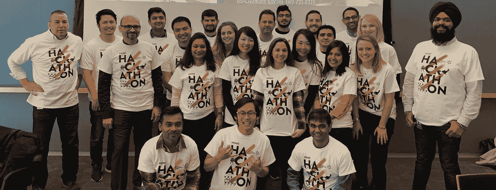
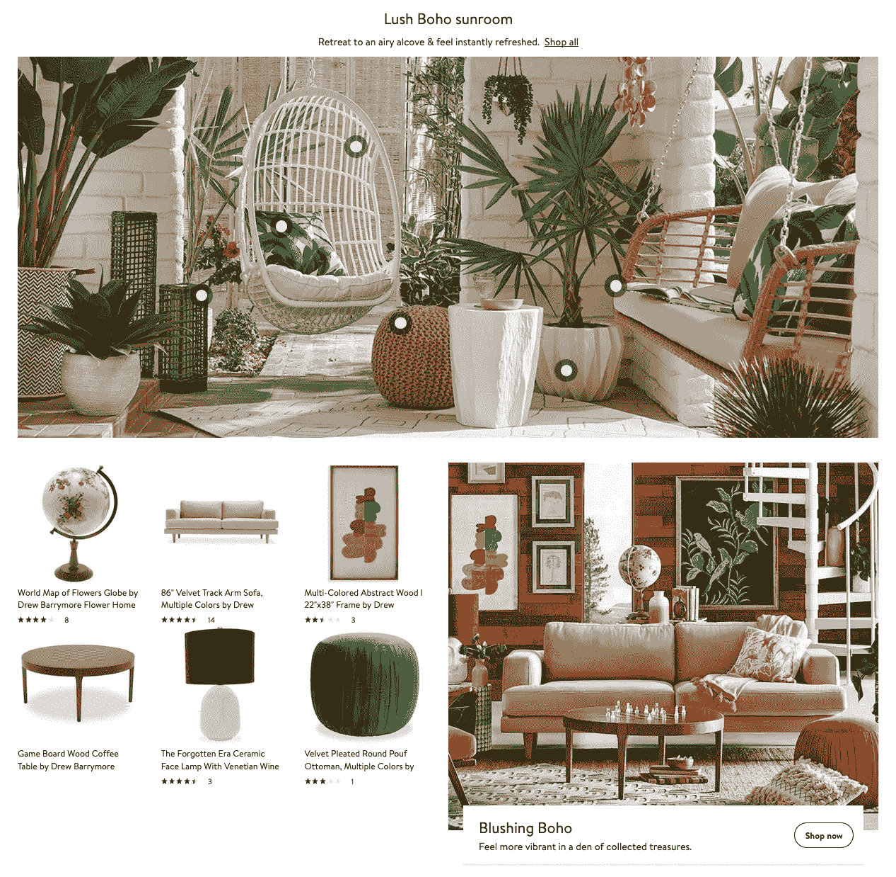

# 为什么我喜欢在沃尔玛实验室工作

> 原文：<https://medium.com/walmartglobaltech/why-i-love-working-at-walmart-labs-814dd322df9d?source=collection_archive---------2----------------------->

我已经在[沃尔玛实验室](https://medium.com/u/c884135151a4?source=post_page-----814dd322df9d--------------------------------)工作了两年多一点，我很高兴地说[沃尔玛的数字化转型](https://www.forbes.com/sites/pamdanziger/2018/10/22/walmart-doubles-down-on-its-transformation-into-a-technology-company/#396cb396404c)真的有了回报。**下面是我喜欢** [**沃尔玛实验室**](https://medium.com/u/c884135151a4?source=post_page-----814dd322df9d--------------------------------) **的几个原因。**



# 在每一步塑造产品的机会

**有影响力的机会**是我喜欢在[沃尔玛实验室](https://medium.com/u/c884135151a4?source=post_page-----814dd322df9d--------------------------------)工作的首要原因。有一种普遍的误解，认为科技公司越大，你的影响力就越小。如果你不相信我，可以看看安德鲁·戈尔迪斯的文章，这篇文章讲述了为什么他仅仅 5 个月就离开了他的公司，以及让你觉得自己有所作为有多难:

> 我需要 3-4 年的时间才能达到“信任”的水平，让我面对不同规模和影响的挑战。

事实上，沃尔玛是世界上最大的雇主，拥有超过 220 万名员工，所以毫不奇怪，许多候选人认为他们在沃尔玛实验室只是职业生涯中的一个小角色。

我来自一家初创企业，我承认有同样的疑虑，但幸运的是，我在沃尔玛实验室的第一周就被证明是错误的。在我想多快加入方面，我有很大的自由，但也对我的第一个项目产生了广泛的影响:为内政部创造新的 Walmart.com 体验。



[Home Landing Page](https://www.walmart.com/cp/home/4044)

在这次改造中，我有机会与产品团队密切合作，以**塑造特性&功能**，与设计团队**对用户界面&体验**进行更改，甚至与 Hayneedle 到**的人员一起确定时间表&数据管道**。在第一周，我不仅帮助**制造**产品，我还帮助**制造**产品。

当我们的新设计最终上线时，我真正意识到了我的劳动成果，以及为什么 web 开发是我的激情所在。**我能够真正地帮助塑造产品的每一步**，它在第一天就接触了数百万独立访客。这就像当你第一次在高中乐队音乐会上表演时，每个人的努力都随着第一个辉煌音符的响起而得到了回报。这是超现实的。


[“I enjoyed the meetings, too.”](https://tenor.com/view/harry-potter-crying-sad-hugging-ron-weasley-gif-4298174)

如果你对我们的工程师如何参与设计过程感兴趣，可以看看我的队友 Aleisha Nelson 的文章:

[](/@nelson.aleisha/da19897dbbff) [## 相距不远的两个世界——UX 和工程如何在沃尔玛实验室携手并进

### 毫无疑问，专业软件工程和用户体验(UX)设计角色需要两个非常…

medium.com](/@nelson.aleisha/da19897dbbff) 

# 尊重我是谁

这个理由推翻了我之前关于在每一步塑造产品的观点。不论年龄、头衔、个性——不论你的背景如何，**你的意见在公司的各个层级都会受到尊重和认真对待**。


[Respect](https://tenor.com/view/respect-tipofthehat-respected-gif-5971429)

例如，在会议中，我显然是资历最浅、职位最低的人，但我仍然被积极鼓励说出自己的想法。更重要的是，**我的想法居然被考虑进去了。当我提出一个问题或建议时，每个人都会确保我们创造出可行的任务**来解决我的问题或进一步探索我的想法。这种环境让我在一个有许多陌生面孔的大公司里感觉像在家里一样，并且鼓励我扩展我的批判性思维。

# “我们”，而不是“我”

作为一个如此大的公司，我们有许多组织，有几十个团队，每个团队有几十个成员。在这么多关键贡献者的海洋中，很容易迷失大方向。人们可以诉诸于激烈的竞争、防御性，有时甚至对自己的队友进行彻底的毒害。值得庆幸的是，这种有害的、外来的氛围在[沃尔玛实验室](https://medium.com/u/c884135151a4?source=post_page-----814dd322df9d--------------------------------)似乎并不存在。

是的，肯定有**健康友好的竞争**。例如，我们有致力于在每个特定部门提供定制体验的“垂直”团队。时尚垂直团队可能正在构建专注于服装购物体验的功能，而家居垂直团队可能正在开发专注于新颖家居装饰购物体验的功能。在我们的两个主要垂直行业之间，我们在高层次上相互竞争，如收入目标，在低层次上，如谁能创造最酷的小工具，以及介于两者之间的一切。尽管如此，我们总是积极地**寻找机会联合起来**作为一个集体整体取得更大的成就[作为**一个**团队](https://www.forbes.com/2010/08/05/teams-teamwork-individuals-leadership-managing-collaboration.html#777f45dc5e86)。


[Go, go Power Rangers!](https://tenor.com/view/power-rangers-hands-in-team-teamwork-gif-8647047)

# 对努力工作的认可，更是对结果的认可

如果职业发展对你很重要，那么你会很高兴知道我们沃尔玛实验室的技术团队非常重视它。在一家初创公司，谁在努力工作并取得成果是相当清楚的，但在大公司，这可能会迷失在庞大的管理和官僚层级链中。我们的技术团队一直在积极应对这种自然症状，他们每周举行**开发者演示**，工程师可以在演示中向同事&经理展示他们一直在做的事情，并且还在 [**交付**、**创新**和**质量**](https://blogs.dnvgl.com/software/2017/10/modern-business-speed-disruption/) 中颁发季度优秀奖。


[Here, you earned it.](https://tenor.com/view/clapping-applause-shia-la-beouf-award-gif-5621294)

仅仅拍几下背不会就此结束。管理层和领导层经常召开会议，讨论每个工程师的勤奋程度、技术技能和影响。这确保了表彰和奖励的权力不会授予少数人，而是作为我们同行的更民主的代表。

# 朝着正确的方向前进

虽然这在谷歌和网飞等大多数知名科技公司中可能是理所当然的，但我发现这在许多不太知名的科技巨头和初创公司中相当罕见。

在我过去在小公司的冒险经历中，团队很容易因为严格的截止日期和对失去投资者的恐惧而偏离轨道。我记得当最后期限越来越近的时候，我们在功能、错误修复、用户体验，甚至是对 ADA 的遵从上妥协得越多。在[沃尔玛实验室，](https://medium.com/u/c884135151a4?source=post_page-----814dd322df9d--------------------------------)我们有一家非常成功的公司支持我们的技术风险投资，因此我们可以**花费额外的时间和资源来适当地构建合适的产品**，甚至[为开源社区做出贡献](https://github.com/walmartlabs)。

想看看我们如何认真对待 [ADA 合规性](https://www.interactiveaccessibility.com/services/ada-compliance)吗？看看我的队友 [Umang Lohia](https://medium.com/u/4b90992cfa2b?source=post_page-----814dd322df9d--------------------------------) 的文章:

[](/@umanglohia/5ada0a7ac048) [## 永远平易近人！

### 如今，在 web 前端进行开发涉及的不仅仅是确保 UI 看起来不错，而且…

medium.com](/@umanglohia/5ada0a7ac048) 

总的来说，我在这里玩得很开心。**最重要的是，**我感谢我的同事帮助我创建了这样一个友好而充满激情的团队。

```
try {
  nextJob();
} finally {
  walmartLabs(); // [careers.walmart.com](https://careers.walmart.com/)
}
```