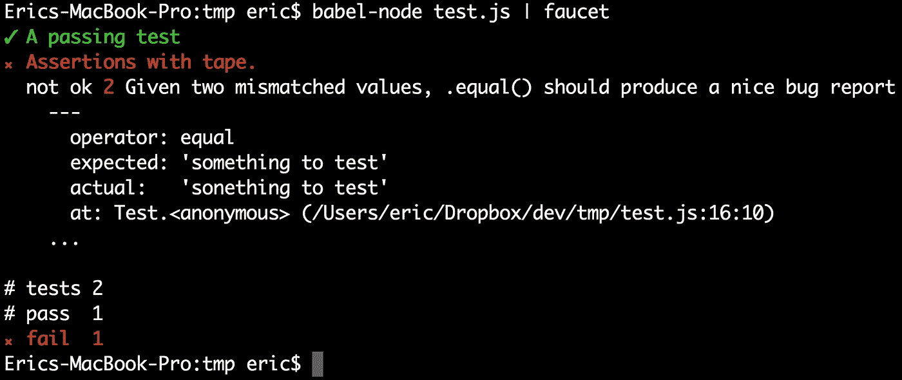
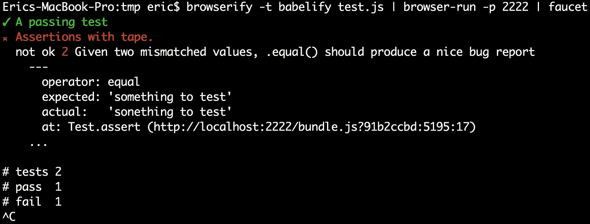

# 为什么我用胶带代替摩卡&你也应该这样

> 原文：<https://medium.com/javascript-scene/why-i-use-tape-instead-of-mocha-so-should-you-6aa105d8eaf4?source=collection_archive---------0----------------------->

## 测量软件质量

> 更新:我现在用 [RITEway](https://github.com/paralleldrive/riteway) 代替胶带。它包装了磁带，使得编写优秀的单元测试更加简单，当单元测试失败时，可以提供清晰的错误报告。参见[“重新思考单元测试断言”](/javascript-scene/rethinking-unit-test-assertions-55f59358253f)了解更多细节。
> 
> TL；DR:摩卡是一辆 15 万美元的保时捷 Panamera，而最好的工具是一辆 3 万美元的特斯拉 Model 3。不要把你的资源浪费在测试华而不实的东西上。相反，投资他们来创建你的应用程序。

有时受欢迎程度是质量的标志。其他时候，受欢迎的东西是因为受欢迎而受欢迎，而不是因为它们比替代品更好。

在实际的生产项目中，我使用过 Jasmine、Mocha、NodeUnit、Tape 和其他一些解决方案。我已经调查了*许多其他的选择。*在过去的几年里，我已经并将继续在我所有的个人项目和我领导的项目中使用 [Tape](https://github.com/substack/tape) 和 Supertest(用于 API 测试)。

## 什么是单元测试？

单元测试的存在是为了测试软件功能的单个单元。单元是一个模块、组件或函数。它们是程序的一部分，可以独立于程序的其他部分工作。单元测试的存在意味着软件是以模块化的方式设计的。你可能偶尔会听说有办法让软件“更易测试”

如果你发现很难在不嘲笑其他东西的情况下为你的程序编写单元测试，那就是你的程序不够模块化的迹象。揭示紧密耦合(模块化的对立面)是单元测试在软件创建中扮演的许多重要角色之一。

每个模块都应该有单元测试，每个应用程序都应该由模块组成。换句话说，如果你不写单元测试，你应该写。

## 摩卡、茉莉等怎么了…？

1.  **太多配置:**选择一个断言库，选择一个报告库，选择一个任务运行器(Grunt，Gulp，等等…)然后弄清楚如何将文档示例翻译成你选择的报告库/任务运行器。所有这些都是太多的认知负荷。 *Vs:选择胶带。完成了。*
2.  **Globals:** Mocha、Jasmine 和其他几个替代品用类似 *`describe`* 、 *`it`* 等函数污染了全球环境……一些断言库扩展了内置原型。除了去除简单模块导出的自文档化特性之外，这些决定可能会与您试图测试的代码发生冲突。 *Vs:磁带的简单模块导出。*
3.  **共享状态:**像 *`beforeEach`* 和 *`afterEach`* 这样的功能积极鼓励你做一些你**绝对不应该做的事情**:在测试之间共享状态。 *Vs. Tape:全局状态共享无此功能。相反，从单个测试中调用 setup 和 teardown 例程，并且* ***包含所有状态到局部测试变量。***

## 为什么是磁带？

Mocha 做了太多，给了开发人员太多的断言选择，这导致了[分析瘫痪](http://en.wikipedia.org/wiki/Analysis_paralysis)和生产力损失。每次我看到 Mocha 被用在一个项目上，我都看到开发人员在测试框架和测试环境上浪费了太多的时间。

当我咆哮的时候，如果我没有提到如果你在 mocks 和 stubs 上花了很多时间，那是一种强烈的代码味道，那我就失职了。通过将你的应用程序分成更多的模块，你可以极大地简化你的测试和应用程序。

> 嘲讽是一种代码气味。

这里和那里的一些简单的模拟是确定的。你的一些应用将不可避免地涉及副作用(例如，从网络或文件系统中读取或写入)。当你真的需要模仿时，保持简单。比基本存根多一点是理想的。但是在许多项目中，我看到了许多原本不需要存在的过于复杂的模拟。为什么要维护不必要的代码呢？

你越是将问题分解成简单的[纯](https://en.wikipedia.org/wiki/Pure_function) [函数](/javascript-scene/the-two-pillars-of-javascript-pt-2-functional-programming-a63aa53a41a4)，就越容易在没有模仿的情况下测试你的代码*。*

> 测试不是你应该花大部分时间去做的事情。

在有限的时间内，你应该花大部分时间考虑如何创建最好的、最灵活的、性能最好的解决方案。在软件开发的世界里，时间就是价值，你不应该浪费一分钟。

如果你喜欢烧钱，就用摩卡、茉莉花茶、Jest，等等。但是如果你珍惜你的时间，继续读下去。

在许多 BDD 断言库中，有一些带有副作用的 getters。在我工作的一家公司(不指名道姓)，这在我们的一个测试中埋下了一个 bug，我们花了太多时间调试测试用例，而不是开发实际的应用程序代码。

> 测试断言应该非常简单，
> & [完全没有魔法](https://en.wikipedia.org/wiki/Magic_(programming))。

*`equal`* ， *`deepEqual`* ，*` pass `*&*` fail `*是我主要的首选断言。如果 *`equal`* 和 *`deepEqual`* 是唯一可用的断言，那么测试界可能会因此变得更好。

为什么？*` equal`*&*` deep equal`*提供了关于期望的质量信息，并且它们导致非常简洁的测试用例，这些测试用例**易于阅读&维护。**

当你写 bug 报告时，你应该总是*提供描述，*解释*你期望看到的*，解释*你实际看到的*。

测试用例应该以大致相同的方式编写:

1.  用简单的英语描述你正在测试的特性。
2.  提供测试的预期结果。这部分就是为什么很多单元测试被称为*期望的原因。*
3.  将其与*实际值进行比较。*

当一个单元测试失败时，错误消息就是你的错误报告。

> 你的测试描述应该足够清晰，可以作为文档使用。

如果您以这种方式编写测试，您的测试错误消息应该足够清晰，可以用作错误报告:

```
TAP version 13
# A passing test
ok 1 This test will pass.
# Assertions with tape.
not ok 2 Given two mismatched values, .equal() should produce a nice bug report
  ---
    operator: equal
    expected: 'something to test'
    actual:   'sonething to test'
  ...1..2
# tests 2
# pass 1
# fail 1
```

> 你的自动化测试错误消息
> 就是你的错误报告。

简单测试断言提供:

*   可读性更好。
*   代码更少。
*   维护更少。

这些功能胜过世界上所有的花里胡哨。

**没有比赛。**

## 测试工具应该是模块化的

一些测试框架(Mocha、Jest 等)提供了比简单的测试运行程序更多的服务。他们想把你的测试格式化，以便于阅读，否则他们会自动地嘲笑你。(还记得我说过的测试套件中的魔法吗？)

他们试图成为端到端的测试解决方案。从将 Mocha 驱动的测试框架从仅客户端测试移植到通用 JavaScript 测试的经验来看，请相信我:有时端到端可能会很糟糕。

Jest 标榜自己是一个更好的端到端解决方案，可以自动模仿节点模块。你大概可以想象我对此的看法。

像 Mocha 和 Jasmine 这样的解决方案比磁带更难适应您的持续集成管道。

## 轻敲，水龙头

TAP 是从 1987 年就存在的[测试任何东西协议](https://en.wikipedia.org/wiki/Test_Anything_Protocol#History)。几乎所有重要的自动化测试工具都支持 TAP 输出。有生成彩色控制台报告的 TAP 处理器，有制作漂亮、有风格的 HTML 的处理器，有可以对结果进行分支并触发各种钩子的处理器，等等…

您可以将 Tape 视为一个纯粹的 CLI 工具，它将单元测试作为输入，并将 TAP 作为输出。使用每个节点平台上可用的标准 Unix 工具，您可以将磁带与几乎任何可以从 stdin 读取并理解 TAP 输出的工具集成在一起。

还记得上面平淡无奇的测试输出吗？它看起来是这样的:



## 轮到你了！

复制并粘贴上面的测试代码，并在您的终端中运行以下命令:

```
npm install -g babel-cli tape faucet browserify browser-run
npm install --save-dev babel-preset-es2015 babelify tape
```

您还需要一个 *`.babelrc`* 文件:

```
{
  "presets": ["es2015"]
}
```

那就试一试:

```
babel-node test.js | faucet
```

很酷吧。

但是如果您想在浏览器中运行您的测试呢？试试这个:

```
browserify -t babelify test.js | browser-run -p 2222
```

打开浏览器，导航至:

```
http://localhost:2222
```

如果你正盯着一张白纸，不要担心。切换回你的控制台看看。您应该看到这个:

```
TAP version 13
# A passing test
ok 1 This test will pass.
# Assertions with tape.
not ok 2 Given two mismatched values, .equal() should produce a nice bug report
  ---
   operator: equal
   expected: ‘something to test’
    actual: ‘sonething to test’
   at: Test.assert (http://localhost:2222/bundle.js?87789b09:5195:17)
  ...1..2
# tests 2
# pass 1
# fail 1
```

眼熟吗？你甚至可以通过*【水龙头】:*

```
browserify -t babelify test.js | browser-run -p 2222 | faucet
```



## 模块化> *

摩卡，茉莉，杰斯特和其他的？对杂乱说不。简化你的生活。体验**试禅。**

您真的需要一个认为*自己的方式是唯一方式的端到端解决方案，*还是想要一个可以直接插入任何标准系统工作流的解决方案？

如果你是为了接近 100%的覆盖率而写的(你应该这样)，你的测试套件很可能比你的应用程序要大。如果您决定明天改变您的测试工作流程，该怎么办？你认为你一天能移植多少测试套件？

我最近开始在单元测试中使用承诺。我从胶带换成了蓝色胶带，它只是胶带周围的一层薄薄的包装，以增加承诺支持。我不需要改变一个单元测试就能让它工作。我根本不需要改变我的测试和持续交付管道中的任何东西。

几周前，我将整个应用测试套件从 QUnit (jQuery 测试框架)移植到磁带上。花了 5 分钟。在最近的一项工作中，我将大量内联断言从实时代码转移到单元测试中(这是这些特定断言的更好位置)。我真的复制，粘贴，做了一个搜索和替换。

## 平行测试

认为您会错过 automagic 测试并行化吗？我将不同模块的测试保存在不同的文件中。编写一个小小的包装器需要大约五分钟的时间，这个包装器将在你所有的机器核心上激发工人，并并行地压缩它们。

## 之前/之后/之前/之后

你不需要这些。它们不利于您的测试套件。真的。我经常看到这些人被滥用来分享全球状态。*试试这个，改为:*

## 更少的功能是新的功能丰富

因为磁带是一个如此简单的模块，具有如此简单的功能，所以很容易对其进行扩展，使其适合许多不同的工作流。例如，看一看[clover field prod-module-boilerplate](https://github.com/cloverfield-tools/prod-module-boilerplate)[package . JSON](https://github.com/cloverfield-tools/prod-module-boilerplate/blob/master/package.json)。

*`blue-tape`* 只是一个简单的磁带包装器，增加了 promise 支持，所以你可以编写这样的测试:

将所有这些东西与持续集成服务集成也是轻而易举的事情。我们将 prod-module-boilerplate 配置为在 [Travis CI](https://travis-ci.org/cloverfield-tools/prod-module-boilerplate) 和 [CircleCI](https://circleci.com/gh/cloverfield-tools/prod-module-boilerplate/tree/master) 中验证我们的新包提交。

注:如果你正在单元测试 [React 组件](/javascript-scene/baby-s-first-reaction-2103348eccdd)，使用[浅层渲染器](http://simonsmith.io/unit-testing-react-components-without-a-dom/)。

你想要华而不实的东西，还是想要灵活性？如果你想让你的测试不碍事，让你专注于构建东西…

> **你打不过** [**胶带**](https://github.com/substack/tape) **。**

# 编辑:2018 年 11 月

最近，我在我的“测试应该非常简单”的哲学上加倍努力，写了一个薄薄的磁带包装，只暴露了深层的等式断言。换句话说，也许你可以通过删除磁带上的特征来击败磁带。

查看[“重新思考单元测试断言”](/javascript-scene/rethinking-unit-test-assertions-55f59358253f)了解更多信息。

> [跟随埃里克·埃利奥特学习 JavaScript】](https://ericelliottjs.com)

***埃里克·艾略特*** *著有《编程 JavaScript 应用》* *(O'Reilly)，纪录片《制作中的主持人，* ***【编程素养】*** *。他为 Adobe Systems******尊巴健身*******华尔街日报*******【ESPN*******BBC****等顶级录音师贡献了软件经验******

**他大部分时间都在旧金山湾区和世界上最美丽的女人在一起。**