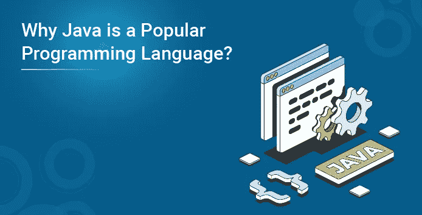

# 为什么 Java 是一种流行的编程语言？

> 原文：<https://medium.com/edureka/why-java-is-a-popular-language-69a998effd0f?source=collection_archive---------1----------------------->

据说 Java 是我们拥有的最好的编程语言之一。那么，为什么是 Java 呢？好吧，Java 已经通过在我们面前展现非凡的特性证明了它的价值。由于这些令人印象深刻的特性，Java 在市场上非常受欢迎。下面先睹为快，看看这些点缀 Java 语言的特性！

这篇文章的内容是:

*   Java 的特性
*   Java 为什么这么受欢迎？
*   Java 在哪里被使用？

我们开始吧！

# Java 的特性

Java 为我们提供了几个引人注目的[特性。我们去看看。](https://www.edureka.co/blog/what-is-java/#FeaturesofJava)

**平台独立**

Java 运行的原则是，一个非常著名的原则，Write 写一次就到处运行。Java 代码被编译成字节码，在 Java 虚拟机中执行。任何有 JVM 运行的系统都能够执行 Java 代码。

**表演**

在字节码被 Java 编译器编译后，它被提供给 JVM，然后被转换成机器代码。这有助于提高 Java 语言的性能。

**多线程**

多线程意味着 Java 让您可以自由地构建具有多个并发活动线程的交互式响应应用程序。

**健壮**

Java 依赖于由自动垃圾收集特性支持的简单内存管理模型，因此 Java 帮助程序员采用创建可靠应用程序所需的编程习惯。

**安全**

Java 中嵌入了几个安全特性。包括运行时检查和编译时的静态类型检查。有了这样的特性，入侵任何 Java 应用都是一个挑战。

**真正意义上的面向对象**

Java 有助于使用面向对象编程语言的功能。例如:

*   抽象
*   包装
*   多态性
*   遗产

**简单**

Java 是一种简单的编程语言。易于阅读和学习。任何人都可以从理解编程的基本原理开始学习 Java。

阅读完这些功能后，让我们进入下一部分。

# Java 为什么这么受欢迎？

Java 的原则，WORA，使它成为一个引人注目的语言！想象一下，你已经创建了一个代码，你可以在任何机器上运行它，在任何你想去的地方工作。这样的特权和安逸！这是最吸引程序员的地方。Java 程序能够在具有 JRE 的不同机器上执行。JRE 兼容所有的设备，比如说，手机，个人电脑，Linux，Windows 等等。

进入下一个环节。

# Java 用在哪里？

Java 一直是新手和有经验的程序员的选择。

*   它用于设计 web 应用程序
*   它被广泛用于创建 Android 应用程序
*   Java 也是开发人员创建科学应用程序的一个很好的选择
*   它也用于开发软件工具
*   游戏开发

到此，我们结束了这个博客。如果你想查看更多关于人工智能、DevOps、道德黑客等市场最热门技术的文章，你可以参考 Edureka 的官方网站。

请留意本系列中解释 Java 其他各方面的其他文章。

> *1。* [*面向对象编程*](/edureka/object-oriented-programming-b29cfd50eca0)
> 
> *2。*[*Java 中的继承*](/edureka/inheritance-in-java-f638d3ed559e)
> 
> *3。*[*Java 中的多态性*](/edureka/polymorphism-in-java-9559e3641b9b)
> 
> *4。*[*Java 中的抽象*](/edureka/java-abstraction-d2d790c09037)
> 
> *5。* [*Java 字符串*](/edureka/java-string-68e5d0ca331f)
> 
> *6。* [*Java 数组*](/edureka/java-array-tutorial-50299ef85e5)
> 
> *7。* [*Java 收藏*](/edureka/java-collections-6d50b013aef8)
> 
> *8。* [*Java 线程*](/edureka/java-thread-bfb08e4eb691)
> 
> *9。*[*Java servlet 简介*](/edureka/java-servlets-62f583d69c7e)
> 
> *10。* [*Servlet 和 JSP 教程*](/edureka/servlet-and-jsp-tutorial-ef2e2ab9ee2a)
> 
> *11。*[*Java 中的异常处理*](/edureka/java-exception-handling-7bd07435508c)
> 
> *12。* [*高级 Java 教程*](/edureka/advanced-java-tutorial-f6ebac5175ec)
> 
> *13。* [*Java 面试题*](/edureka/java-interview-questions-1d59b9c53973)
> 
> *14。* [*Java 程序*](/edureka/java-programs-1e3220df2e76)
> 
> *15。*[*kot Lin vs Java*](/edureka/kotlin-vs-java-4f8653f38c04)
> 
> 16。 [*依赖注入使用*](/edureka/what-is-dependency-injection-5006b53af782)
> 
> 17。 [*堪比 Java 中的*](/edureka/comparable-in-java-e9cfa7be7ff7)
> 
> 18。 [*十大 Java 框架*](/edureka/java-frameworks-5d52f3211f39)
> 
> *19。* [*Java 反射 API*](/edureka/java-reflection-api-d38f3f5513fc)
> 
> 20。[*Java 中的 30 大模式*](/edureka/pattern-programs-in-java-f33186c711c8)
> 
> *21。* [*核心 Java 备忘单*](/edureka/java-cheat-sheet-3ad4d174012c)
> 
> *二十二。*[*Java 中的套接字编程*](/edureka/socket-programming-in-java-f09b82facd0)
> 
> *23。* [*Java OOP 备忘单*](/edureka/java-oop-cheat-sheet-9c6ebb5e1175)
> 
> *24。*[*Java 中的注释*](/edureka/annotations-in-java-9847d531d2bb)
> 
> *25。*[*Java 中的库管理系统项目*](/edureka/library-management-system-project-in-java-b003acba7f17)
> 
> *26。*[*Java 中的树*](/edureka/java-binary-tree-caede8dfada5)
> 
> *27。*[*Java 中的机器学习*](/edureka/machine-learning-in-java-db872998f368)
> 
> *28。*[*Java 中的顶级数据结构&算法*](/edureka/data-structures-algorithms-in-java-d27e915db1c5)
> 
> *29。* [*Java 开发者技能*](/edureka/java-developer-skills-83983e3d3b92)
> 
> 三十。 [*前 55 名 Servlet 面试问题*](/edureka/servlet-interview-questions-266b8fbb4b2d)
> 
> *31。**[*顶级 Java 项目*](/edureka/java-projects-db51097281e3)*
> 
> **32。* [*Java 字符串备忘单*](/edureka/java-string-cheat-sheet-9a91a6b46540)*
> 
> **33。*[*Java 中的嵌套类*](/edureka/nested-classes-java-f1987805e7e3)*
> 
> *34。 [*Java 合集面试问答*](/edureka/java-collections-interview-questions-162c5d7ef078)*
> 
> *35。[*Java 中如何处理死锁？*](/edureka/deadlock-in-java-5d1e4f0338d5)*
> 
> *36。 [*你需要知道的 50 大 Java 集合面试问题*](/edureka/java-collections-interview-questions-6d20f552773e)*
> 
> **37。*[*Java 中的字符串池是什么概念？*](/edureka/java-string-pool-5b5b3b327bdf)*
> 
> *38。[*C、C++和 Java 有什么区别？*](/edureka/difference-between-c-cpp-and-java-625c4e91fb95)*
> 
> *39。[*Java 中的回文——如何检查一个数字或字符串？*](/edureka/palindrome-in-java-5d116eb8755a)*
> 
> *40。 [*你需要知道的顶级 MVC 面试问答*](/edureka/mvc-interview-questions-cd568f6d7c2e)*
> 
> **41。*[*Java 编程语言的十大应用*](/edureka/applications-of-java-11e64f9588b0)*
> 
> **42。*[*Java 中的死锁*](/edureka/deadlock-in-java-5d1e4f0338d5)*
> 
> **43。*[*Java 中的平方和平方根*](/edureka/java-sqrt-method-59354a700571)*
> 
> **44。*[*Java 中的类型转换*](/edureka/type-casting-in-java-ac4cd7e0bbe1)*
> 
> **45。*[*Java 中的运算符及其类型*](/edureka/operators-in-java-fd05a7445c0a)*
> 
> **46。*[*Java 中的析构函数*](/edureka/destructor-in-java-21cc46ed48fc)*
> 
> **47。*[*Java 中的二分搜索法*](/edureka/binary-search-in-java-cf40e927a8d3)*
> 
> **48。*[*Java 中的 MVC 架构*](/edureka/mvc-architecture-in-java-a85952ae2684)*
> 
> **49。* [*冬眠面试问答*](/edureka/hibernate-interview-questions-78b45ec5cce8)*

**原载于 2019 年 10 月 14 日*[*https://www.edureka.co*](https://www.edureka.co/blog/why-java-programming-language/)*。**