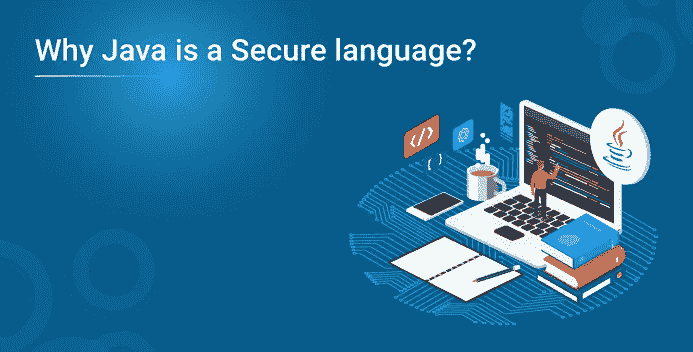

# 为什么 Java 是安全语言？

> 原文：<https://medium.com/edureka/why-java-is-a-secure-language-3635dae8d1dd?source=collection_archive---------0----------------------->

众所周知，Java 是一个广阔的世界。你可以在 Java 中使用很多条款。它是编程世界中最流行的语言之一。由于它提供了许多显著的特性，它是开发者最喜欢的语言。Java 是一种非常引人注目的语言，因为它易于理解和学习。在本教程中，我将讨论 Java 最令人惊叹的特性之一——安全性！

*   为什么 Java 是安全的？
*   使 Java 安全的 10 大特性
*   虚拟机（Java Virtual Machine 的缩写）
*   安全 API
*   安全经理
*   指针无效
*   内存管理
*   编译时检查
*   密码安全
*   Java 沙盒
*   异常处理
*   Java 类加载器

我们开始吧。

# 为什么 Java 是安全的？

由于下面描述的各种特性，Java 是一种非常安全的语言。看一看！

*   在执行之前进行字节码验证，因此程序不能跳转到恶意的或未定义的指令，也不能在指令级犯类型错误。
*   数组的自动边界检查引用的空值检查强制转换的验证防止程序产生任何类型错误。
*   每当加载新代码时，都会进行运行时安全检查。安全管理器和类加载器的使用通过协调对系统资源的访问并防止程序在运行时加载或生成任何任意代码，使得 Java 运行时可以轻松地避免任何任意代码的执行。
*   Java 提供了库级别的安全性。

下面还有一些更具技术性的功能阐述！

# 使 Java 安全的 10 大特性

*   JVM

Java 虚拟机在字节码验证中扮演着重要的角色。JVM 的任务是检查程序没有进行任何不安全的操作。有些情况下，程序会跳转到可能保存恶意数据的错误位置。JVM 保证不存在这种不安全的操作。JVM 有助于减少开发人员遭受内存安全缺陷的可能性。

我们来了解一下安全 API。

*   **安全 API 的**

Java 类库有几个与安全性相关的 API。该 API 涉及加密算法、安全通信和身份验证协议。

让我们继续讨论安全经理

*   **安全经理**

安全管理器保证可疑代码或某些恶意代码不会达到访问平台和 API 的某些功能的目的

*   **指针无效**

Java 语言中没有指针的概念。指针唯一的缺点是它们可以被用来引用另一个对象来进行一些未授权的读写操作。这使得 Java 的安全性处于危险之中。因此，没有指针！

*   **内存管理**

Java 有一个自动垃圾收集系统。它有自己的内存管理机制。允许的时间用户在使用完一些对象后忘记释放内存。但是在 Java 的情况下，不需要腾出内存。JVM 做你的工作。

*   **编译时检查**

例如，如果任何未经授权的方法试图访问私有变量，那么在编译时 JVM 会获取一个错误。JVM 捕捉它遇到的尽可能多的错误。

*   **密码安全**

Java.security.SouceCode 类在 Java 中很有帮助。在从其他网络获取代码的过程中，保留代码的记录变得很重要。上面提到的类维护源信息，并保留保证加密安全性的数字签名。

*   **Java 沙盒**

Java 沙箱基本上是 Java 小程序运行的受限区域。这些小程序无法在没有检查的情况下获得系统资源。

*   **异常处理**

在异常处理中，在运行时，Java 可以通过异常处理捕获不希望的结果并报告给程序员。在程序员纠正它之前，代码不会运行。这个特性增加了 Java 的安全性。

*   **Java 类加载器**

JVM 中有许多类装入器。加载的每个类都有不同的名称。类加载器维护特定类的名称空间。这里的目的是不可信类的行为不应该像可信类一样。

希望现在你已经有了上述问题的答案，为什么 Java 是安全的！就这样，我结束了这个教程。继续阅读，继续探索。如果你想查看更多关于人工智能、DevOps、道德黑客等市场最热门技术的文章，那么你可以参考 [Edureka 的官方网站。](https://www.edureka.co/blog/?utm_source=medium&utm_medium=content-link&utm_campaign=why-java-is-secure)

请留意本系列中解释 Java 其他各方面的其他文章。

> *1。* [*面向对象编程*](/edureka/object-oriented-programming-b29cfd50eca0)
> 
> *2。* [*继承 Java 中的*](/edureka/inheritance-in-java-f638d3ed559e)
> 
> *3。*[*Java 中的多态性*](/edureka/polymorphism-in-java-9559e3641b9b)
> 
> *4。*[*Java 中的抽象*](/edureka/java-abstraction-d2d790c09037)
> 
> *5。* [*Java 字符串*](/edureka/java-string-68e5d0ca331f)
> 
> *6。* [*Java 数组*](/edureka/java-array-tutorial-50299ef85e5)
> 
> *7。* [*Java 集合*](/edureka/java-collections-6d50b013aef8)
> 
> *8。* [*Java 线程*](/edureka/java-thread-bfb08e4eb691)
> 
> *9。*[*Java servlet 简介*](/edureka/java-servlets-62f583d69c7e)
> 
> 10。 [*Servlet 和 JSP 教程*](/edureka/servlet-and-jsp-tutorial-ef2e2ab9ee2a)
> 
> *11。*[*Java 中的异常处理*](/edureka/java-exception-handling-7bd07435508c)
> 
> *12。* [*高级 Java 教程*](/edureka/advanced-java-tutorial-f6ebac5175ec)
> 
> *13。* [*Java 面试题*](/edureka/java-interview-questions-1d59b9c53973)
> 
> *14。* [*Java 程序*](/edureka/java-programs-1e3220df2e76)
> 
> 15。 [*科特林 vs Java*](/edureka/kotlin-vs-java-4f8653f38c04)
> 
> *16。* [*依赖注入使用 Spring Boot*](/edureka/what-is-dependency-injection-5006b53af782)
> 
> *17。* [*堪比 Java 中的*](/edureka/comparable-in-java-e9cfa7be7ff7)
> 
> *18。* [*十大 Java 框架*](/edureka/java-frameworks-5d52f3211f39)
> 
> *19。* [*Java 反射 API*](/edureka/java-reflection-api-d38f3f5513fc)
> 
> *20。*[*Java 中的 30 大模式*](/edureka/pattern-programs-in-java-f33186c711c8)
> 
> *21。* [*核心 Java 备忘单*](/edureka/java-cheat-sheet-3ad4d174012c)
> 
> *22。*[*Java 中的套接字编程*](/edureka/socket-programming-in-java-f09b82facd0)
> 
> *23。* [*Java OOP 备忘单*](/edureka/java-oop-cheat-sheet-9c6ebb5e1175)
> 
> *24。*[*Java 中的注释*](/edureka/annotations-in-java-9847d531d2bb)
> 
> *25。*[*Java 中的图书馆管理系统项目*](/edureka/library-management-system-project-in-java-b003acba7f17)
> 
> 26。[*Java 中的树*](/edureka/java-binary-tree-caede8dfada5)
> 
> *27。*[*Java 中的机器学习*](/edureka/machine-learning-in-java-db872998f368)
> 
> *28。* [*顶级数据结构&Java 中的算法*](/edureka/data-structures-algorithms-in-java-d27e915db1c5)
> 
> 29。 [*Java 开发者技能*](/edureka/java-developer-skills-83983e3d3b92)
> 
> 三十。 [*前 55 名 Servlet 面试问题*](/edureka/servlet-interview-questions-266b8fbb4b2d)
> 
> 31。*[*顶级 Java 项目*](/edureka/java-projects-db51097281e3)*
> 
> **32。* [*Java 字符串备忘单*](/edureka/java-string-cheat-sheet-9a91a6b46540)*
> 
> *33。[*Java 中的嵌套类*](/edureka/nested-classes-java-f1987805e7e3)*
> 
> **34。* [*Java 集合面试问答*](/edureka/java-collections-interview-questions-162c5d7ef078)*
> 
> **35。*[*Java 中如何处理死锁？*](/edureka/deadlock-in-java-5d1e4f0338d5)*
> 
> **36。* [*你需要知道的 50 个 Java 合集面试问题*](/edureka/java-collections-interview-questions-6d20f552773e)*
> 
> **37。*[*Java 中的字符串池是什么概念？*](/edureka/java-string-pool-5b5b3b327bdf)*
> 
> **38。*[*C、C++和 Java 有什么区别？*](/edureka/difference-between-c-cpp-and-java-625c4e91fb95)*
> 
> **39。*[*Java 中的回文——如何检查一个数字或字符串？*](/edureka/palindrome-in-java-5d116eb8755a)*
> 
> **40。* [*你需要知道的顶级 MVC 面试问答*](/edureka/mvc-interview-questions-cd568f6d7c2e)*
> 
> *41。[*Java 编程语言十大应用*](/edureka/applications-of-java-11e64f9588b0)*
> 
> *42。[*Java 中的死锁*](/edureka/deadlock-in-java-5d1e4f0338d5)*
> 
> **43。*[*Java 中的平方和平方根*](/edureka/java-sqrt-method-59354a700571)*
> 
> **44。*[*Java 中的类型转换*](/edureka/type-casting-in-java-ac4cd7e0bbe1)*
> 
> *45。[*Java 中的运算符及其类型*](/edureka/operators-in-java-fd05a7445c0a)*
> 
> *46。[*Java 中的析构函数*](/edureka/destructor-in-java-21cc46ed48fc)*
> 
> *47。[*Java 中的二分搜索法*](/edureka/binary-search-in-java-cf40e927a8d3)*
> 
> **48。*[*Java 中的 MVC 架构*](/edureka/mvc-architecture-in-java-a85952ae2684)*
> 
> **49。* [*冬眠面试问答*](/edureka/hibernate-interview-questions-78b45ec5cce8)*

**原载于 2019 年 10 月 23 日*[*https://www.edureka.co*](https://www.edureka.co/blog/why-java-is-secure/)*。**