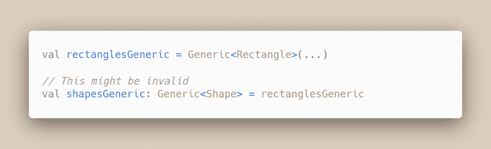

# 为什么科特林有可变集合

> 原文：<https://blog.kotlin-academy.com/why-kotlin-has-mutable-collections-3937a515f913?source=collection_archive---------2----------------------->

## 原因比你想象的要深。

Image taken from: [https://www.runtastic.com/blog/en/kotlin-collections-inside-part-1/](https://www.runtastic.com/blog/en/kotlin-collections-inside-part-1/)

Kotlin 中的一切都是巧妙而优雅的——你永远不必编写不必要的代码，原始语言结构*就可以工作*。但是[可变集合](https://kotlinlang.org/docs/reference/collections-overview.html#collection-types)和不可变集合之间的二分法似乎是可以避免的。它是语言中不可或缺的一部分，这一事实一定指向了更深层的东西。

简单的一行解释是这样的:

> 可变和不可变集合分别公开了不能共存于单个接口中的有用特性。可变集合是可变的，而不可变集合是协变的。

如果这对你没有意义，不要担心。这篇文章的其余部分是写给你解释的！

# 类型层次结构

在继续之前，我们需要建立一些关于等级类型的重要东西。

## 分配能力

考虑以下变量:

虽然变量是用类型`Shape`声明的，但是实际上可以在其中存储类型`Rectangle`的对象。这是因为`Rectangle`是`Shape`的一个子类型，所以它至少实现了`Shape`的所有属性/字段/方法。

因此，这是有效的:

这就引出了你需要记住的第一个要点:

> 当将一个对象赋给一个变量时，**变量**的类型必须是的**超类型(或者与**传入对象**的类型相同)。**

强调变量类型和对象类型之间的区别是很重要的。变量`myShape`看起来像一个`Shape`，但实际上包含一个`Rectangle`。

从这个意义上说，变量的类型定义了一个接口。当你与`myShape`互动时，你与`Rectangle`互动，但你只以`Shape`特定的方式这样做。

## 对象的类型

为了显示`myShape`实际上包含一个`Rectangle`，考虑`Shape`的实现:

而这个`Rectangle`的实现:

如果你运行`myShape.description()`，你会得到如下结果:

因为底层对象的类型是`Rectangle`。`shape`中的引用是对`Rectangle`方法的引用。

## 变量的类型

为了说明您只能以`Shape`特有的方式与`myShape`交互，假设`Rectangle`还定义了以下函数:

如果您运行`myShape.describeRectangularProperties()`，您将得到以下编译时错误:

因为变量`myShape`属于`Shape`类型，因此不能公开`Rectangle`特定的方法`describeRectangularProperties()`。

A Rectangle object in a Shape variable

# 类型参数

当谈到集合时，`Shape`和`Rectangle`会显示为类型参数(如`List<Shape>`和`List<Rectangle>`)。像这样依赖于类型参数的类被称为[泛型](https://kotlinlang.org/docs/reference/generics.html)。

作为类型参数的`Shape`和`Rectangle`的作用有点复杂。在深入研究集合之前，让我们考虑一个更一般的问题:

虽然这看起来很自然，但你不能将一个`Generic<Rectangle>`对象赋给一个`Generic<Shape>`变量。换句话说，这可能是无效的:

这是因为类型`Generic<Shape>` / `Generic<Rectangle>`的对象不仅仅封装了`Shape` / `Rectangle`对象。它们还封装了一些方法，这些方法的行为取决于所提供的类型参数(`Shape`或`Rectangle`)。这让事情变得复杂了。

所以，让我们来分析一下。在方法中，类型参数只能出现在两个地方:

## 返回类型

在此`Drawable`界面中:

…类型参数`T`只出现在封装的抽象方法的返回类型中。

在 Kotlin 中，这种类型参数是通过在泛型定义中的类型参数前放置`out`关键字来标记的。

## 参数类型

在这个`Stackable`界面中:

…类型参数`T`只显示为封装的抽象方法的参数类型。

在 Kotlin 中，这种类型参数是通过在泛型定义中的类型参数前放置`in`关键字来标记的。

# 协方差

考虑像`List<Shape>`这样的不可变集合。一旦它被构造，你唯一能做的就是读取它——因此，它的内部方法只会返回`Shape` s，而不会接收它们。这类似于上面的`Drawable`界面。

这种泛型有一个非常特殊的属性——它们遵循与它们的类型参数相同的继承关系:

如果你仔细想想，这是有意义的——只要我们需要返回`Shape`的对象，我们就可以发送一个返回`Rectangles`的对象。这里最重要的词是“回报”。

这个属性被称为"**协方差"**，因为泛型的类型层次*随类型参数的层次*一起变化。

# 对不可变集合的需求

协方差对于集合来说是一个非常有用的属性:它感觉起来很自然，并且使代码更加直观。但是只有不可变集合才有可能。

你看，可变集合需要公开添加和移除元素的方法；这些方法必须接受类型参数作为参数。如上所述，这意味着可变集合不能协变。

为了让这最后一段更清楚，我们来看一个例子。如果我们允许可变集合是协变的，下面的代码将是有效的:

但是让我们看看如果我们允许它，会出什么问题:

最后一行会抛出运行时错误！这是因为最后一行试图将一个`Circle`添加到一个`MutableList<Rectangle>`中。

有两种方法可以避免上述错误:

1.  如果`rectanglesList`不能放入类型为`MutableList<Shape>`的变量中(即没有协方差)
2.  如果`shapesList`和`rectanglesList`没有类似`add()`的方法(即没有可变性)

即使将类型检查添加到可变集合中的所有写方法，这些类型检查也会产生它们自己的运行时错误/异常……这违背了 Kotlin 尽可能具有编译时类型安全性的哲学。

这里要传达的信息是:

> 可变性和协变性不能在同一个集合接口中实现。

# 结论

1.  可变集合可以从写入的*和*中读取。但是 Kotlin 努力避免所有运行时故障，因此，这些可变集合是不变的。
2.  不可变集合是协变的，但是它们是…嗯…不可变的。尽管如此，Kotlin 确实提供了用这些不可变集合做有用事情的机制(比如过滤值或从现有的不可变集合创建新的不可变集合)。这篇文章给出了一个很好的例子列表:

 [## Kotlin 中的只读集合导致更好的编码。

### 在 Kotlin 中，如果创建一个列表或映射，它就是只读的(类似于不可变的，但略有不同)。这意味着什么…

medium.com](https://medium.com/mobile-app-development-publication/read-only-collection-in-kotlin-leads-to-better-coding-40cdfa4c6359) 

从元素构建集合时使用可变集合。

不过，最终要将它们转移到不可变集合中，这将在需要时为您带来协变赋值的额外好处。

# 点击👏说“谢谢！”并帮助他人找到这篇文章。

了解卡帕头最新的重大新闻。学院、[订阅时事通讯](https://kotlin-academy.us17.list-manage.com/subscribe?u=5d3a48e1893758cb5be5c2919&id=d2ba84960a)、[观察 Twitter](https://twitter.com/ktdotacademy) 并在 Medium 上关注我们。

如果您需要 Kotlin 工作室，请查看我们如何帮助您: [kt.academy](https://www.kt.academy/) 。

