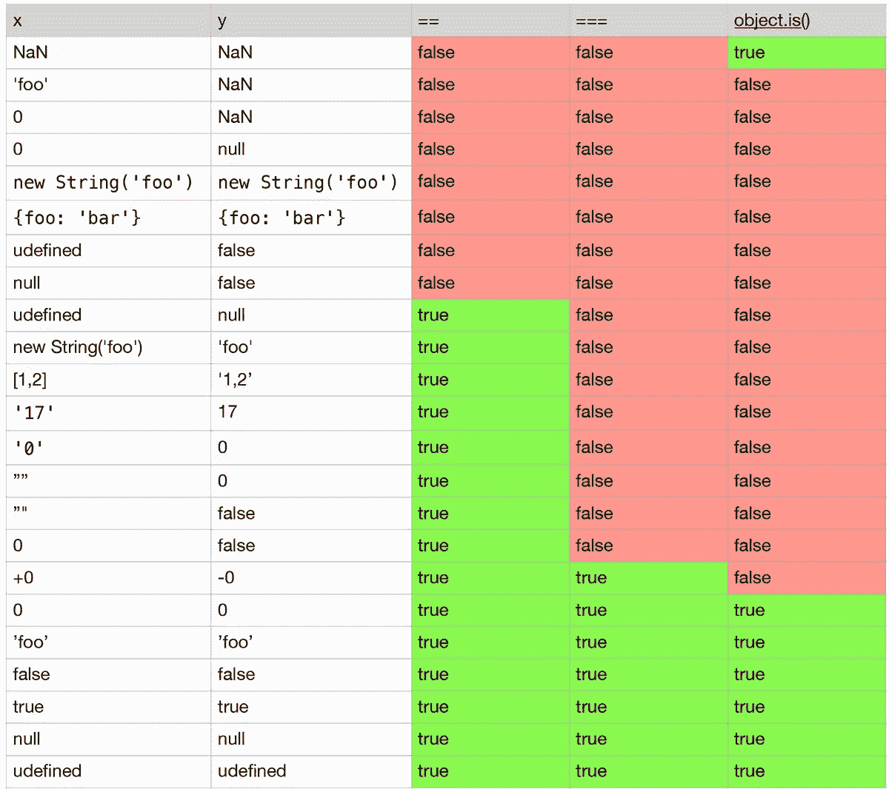

# 为什么 Object.is()优于“==”和“===”？

> 原文：<https://medium.com/quick-code/why-object-is-is-better-than-and-e6c82deb12cc?source=collection_archive---------4----------------------->

Anybody reaction for ‘==’ unexpected results :D

所有使用 JavaScript 的人都知道，JS 是松散类型的，比较“==”会得到意想不到的结果。

所以如果我们使用三重等于运算符“===”，我们得到了一个更严格的结果，但它还不是完美的:

为了帮助我们在这种情况下，我们使用 ES6[‘object . is)(](https://developer.mozilla.org/en-US/docs/Web/JavaScript/Reference/Global_Objects/Object/is)’，它比“===”更精确，而且它在一些特殊情况下表现良好:

## 比较表:

## Polyfill: