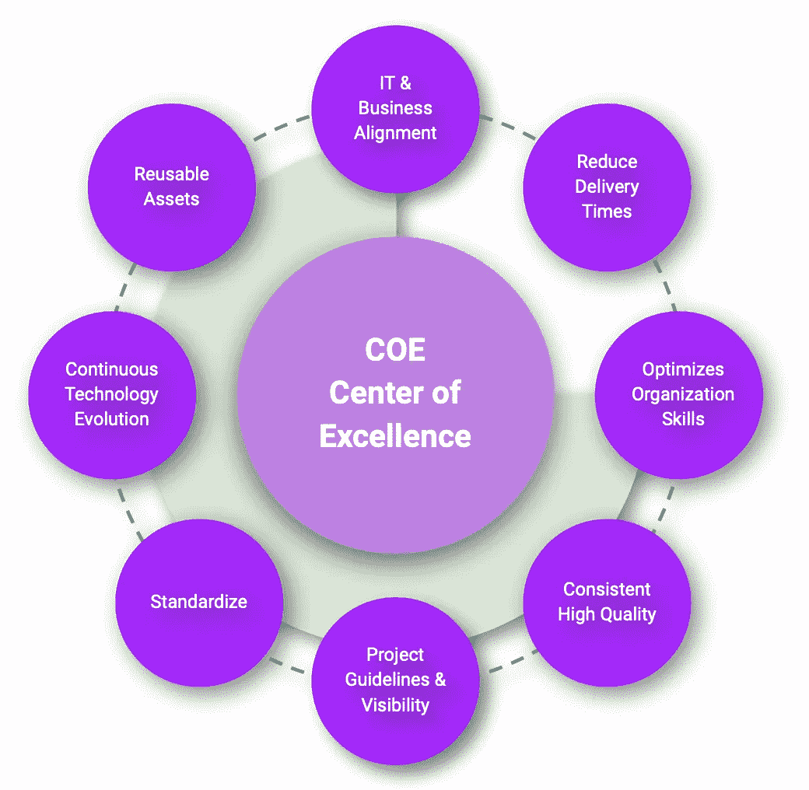
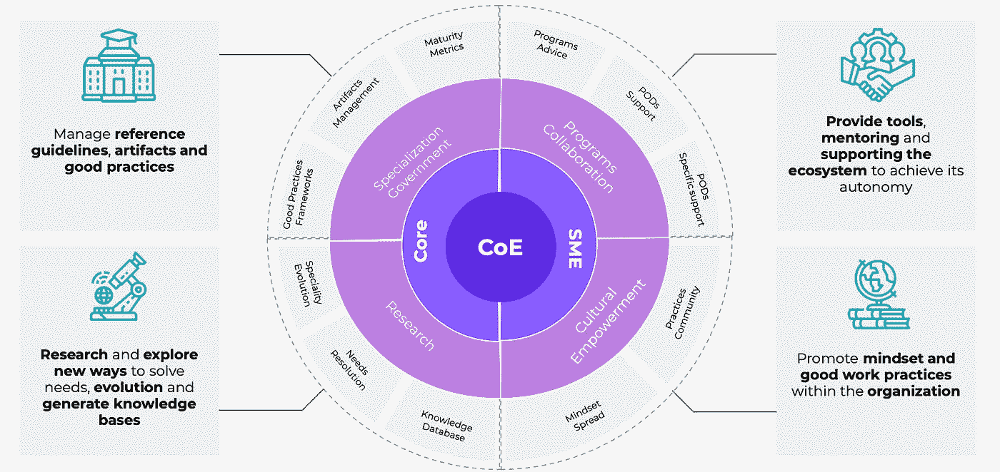

# 为什么组织需要卓越中心

> 原文：<https://medium.com/globant/why-organizations-need-a-center-of-excellence-345969f54f84?source=collection_archive---------0----------------------->

组织正面临着动荡的日子，他们中的大多数都在对抗变化，试图适应和保持运转。他们中的许多人正在过渡数字转型计划，以达到成熟水平，做好快速反应的准备，并且在大多数情况下，能够预测事件。

**企业专注于提供更多价值** **和做创新的事情**，并以适当的方式思考如何为日常业务增加价值。

在这次**之旅中，一条黄金法则就是采用卓越中心**，也被称为 COE。

# [什么是 COE？](https://collectednotes.com/german/center-of-excellence#what-is-a-coe)

但在继续之前，什么是 COE？

COE ( **卓越中心** ) **是一个多学科专家团队** **，致力于**保证快速执行任务和**增强组织的业务能力**。

这个小组的成员在某个特定领域拥有丰富的专业知识。他们将最佳实践标准化，并**贡献专注于其知识领域的思想领导力**。这些人员中心融合了特定领域的知识，并推动组织超越多个学科。

一个 **COE 将专注于为不同的业务领域**提供 **最佳实践，提供培训，并为所有这些不同的团队提供资源。另一方面，COE 将负责所有团队的数据收集和学习，以利用收集的反馈创建持续改进框架。**

我们可以将 COE 活动分为三大主要目标:运营业务、发展业务和转变业务。

# [卓越中心价值主张](https://collectednotes.com/german/center-of-excellence#center-of-excellence-value-proposition)

**跑业务**

COE 将帮助企业提高效率。例如，通过领导决策过程，将有助于降低组织成本或减少时间。COE 支持减轻了日常痛苦，并提供了敏捷性和快速反应。

**发展业务**

COE 可以提高企业效率，帮助组织通过有选择的改进来提高生产力。COE 团队将提高企业竞争力，降低成本优化。COE 决策可以修改企业如何进行常规业务以及如何销售其服务或产品的方式。

**转变业务**

COE 通过战略贡献和协调帮助组织进行数字化转型。COE 团队将有助于为企业带来创新，并揭示新的战略能力，开拓新的市场，开发新产品，并改善他的商业模式。这些类型的 Coe 通常被称为创新中心或实验室团队。

# [卓越中心作为组织内部的价值提供者](https://collectednotes.com/german/center-of-excellence#coe-as-value-providers-inside-organizations)

**节约成本**

COE 团队通过在采用新技术的过程中放弃低效的实践并缩短实施时间来降低运营成本。

**新技术**

考虑到预算以及在中长期内对业务的影响，COE 有助于采用新技术。

**工作表现**

COE 专家可以帮助员工改善工作方式，提供有效的技术和持续的学习。

**调整业务目标**

COE 团队负责将日常工作与业务目标保持一致。这种业务一致性带来了整个组织的业务可见性，并有助于获得有效的工作优先级。

**ROI 改善**

COE 可以促进公司投资，发现和开发可重用资产

# [COE 成员](https://collectednotes.com/german/center-of-excellence#coe-members)

**COE 团队将根据业务需求通过不同的配置文件进行设置**。

没有特定的或推荐的必需成员列表。该列表将与业务性质相关联，并将符合组织的成熟度级别。它也会随着公司的规模而变化。

那些**成员必须有足够的技能**(主题专家知识)，他们**还必须有能力充当其他成员的导师**，例如培训人员。他们必须能够在公司内教授和传播最佳实践。

# [业务转型](https://collectednotes.com/german/center-of-excellence#business-transformation)

**技术本身不能改变一个企业**，**人做改变**。人员和文化对业务转型有着真正的影响。采用卓越中心将把重点放在为公司的每项任务定义和达成最佳方式上。

**已经采用 COE 的公司比尚未采用 COE 的公司有更大的优势**,这些公司将很难创造价值并在业务中保持竞争力。

那些正在考虑如何提高效率，并关注其业务未来的公司应该认真考虑采用卓越中心。