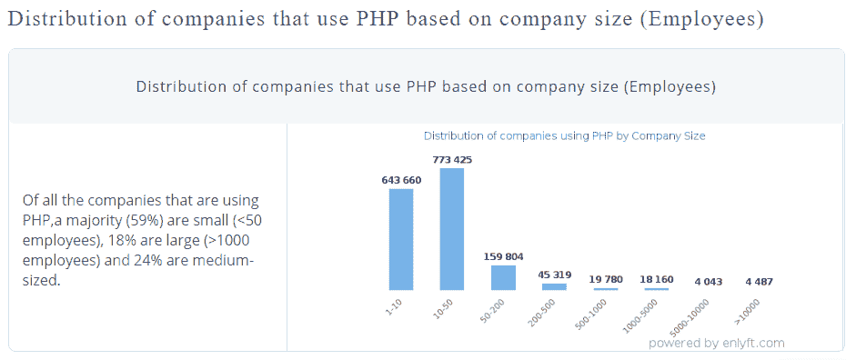

# 为什么更喜欢 PHP？用于 Web 开发的. Net 最新更新

> 原文：<https://medium.com/quick-code/why-prefer-php-over-net-for-web-development-latest-update-ef7f06e96352?source=collection_archive---------0----------------------->

随着数字化趋势的不断发展，对于所有级别的公司来说，创建自己的数字化形象以在当今蓬勃发展的市场中取得成功已经变得非常重要。诚然，你在社交媒体平台上的存在可以帮助你抓住潜在用户的注意力，但要创造一个品牌形象，你需要投资于网络开发。

坚持住！你不需要相信我们的话，只是因为我们告诉你这样做。相反，你可以看看专家们对拥有一个网站的重要性有什么看法。

*   *据总结，* [*46%的小企业*](https://clutch.co/web-designers/resources/small-business-websites-2016-survey#:~:text=Studies%20have%20shown%20that%20over,to%20put%20out%20a%20presentation.%E2%80%9D) *没有自己的网站，只有 54%的企业有官方网页，其中大部分是美国人的。现在，研究表明，超过 70-80%的人在做出购买决定之前会在网上对公司进行调查。用户通常会访问公司网站，以了解品牌的真实性和可信度。此外，有时甚至一个单页网站也能帮助你建立信任，让你以一种完美的方式展示你的产品和服务。—“re Han Fernando，825 media 的首席执行官”。*
*   *无论你经营的是什么类型的企业。如果你有客户，有必要在网上有一些信息，* [*至少有一页*](https://clutch.co/web-designers/resources/small-business-websites-2016-survey#:~:text=Studies%20have%20shown%20that%20over,to%20put%20out%20a%20presentation.%E2%80%9D) *描述你的个人资料和你提供的服务类型以及联系方式。如果你认为雇佣一个网络开发公司对你来说只是一个额外的经济负担，而你忽略了事实，那么你很容易将你的潜在客户转移到其他企业。—“Max Elman，Razorfrog 网页设计的创始人”*

**结论:**一方面，网站可以促进你的业务增长，另一方面，糟糕的技术选择或糟糕的网站设计很容易将你的潜在客户变成烦人的用户。让我们学习如何:

[75%的客户](https://www.markbrinker.com/a-bad-website-can-hurt-your-business)通过网站设计来判断商家的可信度。

*   79%的购物者希望你的网站加载时间不超过 2 秒。

然而，这都是关于网站的作用。但现在，这个行业已经领先一步，网络应用程序的开发正在稳步地为他们在数字世界中的空间铺平道路。

不管你试图构建什么类型的 web 应用，但是网站的性能很大程度上取决于后台运行的脚本和你为项目雇佣的软件开发公司。此外，应用程序的编程方式也会对网站性能产生很大影响。从在 Youtube 上无缝观看视频，在 Linkedin 上与商业伙伴建立联系，到在维基百科上阅读内容，每个应用程序都有强大的脚本或代码背景，使它们能够在用户面前表现良好。

***所以说到选择 web 应用开发的最佳编程语言，PHP 和。Net 是继 Javascript 之后最常用的两种 PLs。***

毋庸置疑，PHP 和。Net 是 web 开发行业的两大巨头，但是比较这两个巨头就像比较苹果和橘子一样。但中心问题是，为什么要雇佣一个 [**PHP 开发公司**](https://www.xicom.biz/offerings/php-development/) 过来。NET 来建立网站？

**让我们直接跳到 PHP 和。Net 来理解到底是什么让 PHP 超越了。NET…**

> 让战斗从基础开始:

# **1。了解 PHP 和。网络**

**一言以蔽之:**PHP 和。NET 是广泛用于 web 开发的开源编程语言。但是由于 PHP 脚本嵌入在 HTML 中，因此它被广泛用于 web 开发项目。另一方面。NET 是一个框架，它包含了许多帮助开发、运行和执行 web 应用程序的组件。

**PHP:** PHP 是一种服务器端的 web 开发语言，由小型开源项目演变而来。它是由拉斯马斯·勒德尔夫在 1995 年引入的，使用了包括 Eclipse、NetBeans 和 Zend Studio 在内的最重要的 ide 进行 web 开发。

此外，因为它是一种服务器端语言，所以它在访问和管理各种类型的数据库方面是高效的。此外，PHP 为支持多种协议的其他服务提供支持，如 POP3、HTTP、IMAP、LDAP 等。

> 由于其适应性和灵活性[，26.2%的开发者](https://www.statista.com/statistics/793628/worldwide-developer-survey-most-used-languages/)正在使用这种编程语言进行 web app 开发。

[Image Source](https://www.statista.com/statistics/793628/worldwide-developer-survey-most-used-languages/)

**。NET:** 这个框架由微软开发，使用了各种技术，包括在运行时管理代码执行的 CLR。此外，它还使用了一些处理线程和内存的组件。今天 [35.1%的开发者](https://www.statista.com/statistics/793840/worldwide-developer-survey-most-used-frameworks/#:~:text=Most%20utilized%20frameworks%20among%20developers%20worldwide%202020&text=According%20to%20the%20survey%2C%2051.4,NET.)在使用。NET，因为它支持多种语言，如 C#、Visual Basic、Visual C++和 Python。

[Image Source](https://www.statista.com/statistics/793840/worldwide-developer-survey-most-used-frameworks/#:~:text=Most%20utilized%20frameworks%20among%20developers%20worldwide%202020&text=According%20to%20the%20survey%2C%2051.4,NET.)

*总结一下这两种语言，值得一提的是 PHP 是一种开源的、可以免费使用的服务器端编程语言，它于 1997 年 11 月首次发布。鉴于，。NET 是一个付费的微软平台，在 2002 年 1 月发布了它的第一个版本。一方面，PHP 是编程语言和 web 框架的独特结合。NET 是一个直接的应用程序框架。*

# **2。PHP 与。NET:性能和速度**

**结论:**就 web 开发而言，网站的性能和速度是真正的游戏规则改变者。所以如果你认为雇佣一个. NET 开发者是唯一的解决方法，那么你可能错了。

平台的性能和速度是相互关联的。网站的性能取决于浏览器响应查询的时间，服务器之间的通信速度在评估中起着重要作用。

## 这里有三个因素可以帮助你评估 PHP 和。网络:

*   在比较访问文件系统的难易程度时，PHP 和。NET 仅仅有什么大的区别，但是当开发者使用带有 ext4 文件的 Linux 系统来操作服务器，而不是 window 操作系统和 NTFS 系统时，可访问性会更好。
*   PHP 使用 LAMP 栈，即 MySQL、Apache、Linux，其脚本运行在自己的内存空间上，从而带来更好的性能。但是另一方面，在基于 COM 的系统上创建了一个. NET 程序，它减慢了整个程序的执行过程。
*   第三，web 的性能和速度很大程度上取决于开发人员的代码编写技能。PHP 和。NET 对于实现 web 应用程序的高标准性能至关重要。因此，我们总是建议雇佣一家精通主流编程语言的专业软件开发公司。

> ***总结一下这一点，可以很公平的说，同时拥有 PHP 和。NET 在一些方面几乎是平等的。但是服务器操作系统、带宽和编码技术的选择很容易影响 web 应用的性能。***

# **3。PHP Vs .NET:哪一个比较实惠？**

**结论:**无论你是创业者还是企业家，web app 的开发成本都是每个人最关心的问题。这就是 PHP 的出彩之处，因为它是免费使用的开源 web 编程语言，而。NET 是微软的付费产品。

**PHP:** 作为一种开源编程语言，雇佣 [**PHP 开发公司**](https://www.xicom.biz/offerings/php-development/) 不需要承担任何开发成本，因为没有相关的许可费。此外，用 PHP 升级和更新 web 应用程序可以简单得多，而且是免费的。这就是为什么大多数企业更喜欢用 PHP 开发 web 应用程序，而不是. NET。

**。NET:** 既然是它是微软的宝贝，那么自然会提出许可费。此外，所有的第三方工具。NET 附加了许可证成本，这将立即提高开发预算成本。

# **4。PHP 与 NET:市场份额**

**结论:** PHP 由于其内置的特性和其他各种原因，在开发者中更受欢迎，并获得了最大的市场份额。但是，总的来说，这两种语言都获得了 91%的市场份额。

Image Source: [https://trends.builtwith.com/framework/programming-language](https://trends.builtwith.com/framework/programming-language)

来自 BuiltWith 数据源的预测显示，PHP 被认为是市场上最受欢迎的编程语言之一。在排名前 100 万的网站中，有 554，769 个网站是用 PHP 建立的，占据了 58%的市场份额。

**。NET:** 这种编程语言也确保了它在流行技术列表中的位置，但只获得了 [26.36%的市场份额](https://www.datanyze.com/market-share/programming-languages--67/asp.net-market-share)。

# **5。PHP Vs .NET:最好推荐给**

**结论:**说到 web 应用程序开发解决方案，PHP 主要被中小型组织使用，而。NET 被大型组织所考虑，但有时它也可以被中型企业用于 web 应用程序开发。

**PHP:** 根据该报告， [58%的员工人数在 1-10 人的小型企业](https://enlyft.com/tech/products/php)正在使用 PHP，22%的中型企业使用它进行 web 开发。然而，它并没有低估开发大规模应用程序的潜力，最好的例子之一就是用 PHP 开发脸书应用程序。

Image Source: [https://enlyft.com/tech/products/php](https://enlyft.com/tech/products/php)

**。NET:** 由于它集成了各种组件和技术，有助于在运行时管理代码和处理线程，因此，它被广泛用于大型应用程序。但是 PHP 仍然比。NET，因为超过 7500 家经过认证的公司正在使用 PHP 进行 web 开发。

# **6。PHP Vs .NET:兼容性**

**结论:**PHP 再次赶超。NET 的兼容性，因为 PHP 可以在多种平台上工作，比如 linus、windows 等等。NET 与 Linux 和基于窗口的应用程序一起工作。

PHP: 雇用 PHP web 开发人员的原因是，它基于一个简单的原则“编写一次就可以在任何地方使用”,可以在 Unix、Solaris、Windows 和 Linux 等多种平台上工作。此外，它还具有与各种 web 服务器和数据库系统协同工作的能力，这最终提高了灵活性。

**。NET:** 它可以与 LINUX 和其他基于 windows 的应用程序一起工作，这使得它在开发人员中很受欢迎。

# **7。PHP Vs .NET:需要哪些编码专业知识？**

**对比:**要提升 web app 的性能，扎实掌握一门编程语言很重要。相比之下，PHP 更容易学习，这也是它被世界广泛使用的原因。

**PHP:** 作为最成熟、最古老的编程语言之一，更容易学习和理解。此外，如果编码简单，开发 web 应用程序或程序也会变得更加容易和简单。

**。NET:** 既然是基于#C 语言，那么学习这种语言不仅难懂而且需要很高的技巧。使用开发 web 应用程序。NET，你需要雇佣一个移动应用程序开发公司，配备有丰富. NET 工作经验的专业开发人员。

# **结论**

写这篇博客的简单目的不是宣布任何赢家，相反，我们总结了几个要点，让你明白为什么 PHP 被广泛使用。NET 进行 web 开发。

希望您已经理解了 PHP 的确切功能，以及为什么开发人员在 web 开发中广泛使用这种语言。如果您对本博客仍有任何疑问，那么建议与专家 [**网络开发公司**](https://www.xicom.biz/offerings/web-development/) 取得联系，他们将进一步向您建议最佳解决方案。