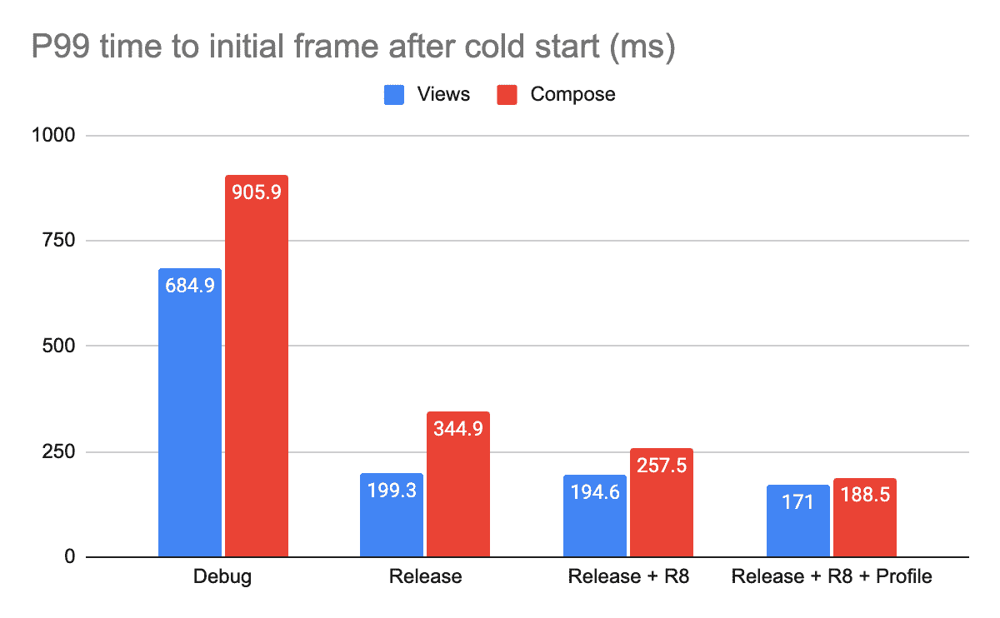
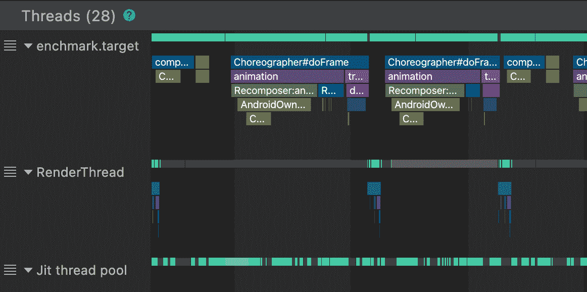
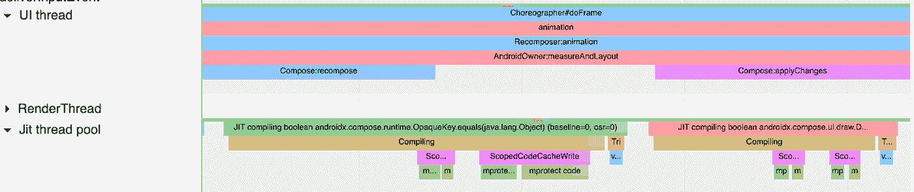
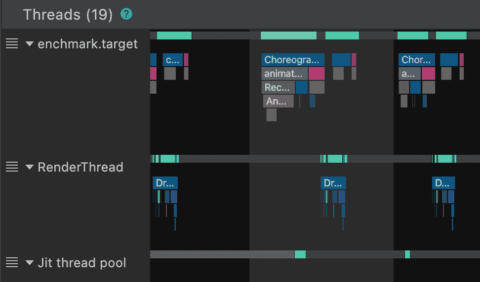
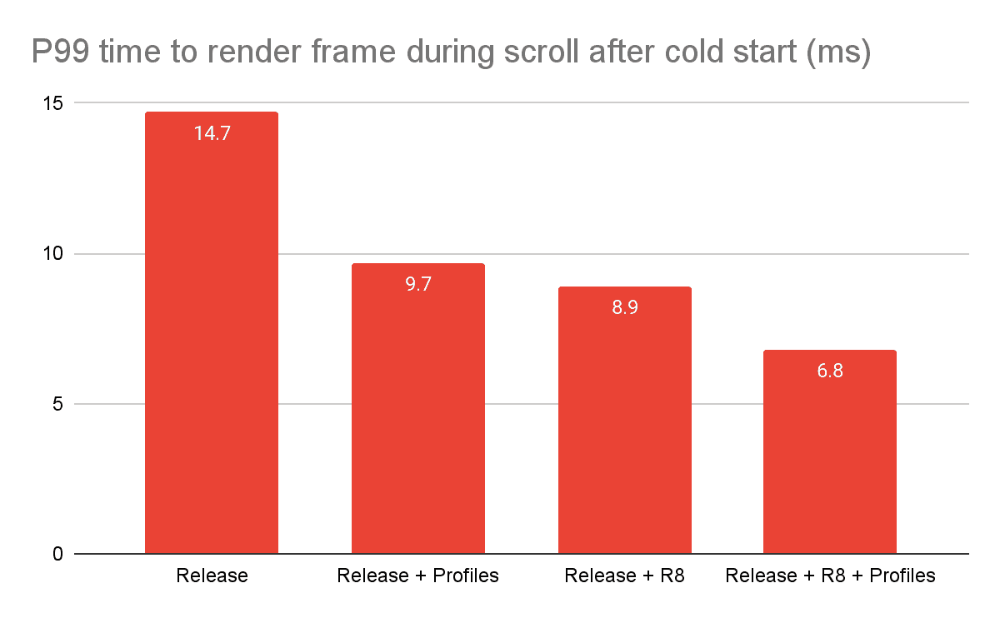

# 为什么您应该总是在发布中测试撰写性能？

> 原文：<https://medium.com/androiddevelopers/why-should-you-always-test-compose-performance-in-release-4168dd0f2c71?source=collection_archive---------3----------------------->

当讨论与 Compose 相关的[性能](http://goo.gle/compose-performance)时，你会发现指导声明“总是在启用 R8 的发布模式下测试”。你可能会注意到在 Android Studio 中调试和部署应用程序时出现的 jank，但是切换到 release 似乎可以解决这个问题。这些影响似乎比基于视图的代码更大。所以问题是:为什么？这个问题的答案有几个层次，所以这篇博文将揭开这个指南的神秘面纱，并详细说明是什么导致了这种性能差距。

在我们开始剥离这些层之前，让我们量化一下我们所说的差异有多大。使用[宏基准样本](https://github.com/android/performance-samples/tree/main/MacrobenchmarkSample)，我们可以在各种配置中对滚动列表活动(基于视图和基于合成)进行基准测试，以查看每种配置对启动和呈现第一帧的**最坏情况**时间的影响。正是这些最坏情况下的框架会让你的应用程序看起来很笨拙。

从这些结果中可以看出，在 debug 中，Compose 的执行速度比在最佳配置中慢得多。值得注意的是，基于视图的活动的执行速度也比其最佳配置慢得多。**所有可调试代码的执行速度都比它的同等优化的不可调试代码**慢，这种影响被 Compose 放大了。但是，为什么呢？

# 撰写是“非捆绑的”

从上面可以看出，性能差异有多种因素，但造成这种差距的最大因素之一是 Compose 是未绑定的——您在应用程序中静态链接库。

我们将 Compose 作为一个库发布，它是从系统框架中分离出来的。然而，经典视图系统是作为 Android 操作系统的一部分与系统框架捆绑在一起的。

当用户下载您的应用程序时，这也包括您正在使用的 Compose 和任何其他库。这就是“非捆绑”的含义。另一方面，view 系统可以被视为 Android 的另一部分，它已经在用户的设备上，提前编译成机器代码，加载并运行。换句话说，它与操作系统捆绑在一起。

Unbundling Compose 允许我们直接向您发布新功能和错误修复。然后，您可以在应用中使用新的编写功能，而不必担心用户运行的 Android 操作系统版本，只要它高于支持的最低版本即可。你也可以按照自己的步调自由地采用它们，而不是在我们发布它们的时候。

虽然将 Compose 作为一个库发布确实有一些折衷，特别是在性能方面。当将您的应用程序构建为“可调试”时，您的应用程序中的所有代码都必须被*解释*，包括 Compose 的所有库代码。这意味着 Android 运行时(ART)不是直接执行机器代码，而是读取 dex 代码并执行它。你可以把它看作是一个中间步骤。我们称这个过程为解释。解释代码比编译代码慢，因为 Android 运行时必须做额外的工作。此外，ART 会将执行次数最多的代码转换成机器码，这样就不会每次都被解释。我们称之为[及时](https://source.android.com/devices/tech/dalvik/jit-compiler)编译，或 JIT。这个过程也需要时间，并会增加 CPU 负载。通过查看系统跟踪，您可以看到正在完成的额外工作。

**Debug** — Note the work being done in the JIT thread pool

**Debug** — Tracing JIT we can see Compose classes

**Release + R8 + Profile**

然而，视图框架的大部分等价代码从来不会在解释模式下运行，因为它已经在发行版中构建和编译过，并与 Android OS 一起发布。构建为“可调试”的基于视图的应用程序代码引用的系统代码已经在发布时构建并优化。

您可能会想，“但是 RecyclerView 也是作为库发布的，为什么它没有受到同样的影响呢？”。答案是，使用像 RecyclerView 和其他 AndroidX 视图库这样的视图，只有一小部分代码是可调试和可解释的。围绕管理哪些视图被重用和回收的 RecyclerView 特定代码是作为可调试的代码运行的，但是下面的视图堆栈仍然是框架代码。

> **“视图库很快回到预编译、发布构建和优化的框架代码**。**另一方面，Compose 版本将整个 UI 堆栈作为可调试代码运行，而不仅仅是懒惰列表管理的一小部分。”**

除了代码在解释模式下运行，加载时间也是不对称的。Android 共享公共系统资源，例如 view 系统，作为 [Zygote 进程](https://developer.android.com/topic/performance/memory-overview#SharingRAM)的一部分，但是 Compose 中的所有类都需要在启动应用程序时加载到内存中。

在发布模式下编译你的应用只能部分解决这个问题。由于应用程序不再是可调试的，所以代码有可能由 ART 编译，并且在没有解释器的情况下运行，但是这是懒惰地完成的。ART 会先以解释模式运行所有代码，然后[编译重要的代码，下次运行的时候会更高效地运行](https://source.android.com/devices/tech/dalvik/jit-compiler)。这意味着，即使你在发布模式下构建应用程序，在比较两者时仍然有相当大的差异。你可以在第一次启动时经常看到这种效果，你可能会注意到你的应用程序起初看起来很笨拙，但后来开始表现良好。你看到了艺术诠释的效果。

这种差异主要由[基线剖面图](https://developer.android.com/studio/profile/baselineprofiles)和 R8 解决(在后面的章节中讨论)。Compose 中包含的基线概要文件会将大多数 Compose 库标记为在应用程序启动时预加载的类，并将大多数 Compose 库方法标记为要编译的方法，这样它们就可以无解释地运行。这对应用性能有着巨大的影响。

**当从 Android Studio 运行时，不使用基线配置文件**，所以你不会在日常开发周期中看到它们的效果。为了正确测试你的应用程序的启动行为，你可以使用[宏基准](https://developer.android.com/studio/profile/macrobenchmark-overview)。Macrobenchmark 允许您对应用程序的启动进行基准测试，并查看使用基准配置文件运行的好处。这是一个更现实的测试，因为这是您的用户将体验到的，而不是从 Android Studio 部署。

# 导致性能下降的其他因素

Compose shipping as a library 是调试和发布之间性能差异的最大贡献者，但是还有其他因素也有显著影响。

## 实时文字

当使用调试版本构建应用程序时，Android Studio 将向 Compose 编译器传递一个标志，以生成稍微昂贵的代码，以便启用名为 [Live Literals](https://developer.android.com/jetpack/compose/tooling#live-edit-literals) 的开发人员工具功能。本质上，这将把生成的代码中的每个常量文字变成一个瘦的“getter 函数”，而不是一个常量。这使得 Android Studio 可以在运行时替换文字，以获得更流畅的开发体验。科特林、R8 和阿特都在不同层次上用常量进行了各种微优化，使得某些代码模式运行得更快。通过把它变成一个带有轻量级条件逻辑的 getter 函数，这些优化都是不可能的。在发布模式下编译应用程序将防止这些去优化的情况发生。

Compose 编译器确定你的可组合组件的[稳定性](https://developer.android.com/reference/kotlin/androidx/compose/runtime/Stable)，以便确定它们在重新组合期间是否可以被[跳过](https://developer.android.com/jetpack/compose/mental-model)。作为这个过程的一部分，编译器将检查传递给你的 Composable 的参数是静态的还是动态的。启用 Live Literals 后，许多参数将变成动态的，允许用不同的文字替换它们。这在发布模式下不会发生，因此调试代码在重新编译时比在发布模式下编译的等价代码运行更多的代码。

你可能也想知道[实时编辑](https://developer.android.com/jetpack/compose/tooling#live-edit)对性能有什么影响。启用时，实时编辑将对性能产生影响，类似于实时文字。然而，由于 Live Edit 的设计方式，当该特性被禁用时，不会有任何性能损失，不像 Live Literals 那样与 debug 标志相关联。

# R8

Compose 也从 R8 优化中受益匪浅。如上所述，**在默认配置中添加 R8 后，启动性能提高了 75%,帧渲染性能提高了 60%**。R8 做了很多优化，但下面是一些对编写代码影响最大的细节。

## λ分组

Compose 将 lambdas 作为 API 设计的一个核心方面。尾随 lambda 用于在 composables 中创建语义嵌套，许多 API 将 lambda 作为它们的第一类入口点。这与用 Java 构建的视图框架形成了鲜明的对比，在视图框架中，基于 lambda 的 API 要少得多，而且通常会避免使用，以减少类的数量。

Lambdas 导致匿名类的生成，这些匿名类实现了许多函数接口中的一个并具有 invoke 方法。例如:

由编译器转换为以下内容:

对于一个合理大小的组合应用程序，会有许多匿名 lambda 类，它们是为相对少量的代码创建的。此外，Compose 编译器将为每个可重启的可组合函数生成额外的 lambdas 作为实现细节。

由于各种原因，Lambdas 可能很贵，但有一点要记住，它们是一个新的独特的类别。当第一次加载一个类时，需要付出性能代价。Compose 解决这个问题的一个方法是利用 R8 的λ分组优化。这将获取具有相同“签名”的 lambda，并将它们分组到单个 lambda 类中，该类的实现基本上是最初分组的类实现的 switch 语句。结果是在运行时加载的 lambda 类要少得多，这会对性能产生明显的影响。

## 省略源信息

在 Compose 在可组合函数中生成的代码中，它在每个可组合函数(包括可组合 lambdas)的根处生成对` [sourceInformation](https://developer.android.com/reference/kotlin/androidx/compose/runtime/Composer#sourceInformation(kotlin.String)) '函数的调用。该函数接收一个字符串，该字符串对信息进行编码，这些信息被开发工具(如[布局检查器](https://developer.android.com/jetpack/compose/tooling#layout-inspector))延迟评估和利用，以计算对可组合函数的调用的源位置。这些方法被有意标记为无副作用，以便 R8 在编译 Compose 代码时完全忽略这些调用。这不仅可以避免方法调用，还可以避免字符串的惰性计算，从而节省时间。

## 恒定折叠

R8 可以访问整个程序，所以对于一个给定的函数，R8 知道从每个可能的调用点传递给它什么值。可组合函数有[个额外的合成参数](/androiddevelopers/under-the-hood-of-jetpack-compose-part-2-of-2-37b2c20c6cdd)，其中一些是 Int 值，作为常量从调用点传入。然后，这些参数被用在条件逻辑中，围绕着 Compose 编译器生成的大量代码。在某些情况下，R8 编译器能够消除代码路径，因为知道该参数的所有可能值，所以它知道这些路径不会被采用。

## 单一实现接口

可组合函数有一个类型为“ [Composer](https://cs.android.com/androidx/platform/frameworks/support/+/androidx-main:compose/runtime/runtime/src/commonMain/kotlin/androidx/compose/runtime/Composer.kt;l=370?q=Composer&sq=) ”的附加参数。Composer 是一个接口；然而，在 Compose 库中只有一个实现,` [ComposerImpl](https://cs.android.com/androidx/platform/frameworks/support/+/androidx-main:compose/runtime/runtime/src/commonMain/kotlin/androidx/compose/runtime/Composer.kt;l=1161?q=Composerimpl&sq=) `。这样做是为了允许将来的其他实现，并允许一些 API 灵活性。

Compose 生成的几乎所有代码最终都调用了这个 Composer 对象的方法。因为参数类型是一个接口，所以所有这些调用在最终的 dalvik 字节码中都以“ [invoke-virtual](https://source.android.com/devices/tech/dalvik/dalvik-bytecode.html#design) ”结束。然而，R8 很聪明，他知道在整个程序中这个接口只有一个实现，所以他可以交换这些类型，把得到的字节码改成“invoke-static ”,这通常要快得多。

# 总结

这就是现在——希望这有助于剥开构成演奏的洋葱的一些层。运行时性能和开发人员经验对 Compose 团队非常重要。当在调试中测试应用程序时，我们正在积极努力改善这种情况。

因此，请记住，如果您在应用中发现性能问题，**请确保在发布模式下进行测试**，更好的是，创建一个基准来量化和测量您的用户将看到的配置性能。可能是你根本没有问题！如需更多合成性能信息，请查看我们的[合成性能指南](http://goo.gle/compose-performance)和 [I/O 对话](https://www.youtube.com/watch?v=EOQB8PTLkpY)。如果你有一个代码表现很差的例子，但是你认为不应该，请在[问题跟踪器](https://issuetracker.google.com/issues/new?component=612128)中提交一个问题。