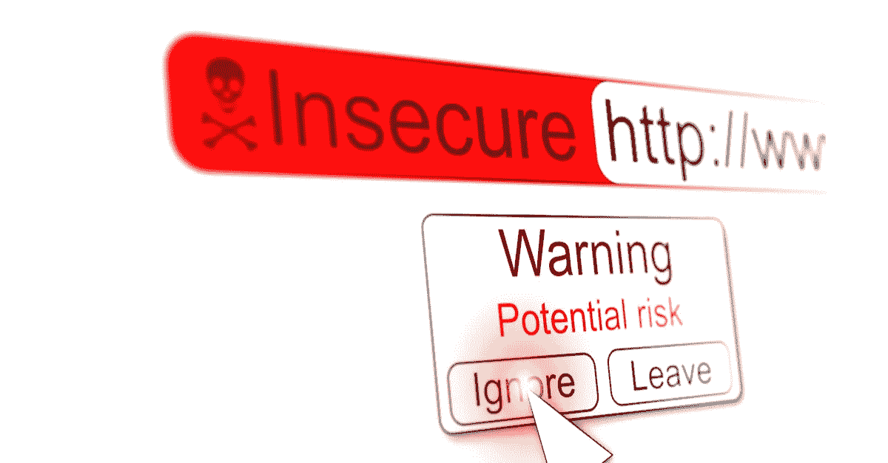
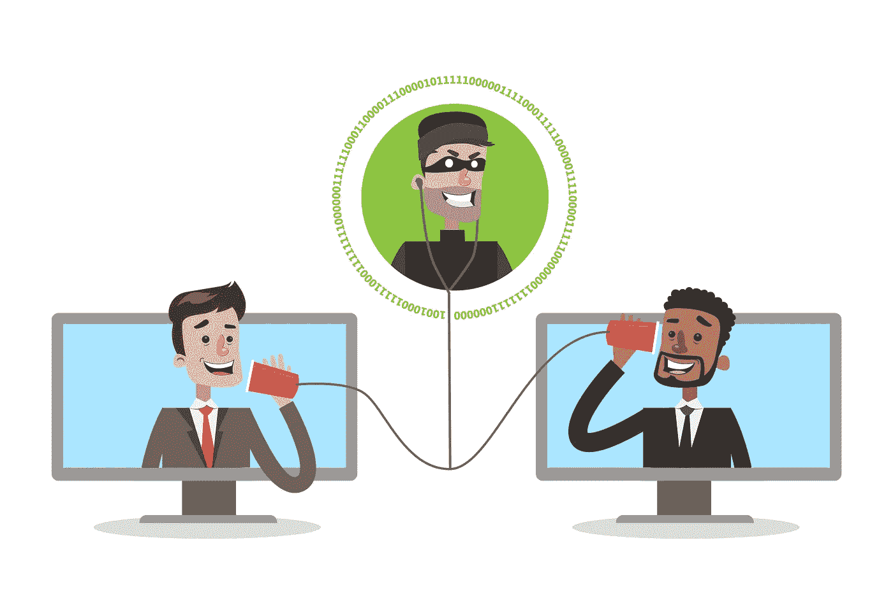
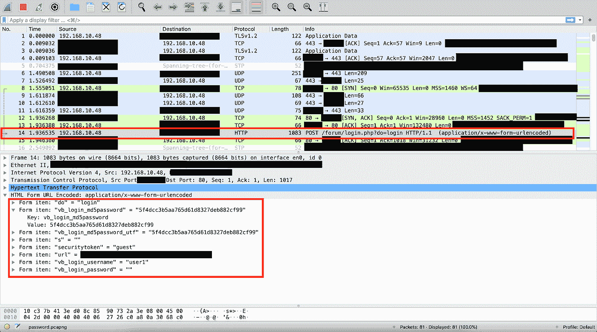
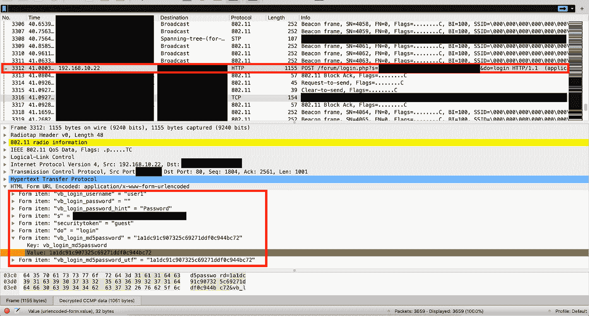
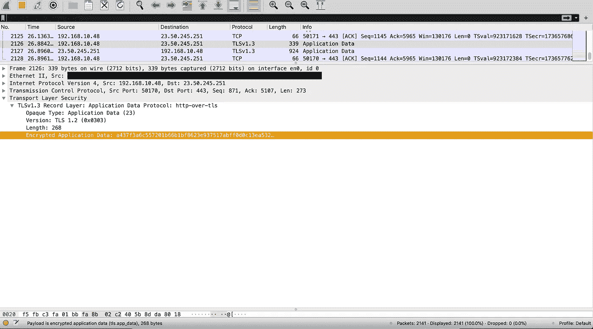

# 为什么你现在要把你的网站移植到 HTTPS！

> 原文：<https://medium.com/globant/why-should-you-port-your-website-to-https-now-5f60eed22807?source=collection_archive---------0----------------------->

我们都听说过“HTTPS 比 HTTP 更好，因为它更安全”这句话。虽然这是事实，但我们需要理解背后的原因。如果我坚持 HTTP 会怎么样？使用 HTTPS 有什么好处吗？

# **使用 HTTP 和 HTTPS 的网站统计**

在我们讨论利弊之前，让我们先评估一下当前的形势。在排名前 100 万的网站中，大约 [50%的网站](https://statoperator.com/research/https-usage-statistics-on-top-websites/)至少在它们的敏感 API 中使用 HTTPS。*现在是 2020 年，只有一半的公共网站在使用 HTTPS* ！为什么这也会让你担心呢？让我们看一个假设的例子。

# **场景**

vulnerable-site.com 是一个基于论坛的网站，创建于 2000 年代中期到后期。托尼是一个注册用户，多年来一直是一个受人尊敬的贡献者。他习惯坐在他最喜欢的咖啡店里浏览论坛。今天，他看到了一个关于第八季的帖子和讨论。他评论说事情没那么糟，并很快在论坛上与其他几个用户展开了争论。在论坛上激烈的辩论之后，他决定他已经受够了，注销并回家。

几个星期后，托尼在家看网飞比赛，突然他从他的朋友(也在论坛上)那里收到多条信息，显示他攻击性帖子的截图。在强烈否认他曾发布过这些帖子后，他试图登录..令他惊恐的是，他意识到他不能。他很快意识到他的账户被黑了，但是很困惑..怎么会？他确信他的密码是安全的，他的设备没有被盗。那么是什么原因呢？

# **阴险的背景故事**

其中一个和 Tony 发生争执的用户是 Raymond，他和 Tony 在同一个办公室工作，是一个非常固执己见的 GoT 粉丝，并被触发(*显然！*)。他决定给托尼一个教训。像几乎所有的网络流氓一样，他没有足够的勇气(或理性)去当面面对托尼。他知道托尼的日常作息和他每天去最喜欢的咖啡店，就跟着他去了那里。

对托尼来说不幸的是，雷蒙德对计算机有点了解，他带了以下信息-

1.  知道这个论坛在 HTTP 上工作。
2.  知道托尼经常去的最喜欢的咖啡店。
3.  知道咖啡店为了顾客的“方便”使用了一个开放的顾客网络。

有了这些知识，他开始 WiFi 数据包嗅探并捕获所有数据包。在得到结果和过滤论坛网站的几秒钟内，他很快就确定了用于登录的 API

Intercept over the same network.

由于 HTTP 默认不使用加密，用户名和密码以文本形式传输！。但是你们当中眼尖的人一定注意到了密码是加密的。(安全吗？😂继续读..)从密钥中可以清楚地看出，它是用 MD5 散列算法加密的。虽然 MD5 在技术上没有被破坏，但是有一个巨大的(并且不断增长的)单词列表被添加了它们各自的校验和。在这个列表中，一个基本的字典或反向查找就足以知道“安全”密码是…嗯…“password 12345”。

让我们退后一点，上面的场景是一个假设，虽然严重，但并不可怕。对于一个真正可怕的场景，想象一下如果银行交易使用 HTTP 而不是 HTTPS 会有多不安全。任何人都有可能在几秒钟内拿走你一生的积蓄！

一些真正善于观察的人可能会指出，攻击之所以可能，只是因为雷蒙德和托尼在同一个网络上。让我们来验证一下这个理论，好吗？

下面截图的场景是——我从我的手机访问同一个网站，我的手机连接到 WiFi 网络，并通过强 WPA2 密码和 MAC 地址白名单作为额外的安全层来保护。我的笔记本电脑目前不在访问网络的白名单中，所以我没有连接到我的手机所连接的 WiFi 网络，但我知道网络的 SSID 和共享密钥。我们再来看看闻过的包。

Intercept over a different network.

WiFi 技术的工作方式固有地暴露了漏洞，任何人都可以嗅探数据包，无论它们是否连接到网络。正如你所看到的，即使没有被授权访问安全网络，我仍然可以清楚地嗅出数据包，尽管是在某些条件下。

> 可怕的是，这两种攻击在正确计时的情况下只需要几秒钟就能完成！

# HTTPS 能阻止它吗？

回到假设的场景，至少密码是用哈希算法加密的，但是为什么要冒险呢？让我们来看一个使用 HTTPS 的网站上的登录动作的捕获

Intercept of an HTTPS request.

即使有人试图嗅探数据包，他们也无法收集用户名和密码。

# **HTTPS 的背景与问世**

现在我们知道了为什么 HTTPS 是必要的，让我们退一步理解 HTTPS 到底是什么。HTTPS 本质上是带加密的 HTTP，使用 SSL/TLS 加密和证书来实现。该证书启用了两个使其更加安全的关键功能—加密和身份验证。

**加密—** 加密是通过使用公钥基础设施(PKI)来完成的，在 PKI 中，任何人都可以使用您的公钥(每个人都可以使用)来加密数据，但只能使用您拥有的唯一私钥来解密。打个比方，把它想象成一个信箱，任何人都可以把信放进去，但是只有你可以用你唯一的钥匙打开它。

**身份验证—** 受发送方和接收方信任的第三方认证机构(CA)，其工作是发布真实性的数字证书。这确保了接收者是它所声称的那个人，而不是冒充它的人。

总而言之，HTTPS 不仅通过确保加密，还通过身份保证来提供更多的安全性。这就是为什么我不能嗅出上述 HTTPS 网站的数据。

**这就是 HTTPS 比 HTTP 更安全的原因。**

# **HTTPS 的其他好处**

*   **更好的搜索引擎优化** —早在 2014 年，[谷歌宣布](http://searchengineland.com/google-starts-giving-ranking-boost-secure-httpsssl-sites-199446)使用 HTTPS 的网站在其页面上的搜索引擎优化排名会有小幅提升。
*   **防止不安全通知**—2018 年，[谷歌宣布](https://blog.chromium.org/2018/05/evolving-chromes-security-indicators.html)不再将使用 HTTPS 的网站标记为安全，而是开始将使用 HTTP 的网站标记为不安全。仔细想想，这是一个很小但很关键的变化。这不仅会赶走网站的潜在访问者，还会产生持久的影响"*这个网站不安全*"在他们的心目中，在这个第一印象决定一切的世界里，这很可能会导致你的网站慢慢消亡。

# **缺点**

> 虽然 HTTPS 比 HTTP 好得多，但它并不是灵丹妙药。

重要的是我们也知道它的缺点-

*   通过在你的设备上安装一个假证书，或者使用蜜罐或一系列其他技术，安全措施可以被绕过。
*   成本——建立普遍接受的证书不是免费的。它们通常需要每年更新，这意味着增加了定期成本。
*   **SSL/TLS 存在漏洞** —虽然不是一个简单明了的场景，但在适当的情况下，即使 [TLS 也被证明是无效的](https://us-cert.cisa.gov/ncas/alerts/TA14-290A)。
*   **速度下降** —验证真实性所需的额外握手步骤会增加页面的加载时间。
*   **混合模式** —虽然一个网站可能会提供安全资源，但页面上的广告或社交插件可能不会在 HTTPS 上运行，这可能会导致您的网站被标记为“不安全”。
*   **不安全的加密** — SSL/TLS 允许服务器和客户端决定他们想要使用的加密方式。虽然所有可用的加密选项都是安全的，但错误配置的服务器仍有可能使用过时的加密，从而暴露一些漏洞。

话虽如此，但利远大于弊。

# **外卖**

让我们来解决显而易见的问题-

*   作为一个网站所有者，你必须尽快移植到使用 HTTPS。
*   作为一个用户，总是在 URL 中寻找安全标志，避免没有安全标志的网站。

> **避免公共 WiFi——如果你不为数据付费，你就是数据！**

但是如果你真的需要使用一个使用 HTTP 的网站呢？可以采取哪些预防措施？

*   **使用 VPN 服务**。它将加密从您的设备到 VPN 服务提供商的数据。这将从源头上防止任何 WiFi 嗅探攻击。
*   总是使用匿名/私人模式。这不会防止数据被窃取，但会增加一些保护措施。
*   如果你只是想浏览博客文章之类的信息，应该还是可以的。

但是对于执行像认证或购买这样的敏感操作，首先，问问你自己是否真的需要它？如果答案仍然是肯定的😑然后按照这些步骤来降低风险。(理想情况下，无论如何你都应该遵循这些！) -

*   使用至少 15–20 个字符的**安全密码**，其中包含大写、小写和特殊字符，并且不可读。**理想情况下使用密码管理器**。
*   对于如此复杂的密码，容易获得反向 MD5 查找的风险很小。
*   **永远不要重复使用密码**即使是琐碎的网站。

> 请记住，您可以使用 HTTP 站点进行敏感操作并不意味着您必须这样做！

**免责声明**——尽管该场景是虚构的，但论坛网站是真实的，并已就该漏洞发出警告。