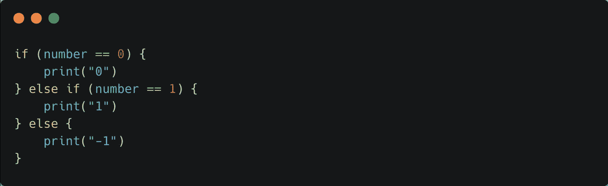
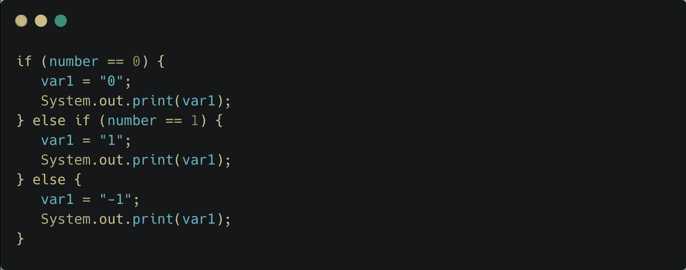
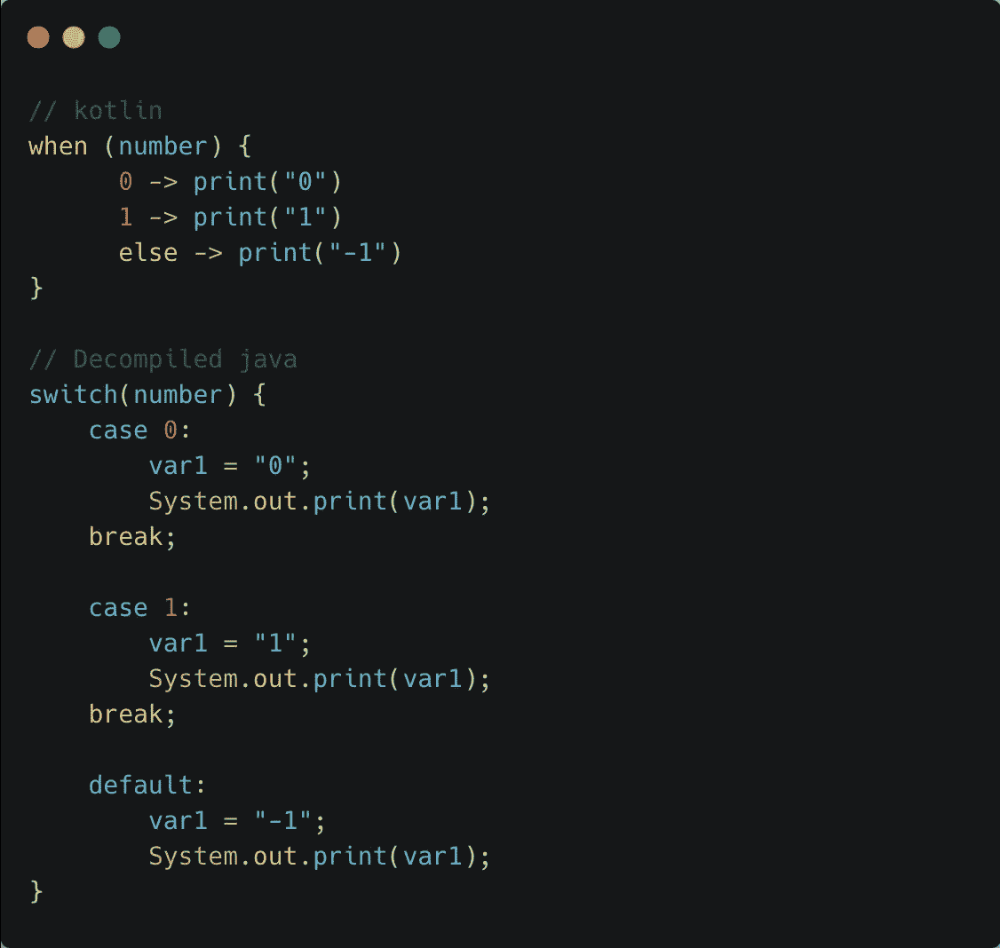
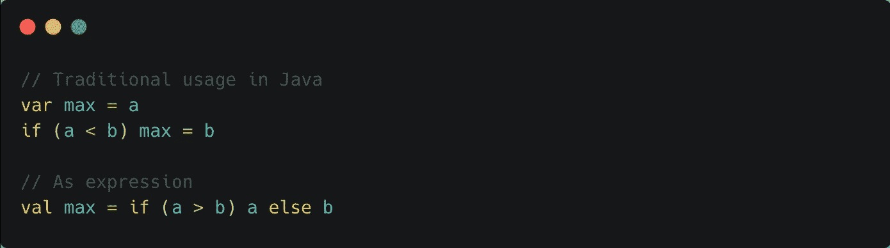
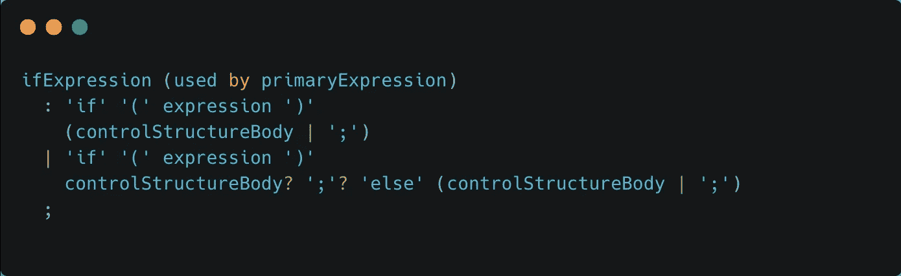
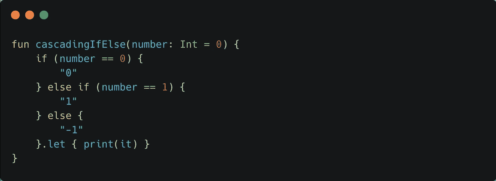
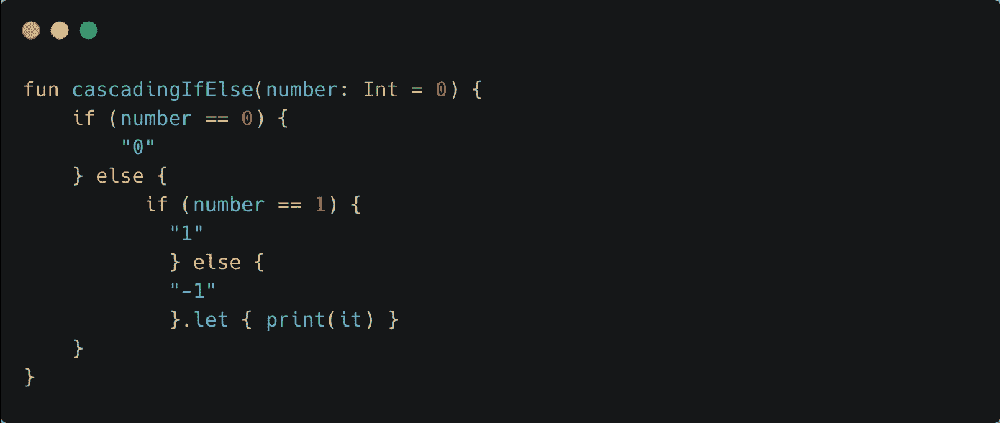
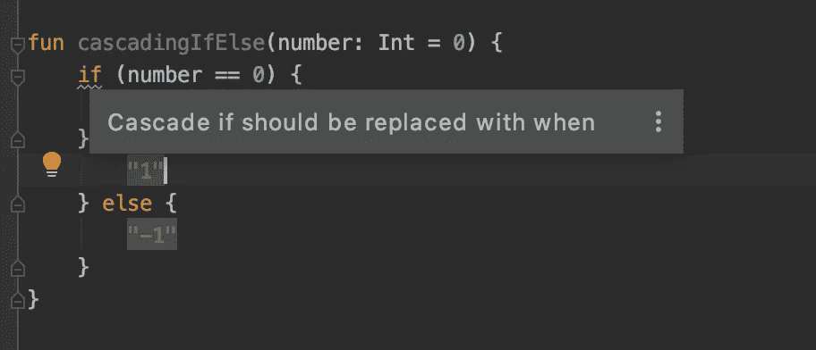

# 在 Kotlin 中避免级联 if-else

> 原文：<https://blog.kotlin-academy.com/why-to-avoid-if-else-if-in-kotlin-d2bc57ebb53e?source=collection_archive---------0----------------------->

Kotlin [编码约定](https://kotlinlang.org/docs/reference/coding-conventions.html#if-versus-when)表示我们应该倾向于用`if`表示二进制，用`when`表示三个或更多选项。

1.  为什么？
2.  为什么在三个或更多选项中，`when`是首选？
3.  为什么 IntelliJ IDEA/Android studio 用“Cascade if 应该替换为 when”来警告我们？

If-else hell

# 理解 Kotlin 和 Java if-else

*   让我们举一个级联 if 的例子。
*   让我们检查反编译的字节码。
*   我们先来了解一下为什么首选`when`。
*   让我们一起来解决一个难题。

# 级联 If

Kotlin version

对于上面的代码，IDE 抛出一个甜蜜的警告，自动“用`when`替换`if`”。在我们盲目使用它之前，让我们更深入地挖掘。

Decompiled version

反编译后的代码显示 Kotlin 在 Java 中编译成普通的`if-else`。一切看起来都很好。

**更换 If - >当**
让我们使用 Intellij/Android studio 的建议，并在使用`when`时检查引擎盖下有什么。

如果是二进制的，编译器将`when`转换为`if-else`，如果有两个以上的选项，则转换为`switch`(常量情况)。

## Java 中为什么要使用 if-else 上的 switch？

*   **多路分支:** Switch 语句将被编译，编译器将检查每个 case 常量(在 Switch 中所有的 case 都是常量)。检查之后，它将创建一个“跳转表”，用于根据表达式值选择执行路径。因此，与 if-else 序列相比，switch 语句对于一大组值将运行得更快。
    Switch 运行得更快，因为编译器知道所有的 case 常量都是相同的类型，它只是比较表达式是否相等。if-else 就不是这种情况了。
*   速度:考虑到事例的数量，switch 语句可能比级联 if 语句更快。小于 5 的开关箱可能不会更快，所以如果开关箱大于 5，最好选择开关箱。多于五项的开关使用查找表或哈希列表。这使得理想情况下可能具有相同的访问时间。另一方面，if-else 序列需要更多的时间，因为它必须线性地评估每个条件。

# 当表达在科特林

Kotlin 中的`[when](https://kotlinlang.org/docs/reference/control-flow.html#when-expression)` [表达式](https://kotlinlang.org/docs/reference/control-flow.html#when-expression)根据其常量或任意表达式的条件替换为`if-else`的`switch`语句或序列。如果所有条件都是常数，并且有 2 个以上的条件，那么它将被编译成一个`switch`。在其他任何情况下，它都是引擎盖下的`if-else`。

# 恒定情况场景

尽管 switch 只在较大的选项组中表现良好，但 Kotlin 仍然将 when 转换为两个以上选项的表达式的开关。

**为什么**是科特林转换成`switch`？为了理解这一点，我们需要了解科特林的`if-else`是如何工作的。

# 如果在科特林

`If-else`是一个**表达式**，也是 Kotlin 中的一个语句，即它返回一个值，也可以作为一个语句使用。
*在繁体 Java 中* `*if-else*` *是一种说法。*

Java if-else vs Kotlin if-else

为了更多地了解 if 条件是如何工作的，我们还可以看看它的语法。

Grammar for If in Kotlin

如果你理解了`if`的语法，那么你就会明白有一个微妙的问题会让 Java 开发人员感到困惑。让我们用一个谜题来探究一下。

# 谜题

Kotlin 开发人员想出警告规则来避免级联`if-else`可能有很多原因。这个难题显示了避免的原因之一，尤其是在常量的情况下。

invoking fun cascadingIfElse()

如果我们调用它，上面的打印结果会是什么？
1)0
2)1
3)-1
4)不会编译
5)不会打印
6)运行时异常

?

?

?

?

?

?

?

?

?

**它不会打印任何东西…** 因为 **If-Else** 是单个表达式，而 **let** 在最后一个表达式上被调用。

该代码可以解读为:

我们很容易被这样的谜题弄糊涂，所以多了解一些 Kotlin 编译器策略对有效使用 Kotlin 总是有好处的。

# 最佳实践

花一些时间在代码的 IDE 警告上。IDE 试图教你一些东西。保持好奇，调查为什么会出现警告，并进行更多探索。

IDE warning

# TL；博士:

*   `If else`是**一个表达式。**
*   级联 **if-else** 会导致代码中出现地雷。
*   Kotlin **when** 被有效地编译成一个 **if-else** 或**开关，Java 中的**，这取决于条件的数量及其状态(常量或任意)。
*   级联 if-else 上的作用域函数如果没有正确封装，总是一个代码矿。
*   永远不要忽略 IDE 警告——永远不要。

# 点击👏说“谢谢！”并帮助他人找到这篇文章。

了解卡帕头最新的重大新闻。学院，[订阅时事通讯](https://kotlin-academy.us17.list-manage.com/subscribe?u=5d3a48e1893758cb5be5c2919&id=d2ba84960a)，[观察 Twitter](https://twitter.com/ktdotacademy) 并在 Medium 上关注我们。

如果您需要 Kotlin 工作室，请查看我们如何帮助您: [kt.academy](https://kt.academy/) 。

