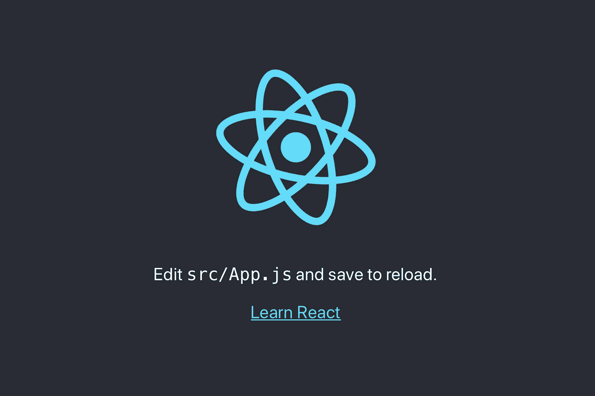

# 为什么什么反应？及其基础知识…

> 原文：<https://medium.com/quick-code/why-what-react-its-basics-5abf9a6caa2f?source=collection_archive---------4----------------------->



React from Facebook

ELLO 的朋友们！！！
在这篇文章中，我们将学习并回答下列问题…

## 1.什么是反应？

## 2.为什么要反应？

之后，我们将看一看 ***反应过来的基本情况。***


# 什么是反应

React.js 是一个开源的 JavaScript 库，专门用于构建单页面应用程序的用户界面。

React 允许我们创建可重用的 UI 组件。React 最初是由脸书公司的软件工程师乔丹·沃克创建的。React 于 2011 年和 2012 年分别首次部署在脸书的 newsfeed 和 Instagram.com 上。

React 允许开发人员创建可以更改数据的大型 web 应用程序，而无需重新加载页面。

这对应于 MVC 模板中的视图。它可以与其他 JavaScript 库或框架结合使用，比如 MVC 中的 Angular JS。

React JS 也简称 React 或 React.js。

## 简单来说，

React 是一个用来构建快速、可伸缩和简单的用户界面的库。它使用不同的组件来构建一个完整的应用程序。
这整个过程可以很容易地理解为一个有待解决的难题，要解决这个难题，我们需要将正确的组件放在正确的位置，一旦所有组件都放在正确的位置，应用程序就完成了。

但是问题是组件是由开发人员构建的。

# 为什么要反应？

现在，摆在我们面前的主要问题是为什么要使用 React。有很多开源平台可以让前端 web 应用程序开发变得更容易，比如 Angular。
让我们快速了解一下 React 相对于其他竞争技术或框架的优势。有相当多的框架可以完成与 React 相同的任务

所以，如果你正在寻找下一个最好的东西，但是你感觉有点迷失在框架丛林中，我建议看看 React。

***1。简单性***

ReactJS 只是更容易立即掌握。基于组件的方法、定义良好的生命周期和简单 JavaScript 的使用使得 React 非常容易学习、构建专业的 web(和移动应用程序)并支持它。React 使用一种叫做 JSX 的特殊语法，允许你混合 HTML 和 JavaScript。开发者仍然可以用普通的 JavaScript 编写，但是 JSX 更容易使用。

**②*。*易学**

任何具有编程基础知识的人都可以很容易地理解 React，而 Angular 和 Ember 被称为“特定领域语言”，这意味着学习它们很难。要反应，只需要 CSS 和 HTML 的基础知识。

***3。*原生方法**

React 可以用来创建移动应用(React Native)。React 是可重用性的铁杆粉丝，这意味着支持广泛的代码可重用性。所以同时可以做 IOS，Android，Web 应用。

***4。可测性***

ReactJS 应用程序非常容易测试。React 视图可以被视为状态的函数，因此我们可以操纵传递给 ReactJS 视图的状态，并查看输出和触发的动作、事件、函数等。

## React JS 的优势:

*   JSX 是用来使它更先进和相当简单的使用。它使用 HTML 标签和语法来呈现组件。
*   **单向数据流:**它允许独特的数据流方式，在这种方式中，值集作为 HTML 标签中呈现为属性的组件进行传递。它不能直接访问或修改组件，而是通过回调来完成这项任务。属性然后被称为**“属性向下流动，动作向上流动。**
*   **虚拟 DOM:** React JS 创建组件，并且将组件中的任何变化与 VDOM 的先前状态进行比较。如果有任何变化，则仅更新组件的该部分，而在简单 DOM 中，整个浏览器在组件或网页中的每次变化时被重新加载。
*   **呈现方法**接受输入并返回要显示的内容。JSX 是一种类似 XML 的语法。组件可以通过这些属性来呈现()。
*   **状态全组件:**组件除了获取输入数据外，还可以维护内部状态数据。当组件状态改变时，通过调用`render()`重新调用它。
*   **React use Babel:** 它是一个将标记语言转换成 JavaScript 的编译器。您可以使用 JavaScript 的最新功能，也可用于不同的转换。例如，我们的 React JS 用这个将 JSX 转换成 JavaScript。
*   JSX 表达式可以用花括号括起来。它们是不可变的，因此不能被改变，如果你想修改的话，每次都可以使用`render()`来替换它们。
*   React 组件是返回 **React 元素的 JavaScript 函数。** React 使用 ES6 类来创建组件，并且可以使用 render 方法来创建。

# React 的基础。

如上所述，我们已经了解了 react 是什么，以及为什么它在开发人员和技术行业中如此受欢迎。我们将通过学习以下内容慢慢来，

## **JSX**

这是指一种类似 HTML 的语法，它在内部将其转换为 react 元素。

## 状态

React 组件有一个内置的`state`对象。

`state`对象是存储属于组件的属性值的地方。

当`state`改变时，组件重新渲染。

`state`只在一个类组件中定义。

## 成分

有两类成分在起反应，
**1。功能组件**

**2。类组件**(由状态和生命周期方法组成)
***组件可重用。***

## 小道具

这些都是只读的。
道具可以从一个组件传递到另一个组件。

```
const myelement = <App device="Android" />;
```

组件接收参数作为一个`props`对象。

```
class App extends React.Component {
  render() {
    return <h2>I am a {this.props.device}!</h1>;
  }
}//on executing output will be
//I am a Android!
```

## 反应生命周期

React 中的每个组件都有一个生命周期，您可以在它的三个主要阶段对其进行监控和操作。

这三个阶段分别是**安装**、**更新**和**卸载**。

我将在下一篇文章中解释整个生命周期方法。

所以，就这样了**谢谢各位！！！为了阅读我的文章，让我知道你是否对文章或我解释的概念有任何疑问，请在底部写下回复。**

在 twitter 上关注我，保持联系，让我知道你感到困难的其他领域，以便我阅读自己，并尝试用我的文章解释它。

[https://twitter.com/bhavishya2107](https://twitter.com/bhavishya2107)

> 谢谢你！！！
> 
> *保持学习和编码😎*

# 参考:

*   https://ReactJSjs.org/:你不需要任何其他资源来学习 react，因为文档中有很多简单的例子和解释。