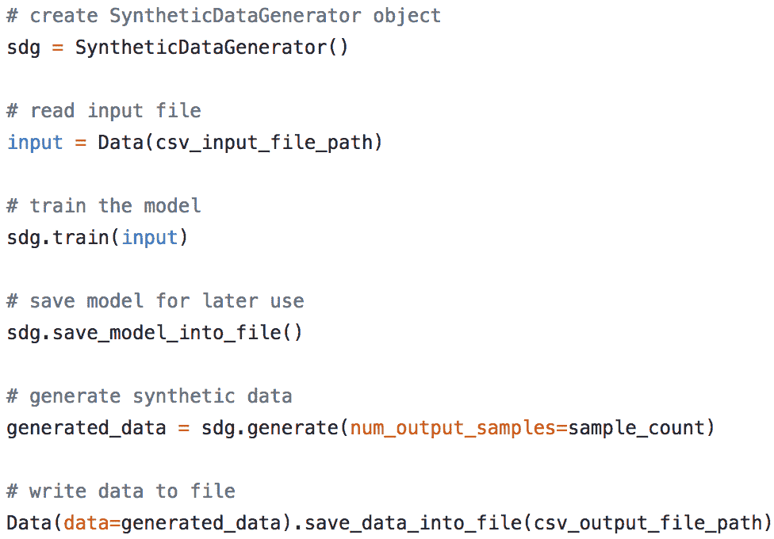
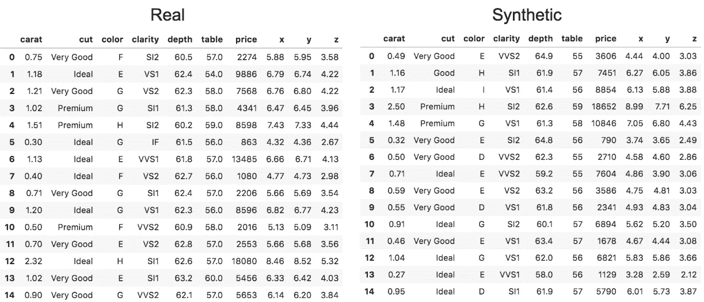
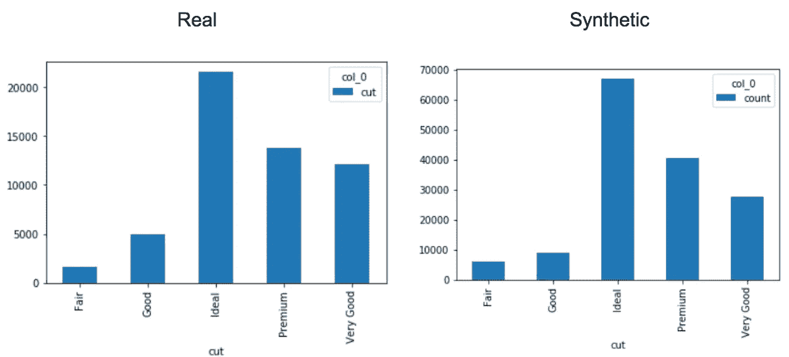
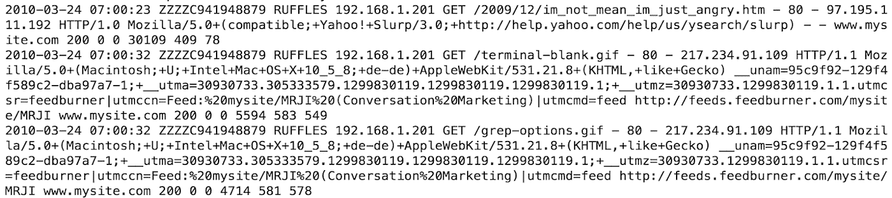
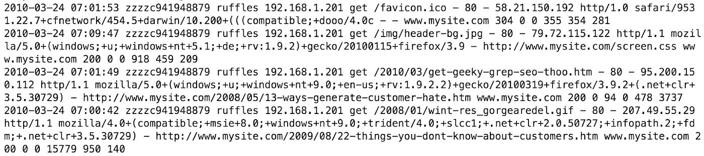
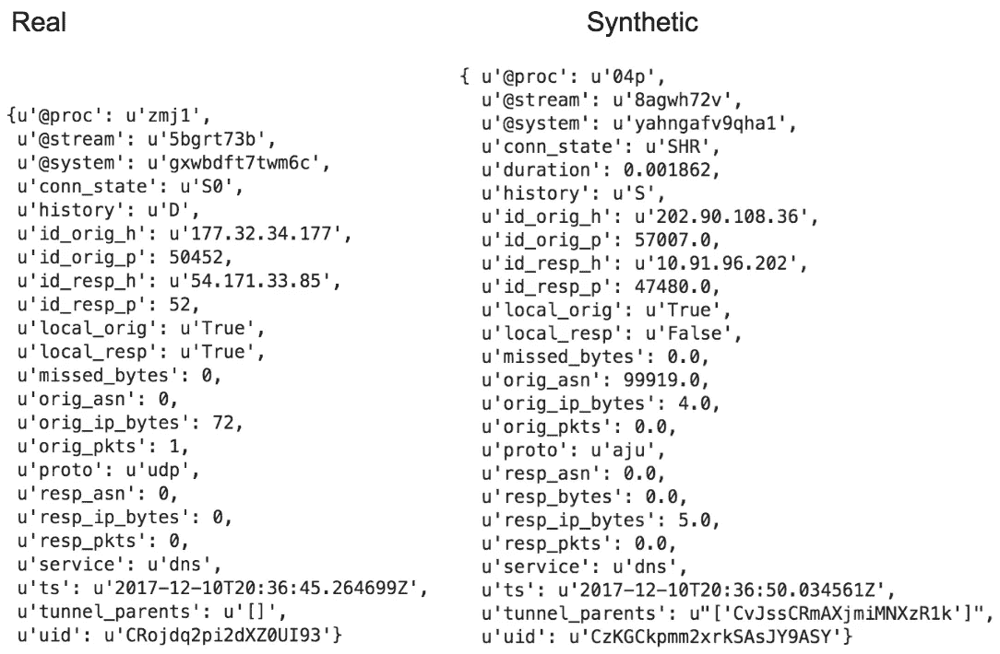
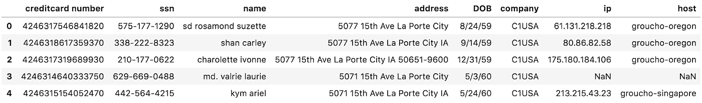
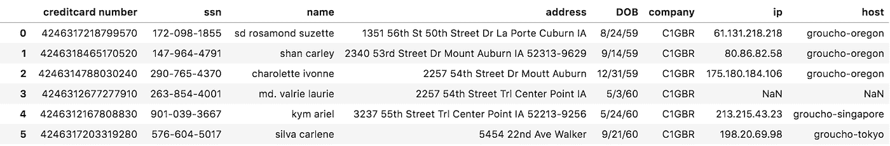

# 为什么数据科学不一定需要数据

> 原文：<https://medium.com/capital-one-tech/why-you-dont-necessarily-need-data-for-data-science-48d7bf503074?source=collection_archive---------0----------------------->

“合成数据。”您可能以前听说过这个术语，但是如果您没有听说过，它实际上是伪数据，包含与“真实”数据相同的模式和统计属性。换句话说，它看起来如此真实，几乎不可能说它不是。

那么，合成数据的意义何在？如果我们已经能接触到真实的数据，这又有什么关系呢？

在软件开发、数据工程、数据科学或机器学习任务中，我们经常需要访问真实数据来开发系统。不幸的是，我们生活在一个[数据泄露](https://www.google.com/search?q=data+leaks&source=lnms&tbm=nws)和隐私担忧的世界，这可能会极大地影响组织、个人和整个社会；这使得在某些情况下使用合成数据成为更安全的开发方法。

此外，对于在高度监管的行业中运营的公司来说，随着全球新法规和准则的出现，如[欧盟通用数据保护法规(GDPR)](https://gdpr-info.eu/) ，使用合成数据可以有效地保持合规性、保护敏感数据并保持继续开发和创新的灵活性。

考虑到这一点，我想深入研究三个核心实例，它们可以作为合成数据应用的理想用例:

1.  软件开发
2.  数据工程
3.  数据科学

在这些情况下，利用合成数据的主要驱动因素之一是在提高安全性的同时使其更易于开发。

**生成合成数据**

考虑到数据访问的简单性和安全性，我在伊利诺伊大学厄巴纳-香槟分校[研究园区 Capital One 实验室的团队](http://researchpark.illinois.edu/)开发了一个 Python 库来协助数据生成过程。出于本文的目的，我们称它为*合成数据生成器** 类。

只需几行代码就可以获取真实数据样本，并创建一个可安全共享的模型来生成合成数据:

该库本身可以为结构化数据格式(CSV、TSV)、半结构化数据格式(JSON、Parquet、Avro)和非结构化数据格式(原始文本)生成合成数据。

每种数据格式都需要自己的机器学习模型。对于需要维护列间关系的结构化数据，我们主要使用生成式对抗网络(GANs)。对于半结构化和非结构化数据格式，我们通常使用递归神经网络(RNNs)。

**合成结构化数据**

结构化数据(我们使用 GANs 的地方)经常被数据科学家用来开发机器学习和统计模型。对于这个用例，我们需要保持合成数据的模式、数据分布和列之间的关系尽可能接近真实。

我们要看的第一个例子是在[钻石数据集](https://ggplot2.tidyverse.org/reference/diamonds.html)上利用*合成数据生成器*:

根据模式和样本，很难看出区别。

如果我们更进一步，开始观察合成数据与真实数据的统计特性，你会开始注意到一个差异；然而，它通常是轻微的。以钻石切割的分布为例；它们看起来非常相似:

通常，真实数据集和合成数据集在数据分布之间有微小的差异，通常在原始数据分布的百分之几之内。或许更重要的是，由[协方差矩阵](https://en.wikipedia.org/wiki/Covariance_matrix)明确的各种数据分布之间的关系也保持大致相同。

下面是来自[威斯康星癌症数据集](https://archive.ics.uci.edu/ml/datasets/Breast+Cancer+Wisconsin+(Diagnostic))的一个示例，可用于样本分类问题(如识别恶性或良性肿瘤):

在这种情况下，因为协方差矩阵、数据分布和数据的其他方面非常相似，所以我们训练的分类模型实际上在合成数据上的训练与真实数据上的训练一样好。

需要注意的是，在合成数据上训练模型并不总是像在真实数据上一样有效。当生成合成数据时，数据分辨率总是会降低——这意味着它永远不会像原始数据一样好。然而，一般来说，合成数据确实能够实现模型的初始开发，当对真实数据进行再训练时(特别是当应用[迁移学习](https://en.wikipedia.org/wiki/Transfer_learning)时)，通常会如预期那样执行。

**合成半结构化数据**

除了模型开发之外，在软件开发和数据工程中也有一些关键的用例，半结构化和非结构化数据更为常见。对于半结构化和非结构化的数据格式，我们使用 RNNs，它实际上不仅会学习生成数据，还会学习生成模式。

以代理日志为例。下面，我们有真实的日志(非结构化数据):

如果你将这些与合成日志进行比较，它们看起来几乎是一样的:

如果不是不可能的话，也很难区分这两者。默认情况下，我们的系统会检查多个指标以及其他变量中输出数据与实际数据的重叠。在测试中，我们的解析器可以对合成数据和真实数据都起作用。

在半结构化的情况下，比如 JSON 对象，RNN 将学习 JSON 对象的结构。这甚至包括键的分布、模式的细微变化或嵌套的 JSON 对象，如{ " JSON ":{ " embedded JSON ":" value " }。

下面的例子演示了这样一种情况:

这种数据的用例主要是构建解析器、数据管道和响应 API 请求。一种特殊的使用方法是构建一个负载测试系统；它使团队能够确定系统可以处理多少数据，以及它是否可以自动缩放，以及其他关键见解。

**合成符号化数据**

还有一点需要注意的是令牌化，即使用令牌替换需要保护的数据部分。这维护了数据中的真实关系——例如，出现在一行数据中的任何 ID 都将包含完全相同的令牌，从而使每一行都保持链接。

对于合成数据，这一令牌化过程得到了改进，我们称之为“智能令牌化”，允许用看起来与原始令牌一样的合成令牌替换安全字段！这意味着从业者可以继续做从数据科学到软件工程的任何事情，而完全不受数据不真实这一事实的阻碍。

以下面的例子为例，我们对一个示例购买数据集*的地址、SSN 和信用卡字段进行了标记化(注意:数据集是通过将这个公开可用的* [*Kaggle 数据集*](https://www.kaggle.com/casimian2000/aws-honeypot-attack-data) *与随机生成的假 SSN、信用卡、地址和姓名*相结合而创建的):

原始数据集

综合记号化数据集

当我们进行令牌化时，我们确保没有新值精确地映射到原始数据，确保没有办法反转精确的字段(在本例中为“信用卡号”、“ssn”和“地址”字段)。

**合成数据的好处**

合成数据的使用带来了无数的好处，尤其是能够确保敏感数据集更严格的安全性。

特别是对于工程师、分析师和数据科学家来说，这意味着我们现在可以更好、更安全地工作。在几分钟内，我们通常可以找到一个数据集，下载合成数据生成模型，并开始开发，只在必要时请求访问真实数据。

对于 Capital One 的我们来说，这意味着我们可以更快、更安全地开发，这要归功于合成数据。

***SyntheticDataGenerator 库由 Capital One 伊利诺伊大学厄巴纳-香槟分校实验室的数据创新团队开发。主要作者:Anh Truong、Fardin Abdi、Vincent Pham、Mark Watson、Jeremy Goodsitt 和 Austin Walters。***

*以上观点为作者个人观点。除非本帖中另有说明，否则 Capital One 不隶属于所提及的任何公司，也不被其认可。使用或展示的所有商标和其他知识产权都是其各自所有者的所有权。本文为 2018 首都一。*