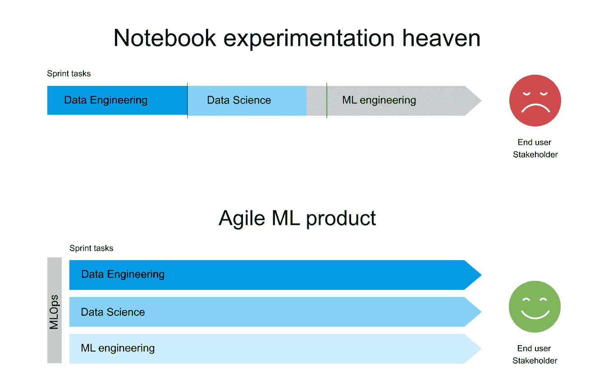

# 为什么您需要 MLOps 来构建敏捷 ML 产品

> 原文：<https://medium.com/compendium/why-you-need-mlops-to-build-agile-ml-products-a2b7a107db94?source=collection_archive---------1----------------------->

大多数机器学习(ML)模型[从未投入生产](https://www.gartner.com/en/newsroom/press-releases/2020-10-19-gartner-identifies-the-top-strategic-technology-trends-for-2021)。他们呆在笔记本电脑实验天堂，那里的一切都是关于数据科学的。笔记本电脑中的 ML 模型概念验证是一回事。从笔记本电脑到生产，T2 完全是另外一回事。它要求整个端到端数据和 ML 管道具有弹性、云效率，并作为可复制的软件产品可供最终用户和维护人员访问。这就是 MLOps 的意义所在。

在这篇文章中，我们试图简要解释什么是 MLOps，以及为什么它与敏捷产品开发如此契合。

# 原型还是产品？

你愿意吗

1.  在最终用户无法访问的本地笔记本电脑中，基于离线数据定制的具有高级功能工程和出色性能得分的 ML 模型，或
2.  一个全球可用的健壮的数据管道，产生高质量和及时的相关结果，应用一个部署的模型，几乎不超过您的基线模型，但被最终用户使用？

从数据科学家的角度来看，选项 1 听起来更像 Kaggle，更具挑战性。而选项 2 实际上作为一个创造价值的原型一直到生产。

> 对于一个数据科学家来说，建立一个有用的模型并不总是很难。将其投入生产是。然而，只有在生产中，ML 才作为一种产品提供价值。

从一开始就专注于产品。即使在试验时，也要在整个管道上工作。随着越来越多用于[自动化模型选择和训练](https://cloud.google.com/automl)的高质量工具出现，我们应该将注意力集中在端到端的管道构建上，并快速探索从数据输入到输出可视化的所有未知。拥有一个小而有效的原型管道遵循敏捷原则和最小化的途径来构建 ML 产品。

如果您的 ML 项目目标主要是面向研究的，并且是为了证明一个数据集和一个模型可以解决一个给定的问题，那么担心自动化操作部分和部署模型以供最终用户使用可能看起来很遥远。也许您甚至没有准备好测试您的解决方案的最终用户。

然而，只要您没有部署任何东西并通过可重复的培训过程和管道提供给最终用户，您就没有解决业务问题的工作产品。此外，通过将实验和模型改进看得比向最终用户交付一个工作的敏捷原型更重要，你打破了敏捷原则。将 ML 模型的性能再提高一个百分点通常需要付出巨大的努力，如果部署 ML 模型的管道不可操作，则不应该优先考虑这一点。

从一开始，以敏捷的方式构建 ML 产品就需要端到端的管道思维。这就是 MLOps 的心态。

# MLOps =数据+模型+代码

与传统软件相比，ML 模型不仅仅是代码。ML 模型是特定数据集和训练程序的函数。一旦经过训练，ML 模型基本上就是一个规则集，它从新的看不见的数据中提供答案。

*   传统软件直接通过代码实现规则集。
*   ML 代码首先实现生成规则集的过程。
*   MLOps 代码实现生成 ML 代码的过程。

包括所有其他胶水和东西，通常在围绕 ML 模型构建产品时花费大部分精力，ML 代码通常是整个代码库的一小部分。实际上，并不是所有的操作性的东西将你的 ML 模型实验作为一个可复制的软件产品来发布和维护。

[ML code size in ML systems](http://cloud.google.com/architecture/mlops-continuous-delivery-and-automation-pipelines-in-machine-learning)

MLOps 是 ML 工程的方法论，它将 ML 系统开发(ML 部分)与 ML 系统操作(Ops 部分)统一起来。它提倡将 ML 系统构建的关键步骤形式化，并在有益时实现自动化。MLOps 为快速可靠地构建、部署和运行 ML 系统提供了一套标准化流程和技术能力。”(谷歌的 MLOps 定义)

MLOps 管理数据、模型和代码的生命周期。维护这三者的结合是一个很大的挑战。它涉及管理管道中复杂的多步骤 ML 工作流程，并确保每一步都以可重复、经济高效和可扩展的方式运行。MLOps 是一个频繁且尽可能快的交付高质量工作软件的良好实践。

# 敏捷 ML 产品

如果我们在构建 ML 产品时真的努力遵循敏捷原则，当务之急是尽可能快地将我们的 ML 模型完全自动化地展示给最终用户。然后迭代。

通常，对最终用户来说，最大的价值就是获得稳定的干净和可视化的数据。所以从那里开始。没有模型。

然后添加一个简单的模型，并作为完整管道的一部分进行部署。从那里开始迭代，并不断将你的分数与基线模型进行比较。简单的模型通常很难被击败，并有助于获得最大的性能收益。

尽早建立端到端的管道还可以确保最基本的数据对于生产来说是可用的和足够健壮的。最后，探索未知的能力必须从一开始就成为最终用户不可或缺的一部分。

避免陷入笔记本电脑实验天堂中无休止的模型构建循环。你总是可以改进模型的！人们花了几个月的时间在 Kaggle 上，从性能指标中挤出额外的 0.1%。甚至实验阶段也需要自动化和版本控制，但不幸的是经常被忽略。

构建您的可重用 MLOps 组件库，以简化维护并加速您的下一个 ML 管道原型和实验。

我们需要最佳实践的可重用蓝图来从一个 hacky ML 实验变成一个专业的敏捷 ML 产品。构建整个管道需要各种各样的技能，这些技能的细节随时都在变化。如果你不知道怎么做，请提问。