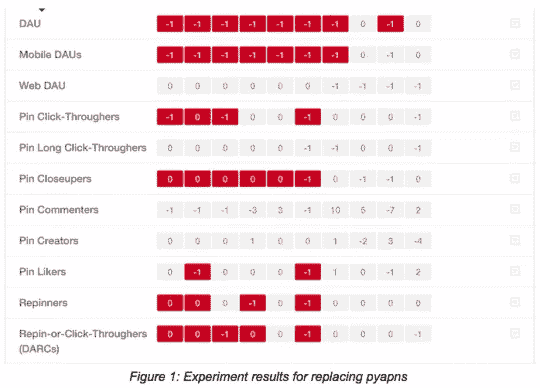

# 为什么您应该对您的基础设施进行 A/B 测试

> 原文：<https://medium.com/pinterest-engineering/why-you-should-be-a-b-testing-your-infrastructure-b7158e1c9bbc?source=collection_archive---------2----------------------->

约翰·埃根和安德里亚·伯班克| Pinterest 工程师，数据和数据科学

使用数据驱动方法进行产品开发的好处是众所周知的。大多数公司都明白在添加新功能或重新设计页面时进行 A/B 实验的好处。虽然工程师和产品经理已经接受了数据驱动的产品开发方法，但很少有人想到将其应用于后端开发。我们已经对 Pinterest 的主要基础设施变化进行了 A/B 测试，并发现这对于验证这些变化对用户没有负面影响非常有帮助。

在开发复杂软件时，错误是不可避免的。通常很难证明您已经涵盖了所有可能的边缘情况、所有可能的错误情况和所有可能的性能问题。然而，当替换或重新构建现有系统时，您有一个独特的机会来证明新系统至少和它所替换的系统一样好。对于像 Pinterest 这样快速发展的公司来说，重新架构或更换基础设施的一个组件的必要性相对频繁。我们非常依赖日志记录、监控和单元测试来确保我们正在创建高质量的代码。然而，我们还尽可能运行 A/B 实验作为验证的最后一步，以确保不会对引脚产生意外影响。我们运行这个实验的方式非常简单:一半的 Pinners 被发送到旧的代码路径并访问旧的系统，另一半使用新的系统。然后，我们监控结果，以确保对治疗组中 Pinners 的所有关键指标没有影响。这是三个这样的实验的结果。

## 2013 年:新的网络框架

我们对 A/B 测试基础设施变化的承诺是在 2013 年初重写我们的 web 框架时形成的。随着时间的推移，我们的遗留代码变得越来越笨拙，它的功能开始与我们的移动应用程序的功能相背离，因为它通过完全独立的代码路径运行。因此，我们构建了一个新的 web 框架(代号为 Denzel ),它是模块化的、可组合的，使用与我们的移动客户端相同的 API。同时，我们[重新设计了](https://blog.pinterest.com/post/45669182372/our-new-look-more-ways-to-discover-what-you-love)网站的外观和感觉。

到了发布的时候，我们就是否应该运行一个实验进行了广泛的辩论，因为我们在组织上完全致力于这种变化，并且还没有对这种规模的变化运行过许多实验。但是，当我们在一小部分流量上进行实验时，我们不仅发现了一些我们没有完全测试的客户端中的主要 bug，还发现了一些我们没有移植到新框架中的次要功能，这些功能实际上推动了大量的用户参与。在全面推出新网站之前，我们恢复了这些功能并修复了错误，这给了 Pinners 更好的体验，同时也让我们更好地了解了我们的产品。

fire 的第一次尝试帮助我们建立了广泛的实验和数据驱动的决策文化，并学会了将大的变化分解为单独可测试的组件。

## 2014 年:Pyapns

我们依靠一个名为 [pyapns](https://github.com/samuraisam/pyapns) 的开源库通过苹果的服务器发送推送通知。这个项目是几年前写的，没有得到很好的维护。根据我们的数据和我们从其他公司听到的信息，我们对它的可靠性有所担忧。我们决定使用另一个名为 [PyAPNs](https://github.com/djacobs/PyAPNs/) 的库进行测试，这个库似乎写得更好，维护得也更好。我们建立了一个 A/B 实验，监控结果，发现我们的 PyAPNs 访客减少了 1%。我们做了一些调查，但无法确定下降的原因，所以我们最终决定退回并坚持使用 pyapns。

## 2015 年:用户服务

我们已经慢慢地向更加[的面向服务的架构](http://en.wikipedia.org/wiki/Service-oriented_architecture)发展。最近，我们提取了大量用于管理用户的代码，并将其封装到新的 UserService 中。我们采用迭代的方法来构建服务，一次提取一部分功能。我们对处理所有用户相关数据的方式进行了如此重大的重构，我们希望确保不会出现任何问题。我们为提取的每个主要功能设置了一个实验，总共三个实验。每个实验都成功完成，显示任何指标都没有下降。结果给了我们很大的信心，这个新的用户服务与以前的代码相当。

我们在基础设施的 A/B 测试方面取得了很大成功。这有助于我们识别变化何时会造成我们可能没有注意到的严重负面影响。当它们运行良好时，它们还会给我们信心，让我们相信新系统正在按预期运行。如果你没有 A/B 测试你的基础设施变化，你真的应该这样做。

[*约翰·埃根*](http://jwegan.com) *是一名成长工程师，安德里亚·伯班克是一名数据科学家*

鸣谢:冯丹、乔希·因肯布兰特、纳丁·哈里克和 Vy Phan，感谢他们在本文实验中的帮助。

*获取 Pinterest 工程新闻和更新，关注我们的工程*[*Pinterest*](https://www.pinterest.com/malorie/pinterest-engineering-news/)*，* [*脸书*](https://www.facebook.com/pinterestengineering) *和* [*推特*](https://twitter.com/PinterestEng) *。有兴趣加入团队吗？查看我们的* [*招聘网站*](https://about.pinterest.com/en/careers/engineering-product) *。*