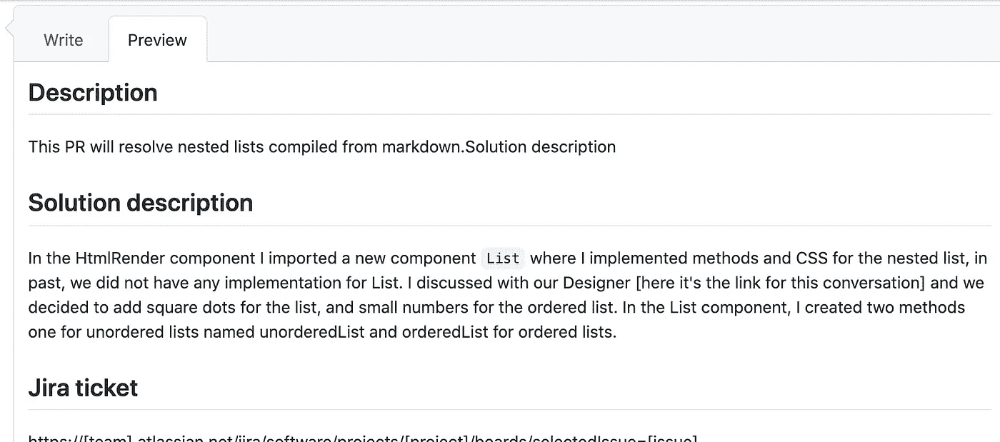

# 为什么你应该激发你的拉动式需求？

> 原文：<https://medium.com/quick-code/why-you-should-motivate-your-pull-request-c84ba9e557c7?source=collection_archive---------8----------------------->



GitHub PR view

每个程序员都使用 GitHub 或另一个 Git 库，如果你没有使用 Git 库，请阅读它。好的公关描述是沟通中的线索。你不会想花几个小时在公共关系上，仅仅是为了理解你的同事守则。另一个很好的例子是，当你在几天或几周后回到这个问题时，这个描述会让你在几分钟内回到你的工作中，而不是几个小时。

这里是我对 PR 描述的推荐。

```
## Description
This PR will resolve nested lists compiled from markdown. Solution description## Solution description
In the HtmlRender component I imported a new component `List` where I implemented methods and CSS for the nested list, in the past, we did not have any implementation for List. I discussed with our Designer [here it’s the link for this conversation] and we added square dots for the list, and small numbers for the ordered list. In the List component, I created two methods: one for unordered lists named unorderedList and orderedList for ordered lists.## Jira ticket
https://[team].atlassian.net/jira/software/projects/[project]/boards/selectedIssue=[issue]## Did you test this issue on all browsers?
[x] Chrome
[x] FireFox
[x] Edge
[x] Safari
[x] Mobile Safari/Chrome
[x] Tablet Safari/Chrome
```

# 描述

在这个地方，拉请求的作者应该用几句话描述问题，作者想要在这个 PR 中解决什么。你应该打出最多 2/3 的段落。它必须简短但有价值。这不是文章、评论者、另一个同事的地方，否则你必须很容易明白你想在这里解决什么。
例如:

```
This PR will resolve nested lists compiled from markdown.Solution description
```

# 解决方案描述

您应该在这里描述您的步骤，添加、更改或删除的内容。解决方案描述就像一本日志，你可以在其中描述你的步骤或解释你的想法。
举例:

```
In the HtmlRender component I imported a new component `List` where I implemented methods and CSS for the nested list. In the past, we did not have any implementation for List. I discussed with our Designer [here it’s the link for this conversation] and we added square dots for the list, and small numbers for the ordered list. In the List component, I created two methods: one for unordered lists named unorderedList and orderedList for ordered lists.
```

# 吉拉机票

如果您没有将吉拉添加到另一个服务，请在此处添加票证链接。

# 你在所有浏览器上都测试过这个问题吗？

这是一个清单的地方。如果你不在网上测试，再加一个列表。

感谢您的关注！我将感谢您的反馈。