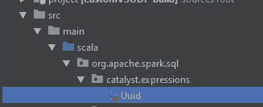
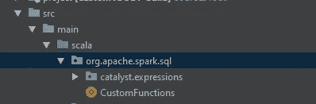
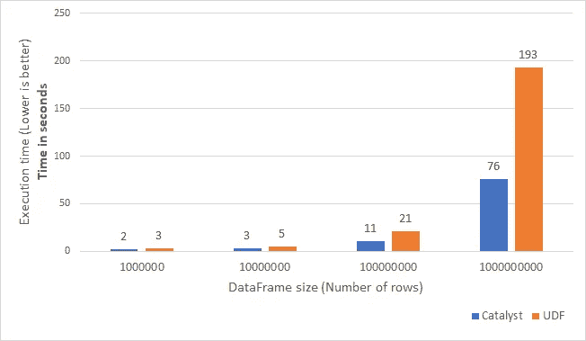

# 为什么应该开始编写 Spark 自定义本机函数

> 原文：<https://medium.com/version-1/why-you-should-start-writing-spark-custom-native-functions-427372c08b4?source=collection_archive---------2----------------------->


当人们需要做一些 Spark 中没有的事情时，他们首先尝试的事情之一是编写一个 UDF，一个**用户定义的函数**，允许他们实现他们正在寻找的功能，但这是最好的方法吗？编写 UDF 对性能有什么影响？

这篇文章将着眼于实现一个函数，通过使用 UDF 和编写自定义 Spark-Native 代码，用两种不同的方法返回 UUID，并比较它们的性能。

我们开始吧！

这篇文章将遵循下一个结构。

*   **1。简介**
*   **2。UUIDs 的快速前言**
*   **3。使用 UDF 的 UUID 实现**
*   **4。UUID 用催化剂表达式实现**
*   **5。性能比较**
*   **6。结论**
*   **7。资源**

**注 1** :这只适用于使用 **scala** 的情况。

**注 2**:Spark 从 3.0.0 版本开始就提供了 **UUID()** 函数，但是由于其简单性，实现它仍然是一个有用的练习。

**你可以找到代码**:[https://github.com/imdany/spark_catalyst_udf](https://github.com/imdany/spark_catalyst_udf)

1.  **简介**

如果你使用过 Spark，你就会知道有些情况下 Spark 本身没有提供你需要的功能，所以你需要扩展它。

通常，您可以通过编写一个 UDF 来完成这项工作。但是你知道还有另一种选择吗？它们被称为 **Catalyst 表达式**，我不得不说它们写起来并不简单，但是(剧透一下)它们可以把你的应用带到另一个性能水平。

所以说正事吧！

**2。UUIDs 的快速介绍**

UUID 代表通用唯一标识符，这是一种非常常见的生成唯一字符串的方法，该字符串可以标识一段数据。这种机制有许多不同的实现，但最常用的是 UUID 版本 4，ID 如下所示:

> c896f 39a-6001–4e 62–9296-a 323 bee9b 047

这个版本的关键点是组成标识符的位是随机生成的，没有内在逻辑。因此，仅通过查看 UUID 是无法识别来源信息的。

生成 id 时的另一个重要方面叫做“冲突”，这意味着在生成过程中会出现重复的字符串。引用自维基百科:

> “为了使**有 50%的概率至少发生一次冲突，需要生成的随机版本 4 UUIDs 的数量是 2.71 万亿分之一……**
> 
> 这个数字相当于大约 85 年每秒产生**10 亿个 UUIDs。包含这么多 UUID 的文件，每个 UUID 16 字节，大约是 45 [艾字节](https://en.wikipedia.org/wiki/Exabyte)。"**

所以我们可以说，我们面对这个问题是难以置信的。

Java/Scala 已经在类 **java.util.UUID.** 中实现了这个功能。这个类提供了一个名为 **randomUUID()** (你可以在这里查看源代码，[](http://hg.openjdk.java.net/jdk8/jdk8/jdk/file/default/src/share/classes/java/util/UUID.java#l141%29.)*)的方法，它为我们生成 UUID，但是……我们如何从 Spark 中访问这个功能呢？*

*让我们看看如何使用 UDF 和 Catalyst 表达式方法在 Spark 中实现这个 UUID 生成器。*

*3.**使用 UDF 的 UUID 实现***

*使用 UDF 实现 UUID 生成器很简单，这是我可能在我参与的所有项目中见过的一段代码。*

*通过一些变化或不同的语法，我们可以这样写这个函数:*

*这样，我们可以将 UUID 函数用于 SQL 表达式和 Dataframe API。*

*这里的要点是我们使用了现有的 Java 函数，但不是在 Spark 中。要使用 Spark 中的代码，我们可以将该代码包装在 Spark 提供的 UDF 方法周围，然后注册该 UDF，如果我们想在 SQL API 中使用它的话。*

*很简单，对吧？你可以用这种方法做很多很多不同的事情。这很容易做到，也很有效，但是还有其他方法来扩展 spark 的功能。*

***4。UUID 用 Catalyst 表达式实现***

*编写 catalyst 表达式可能比 UDF 更复杂，但是正如您将在下一节中看到的，这样做有一些性能优势。让我们从基础开始，我们如何写它们:*

*要在 Spark 中编写自定义函数，我们至少需要两个文件:第一个文件将通过扩展 Catalyst 功能来实现功能。第二个将使该功能可用。*

*   ***催化剂表达式***

*包含代码实现的文件需要在特定的包中创建，即:*

***org . Apache . spark . SQL . catalyst . expressions***

*因此，我们需要在 Spark 项目的那个文件夹中为我们的函数创建文件。*

**

*Location of the file*

*这是事情变得非常复杂的时候。为了让 Spark 使用我们的函数，我们需要扩展可用的接口。我们可以实现许多不同的接口，找到正确的接口可能会很复杂，因为相关的文档并不丰富。化繁为简，我们来分析一下我们要实现什么— **一个没有输入参数，返回一个字符串的函数。***

*我发现我需要实现一个“**叶子表情**，所以我的类会这样开始:*

```
*case class Uuid() extends LeafExpression with CodegenFallback { override def nullable: Boolean = ??? override def eval(input: InternalRow): Any = ??? override def dataType: DataType = ???}*
```

*因此，让我们从最简单的方法开始，来填充这个定义:*

*对于数据类型，我们希望返回一个字符串:*

```
*override def dataType: DataType = StringType*
```

*对于可空值，因为我们不想从函数中返回空值:*

```
*override def nullable: Boolean = false*
```

*最后一位，“eval”**，**是将生成 UUIDs 的函数的实际评估。*

```
*override def eval(input: InternalRow): Any = UTF8String.fromString(java.util.UUID.randomUUID().toString)*
```

*就是这样！您可能注意到的唯一不寻常的事情是 **UTF8String.fromString()。**如果您尝试不使用它来运行代码，您会看到:*

***Java . lang . classcastexception:Java . lang . string 不能转换为 org . Apache . spark . unsafe . types . utf8 string***

*之所以调用该方法，是因为 Spark 使用它将“外部字符串”转换成“Spark 字符串”([*https://github.com/apache/spark/…/UTF8String.java#L49*](https://github.com/apache/spark/blob/master/common/unsafe/src/main/java/org/apache/spark/unsafe/types/UTF8String.java#L49))*

*最终的代码如下所示:*

*简单对吗？嗯，在这种情况下，是的，这是一个简单的实现，但它通常不像这样简单。*

*   ***函数包装器***

*既然我们已经编写了 catalyst 表达式，我们需要让它对 Dataframe API 可用。为此，我们需要创建一个文件。这个文件的位置不如前一个文件重要，但是为了进行排序，我通常把它放在:*

***org.apache.spark.sql***

**

*Location of the Wrapper file*

*而这一次，我已经调用了它的 CustomFunctions，它需要定义以下内容:*

*有了这段代码，我们就可以通过对象 CustomFunctions 使用函数 **Uuid** 。*

*   ***用法***

*最后一个问题是，我们如何使用这个函数？答案相当简单！*

*我们需要像导入其他函数一样导入它:*

```
*import org.apache.spark.sql.CustomFunctions.UUID_CUSTOM*
```

*并在我们的数据框架中使用它:*

```
*.withColumn("uuid", UUID_CUSTOM())*
```

***5。性能比较***

*你可能会问自己的问题是，所有这些真的值得吗？好吧，让我们来看看这些数字。*

*我使用 UDF 和 catalyst 表达式在不同大小的数据帧上运行了相同的代码，结果非常有趣。*

```
*// UDF versionval data = spark.range(nRows).toDF("ID").withColumn("uuid_udf", expr("uuid_udf()"))data.write.format("parquet").mode("overwrite").save(s"/tmp/test/UDF/${runID}")--------// Catalyst Versionval data = spark.range(nRows).toDF("ID").withColumn("uuid", UUID_CUSTOM())data.write.format("parquet").mode("overwrite").save(s"/tmp/test/catalyst/${runID}")*
```

*我用 4 个不同的行数运行了每个函数，每个组合运行了 100 次，然后我得到了这些时间的平均值，结果是这样的:*

**

*Performance comparison (lower is better)*

*对于小数据帧，差异不是很明显。但是，当您增加数据帧的大小时，您可以开始看到 Catalyst 表达式的性能比 UDF 好得多。*

***6。结论***

*那么我应该停止使用 UDF，开始写 Catalyst 表达式吗？*

*我不能回答你，因为这取决于许多不同的方面，如时间、可用资源或知识。*

*但是从测试的**结果可以清楚地看出，如果你需要一个高性能的应用程序或者减少你的工作的执行时间，你应该考虑看看如何编写这些类型的 catalyst 表达式。***

***7。资源***

*我还没有找到太多关于 Catalyst 表达式及其实现的文档。因此，如果您想深入了解这一点，我建议您查看一下 spark 源代码，寻找与您尝试的功能相似的现有功能，并在此基础上实现您的功能:*

***例子:***

*[*https://github . com/Apache/spark/blob/master/SQL/catalyst/src/main/Scala/org/Apache/spark/SQL/catalyst/expressions/string expressions . Scala*](https://github.com/apache/spark/blob/master/sql/catalyst/src/main/scala/org/apache/spark/sql/catalyst/expressions/stringExpressions.scala)*

*[*https://github . com/Apache/spark/blob/master/SQL/catalyst/src/main/Scala/org/Apache/spark/SQL/catalyst/expressions/算术. scala*](https://github.com/apache/spark/blob/master/sql/catalyst/src/main/scala/org/apache/spark/sql/catalyst/expressions/arithmetic.scala)*

***表情:***

*[*https://github . com/Apache/spark/blob/master/SQL/catalyst/src/main/Scala/org/Apache/spark/SQL/catalyst/expressions/expression . Scala*](https://github.com/apache/spark/blob/master/sql/catalyst/src/main/scala/org/apache/spark/sql/catalyst/expressions/Expression.scala)*

*感谢阅读！*

***关于作者** Daniel 是 Version 1 的大数据开发人员，从事 Version 1 的数据分析实践，目前负责开发一个带有 Databricks 的分析平台。*