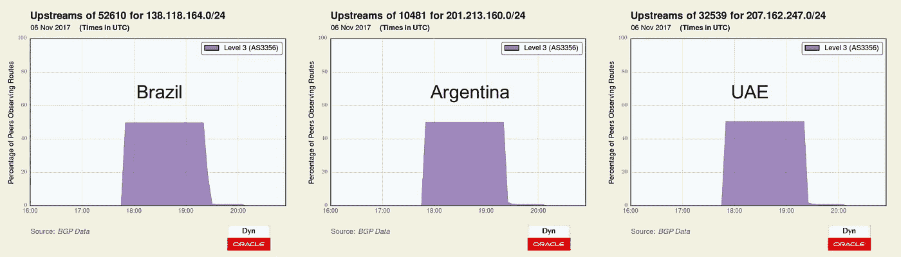

# 3 级 BGP 路由泄漏造成的广泛影响

> 原文：<https://medium.com/oracledevs/widespread-impact-caused-by-level-3-bgp-route-leak-internet-intelligence-3dbd724d9ac5?source=collection_archive---------0----------------------->

周一，在 90 多分钟的时间里，美国和世界各地数百万用户的互联网服务慢得像蜗牛爬行。这种普遍的服务质量下降是由最近的僵尸网络威胁引起的吗？这次不会。原因是另一个 BGP 路由漏洞——路由器配置错误，将互联网流量从预定路径引向其他地方。

虽然没有一天互联网上没有路由泄露或某种形式的错误配置，但当这个错误是由世界上最大的电信网络[犯下的时候就完全是另一回事了。](https://dyn.com/blog/a-bakers-dozen-2016-edition/)

在这篇博文中，我将描述这次路由泄漏中发生了什么以及一些影响。不幸的是，没有什么灵丹妙药可以完全消除这些在未来发生的可能性。只要我们有人配置路由器，错误就会发生。

**发生了什么？**

世界协调时周一(2017 年 11 月 6 日)17:47:05，3 级(AS3356)开始在全球范围内宣布数千条 BGP 路由，这些路由是从客户和同行那里了解到的，旨在保留在 3 级内部。这样一来，到康卡斯特(Comcast)和加拿大贝尔(Bell Canada)等大型眼球网络以及网飞(Chrysler)等主要内容提供商的互联网流量，就被错误地发送到了 3 级错误配置的路由器上。流量工程是一个微妙的过程，因此沿着一条意想不到的路径发送大量流量会导致服务质量下降。不幸的是，这些泄露的路线中有许多一直流传到世界协调时 19:24，导致互联网上超过 90 分钟的问题。

加拿大贝尔公司(AS577)

加拿大贝尔公司(AS577)通常发送 2，400 多一点的 3 级前缀进入 3 级客户群。在周一的路由泄露期间，这个数字跃升至 6459 个前缀——其中大多数是现有路由的更多细节，同样重要的是，向第三级的第一级同行宣布，如 NTT (AS2914)和 XO (AS2828，[现在是威瑞森](https://www.forbes.com/sites/antoinegara/2016/02/22/verizon-to-buy-xo-communications-fiber-business-for-1-8b-from-billionaire-carl-icahn/#5c7a20bef697)的一部分)。

下面是路由泄漏的延迟影响的可视化。

接下来是第 3 级泄露的加拿大贝尔公司的一条路由的传播概况。例如，50.100.32.0/22 通常不在全局路由表中。该地址空间被 50.100.0.0/16 所覆盖，这是一条不太具体的路由。在泄漏过程中，这条路线(以及大约 4000 条其他路线)出现在全球路由表中，由 AS577 始发，由 AS3356 中转。大约 40%的 BGP 来源在它们的路由表中有这些泄漏的路由，并且大多数选择 NTT (AS2914)在到 AS577 的途中到达 AS3356(右下)。

**康卡斯特(各种 ASN)**

康卡斯特，T2 最大的互联网服务提供商，也受到了周一路由泄露的直接影响。

康卡斯特使用大量的 ASN 来运行他们的网络，而 Level 3 泄露了其中相当一部分的前缀，转移并减缓了去往康卡斯特的互联网流量。根据我们的数据，Level 3 泄露了 Comcast 下面列出的 18 个 ASN 的 3000 多个前缀。

*   AS33491 (356 个泄漏的前缀)
*   AS7725 (252 个泄漏的前缀)
*   AS7015 (248 个泄漏的前缀)
*   AS33287 (241 个泄漏的前缀)
*   AS33651 (235 个泄漏的前缀)
*   AS22909 (198 个泄漏的前缀)
*   AS33657 (178 个泄漏的前缀)
*   AS33668 (176 个泄漏的前缀)
*   AS20214 (176 个泄漏的前缀)
*   AS7016 (161 个泄漏的前缀)
*   AS33650 (152 个泄漏的前缀)
*   AS33667 (145 个泄漏的前缀)
*   AS33652 (142 个泄漏的前缀)
*   AS33490 (117 个泄漏的前缀)
*   AS13367 (117 个泄漏的前缀)
*   AS33660 (101 个泄漏的前缀)
*   AS33659 (97 个泄漏的前缀)
*   AS33662 (89 个泄漏的前缀)

我们对 Comcast 的 traceroute 测量从性能角度揭示了泄漏的影响。下面的两个可视化显示了流向通过第 3 级转移的泄漏 IP 地址空间的互联网流量的膨胀，以及观察到的延迟的增加。

**其他影响**

三级泄漏了来自 RCN 的 81 个前缀，他们似乎在世界协调时 18:34 拔掉了三级连接的插头，大概是因为他们发现了导致他们网络速度变慢的原因。

3 级泄露了来自网飞(AS2906)的 97 个前缀，包括以下内容:

影响不仅限于美国。周一，巴西、阿根廷和阿联酋的网络也出现了 3 级泄露。以下是从 Giga Provedor de Internet Ltda(as 52610，42 个泄露的前缀)、Cablevision S.A. (AS10481，365 个泄露的前缀)，甚至卡塔尔的威尔康奈尔医学院(AS32539，3 个泄露的前缀)泄露的示例路由:

**结论**

重要的是要记住，互联网仍然是一个尽最大努力的努力，由一群技术人员在不断的协调下保持在一起。在这个特殊的案例中，当 [Job Snijders](https://twitter.com/JobSnijders) 敏锐地[观察到](https://puck.nether.net/pipermail/outages/2017-November/010952.html)新的前缀在 Comcast 和 Level 3 之间路由时，关于这个事件起源的最初线索首先在一个技术论坛(中断列表)中被报道。

在没有任何银弹解决方案的情况下，对等泄露是互联网的持续风险。我们之前建议[在随意窥视时使用保护措施](https://dyn.com/blog/use-protection-if-peering-promiscuously/)，但即使是像谷歌这样运营良好的网络，也同时是[泄密者](https://dyn.com/blog/large-bgp-leak-by-google-disrupts-internet-in-japan/)和[被泄露者](https://dyn.com/blog/routing-leak-briefly-takes-google/)。

网络共享到对等体的更具体的路由，以确保返回流量通过对等链路直接返回。但是总是存在这样的风险，对等体可能会泄漏这些路由并对您的网络产生负面影响。当泄密者是世界上最大的电信公司时(而且[只会变得越来越大](http://ir.centurylink.com/IRW/CustomPage/Index?KeyGenPage=329255)，影响可能会很大。

*原载于 2017 年 11 月 7 日 blogs.oracle.com***。**