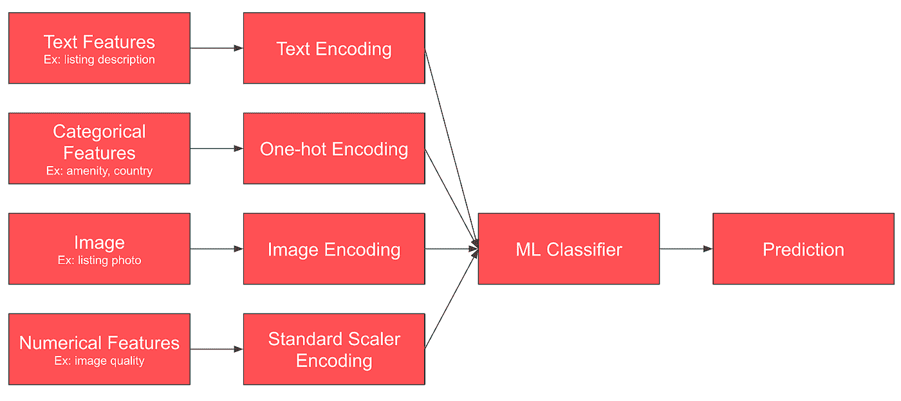

# WIDeText:多模态深度学习框架

> 原文：<https://medium.com/airbnb-engineering/widetext-a-multimodal-deep-learning-framework-31ce2565880c?source=collection_archive---------0----------------------->

**我们如何为快速产品开发设计多模态深度学习框架，以及在此基础上构建的房间类型分类模型如何帮助我们更好地了解我们平台上的房屋。**

***[*米娅赵*](/@cenzhao06)*[*元培曹*](/@caoyuanpei)****

****

**深度学习(DL)正在帮助我们 Airbnb 更好地服务于我们的利益相关者，并增强归属感。例如，我们将它用于搜索排名模型、欺诈检测模型、客户支持中的问题预测模型、对列表的内容理解以及许多其他领域。DL 中的一个主要部分是分类任务，它使用一组特征来预测分类中的标签或类别，例如从列表图像中预测房间类型。**

**现实世界中分类问题的复杂性非常高，因为生产中有各种不同的信号和潜在有用的特征。数据科学家和机器学习工程师总是致力于提高模型性能(例如，精度、召回率等)。)在建立分类模型时，通过充分地将丰富的信号结合到问题域中。从学术界和工业界的文献综述来看，这已经被证明是有帮助的。**

**这篇文章将介绍 WIDeText，这是一个由 Airbnb 构建的多模态深度学习框架，可以轻松开发和生产分类系统，并通过一个使用 WIDeText 构建最先进的房间类型分类器的示例向您展示。**

****

**Overview of WIDeText based model architecture having Text, Wide, Image and Dense channels**

# **多模态分类任务的背景**

**通常，ML 工程师和数据科学家从简单的分类问题开始——有核心特征，如文本或图像，目标是训练 DL 模型编码，并预测他们的最佳类别。例如，Airbnb 房源上有房间图像，模型希望根据它们来预测房间类型。**

****

**Single model design for classification task**

**然而，我们意识到，许多其他功能对于理解 Airbnb 房源中的房间类型也有很大价值。例如，一个图像标题说“生活空间/用餐区、电视和电壁炉”，这是一个文本特征，提供了将房间分类为客厅的强烈信号。**

**随着我们加入更多的功能，模型变得更加复杂。首先，增加了更多类型的特征和负责理解它们的“专家”**(编码或嵌入模型)**，以提高其性能。第二，需要一个更复杂的“决策者”**(分类器)**，能够总结所有的声音并做出预测。这就是工程开销变得重要的地方。**

****

**More complicated multimodal model design for classification task**

**在大多数情况下，必须构建特定的模型架构和特征处理管道，编写培训和评估脚本，并将模型部署到管道或端点中。与此同时，必须尽最大努力跟踪每一个细节，以便正确地审查工作，如图中的步骤 3 至 7 所示。这被证明是机器学习开发过程的主要部分。从长远来看，这既不省时，也不可扩展。**

****

**Briefing steps on developing and deploying ML models in Airbnb**

**我们提出了一个统一的框架来简化、加速和流线化这种类型的多模态分类任务的开发和部署过程。**

# **WIDetext —多模态深度学习框架**

**通过查看几个多模态分类任务和它们使用的特性，不难发现这些特性属于几个常见的类别，可以由特定的“专家”(模型架构)来处理。**

****图像通道****

*   **例子:列表图像，市容图像等。**
*   **MobileNet、ResNet 等。是这方面的专家。我们将在后面的章节中介绍更多的细节。**

****文字频道****

*   **示例:图像标题、评论、描述等。**
*   **有许多 NLP 模型，如 CNN，LSTM，变形金刚等。是这方面的专家。**

****密集通道****

*   **示例:分类特征、数字特征，如舒适类型、图像质量得分、位置信息等。**
*   **GBDT 是专家之一。**

****宽通道****

*   **其他地方的专家生成的现有嵌入，可以被我们的决策者(分类器)直接利用。**

**因此，在 Airbnb，我们开发了一个基于 PyTorch 的内部多模态深度学习框架，名为 WIDeText: Wide、Image、deep 和 Text，以轻松开发和生产分类系统。**

**这里的核心概念是模型融合。我们可以为不同类型的特征利用最先进的模型架构，并组装嵌入来提高最终分类器的能力。它提供了一种以积木方式构建深度学习模型的体验——人们可以轻松地插入/关闭通道，并根据目标调整它们的架构。**

**让我们仔细看看 WIDeText 是如何覆盖您的:**

1.  **模型原型和开发(配置渠道和架构)**
2.  **培训和部署(在生产中构建管道)**

## **模型开发——基于 Json 的模型配置**

**WIDeText 支持使用 JSON alike 来配置模型:框架中的每个通道都是可插拔的，并且可以根据它们的架构和训练超参数进行配置。**

**宽文本分类器需要超参数。对于不同的用户情况，可以有选择地设置“其他通道”。**

**下面的代码片段显示了一个为多模态分类模型设置它的虚拟示例。**

****

**A dummy example of setting up a multimodal classification model using WIDeText**

**为了帮助可视化刚刚构建的基于宽文本的模型，它包括**

*   **基于 VGG 的图像通道**
*   **基于 CNN 的文本频道**
*   **基于 GBDT 的密集渠道**
*   **宽渠道**
*   **基于 MLP 的分类器**
*   **以及他们的训练和评估超参数**

****

**Visualization of the WIDeText based model having Text, Wide, Image and Dense channels**

## **培训和部署—与 Airbnb 的基础设施相集成**

**与 Airbnb 的机器学习基础设施的集成使得模型开发和部署变得容易。**

**作为背景，Airbnb 的 Bighead 机器学习基础设施为用户提供了一个可组合的、一致的、通用的界面，用于使用最少的“粘合”代码创建一个自包含的模型。Bighead transformer 接口(需要注意的是，这与深度学习领域中其他著名的 transformer 架构无关)提供了一种定义有状态或无状态函数的方法，这些函数将一个命名特征张量的集合转换为另一个命名特征张量的集合。每个变压器都可以根据您的使用情况进行安装和配置。每个转换器可以在给定数据源的情况下执行转换，然后应用于新数据进行推理。更重要的是，一组变压器可以连接到一个称为 ML pipeline 的有向无环图(DAG)。**

**我们提供了一个包装器来使任何基于宽文本的模型成为大头转换器。这可以与现有的预处理器、变压器等相结合。与 WIDeText transformer 一起构建和部署端到端的机器学习管道。**

**例如，在下面显示的管道中，我们为不同类型的输入添加了几个预处理程序，然后将它们输入到 WIDeText 转换器中，它们是用于图像数据的 JPEGResizeDecoder，以及一个用于宽和密集特征的热编码器、缩放器和特征组合器。**

****

**An example of the integrated machine learning pipeline having multiple transformers, such as WIDeText transformer, several preprocessors, etc.**

**有了这个构造好的 Bighead 管道，人们可以使用它的统一 API 将他们的数据注入到训练和评估中，并将管道部署到生产中，并作为在线端点公开。**

**WIDeText 框架已经被制作团队广泛采用。Airbnb 的产品中已经建立并交付了多个生产模型，例如客户支持中的问题预测，以及经验标记，以更好地了解 Airbnb 上的经验列表。在下一节中，我们将描述 Airbnb 的房间类型分类模型 WIDeText 的一个示例应用。**

# **房间分类的应用**

**截至 2020 年 6 月，Airbnb 拥有超过 3.9 亿张活跃的房源照片。俗话说“一图胜千言”。当客人预订时，照片列表是关键的决策因素，照片室分类，如卧室、厨房等。，是为客人提供最佳搜索体验的重要过程。例如，在 Airbnb Plus 房源的照片库中区分不同的房间类别，以提供更好的搜索体验。在 Airbnb，我们一直在对房间图像使用基于卷积神经网络(CNN)的房间分类模型。然而，随着我们平台的发展，我们在多种模式上拥有了一系列不同的特性。这些来自描述 Airbnb 家庭照片的不同输入源。例如，图 1 显示了 Airbnb 上常见的家庭可视化。提供家庭照片、主持人撰写的图像说明和列表地理位置(城市和国家)。多模块性引导我们创建一个图像、文本描述和地理位置类别的联合表示，用于房间分类。**

****

**An example of home photo with its image caption and home location available from Airbnb. The features selected in room type classifier are: 1) image thumbnail; 2) image caption text displayed on airbnb: “Living Space w/ TV”; 3) image technical features: image size, width, image height, and image quality; 4) computer vision features: amenity detection results (i.e. n_couch = 2, n_tv = 1, n_bed = 0, etc); 5) listing geo-location features: country = ‘US’, and region = ‘north america’;**

**受这些多模态数据源的启发，我们利用 WIDeText 轻松开发和生产房间分类系统。**

****

**Architecture of WIDeText-based Room Type Classifier**

## **房型分类的渠道选择**

****文字频道****

**文本频道使用 Airbnb 主机上传的图像标题文本。房型分类包含平均 4 个字的文字长度，比较短。由于基于 CNN 的文本架构可以有效且高效地捕捉短短语上的本地关系，所以我们选择将 CNN 作为插件文本通道。文本通道允许从特定领域的较大语料库中预先训练的单词向量进行迁移学习。所有与房间相关的描述都被用作领域语料库，并且通过首先应用 skip-gram 模型来生成单语嵌入，然后以零镜头学习方式对齐它们，来预训练多语言单词嵌入。**

**我们应用多个滤波器尺寸来捕获不同的区域尺寸，并且针对相同的区域尺寸应用多个滤波器来学习相同区域中的互补特征。1-max-pooling 用于从每个要素地图中提取一个标量，然后可选的 dropout 后跟一个完全连接的图层可用于进一步缩小维度。**

****密集通道****

**像列出地理位置(即国家和地区)这样的分类特征是房间类型分类中的基本信号。作为一个具体的例子:“房子”作为一个列表类型在郊区很普遍，但在城市中远不常见，所以入口作为一个房间类型往往在这两个地方非常不同。**

****

**Entrance to Home in suburb (left) vs. city (right)**

**在密集信道中，这些分类特征被编码为一个热码编码器表示，然后通过全连接层的反向传播进一步学习。**

**数字特征，如图像尺寸/宽度/高度和检测到的设施数量，包括床/枕头/微波炉等。，也可以帮助预测房间类型。比例数字特征在密集通道中提供，然后与分类特征一起用于前馈层。**

****图像通道****

**我们在测试集上应用了多个模型，并将性能与基于仅使用图像特征的预训练 mobileNet 构建的基线模型进行了比较。它表明，使用 WIDeText 整合非图像功能显著提高了不同房间类型类别的整体性能。最后，由于准确性和计算时间之间的权衡，我们使用 ResNet 50 推出了一个宽文本模型。**

****

**Table: performance comparison between the baseline model trained by pre-trained MobileNet architecture without using non-image feature and the proposed Room Type classifier trained by WIDeText architecture based on pre-trained MobileNet, fine-tuned ResNet 50 and EfficientNet B4 image channel.**

# **外卖食品**

**在这篇文章中，我们回顾了我们如何为快速产品开发设计多模态深度学习框架，并证明了在此基础上建立的模型大大提高了房间分类任务的预测准确性。**

**以下是从使用 WIDeText 框架训练多模态分类器的 ML 实践者那里获得的一些关键信息:**

**首先，WIDeText 框架有助于将模型开发和部署过程从几周缩短到几天。这种端到端的培训和部署框架使建模者能够利用尽可能多的原始特性，从而使模型调试更加容易。**

**其次，通常的做法是分别比较每个通道的架构选择。我们证实了在我们的多模型框架中这样做的有效性。我们开始在不改变其他通道的情况下，为房间类型分类试验不同的图像通道选择。因此，我们可以独立地为每个渠道选择优化的原型。**

**第三，如果数字特征在所有特征中起重要作用，建议从 GBDT 到神经网络的蒸馏以获得更好的性能，因为它允许丢失或未缩放的输入值。如果分类特征非常重要，那么选择基于嵌入的密集图层可以获得更好的性能。**

# **承认**

***感谢 Bo Zeng 和 Peggy Shao 对 WIDeText 框架的贡献，感谢他们在工作中采用该框架，并提供宝贵的反馈。我们还要感谢 PyTorch 等开源库的贡献者以及 MobileNet、ResNet 和 EfficientNet 的最初发明者。我们从这个友好的开源社区中受益匪浅。最后，我们感谢 Ari Balogh 的支持，并感谢 Joy Zhang、和 Do-kyum Kim 对校对工作的帮助。***

# **进一步阅读**

**[Bighead:一个与框架无关的端到端机器学习平台](https://ieeexplore.ieee.org/document/8964147)进入 Airbnb 机器学习基础设施的细节。*DSAA*2019 年**

**[分类 Airbnb 上的列表照片](/airbnb-engineering/categorizing-listing-photos-at-airbnb-f9483f3ab7e3)描述了应用于 Airbnb 照片分类的深度学习模型**

**我们总是欢迎读者的想法。有兴趣在 Airbnb 贡献 AI/ML 工作的，请查看我们的 [*开放职位*](https://careers.airbnb.com/) 。**