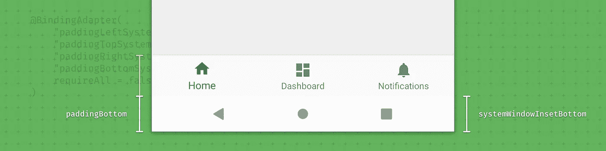
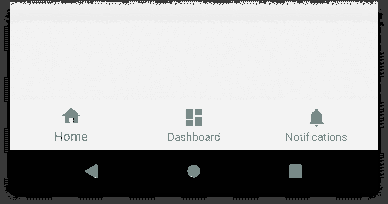
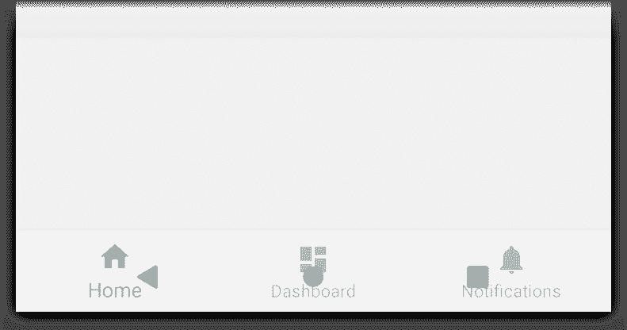
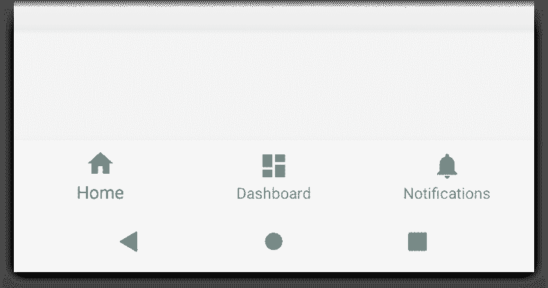
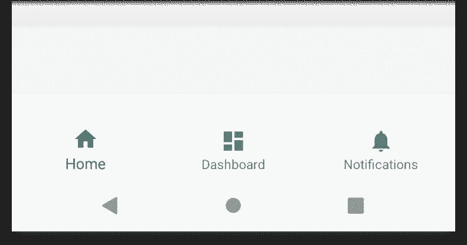
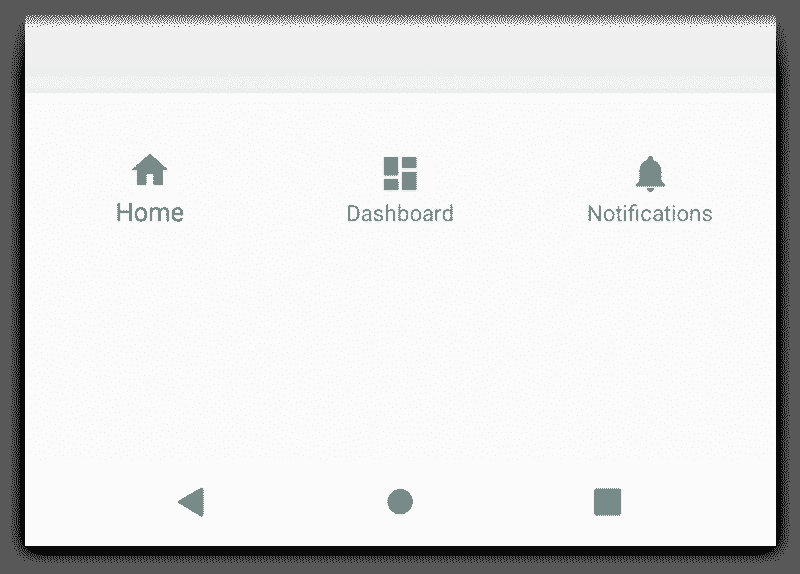
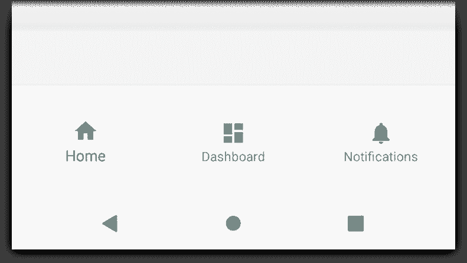

# WindowInsets —布局的监听器

> 原文：<https://medium.com/androiddevelopers/windowinsets-listeners-to-layouts-8f9ccc8fa4d1?source=collection_archive---------1----------------------->



## 将我们处理插入的地方移到我们的视图所在的地方，布局文件

如果你看过我的[成为窗户装配工大师](https://chris.banes.dev/talks/2017/becoming-a-master-window-fitter-lon/)的演讲，你就会知道处理窗户嵌入物可能是复杂的。最近，我一直在改进一些应用程序的系统栏操作，使它们能够在状态栏和导航栏后面绘图。我想出了一些让处理 insets 更容易的方法。

# 在导航栏后面绘图

在这篇文章的剩余部分，我们将通过一个简单的例子使用一个`[BottomNavigationView](https://developer.android.com/reference/com/google/android/material/bottomnavigation/BottomNavigationView)`，它被安排在屏幕的底部。它的实现非常简单，如下所示:

```
<BottomNavigationView
    android:layout_height="wrap_content"
    android:layout_width="match_parent" />
```



默认情况下，您的活动内容将在系统提供的 UI(导航条等)中进行布局，因此我们的视图与导航条齐平。我们的设计师已经决定，他们希望应用程序开始在导航栏后面绘图。为此，我们将使用适当的标志调用`[setSystemUiVisibility()](https://developer.android.com/reference/android/view/View.html#setSystemUiVisibility(int))`:

```
rootView.systemUiVisibility = View.SYSTEM_UI_FLAG_LAYOUT_STABLE or
        View.SYSTEM_UI_FLAG_LAYOUT_HIDE_NAVIGATION
```

最后，我们将更新我们的主题，以便我们有一个半透明的导航栏，带有黑色图标:

```
<style name="AppTheme" parent="Theme.MaterialComponents.Light">
    *<!-- Set the navigation bar to 50% translucent white -->*
    <item name="android:navigationBarColor">#80FFFFFF</item>
    *<!-- Since the nav bar is white, we will use dark icons -->*
    <item name="android:windowLightNavigationBar">true</item>
</style>
```



The view is being displayed behind the navigation bar

如你所见，这只是我们需要做的事情的开始。既然活动现在是在导航栏后面布局，我们的`BottomNavigationView`也是。这意味着用户实际上不能点击任何导航项目。为了解决这个问题，我们需要处理系统调度的任何 [WindowInsets](https://developer.android.com/reference/android/view/WindowInsets) ，并使用这些值对视图应用适当的填充。

# 通过填充处理插图

处理 [WindowInsets](https://developer.android.com/reference/android/view/WindowInsets) 的一个常用方法是给视图添加填充，这样它们的内容就不会显示在系统视图的后面。为此，我们可以在 applywindowsetslistener 上设置一个[来向视图添加必要的底部填充，确保其内容不会被遮挡。](https://developer.android.com/reference/android/view/View.OnApplyWindowInsetsListener)

```
bottomNav.setOnApplyWindowInsetsListener { view, insets ->
    view.updatePadding(bottom = insets.systemWindowInsetBottom)
    insets
}
```



The view now has bottom padding which matches the navigation bar size

好极了，我们现在已经正确处理了底部系统窗口插入。但是后来设计师决定在布局中也添加一些填充:

```
<BottomNavigationView
    android:layout_height="wrap_content"
    android:layout_width="match_parent"
    **android:paddingVertical="24dp"** />
```

*注意:我不建议在 BottomNavigationView 上使用 24dp 的垂直填充，我在这里使用一个大值只是为了让效果更明显。*



The view has the correct top padding, but the intended bottom padding isn’t there

嗯，那不对。你能看出问题吗？我们从`OnApplyWindowInsetsListener`对`[updatePadding()](https://developer.android.com/reference/kotlin/androidx/core/view/package-summary#updatepadding)`的调用现在将从布局中清除预期的底部填充。

啊哈！让我们把当前的填充和插入加在一起:

```
bottomNav.setOnApplyWindowInsetsListener { view, insets ->
  view.updatePadding(
    bottom = view.paddingBottom + insets.systemWindowInsetsBottom
  )
  insets
}
```

我们现在有了一个新问题。在一个视图的生命周期中，WindowInsets 可以在*任何*时间被调度，也可以在*多次被调度。这意味着我们的新逻辑第一次会工作得很好，但是对于每个调度，我们将添加越来越多的底部填充。不是我们想要的。🤦*



The accumulated padding after 3 WindowInset dispatches

我想到的解决方案是在膨胀后记录视图的填充值，然后引用这些值。示例:

```
*// Keep a record of the intended bottom padding of the view*
**val** bottomNavBottomPadding = bottomNav.paddingBottom

bottomNav.setOnApplyWindowInsetsListener { view, insets ->
  *// We've got some insets, set the bottom padding to be the*
  /*/ original value + the inset value*
  view.updatePadding(
    bottom = bottomNavBottomPadding + insets.systemWindowInsetBottom
  )
  insets
}
```



Finally, what we intended

这非常有效，这意味着我们保持了布局中填充的意图，并且我们仍然根据需要插入视图。虽然为每个填充值保留对象级属性非常麻烦，但我们可以做得更好…🤔

# doOnApplyWindowInsets

输入我新的`doOnApplyWindowInsets()`扩展方法。这是一个围绕`[setOnApplyWindowInsetsListener()](https://developer.android.com/reference/android/view/View.html#setOnApplyWindowInsetsListener(android.view.View.OnApplyWindowInsetsListener))`的包装器，它概括了上面的模式:

当我们需要一个视图来处理插入时，我们现在可以做以下事情:

```
bottomNav.doOnApplyWindowInsets { view, insets, padding ->
    // padding contains the original padding values after inflation
    view.updatePadding(
        bottom = padding.bottom + insets.systemWindowInsetBottom
    )
}
```

好多了！😏

# requestApplyInsetsWhenAttached()

你可能已经注意到了上面的`requestApplyInsetsWhenAttached()`。这并不是绝对必要的，但确实解决了 WindowInsets 调度方式的限制。如果一个视图调用了`[requestApplyInsets()](https://developer.android.com/reference/android/view/View.html#requestApplyInsets())`，而它并没有被附加到视图层次结构中，那么这个调用将被丢弃并被忽略。

这是在`[Fragment.onCreateView()](https://developer.android.com/reference/androidx/fragment/app/Fragment.html#onCreateView(android.view.LayoutInflater,%20android.view.ViewGroup,%20android.os.Bundle))`中创建视图时的常见场景。解决方法是确保简单地调用`[onStart()](https://developer.android.com/reference/androidx/fragment/app/Fragment.html#onStart())`中的方法，或者使用一个监听器请求附加的 insets。以下扩展函数处理这两种情况:

# 用活页夹把它包起来

至此，我们已经大大简化了如何处理窗口插入。我们实际上在一些即将到来的应用中使用了这个功能，包括一个即将到来的会议😉。尽管如此，它仍然有一些缺点:

*   逻辑远离我们的布局，这意味着它很容易被遗忘。
*   我们可能需要在很多地方使用它，导致大量几乎相同的副本遍布整个应用程序。

我知道我们可以做得更好。

到目前为止，整篇文章只关注代码，以及通过设置监听器来处理 insets。我们在这里讨论的是视图，所以在理想的情况下，我们应该声明在布局文件中处理插入的意图。

输入[数据绑定适配器](https://developer.android.com/topic/libraries/data-binding/binding-adapters)！如果您以前从未使用过它们，它们让我们将代码映射到布局属性(当您使用数据绑定时)。你可以在这里了解更多信息:

[](/androiddevelopers/android-data-binding-custom-setters-55a25a7aea47) [## Android 数据绑定:自定义设置器

### 让数据绑定做你想做的

medium.com](/androiddevelopers/android-data-binding-custom-setters-55a25a7aea47) 

因此，让我们创建一个属性来完成这项工作:

在我们的布局中，我们可以简单地使用新的`paddingBottomSystemWindowInsets`属性，它会自动更新任何插入的内容。

```
<BottomNavigationView
    android:layout_height="wrap_content"
    android:layout_width="match_parent"
    android:paddingVertical="24dp"
    **app:paddingBottomSystemWindowInsets="@{ true }"** />
```

希望你能看到与单独使用`OnApplyWindowListener`相比，这是多么符合人体工程学和易于使用。🌠

但是等等，绑定适配器被硬编码为只设置底部维度。如果我们还需要处理顶部的插入怎么办？还是左边？还是对的？幸运的是，绑定适配器让我们很好地将所有维度的模式一般化:

这里我们声明了一个具有多个属性的适配器，每个属性都映射到相关的方法参数。需要注意的一点是`requireAll = false`的用法，这意味着适配器可以处理被设置属性的任何组合。这意味着我们可以执行以下操作，例如，设置左侧和底部:

```
<BottomNavigationView
    android:layout_height="wrap_content"
    android:layout_width="match_parent"
    android:paddingVertical="24dp"
    **app:paddingBottomSystemWindowInsets="@{ true }"
    app:paddingLeftSystemWindowInsets="@{ true }"** />
```

易用性级别:💯

## android:fitSystemWindows

你可能读过这篇文章，并且想“*为什么他没有提到 fitSystemWindows 属性？*”。其原因是因为属性带来的功能性并不是*通常是*我们想要的。

如果你正在使用 [AppBarLayout](https://developer.android.com/reference/com/google/android/material/appbar/AppBarLayout.html) 、 [CoordinatorLayout](https://developer.android.com/reference/androidx/coordinatorlayout/widget/CoordinatorLayout.html) 、 [DrawerLayout](https://developer.android.com/reference/androidx/drawerlayout/widget/DrawerLayout.html) 和好友，那么可以使用它。构建这些视图是为了识别属性，并以与这些视图相关的自以为是的方式应用窗口插入。

`android:fitSystemWindows`的默认视图实现意味着使用 insets 来填充每个维度，但对于上面的例子是不可行的。如需了解更多信息，请参见这篇仍然很有意义的博文:

[](/androiddevelopers/why-would-i-want-to-fitssystemwindows-4e26d9ce1eec) [## 我为什么要安装系统窗口？

medium.com](/androiddevelopers/why-would-i-want-to-fitssystemwindows-4e26d9ce1eec) 

# 人机工程学 FTW

唷，这是一篇很长的帖子！除了我们让`WindowInsets`更容易处理之外，希望它展示了扩展函数、lambdas 和绑定适配器等特性如何让任何 API 更容易使用。