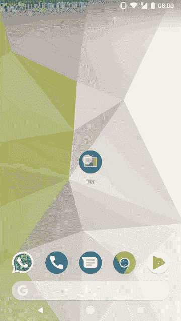

# 窗口插入+片段过渡

> 原文：<https://medium.com/androiddevelopers/windows-insets-fragment-transitions-9024b239a436?source=collection_archive---------2----------------------->

## 悲惨的故事


[Cat Window](https://flic.kr/p/92WJtS)

这篇文章是我写的关于片段转换的系列文章的第二篇。下面是第一个，它设置了如何让片段过渡工作。

[](/google-developers/fragment-transitions-ea2726c3f36f) [## 片段转换

### 让他们工作

medium.com](/google-developers/fragment-transitions-ea2726c3f36f) 

> 在我继续之前，我假设你知道什么是窗口插入，以及它们是如何被分派的。如果你不知道，我建议你看看这个演讲(是的，是我写的🙋)

[](https://chris.banes.me/talks/2017/becoming-a-master-window-fitter-lon/) [## 成为窗户装配工大师🔧

### 窗口插入长期以来一直是开发人员困惑的来源，这是因为它们确实非常令人困惑…

克里斯.贝恩斯.我](https://chris.banes.me/talks/2017/becoming-a-master-window-fitter-lon/) 

我要坦白一件事。当我写这个系列的第一篇博文时，我在视频上做了一点手脚。我实际上遇到了一个窗口插入的问题，这意味着我实际上结束了如下:



Transition breaks status bar handling

Woops，不完全是我在第一个帖子里展示的🤐。我不想把第一篇文章写得太复杂，所以决定把它单独写出来。无论如何，你可以看到，当添加转换时，我们突然失去了所有的状态栏处理，视图被推到了状态栏的后面。

## 问题是

这两个片段都大量使用窗口小图来绘制系统栏的后面。片段 A 使用一个 [CoordinatorLayout](https://developer.android.com/reference/android/support/design/widget/CoordinatorLayout.html) 和 [AppBarLayout](https://developer.android.com/reference/android/support/design/widget/AppBarLayout.html) ，而片段 B 使用自定义窗口嵌入处理(通过 applywindowsetslistener 上的[)。不管实现如何，这种转换都会把两者都搞乱。](https://developer.android.com/reference/android/support/v4/view/OnApplyWindowInsetsListener.html)

那么，为什么会出现这种情况呢？当您使用片段转换时，退出(片段 A)和进入(片段 B)内容视图的实际情况如下:

1.  过渡已完成。
2.  因为我们在片段 A 上使用了退出过渡，所以视图 A 保持不变，并且过渡在其上运行。
3.  视图 B 被添加到容器视图中，并立即设置为不可见。
4.  开始片段 B 的进入和“共享元素进入”转换。
5.  视图 B 被设置为可见。
6.  当片段 A 的退出转换完成时，视图 A 从容器视图中移除。

这听起来不错，但是为什么它会突然影响窗口插入的处理呢？这都是因为在转换过程中，两个片段的视图都出现在容器中。

这听起来很好，对吗？在我的场景中，两个片段的视图都想要处理和使用窗口插入，因为它们都希望看到屏幕上唯一的“主”视图。但是只有一个视图会收到窗口插入:第一个子视图。这是由于 ViewGroup [分派窗口插入](https://android.googlesource.com/platform/frameworks/base/+/refs/heads/master/core/java/android/view/ViewGroup.java#6928)的方式，即通过依次迭代其子元素，直到其中一个元素消耗了这些插入。如果第一个孩子(这里的片段 A)消耗了 insets，那么任何后续的孩子(这里的片段 B)都得不到它们，我们就结束了这种情况。

让我们再来一遍，但是这一次增加了调度窗口插入的时间:

1.  交易已完成。
2.  由于我们使用的是退出转换，视图 A 保持不变，转换在其上运行。
3.  视图 B 被添加到容器视图中，并立即设置为不可见。
4.  **窗口小图被调度。我们希望视图 B(子视图 1)获得它们，但是视图 A(子视图 0)再次获得它们。**
5.  开始片段 B 的进入和“共享元素进入”转换。
6.  视图 B 被设置为可见。
7.  当片段 A 的退出转换完成时，视图 A 被移除。

## 修复

修复实际上相对简单:我们只需要确保两个视图
都接收到窗口插入。

我这样做的方法是在容器视图中添加一个[on applywindowsetslistener](https://developer.android.com/reference/android/support/v4/view/OnApplyWindowInsetsListener.html)(在本例中是在主机活动中),它手动将任何 insets 分派给它的所有子节点，而不仅仅是在一个节点使用 insets 之前。

```
fragment_container.setOnApplyWindowInsetsListener { view, insets ->
  var consumed = false

  (view as ViewGroup).forEach { child ->
    *// Dispatch the insets to the child*
    val childResult = child.dispatchApplyWindowInsets(insets)
    *// If the child consumed the insets, record it*
    if (childResult.isConsumed) {
      consumed = true
    }
  }

  *// If any of the children consumed the insets, return
  // an appropriate value*
  if (consumed) insets.consumeSystemWindowInsets() else insets
}
```

在我们应用之后，两个片段都收到了窗口插入，我们得到了我在第一篇文章中实际显示的结果:


## 奖金部分💃:确保请求

我差点忘了写一件相关的小事。如果你在片段中处理窗口插入，隐式地(通过使用 AppBarLayout 等)或显式地，你需要确保你请求一些插入。使用 [requestApplyInsets()](https://developer.android.com/reference/android/support/v4/view/ViewCompat.html#requestApplyInsets(android.view.View)) 很容易做到这一点:

```
override funonViewCreated(view: View, icicle: Bundle) {
  super.onViewCreated(view, savedInstanceState)
  *// yadda, yadda* **ViewCompat.requestApplyInsets(view)**
}
```

你必须这样做，因为只有当整个视图层次结构**的聚合系统 ui 可见性值发生变化**时，窗口才会自动向下发送 insets。由于可能有两个片段提供完全相同的值的时候，聚集值不会改变，所以系统将忽略“改变”。