# 适用于初学者的 Windows Powershell 命令

> 原文：<https://medium.com/quick-code/windows-powershell-commands-for-beginners-d7ba86c8625e?source=collection_archive---------3----------------------->

## **议程**

*   Powershell 简介
*   PowerShell 的需求
*   Powershell 的背景
*   为什么它比替代品更好？
*   最常见的管理 Powershell 命令
*   使用管道
*   选择、排序、测量、导出、导入、转换、过滤、在管道中传递数据。
*   使用 PS 提供程序和 PSDrives
*   格式化输出
*   WMI(Windows Management Instrumentation)简介
*   循环(For/ For-each/While)
*   接受用户输入
*   显示输出
*   这个 Shell 是基于命令行的，也可以包含在 GUI 中。
*   由微软开发
*   基于。Net 框架
*   它包括脚本。
*   能够与其他基于 Windows 的软件交互，例如
*   Citrix，SQL，AD，任何像 Slack 这样的开放 API 等等。

## **需要什么？**

*   微软将 PowerShell 描述为“一个基于任务的命令行外壳和脚本语言…建立在。NET 框架。PowerShell 有什么了不起的？你为什么要用它？
*   PowerShell 既是命令行 Shell，也是脚本语言
*   PowerShell 可以与令人眼花缭乱的技术进行交互。
*   。NET 框架，注册表，COM，WMI，ADSI。Exchange、Sharepoint、系统中心、Hyper-V、SQL。、思科 UCS、Citrix XenApp 和 XenDesktop。REST APIs，XML，CSV，JSON，网站，Excel 等办公应用。、dll 和其他二进制文件，包括*nix 工具。
*   PowerShell 是基于对象的。这给了我们难以置信的灵活性。在对象通过管道时对其进行过滤、排序、测量、分组、比较或采取其他操作。使用属性和方法，而不是原始文本。
*   微软全力支持 PowerShell。PowerShell 不会消失。这是[微软通用工程](https://www.microsoft.com/cec/en/us/cec-overview.aspx)标准中的要求，没有 PowerShell 接口的服务器产品不能发货。
*   在许多情况下，微软只是在 Powershell 的帮助下构建它的 GUI。在这里，我们可以执行比我们在 GUI 上想的更多的功能。
*   PowerShell 还提供了一个主机，通过它 PowerShell 运行时可以嵌入到其他应用程序中。

## **背景**

*   每个发布的微软 DOS 版本都有外壳，所以在 Windows9x 之前，它依赖于 Command.com，后来在 NT 家族中它变成了 cmd.exe
*   1998 年，微软推出了 Cscript.exe，允许兼容的脚本语言，如 Jscript 和 VBScript。
*   到 2002 年，微软已经开始开发一种新的命令行管理方法，包括一个名为 Monad 的 shell(也称为微软 Shell 或 MSH)
*   PowerShell 版本 1 于 2006 年 9 月 26 日发布，但正式发布是在 2006 年 11 月 14 日。
*   PowerShell v2.0 已于 2009 年 8 月完成并发布，作为 Windows 7 和 Windows Server 2008 R2 的一个组成部分
*   2016 年 8 月 18 日，微软宣布他们已经将 PowerShell 开源并跨平台，支持 Windows、 [OS](https://en.wikipedia.org/wiki/OS_X) X、 [CentOS](https://en.wikipedia.org/wiki/CentOS) 和 [Ubuntu。](https://en.wikipedia.org/wiki/Ubuntu_(operating_system))
*   开源的举动创造了 PowerShell 的第二个化身“PowerShell Core ”,它运行在[上。NET](https://en.wikipedia.org/wiki/.NET_Core) 核心。它与“Windows PowerShell”截然不同，后者运行在完整的[上。NET](https://en.wikipedia.org/wiki/.NET_Framework) 框架。从 5.1 版本开始，PowerShell Core 与 [Windows Server 2016 Nano](https://en.wikipedia.org/wiki/Windows_Server_2016) 服务器捆绑。

## **内置工具**

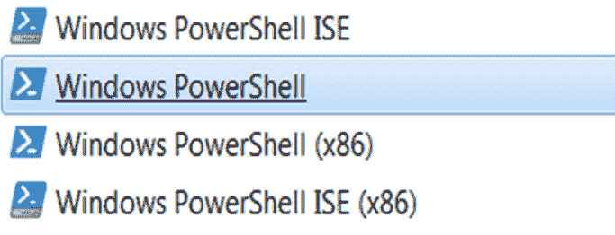

*Powershell 优于其传统替代产品，如 VBScripting、Bash

*一致的语法、一致的命令结构

*经得起未来考验。网络整合

*通过帮助和文档提供支持(Get-Help)

**反正容易找出来，只需要一点线索。(Get-Command " * Service * "**

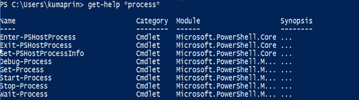

1.  像浏览文件系统一样浏览 Windows 注册表:
2.  递归搜索文件中的特定字符串:dir -r |选择字符串“搜索此”
3.  找出使用最多内存的五个进程:ps | sort -p ws | select -last 5
4.  像 DHCP 一样循环服务(停止，然后重新启动):重新启动-服务 DHCP
5.  列出文件夹中的所有项目:Get-child item-Force
6.  对一系列目录或文件夹进行递归:Get-child item-Force c:\ directory-Recurse
7.  删除目录中的所有文件，而不提示每个文件:Remove-Item C:\ tobe deleted-Recurse
8.  重新启动当前计算机:(Get-wmio object-Class Win32 _ operating system-computer name。). Win32Shutdown(2)

*   获取有关计算机品牌和型号的信息:Get-wmio object-Class Win32 _ ComputerSystem
*   获取当前计算机的 BIOS 信息:Get-wmio object-Class Win32 _ BIOS-computer name。
*   列出已安装的修补程序 QFEs 或 Windows Update 文件:Get-wmio object-Class Win32 _ quick fix engineering-computer name。获取当前登录到计算机的用户的用户名:
*   get-wmio object-Class Win32 _ ComputerSystem-Property UserName-computer name。
*   仅查找当前电脑上已安装的应用程序的名称:
*   get-wmio object-Class Win32 _ Product-computer name。|格式-宽-列 1
*   获取分配给当前计算机的 IP 地址:Get-wmio object-Class Win32 _ NetworkAdapterConfiguration-Filter IPEnabled = TRUE-computer name。|格式-表格-属性 IPAddress
*   获取当前计算机的更详细的 IP 配置报告:Get-wmio object-Class Win32 _ NetworkAdapterConfiguration-Filter IPEnabled = TRUE-computer name。|选择-对象-属性[a-z]*-排除属性 IPX*，WINS*
*   在当前计算机上查找启用了 DHCP 的网卡:Get-wmio object-Class Win32 _ NetworkAdapterConfiguration-Filter " DHCP enabled = true "-computer name。
*   在当前计算机的所有网络适配器上启用 DHCP:
*   get-wmio object-Class Win32 _ NetworkAdapterConfiguration-Filter IPEnabled = true-computer name。| ForEach-Object -Process {$_。EnableDHCP()}

**软件管理**

*   在远程计算机上安装 MSI 软件包:(Get-wmio Object-computer name target machine-List | Where-Object-filter script { $ _。Name -eq "Win32_Product"})。安装(\ \ MACHINEWHEREMSIRESIDES \ path \ package . MSI)
*   使用基于 MSI 的应用程序升级包升级已安装的应用程序:
*   (Get-wmio object-Class Win32 _ Product-computer name。-Filter " Name = ' Name _ of _ app _ to _ be _ upgraded ' "。升级(\ \ machine where msiresides \ path \ upgrade _ package . MSI)
*   从当前计算机中删除 MSI 包:(Get-wmio object-Class Win32 _ Product-Filter " Name = ' Product _ to _ remove ')-computer Name。).卸载()

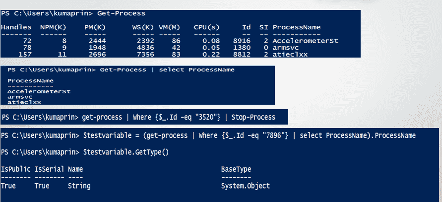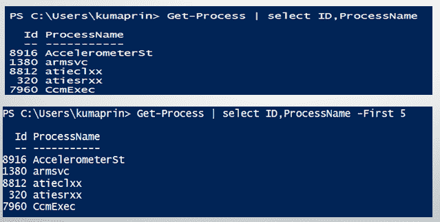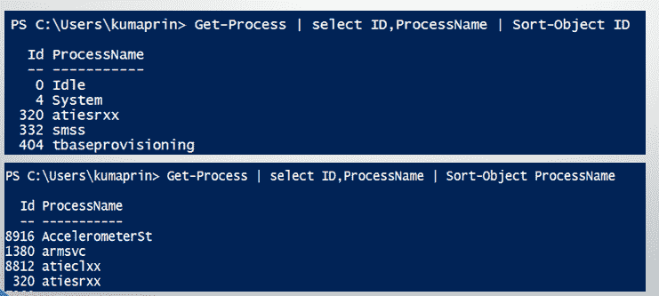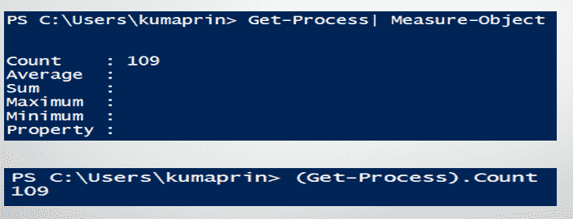

$var = Read-Host -AsSecureString

**过滤**

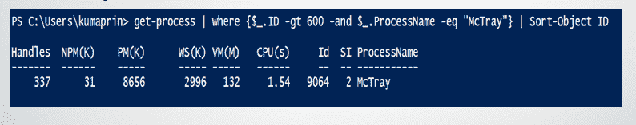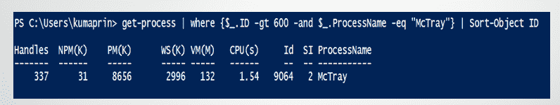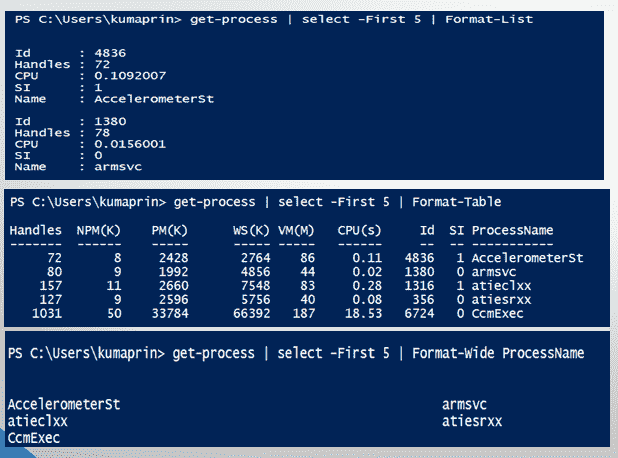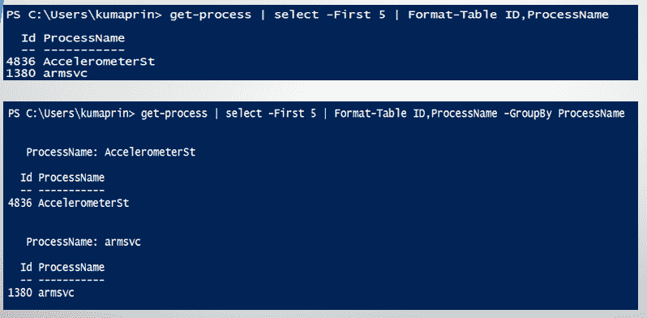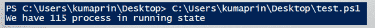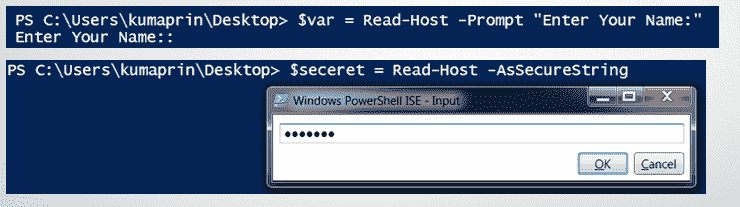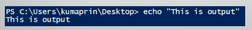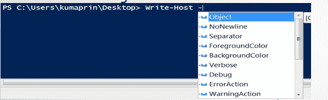

foreach(＄1 中的元素..9){

write-Host-NoNewLine“$ { element }”

开始-睡眠-秒 1

写入主机""

**写输出**

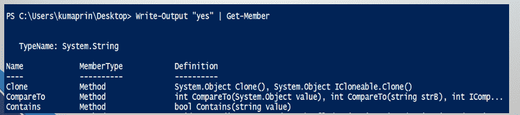

**循环**

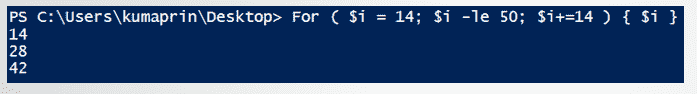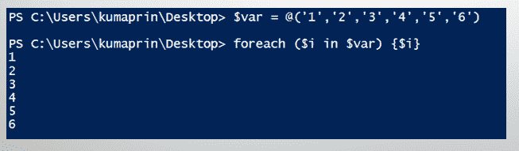

**While/ Do-While 循环**

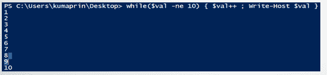

$val++写主机$val

} while(＄val-ne 10)

**导入**

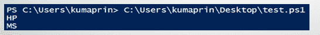

*原载于*[*https://www.mytectra.com*](https://www.mytectra.com/blog/windows-powershell-commands-for-beginners/)*。*