# Android 开发者挑战赛的获胜者——有益的创新

> 原文：<https://medium.com/google-developer-experts/winners-of-android-developer-challenge-helpful-innovation-babbecb66f56?source=collection_archive---------5----------------------->

## 以创新方式使用机器学习赢得全球挑战的 10 款应用

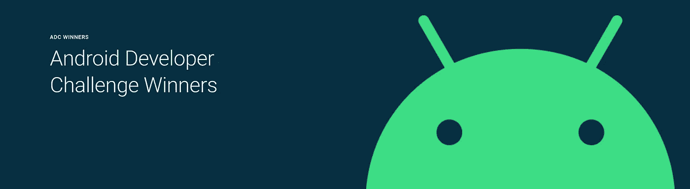

大约上午 9:30，我接到 DHL 快递公司——卡拉奇的电话。当我取包裹时，代表问我是否在等一个来自英国伦敦的包裹。我当即答应了。他说他们需要我给巴基斯坦海关中心写一封信要求澄清，一旦他们得到许可，就会送到我家。

我为此超级兴奋，急切地等待着。这是谷歌提供给一些 Android 谷歌开发者专家的一个包，作为礼物，用来审查 Android 开发者挑战赛的获奖应用。我自愿参加，并打算写一篇关于它的文章。你此刻正在读那篇文章。

去年 2019 年，当世界上一切正常，没有这个令人沮丧的新冠肺炎·疫情时，[谷歌邀请安卓开发者使用安卓 10 的离线机器学习功能来开发创新应用](https://android-developers.googleblog.com/2019/10/android-developer-challenge.html)。这被称为 Android 开发者挑战。

从所有提交的应用程序中，选出了 10 个获奖应用程序。谷歌与开发人员合作，进一步完善和改进应用程序。最后，是时候把他们作为全球赢家展示给世界了。

# 来自伦敦的神秘盒子

在我家门口接到那个电话大约 3 天后，我收到了那个盒子。里面装满了好吃的东西，一本杂志，获胜者送的礼物等等。

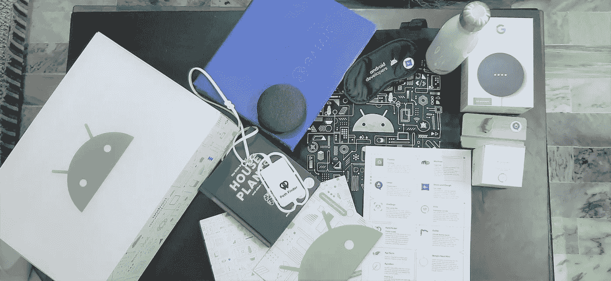

The goodies from the mystery box of London

现在，我将逐一描述获奖的应用程序，以及他们送的礼物，以及他们的应用程序是如何真正独特和创新的。

# 巴基斯坦农业农场

老实说，我不知道这件事。我也没想到。当我开始阅读杂志和获奖者时，我惊讶地发现，一个由来自巴基斯坦一个非常偏远地区的 4 名学生团队开发的应用程序已经进入了全球挑战的获奖名单。这是一个由[米尔维斯·汗](https://medium.com/u/4df9649a0fe?source=post_page-----babbecb66f56--------------------------------)和他的团队开发的非常棒的应用程序。

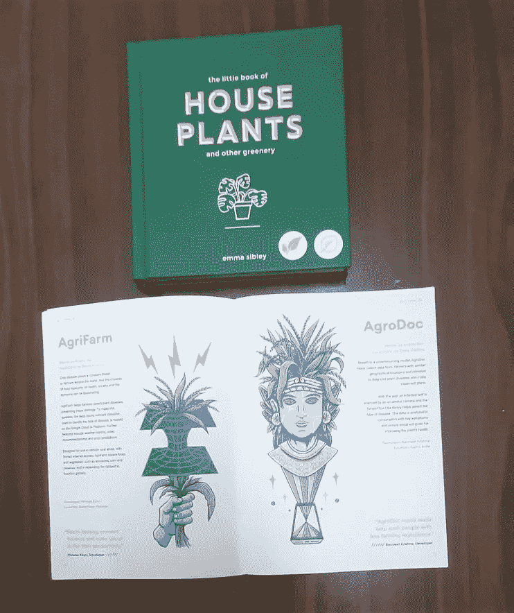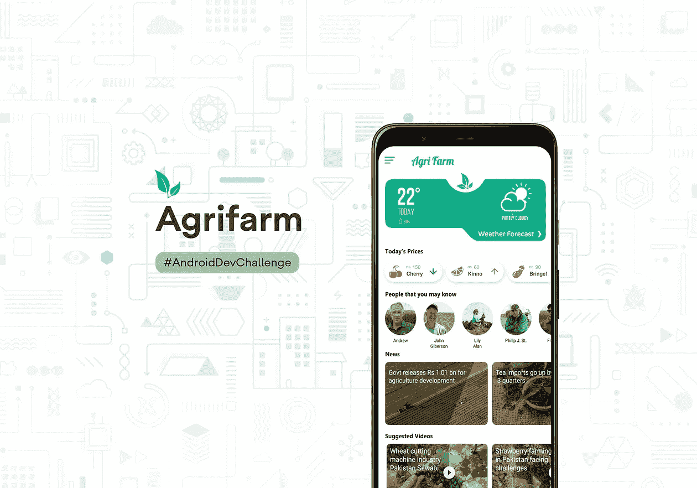

AgriFarm and book about planting — [Image Credits](https://blog.google/products/android/developer-challenge-winners)

首先，AgriFarm 应用程序通过拍摄作物照片来帮助农民对作物疾病进行分类，而农民没有任何技术知识。这个应用程序使用图像处理和机器学习来识别常见的作物疾病。该应用程序中的一些好功能是作物医生，推荐视频，以帮助用户了解作物疾病，市场价格工具等。

 [## Google Play 上的农业应用

### AgriFarm 帮助农民检测作物疾病，提供个性化新闻和推荐视频。有了 AgriFarm，不要错过…

play.google.com](https://play.google.com/store/apps/details?id=com.fyp.agrifarm) 

# AgroDoc —印度

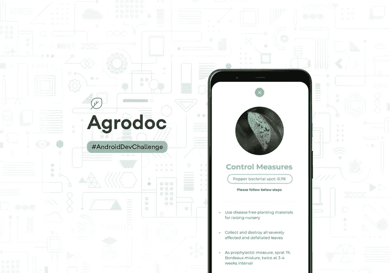

[Image Credits](https://blog.google/products/android/developer-challenge-winners)

这是一个类似于农场的想法。它还提供了一种逐步解决作物病害的方法。这是 Navneent Krishna 和他的团队开发的。

 [## agro doc-Google Play 上的应用程序

### AgroDoc 帮助农民通过扫描植物叶片来识别作物/植物疾病

play.google.com](https://play.google.com/store/apps/details?id=com.navneet.theagrodocapp) 

# es kke—刚果民主共和国

该应用仅面向刚果民主共和国的用户，致力于简化移动货币交易及其历史。该应用程序与该地区的 M-Paisa、Orange Money 等其他服务兼容，借助离线机器学习能力，彻底改革了资金管理。

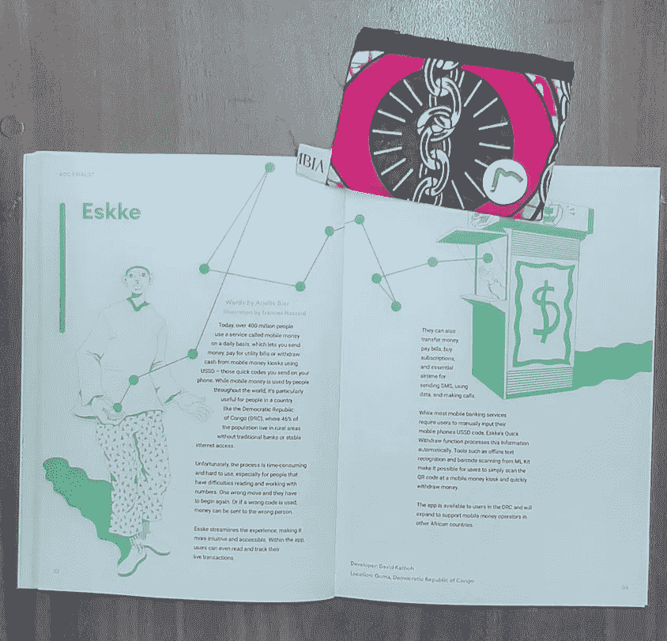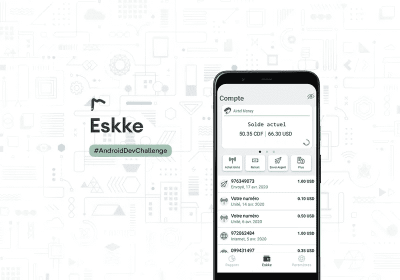

Eskke and its money bag — [Image Credits](https://blog.google/products/android/developer-challenge-winners)

这是由大卫·蒙贝雷·卡索和妮可·姆巴布·穆辛比完成的严肃作品。

 [## Eskke -移动货币交易 Google Play 上的应用程序

### ESKKE 是一个简单快捷的应用程序，可以进行支付并跟踪您所有移动资金的历史记录…

play.google.com](https://play.google.com/store/apps/details?id=com.geekslab.david.mobilesms) 

# 探路者—美利坚合众国

一个旧的想法和一个新的执行方式，Path Finder 应用程序通过识别和计算物体在其路径上移动的轨迹，帮助视力障碍者在复杂的情况下导航，如商场或拥挤的街道等。正如开发者科林·谢尔顿和他的团队所说:

> “我们希望利用机器学习来实现公共利益。”

这确实是一个奇妙的想法，它可以通过技术给社会带来严重的影响。

 [## 路径查找器 Google Play 上的应用程序

### 当在公共环境中旅行时，如购物中心或拥挤的街道，移动的障碍物不断移动…

play.google.com](https://play.google.com/store/apps/details?id=com.br.ml.brpathfinder) 

而且不仅仅是他们的 app，我个人也很喜欢他们的卡座礼物。这对我来说很方便。感谢 Path Finder 的朋友们！

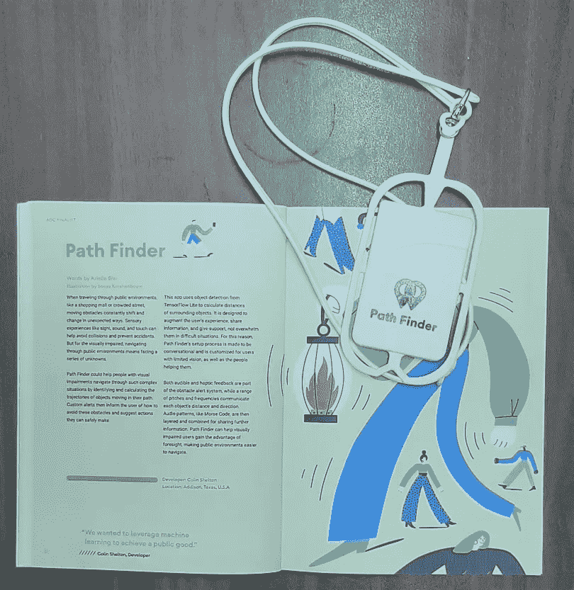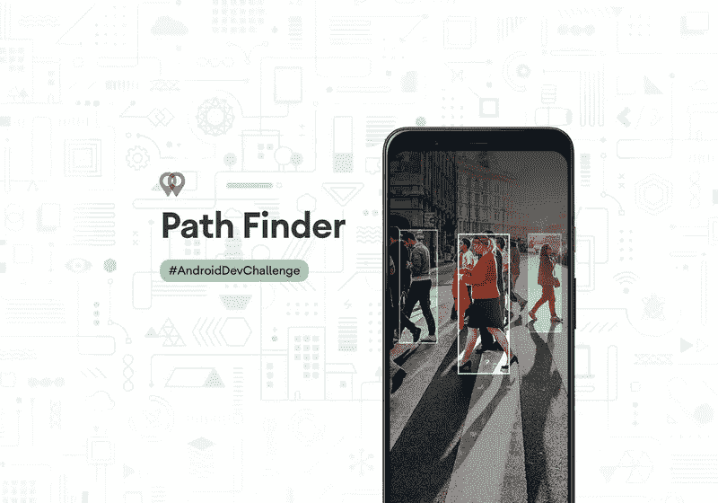

PathFinder and its card holder — [Image Credits](https://blog.google/products/android/developer-challenge-winners)

# 打鼾和咳嗽——美国

这个应用程序很有趣。该应用程序专注于健身，通过记录声音，帮助用户识别他们睡觉时的打鼾和咳嗽模式。功能如此简单，但如此强大的概念，我很喜欢这个应用程序，并一直在使用它。我很想对开发商*伊森·范表示感谢。*

 [## 打鼾和咳嗽:在 Google Play 上检测和记录打鼾和咳嗽的应用程序

### 打鼾和咳嗽应用程序记录你睡觉时发出的鼾声和咳嗽声，然后你可以听它们…

play.google.com](https://play.google.com/store/apps/details?id=co.vimo.snore) 

打鼾&咳嗽想出了一个漂亮的眼罩礼物。

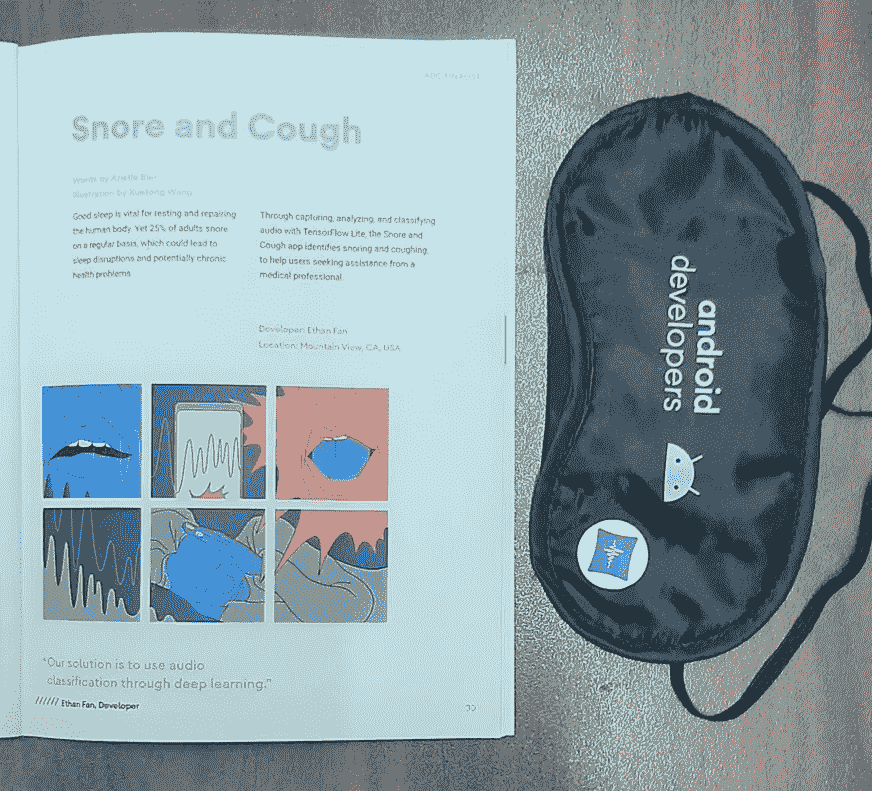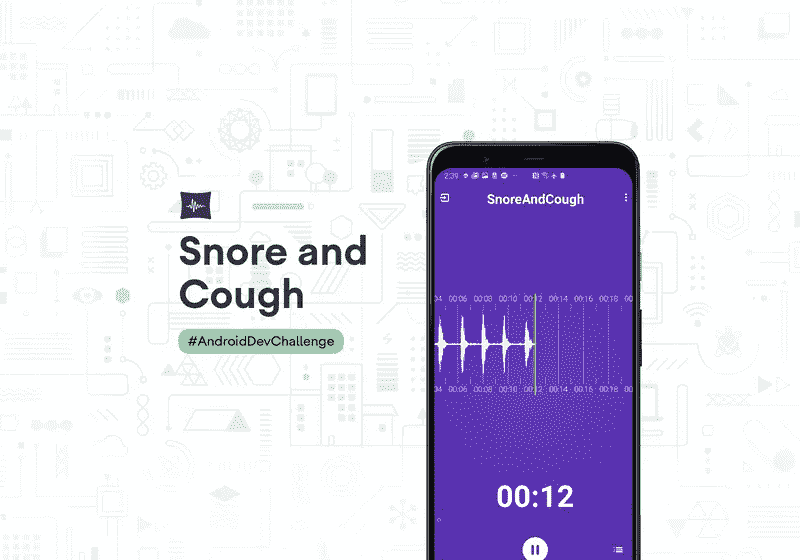

Snore & Cough and eye mask — [Image Credits](https://blog.google/products/android/developer-challenge-winners)

# 斯蒂拉—德国

Stila 与 Fitbit 腕带或谷歌 Wear OS 上运行的设备等可穿戴设备配对，以监控、跟踪和帮助管理身体的压力水平。这是银鼎翼开发的。

 [## stila-Google Play 上的应用程序

### 在我们的日常生活中，暴露在极端压力下是一个常见的问题，尤其是在学生和专业人士中…

play.google.com](https://play.google.com/store/apps/details?id=lmu.pms.stila) 

这具有分析心率模式以降低压力水平的功能，这对所有人来说都是一个严重的问题。也许这就是他们美丽的冥想有机蜡烛有用的地方。

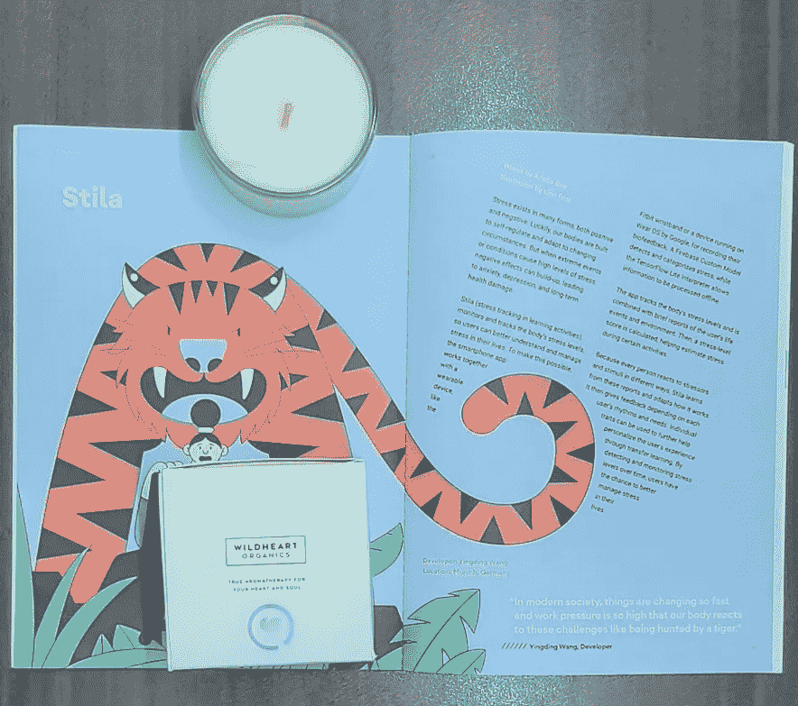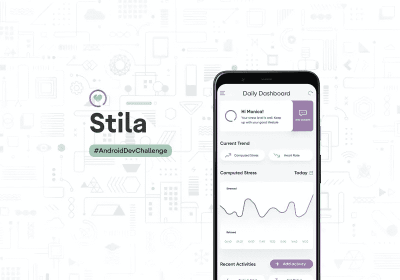

Stila and their meditation candle — [Image Credits](https://blog.google/products/android/developer-challenge-winners)

# Leepi —印度

另一个是来自印度的图像处理，它通过分析和检测图像中的姿势来帮助人们学习美国手语。由 Prince Patel 及其团队开发的这款应用非常好用。我对这个应用程序有非常流畅的用户体验。

 [## Leepi -学习美国手语 Google Play 上的应用程序

### Leepi 希望让每个人都可以免费学习手语！学习是在…的帮助下进行的

play.google.com](https://play.google.com/store/apps/details?id=com.mangoai.leepi) 

可能和他们的 app 用途无关，他们拿出了一个很有用的礼物送给我。手机支架。耶！！！

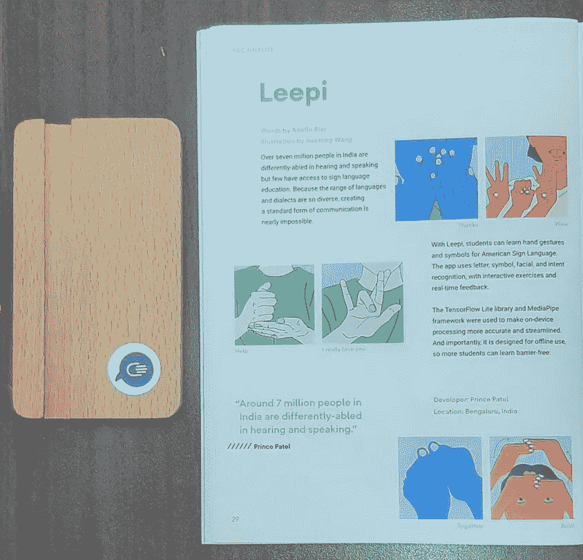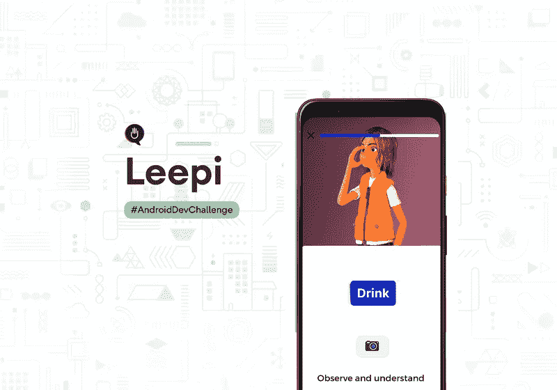

Leepi and their phone holder — [Image Credits](https://blog.google/products/android/developer-challenge-winners)

# mix pose——美利坚合众国

名字很酷，这是冥想空间的另一个应用。这一次，这实际上是将瑜伽老师和健身专业人士与用户联系起来。由 Peter Ma 开发，这是一个直播应用程序，让瑜伽老师和健身专业人士有机会教学，跟踪对齐，确保你处于正确的姿势，并给出实时反馈。

 [## 直播在线瑜伽课程| mix pose-Google Play 上的应用程序

### 参加每日免费在线瑜伽课程，与朋友一起参加在线瑜伽课程，并获得实时…

play.google.com](https://play.google.com/store/apps/details?id=com.mixpose.shiva.android) 

你对瑜伽训练应用开发者有什么期望？显然是瑜伽垫。:)

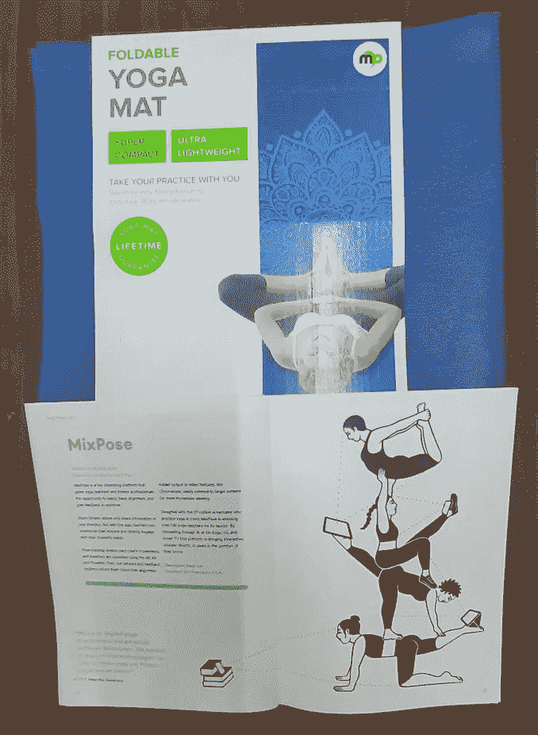

MixPose and the Yoga Mat — [Image Credits](https://blog.google/products/android/developer-challenge-winners)

# 垃圾——美利坚合众国

这是我最喜欢的一张。该应用程序帮助用户了解哪些物品可以回收，在哪里可以回收，以及如何通过惊人的“如何”指南来回收。这个应用程序解决了我们社会中一个严重的问题，即不断增加的垃圾，并让人们意识到回收利用和让社会更加绿色。

 [## 垃圾回收使 Google Play 上的应用变得简单

### Trashly 让回收变得简单，让你可以将其融入日常生活。我们都想帮助改善…

play.google.com](https://play.google.com/store/apps/details?id=com.epam.mobilelabs.trashly) 

由 Elvin Rakhmankulov 开发，他们提供了一个漂亮的手提袋。

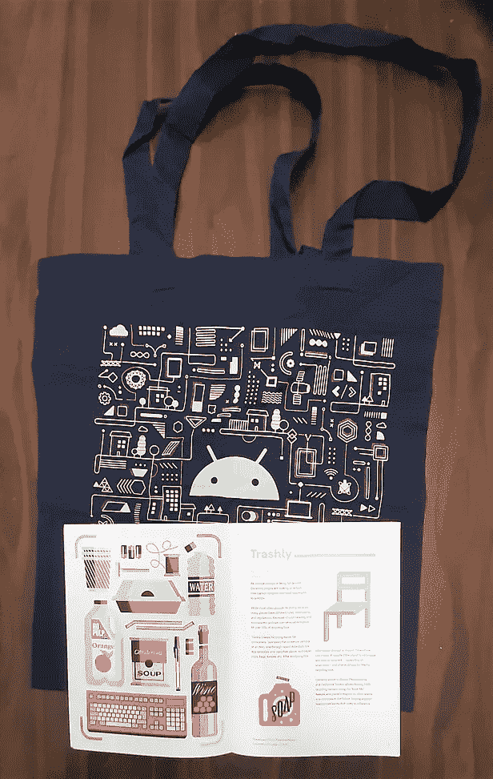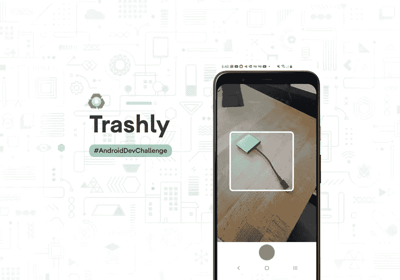

Trashly and tote bag — [Image Credits](https://blog.google/products/android/developer-challenge-winners)

# uno dogs——印度

最后，这个应用程序使用机器学习的力量专注于动物。由 Chinmany Mishra 创建，这有助于宠物主人更好地支持他们的宠物的健康，提供定制的信息和健身计划。

 [## 卡路里计数器和狗的健身应用程序-uno dogs-Google Play 上的应用程序

### UnoDogs 是一款针对狗狗的健身管理应用。它有助于跟踪你的狗的卡路里，运动和健康问题…

play.google.com](https://play.google.com/store/apps/details?id=com.unodogs) 

这个应用程序包括一个巨大的狗粮和零食数据库。使用该数据库，app 能够实现卡路里、锻炼、健康跟踪等功能。

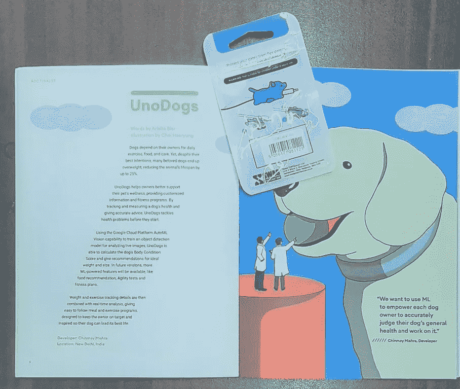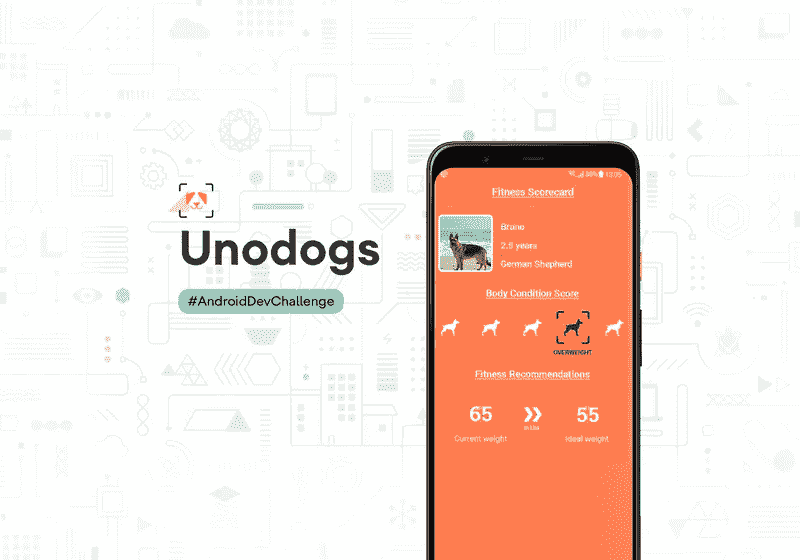

UnoDogs and Cable Protector — [Image Credits](https://blog.google/products/android/developer-challenge-winners)

# 包扎

回顾所有这些应用程序，看到技术和机器学习如何帮助社会和解决问题，这是一次非常愉快的经历。这是杂志中所有获奖应用的列表。

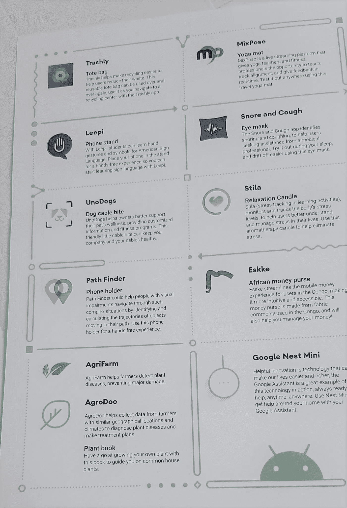

Magazine page about all the winning apps

我要感谢[谷歌的开发者](https://medium.com/u/991272e72e68?source=post_page-----babbecb66f56--------------------------------)给了我这份令人惊喜的礼物，并为我提供了审查这些应用的机会。

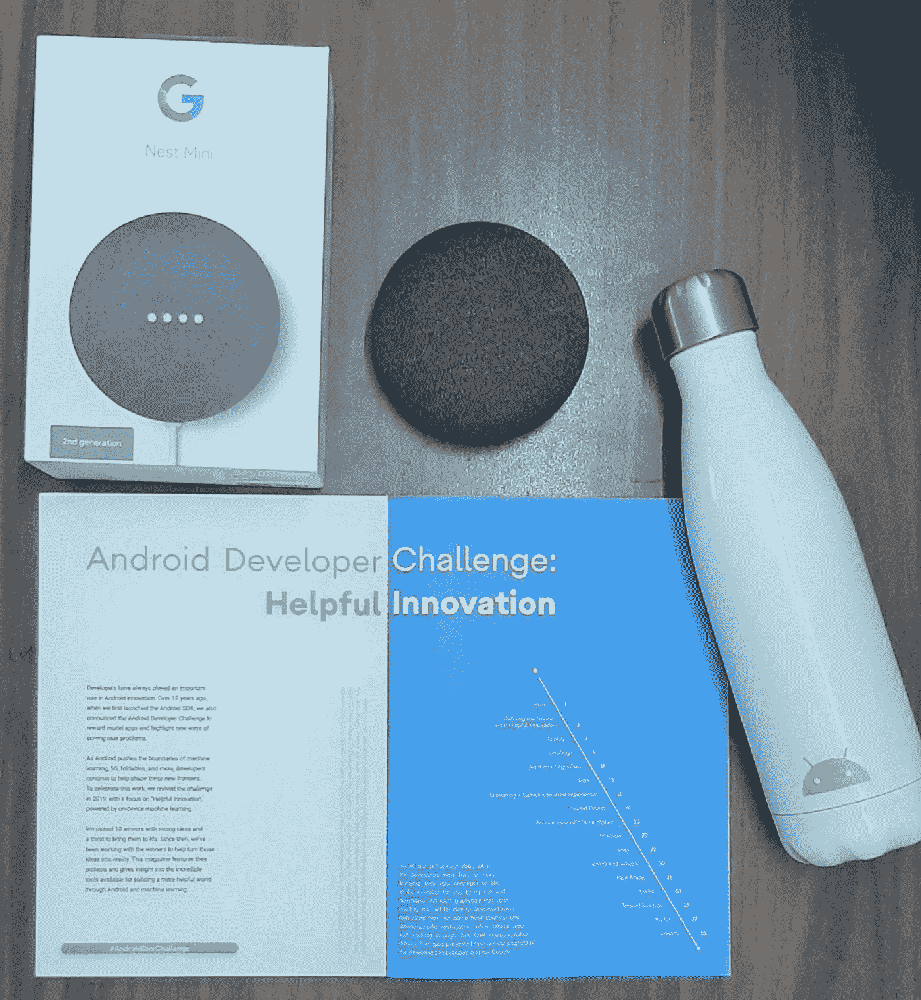

A bottle, Google Nest Mini and the magazine

你可以通过这个链接阅读这本[杂志的电子版。以下是这些获奖应用的官方公布视频。](https://developer.android.com/helpful-innovation#building-the-future-with-helpful-innovation)

**Wajahat Karim** 是巴基斯坦首位谷歌 Android 开发专家。作为一名经验丰富的 Android 开发人员，他非常关心这个问题，并一直在撰写和谈论这个问题。他已经写了两本关于 Android 开发的 300 多页的世界范围内的书，[在他的网站或他的媒体出版物上发表了 100 多篇文章。他也是开源领域的热情贡献者，并且](https://wajahatkarim.com)[已经创建了许多 Android 库](https://github.com/wajahatkarim3)，供全球数千名开发者在他们的应用中使用。作为一名活跃的公共演讲者，他花了很多时间在会议上发表演讲，并激励人们开发 Android。你可以在 Twitter [@WajahatKarim](https://twitter.com/WajahatKarim) 上找到最活跃的 Wajahat，他经常在那里分享所有关于 Android 和社区建设的好东西。