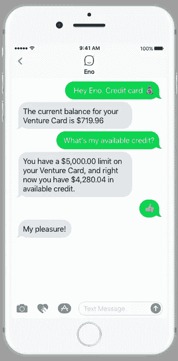

# 有了 Eno，银行就成了对话

> 原文：<https://medium.com/capital-one-tech/with-eno-banking-gets-conversational-8a5f5a84d563?source=collection_archive---------1----------------------->

短信。这是每个人一直在做的事情；以至于人们偶尔会在街上偶遇，或者因为连续发送太多表情符号而变成网球拇指。

短信无处不在——作为 Capital One 帮助我们的客户更轻松地管理他们的资金的持续努力的一部分，今天在 SXSW 我们推出了第一个来自美国银行的自然语言短信聊天机器人[Eno](http://www.CapitalOne.com/Eno)**的试点。**登录我们移动网站的精选客户将被邀请加入试点，我们将在未来几个月内向更多客户推广。

但是等等——我们怎么知道客户甚至想和他们的银行发短信呢？嗯，这很简单——他们已经这样做了。有趣的是，我们很久以前就推出了聊天机器人——只是我们不知道而已。你看，Capital One 有一个短信提醒，非常明确地要求客户回复两个特定单词中的一个:确认或拒绝。就这么简单，其他的我们也不太懂。然而，令人惊讶的是，大量顾客的回答中包含了除这两个词之外的内容。我们有问题、解释、表情符号——只要你说得出。Eno 1.0 是我们满足这一客户需求的第一步，即与我们进行关于金钱的文本对话。

Eno 使用自然语言处理器来理解客户通过文本交流的不同方式。例如，Eno 共享余额信息来回应两个*“我的水银卡余额是多少？”*和更缩写的*“水银 bal”*

还有，没有表情符号的短信是什么？顾客可以给 Eno 发送装钱的表情符号💰快速总结他们的账户或竖起大拇指的表情符号👍确认付款。

Eno 可以用自然语言回答关于客户的 Capital One 信用卡和银行账户的许多基本问题(见下面的示例)，当它不能回答时，它通常会在我们的移动网站上提供一个链接，指向解决客户问题的确切页面。Eno 是新的，还在学习中，但 Eno 会从每次聊天中学习，所以随着时间的推移，它会在对话中变得越来越好。

# **那么，Eno 是谁？**

我们对 Eno 的名称和潜在的视觉治疗方法进行了大量的思考。Eno 这个名字，也就是“one”反过来拼写，与品牌紧密相连。我们还喜欢，如果你在谷歌上搜索*“eno 定义”*，得到的回应是*“酷，太棒了”*。我们不想传达种族、性别、年龄等。通过角色的名字或视觉表现。这样，我们避免了人们可能存在的任何无意识偏见，Eno 可以保留客户在他们脑海中想象的任何东西。

在[www.capitalone.com/Eno](http://www.capitalone.com/Eno.)了解更多关于 Eno 的信息，并报名加入我们的飞行员等候名单。如果您是奥斯汀 SXSW 的 Capital One 客户，请到 Antone's 的 Capital One House，今天就加入 Eno 试点。Eno 期待和你聊天！

## **Eno 能回答什么问题？**

客户可以向 Eno 询问以下问题:

*   您的 Capital One 信用卡、支票账户和储蓄账户的账户余额
*   您的 Capital One 信用卡、支票账户和储蓄账户的近期交易
*   Capital One 信用卡账单到期日
*   您的 Capital One 信用卡的可用信用和信用额度
*   支付你的第一资本信用卡账单
*   您的帐户摘要
*   你的付款记录
*   你的银行路由号码(你知道，那是你每六个月需要一次的东西，你永远也想不起来……)

客户还可以从 Eno 中获得一些乐趣，并询问一些问题，如:

*   你是人类吗？
*   你在哪里？
*   给我讲个笑话，伊诺！
*   你长什么样？
*   你长什么样？
*   你是男孩还是女孩？
*   伊诺，你钱包里有什么？

因此，请到 www.capitalone.com/Eno[了解更多关于 Eno 的信息，并报名加入我们的飞行员等候名单。](http://www.capitalone.com/Eno.)

*欲了解更多关于 Capital One 的 API、开源、社区活动和开发人员文化的信息，请访问我们的一站式开发人员门户网站 DevExchange。*[*developer.capitalone.com/*](https://developer.capitalone.com/)