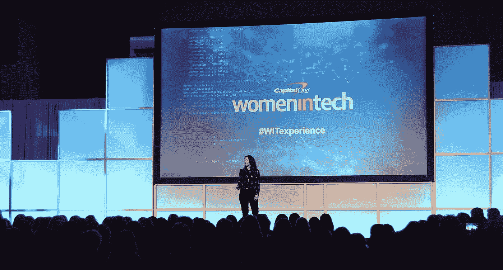
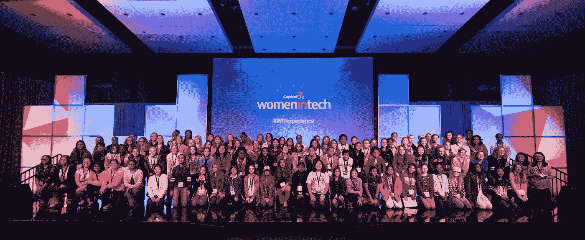

# 女性和科技的未来

> 原文：<https://medium.com/capital-one-tech/women-and-the-future-of-tech-c0a1d6fbdaa5?source=collection_archive---------9----------------------->

Debbie Sterling, Founder and CEO of GoldieBlox

*Jennifer Manry，企业技术 MVP，Capital One*

> “工程师解决实际问题，让世界变得更美好。”

T2 goldie blox T3 的创始人兼首席执行官黛比·斯特林(Debbie Sterling)在本周的 WIT Experience 上与近 1500 名参与者分享了这一鼓励，该活动由 Capital One 与弗吉尼亚州技术部长凯伦·杰克逊合作发起。观众包括职业女性技术人员和盟友，他们参加了技能培养会议、学习如何在社区举办黑客马拉松的研讨会，并有机会与同行交流。

在这一天里，科技行业的女性学习新技能，探索她们在科技行业的未来。在 [Kaylyn Gibilterra 在格蕾丝·赫柏庆典](/capitalonetech/good-to-go-a-language-that-makes-it-easy-for-engineers-to-talk-to-each-other-17ad0f47f76c)上关于 Go 语言的演讲获得成功后，她将其扩展为针对刚接触这门语言的软件工程师的深度教程。Capital One 的技术学院教参与者如何建立自己的亚马逊 Alexa 技能，强调了机器学习的最新进展，并展示了 DevOps 如何推动更好的结果。

Coders Experience Attendees

出席的还有 100 多名中学女生，她们参加了名为[程序员体验](/capitalonetech/capital-one-coders-helps-students-shape-their-future-1ca36a6ec5ec)的为期一天的编码研讨会。每个站点的获胜团队都有机会参加 WIT 体验，继续他们的 STEM 学习。看着这些女孩与机器人互动，学习如何黑客，看看她们在科技领域的未来会是什么样子，这对每个人都是鼓舞人心的。

一位学生的母亲与我们分享说，在 Coders 体验之前，她的女儿认为她数学不好，在数学课上成绩一般。在与其他热爱 STEM 的女孩联系并向我们的志愿者学习后，她对数学表现出了新的兴趣，并开始在班上获得 A。它不仅鼓励学生追求数学，还向她的母亲展示了可以帮助女儿脱颖而出的工具和活动类型。

就像一种令人沮丧的力量可以改变一个人的生活轨迹一样，一次积极的经历可以是认为自己不够好和有信心成功之间的差异。

在 Coders Experience girls 的闭幕式上，我重复了我们的志愿者在整个活动中使用的电话回访练习。当志愿者问这些问题时，我们鼓励女孩们热情地回答:“胡说！”我们问:

> 有人告诉过你电脑不适合女孩吗？胡说八道！
> 
> 你觉得女生数学不好吗？胡说八道！
> 
> 你听说过女生不应该当工程师吗？胡说八道！

看到这些女孩对技术的热爱，看到她们的自信飙升，是我最喜欢的程序员，也是为什么我如此热衷于将女性技术专家提升为年轻女孩的榜样。当她们走进一个有 1000 多名科技界女性的房间时，她们脸上的表情是一个骄傲的时刻，她们面前是非常真实的榜样。

> 女孩们通过参加 WIT 体验的女性看到了她们自己和她们在科技领域的未来，

他们没有隐瞒他们的问题。“你写什么样的代码？”“你能告诉我更多关于网络安全的信息吗？”"我要多大才能在科技行业工作？"他们的精力是无限的，他们承诺将这种好奇心带回他们的朋友和学校，向其他女孩展示 STEM 有多么有趣。

你认为女孩和女人不是科技的未来吗？

废话。

这些是作者的观点。除非本帖中另有说明，否则 Capital One 不属于所提及的任何公司，也不被其认可。使用或展示的所有商标和其他知识产权都是其各自所有者的所有权。本文为 2017 首都一。