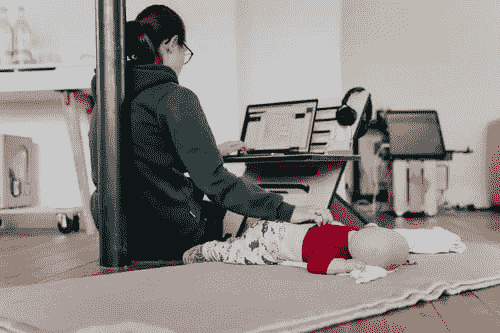

# 技术领域的女性:一条充满挑战但可实现的道路

> 原文：<https://medium.com/globant/women-in-technology-a-challenging-but-attainable-path-d2824d626ad8?source=collection_archive---------1----------------------->

一家重要跨国公司的高管在一次晚宴上说:“女性对公司来说非常昂贵，因为当她们是母亲时，你必须提供带薪休假。“*我确实喜欢和女性一起工作……*，”另一位与会者说，起初似乎是试图将这位高管从他厌恶女性的言论的后果中解救出来。但事实并非如此。他结束评论时说，“*……因为他们有最好的腿。*“坐在餐桌旁的仅有的两位女性中的一位反驳了两位男性的歧视性评论，她说:“*这就是我决定不要孩子的原因；因为我相信我注定要做更大的事情，而不仅仅是换尿布。”这群人中的另一个女人站了起来。她再也无法忍受这些评论，因为它们影响了她作为一名女性、一名专业人士和一名母亲的个人。*

这听起来像恐怖电影场景，不是吗？事实上，这是网飞系列电影中的一个场景。

这绝不是虚构的，这是许多妇女目前的现实，因为她们决定成为母亲，失去了晋升、管理职位、具有挑战性和高影响力的项目以及其他可以促进其职业发展的工作机会。这不仅是因为存在歧视妇女的组织，还因为在家里，我们被教导要遵守一种文化，在这种文化中，母亲负责家务、孩子和他们的课外活动等，这减少了妇女可以投入到工作中的时间。父亲和母亲在分配家务和家庭责任方面的不平等加剧了这种情况。

我记得我是在失业找工作的时候得到怀孕的消息的。我首先想到的是，没有公司会因为我怀孕而雇佣我。然而，我有幸没有成为那些因为选择成为母亲而不得不放弃事业的女性中的一员，我被一家公司接受了，8 年多后的今天，我为属于这家公司而感到无比自豪。此外，我设法在我的伴侣身上找到了一个我们能够平衡家庭和工作角色的队友。

今天，我们仍然看到一些女性不得不在家庭和职业生活之间做出选择，就好像这两个世界是不相容的一样，这就把做母亲变成了对她们职业机会的限制。

这是当今劳动力市场存在性别差距的众多原因之一。但如果我们看看接受高等教育的女性和男性之间的差异，这个问题会更早出现，如果我们谈论 STEM 职业，这个问题会变得更大。在哥伦比亚这样的发展中国家，根据 El Tiempo 的" [Una maratón en tacones](https://www.eltiempo.com/tecnosfera/novedades-tecnologia/mujeres-en-ciencia-tecnologia-ingenieria-y-matematicas-en-colombia-411384) "(“高跟鞋马拉松”)进行的一项分析，在 2001 年至 2018 年(即 17 年)期间，从 STEM 职业毕业的女性和男性之间的差距保持在 30%。今天，这个数字并没有太大的不同。

在这个历史时刻，我们有责任为缩小差距和建设一个对子孙后代越来越公平的世界做出贡献。**这不是一条容易的道路，但也不是不可能的。**对于目前已经是母亲的女性和劳动力市场上活跃的专业人士来说，这是一个挑战。**这不容易，从来都不容易，但也不是不可能。为了实现这一目标，我们需要社会不再将女性视为唯一对家庭和孩子负责的人，并教育那些将成为明天的父亲和母亲的人，那些将做出能够缩小差距的工作和工资决定的人。**

此外，教育和商业领域的私营和公共部门必须联合起来，制定举措来缩小差距，并在激励、培训和雇用越来越多的妇女方面产生影响和切实成果。

以下是旨在实现这一目标的一些举措的例子，我认为这些举措是相关的:

[**建立全球女性奖**](https://womenawards.globant.com/) 倡议，其主要目标是**通过揭示那些通过技术对社会产生影响的女性的故事来激励**，她们的生活故事值得了解和模仿。

去年是 Globant 颁发的第一个奖项，其结果超出了我们的预期:来自 15 个国家的 10，000 多名被提名者参加了这次冒险。就像这个项目一样，我们还有其他项目，这些项目是整个项目的一部分，旨在减少性别差距，并有明确的目标(到 2025 年，女性和非二元性别在领导岗位上的比例达到 50%)，以及寻求激励、培训和雇用女性的项目。该方案不仅针对 Globant 以外的社区:它还包括培训女性领导人和建立多样性和包容性文化的内部倡议。

由 Fundación Plan(与 Globant 和法国驻哥伦比亚大使馆合作)发起的鼓舞人心的[**# MujeresEnLaNube**](https://www.plan.org.co/proyectos/mujeresenlanube/)**项目**是一个以**培训**为重点的项目，旨在帮助全国具有社会挑战性地区的少女发展数字技能。这些青少年在设计和网页开发、4IR 技术以及数字和视频游戏动画方面获得了更深入的知识。

Laboratoria 的才艺竞赛是一项黑客马拉松式的活动，旨在通过为期 5 天的挑战展示 Laboratoria 女性毕业生的技能。一旦黑客马拉松结束，参与的公司就可以接触到这些人才，最终可以面试并雇佣他们感兴趣的人。Laboratoria 是一家非常注重培训的公司，但通过这样的活动，它寻求创造开放空间来促进学生的就业。

然而，这并没有就此结束。这只是一场人人有责的战斗的开始。根据英国广播公司 2018 年发布的世界经济论坛的分析，尽管在解决工资差距等性别问题上有所改善，但要完全消除全球性别差距还需要 **200** 年。这就是为什么我们为追求平等所做的一切努力永远不会是徒劳的，也永远是不够的。那篇文章发表已经两年了，所以我们还有 198 年的时间来改变历史。你在做什么来改变它？