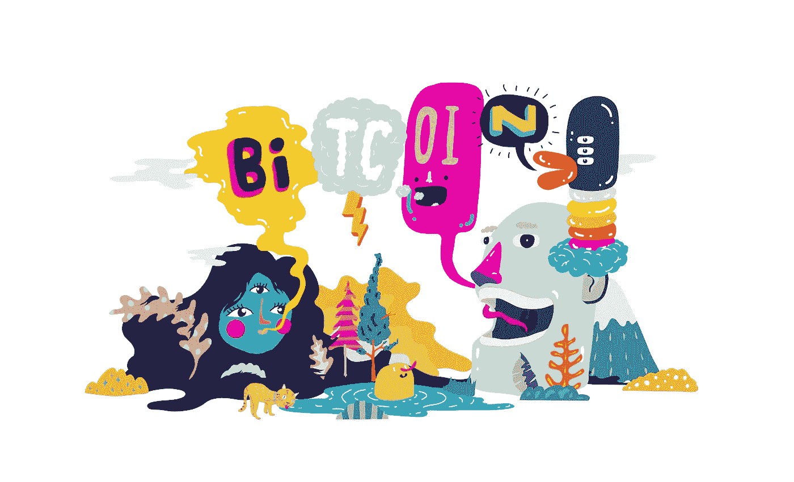

# 比特币的女人

> 原文：<https://medium.com/square-corner-blog/women-of-bitcoin-359d22df52d9?source=collection_archive---------2----------------------->

> 注意，我们已经行动了！如果您想继续了解 Square 的最新技术内容，请访问我们的新家[https://developer.squareup.com/blog](https://developer.squareup.com/blog)

*今天，我们很高兴开始我们的“BTC 女性”博客系列。在这一系列中，我们将听到 Square 现金应用团队成员讲述他们在为我们的客户扩大比特币使用范围方面所做的令人难以置信的工作。*

在我们的“BTC 女性”系列的第一期，我们将与两位有影响力的现金应用团队成员交谈:营销团队的**石梁**和工程团队的**丽贝卡·科希洛**。

梁来到 Square 才一年左右，就已经在体验式营销领域产生了巨大的影响。在来 Square 之前，梁正在组织设计和体验活动，包括在纽约和洛杉矶举办的甜点节。

Rebecca 在 Square 工作了两年，其中一半时间都在 Cash 团队，之前支持流量工程工作。作为一名软件工程师，丽贝卡现在从事各种工作，从设计比特币在 Cash 钱包和区块链之间的管理和移动，到管理客户余额和 Cash App 的内部账本。当有人购买比特币时，她的代码会让它发生。

**说说你在比特币上做过和正在做的工作。**

**LS:** [我们团队推出了一款图文并茂的在线讲解器，名为“我的第一枚比特币”。](https://cash.app/bitcoin)我们想让比特币变得容易接近，让广大受众容易理解。自推出以来，该网站收到了大量积极的反馈。

你最喜欢作品的哪一部分？

**LS:** 一直在做新的和不同的事情，比如设计现金应用程序服装——例如，金箔比特币运动衫。业务的不可预测性促使我学习和成长。

当我第一次加入 Cash 时，实际上没有专门的加密团队，所以我成为了这个项目的第一个全职工程师。我开发了很多功能，这是一次很好的学习经历。没有指南，有很多事情要做；例如，弄清楚可扩展性，比特币钱包管理，如何安全地存储我们的比特币，我们如何管理我们的风险。

一旦我们决定向整个 Cash App 客户群推出比特币买卖功能，那就是紧张的几周。在这一点上，我是最积极地处理代码的工程师，也是必须让所有工程师跟上速度并在我们现有的比特币代码库和需要完成的项目方面接受培训的人。我从来没有有效地管理过一群工程师，我非常感谢这段经历以及如此令人惊叹和热情的工程师团队。将所有这些代码架构展示给不同的工程师群体，特别是作为一名年轻女性，这是相当超现实的。SF 现金工程团队实际上都飞到了澳大利亚，亲自与我们的工程师团队一起工作。12 月，20 名工程师在一个房间里呆了几个星期，才把它运出去..那次冲刺以及我在协调过程中所扮演的角色，是我最喜欢的现金时光之一。

是什么让你对比特币/加密感兴趣？

**RC:** 我对它感兴趣很久了。我第一次了解这个话题是在麻省理工学院，但真正开始认真研究它是在 2013 年。我喜欢它是一种分散的、不受审查的货币形式。比特币提供全球解决方案，鼓励所有人获得更多金融服务的能力也非常强大。

**在金融系统的这个新领域工作，最令人兴奋的事情是什么？**

LS: 有一点很突出，那就是现在，连我妈妈都知道比特币是什么。她会打电话给我说价格下降，我会说，“你从哪里听来的？”

特别是，当(比特币)在去年 12 月达到顶峰时，我对它作为一个话题变得如此普遍和普遍感到敬畏；连我妈都在说想投资！

我认为 Cash App 正在做一些非常特别的事情，让比特币更容易理解和使用。现在你不必等几个星期才买，它是即时的，你可以很快卖掉它。它通过让任何人都可以使用比特币来实现比特币的民主化。

Square 具有独特的定位，因为我们既帮助任何人接受付款并进行销售，也帮助任何人使用现金应用程序进行付款。比特币实际上是一种无国界的全球货币，使用比特币意味着我们实际上有能力以一种巨大的方式推动全球变革，这令人振奋。我们在现金方面所做的工作有能力彻底改变全球经济，希望对那些目前被排除在外的人有益。

**你在更广泛的加密或技术领域看到的最有趣的事情是什么？**

老实说，匿名货币的发展总的来说非常有趣。我对数字隐私非常感兴趣，所以我喜欢关注匿名货币背后的技术。

我也喜欢看闪电网络的发展，这将有望允许更便宜和更快的比特币支付，并允许网络扩大规模。

**是什么让你对自己的工作充满激情？**

**RC:** 现金团队太厉害了。我喜欢成为其中的一部分。能够准确地选择我想做的工作，并成为加密工作流的一部分，这真的令人惊讶。当我加入时，我立即被赋予了很多责任和控制权；每个人都相信我能做到，这也让我对自己充满了信心。当你有能力在自己喜欢的领域发展自己的技能时，你很容易充满激情。

作为一名女工程师，Cash 是一个了不起的团队。我觉得自己受到了重视，并且和我的同事一样，对自己的工作充满信心。我们在继续雇佣女性工程师方面取得了重大进展。

你对其他有兴趣进入秘密空间的女性有什么建议？

LS: 拥有一个让你感到舒适的良好的人际网络和支持团体。例如，我是脸书一个女性秘密组织的成员，有时和其他女性谈论你正在努力解决的问题会让你感觉更放松。

**RC:** 具体在 crypto 方面，要有知识，有准备。激情和兴趣是最重要的——其他的会随之而来。(虽然我很少在 Square 处理这个问题，但在更大的世界里，加密空间并不是最吸引人的社区。作为一个女人，你有时需要比男人多知道两倍的东西才能被认真对待。)但是，不要气馁，让更多女性和代表性不足的群体感兴趣并参与进来非常重要，因为多样化的背景将产生发现新的、突破性的区块链应用程序所需的创造性想法。

你得到的最好的建议是什么？

**LS:** 好好玩！