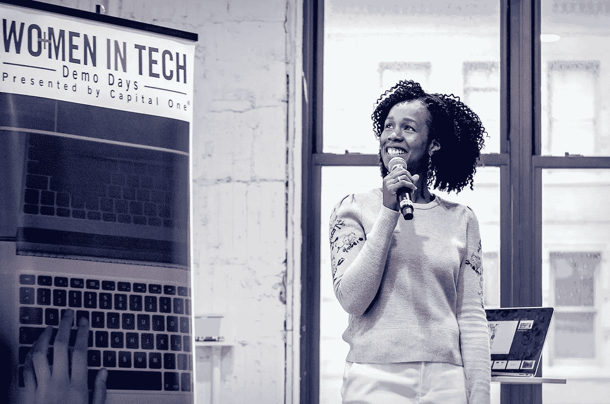
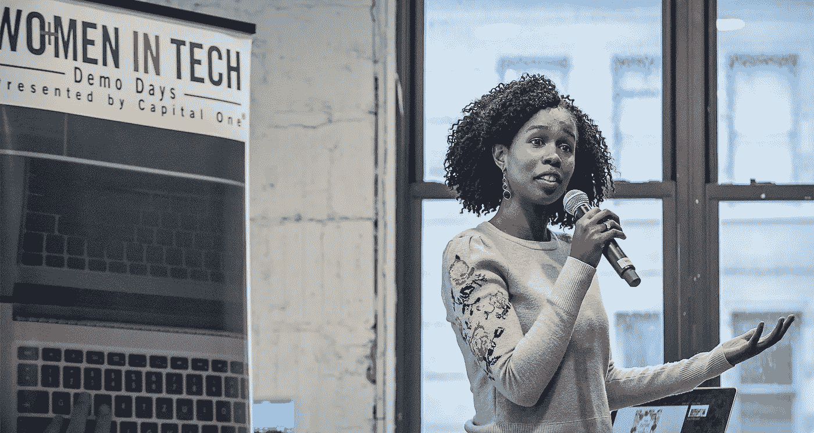

# 女性科技企业家需要成为“引人注目的人物”

> 原文：<https://medium.com/capital-one-tech/women-tech-entrepreneurs-need-to-become-visible-figures-b85781a5478e?source=collection_archive---------9----------------------->

*Capital One 产品管理高级总监 Asmau Ahmed*

毫不奇怪，至少可以说，我与风投的经历很有趣。

当我走进一个投资者的房间时，盯着我的面孔不仅看起来与我的不同，最初几分钟常常感觉像“猜猜谁要来吃饭。”理解我这个黑人女性所需要的时间和心理调整，从一开始就让我处于劣势。想象一下，当桌子对面的人与你没有真正的联系时，让自己做好心理准备，给出你人生中最好的演讲。

经过几十次这样的互动后，我决定一定有更好的方法。我的解决方案？我把简历放在前面。大学毕业 20 年后，我强调了我的成绩。(谁会这么做？)我把我的 LinkedIn 个人资料图片撤了。我没有使用性别代词。我去除了暴露我种族的从属关系。我没有一开始就提到我的观众主要是有色人种女性。

本质上，我拿走了我的一部分身份。而且成功了。简单地说。

有了这些变化，我的投资者会议立即增加了。但你知道什么没有吗？我的自信。即使我到了球场，反应还是一样，除了这一次，他们也很惊讶。通过他们的惊讶，他们几乎不能理解我的商业模式，可扩展性计划，受众群体，营销策略和领导力。

我意识到隐瞒身份只是推迟了拒绝。这当然不值得我的身份危机和所有伴随着“出卖”感觉而来的情感包袱(负罪感)因此，我重新发布了我的个人资料照片，添加了我的工作单位，并修改了我的执行摘要，以显示有色人种女性。

*我参加的会议少了吗？*

是的。

*这值得吗？*

绝对是。

通过毫无歉意地做真实的自己，我遇到了更少的投资者，但他们是正确的投资者。他们是真正对我的业务潜力感兴趣的风投。

我以前不随便讲这个故事。我曾经为此感到尴尬，害怕因为隐瞒了自己的身份而被评判。然后，我最近在纽约的女性技术展示日与一群开发人员、设计师和企业家分享了它——主要是女性和一些男性盟友。

那天下午，我知道我必须继续讲述这个故事，因为那里的男男女女告诉我的事情:每当我提到一次微小的侵犯时，他们就点头。关于我的决定和我会做什么不同的问题。最重要的是，我们行业多样性的未来。

我确实相信有希望。作为一名黑人女性，无法逃避当前严峻的现实。但是也有巨大的机会。作为一名女性，作为一名黑人女性，如果你关注正确的论坛、正确的伙伴关系，以及——我怎么强调都不为过——建立社区的重要性，那么这将是一笔财富。以下是我作为企业家和工程师的亲身经历:

**去 VC 还是不去 VC。**每个创始人都想拥有规模化的能力。黑人女性创始人甚至难以筹集足够的资金来测试她们的产品。对于黑人女性来说，风投资金的平均金额为 3.6 万美元。我想让你问一问你什么时候以及是否需要筹集资金。太多的初创公司将风险投资作为衡量成功的标准，并专注于筹集资金而不是业务。时机至关重要。在有意义的时候寻求资助，但不要让金钱遮蔽了你的视野。

**明智地选择。**作为一名女性创始人，像选择合伙人一样选择投资者至关重要。你必须问自己:这些人愿意与你同甘共苦吗——理解你可能比别人有更多的“想法”？他们了解你可能面临的挑战吗？他们在投资者群体中的声誉如何？你们有相同的价值观吗？你将如何处理分歧？一旦你自己获得了一定程度的成功，你也可以成为同样的投资者。

**董事会多元化是一项商业要务。**很多决策都是在董事会层面做出的。作为一个初创公司的创始人，一旦你筹集到资金，你将向董事会汇报，这带来了新的责任和问题。正如研究表明多元化团队推动创新并改善业务成果一样，多元化董事会也是如此。成为董事会的倡导者，在董事会中，我们作为黑人创始人所面临的独特挑战不是禁忌，而是可以自由而真诚地谈论的。

**用宽广大胆的网络抬高音量。我认为，每一位从事科技行业的女性都有责任帮助另一位女性成长，发现另一位正在做伟大事情的杰出企业家，或者拥有远见卓识技能的工程师，并帮助她获得茁壮成长所需的平台。如果不建立社区和扩大我们的声音，我们将一事无成。科技和风险投资界的现实是，任何背景的男性都比女性多。我们必须与生活中的男人合作，确保他们成为盟友。作为一名创始人，这意味着扩大你自己的关系网，让那些为你的成功投资的人加入进来。在大公司内部，这意味着发展和培养盟友环境。**

我是一个规模虽小但日益壮大的网络团体的一员，我们称之为可见人物。它从我们几个人开始，我们发展很快。在某种程度上，这是我们对未来的呼唤。

我 3 岁的女儿这一代人应该准备好进入职场，在很大程度上做出改变——不要担心别人在商业推介或社交媒体个人资料中看不到自己。

在 2017 年，我们没有理由不被关注。

作为一名企业家，阿斯毛·艾哈迈德是美国仅有的 12 名获得超过 100 万美元风险投资的黑人女性之一。2010 年，她创建了视觉搜索引擎 Plum Perfect，其中一个应用程序是一个移动应用程序，它可以分析购物者的自拍，以推荐她的妆容。作为 Capital One 数字产品管理团队的一员，她专注于设计改变人们与金钱互动方式的产品和体验。

*此片原载于 2017 年 8 月 30 日*[*【CNET】*](https://www.cnet.com/news/women-entrepreneurs-need-to-be-visible-figures-in-tech/)*嘉宾解说。*

*以上观点为作者个人观点。除非本帖中另有说明，否则 Capital One 不属于所提及的任何公司，也不被其认可。使用或展示的所有商标和其他知识产权都是其各自所有者的所有权。本文为 2017 首都一。*