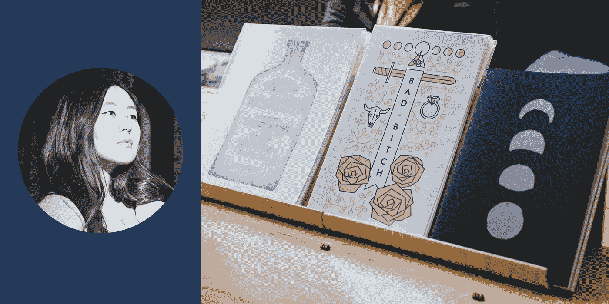

# 制造的女人

> 原文：<https://medium.com/square-corner-blog/women-who-make-376b94742dc5?source=collection_archive---------1----------------------->

> 注意，我们已经行动了！如果您想继续了解 Square 的最新技术内容，请访问我们的新家[https://developer.squareup.com/blog](https://developer.squareup.com/blog)

这个月是 Square 的 WomEng 聚焦月，所以我们把它作为庆祝公司内外女工程师的时间。我们在办公室组织了一个广场卖家活动，以女性工程师和设计师为特色……她们碰巧也是有自己小生意的制造商。以下是他们的故事。

# 艾米·维博沃，[泡泡杂志](https://shop.bubblesort.io/)

Amy 在技术领域有十年的职业生涯，包括人机交互研究、机器学习研究、FPGA 编程和 web 开发。最近，她在 Airbnb 的增长团队中担任了三年的网络开发人员，然后离开去创建自己的企业。她的任务重点是让计算变得更受欢迎和包容，这包括设计可爱的、以女性编程为主题的服装，以及撰写关于算法、加密和带有大量插图的数据结构的杂志。

# 苏珊·林，[明特洛迪卡工作室](http://susan.level.press)

苏珊，或 [@mintlodica](https://twitter.com/mintlodica) ，是一名艺术家。她的作品灵感来自于现实和超现实的交叉。她以【T10 天水彩画重新开始了她的艺术生涯，并在[水彩画](https://www.instagram.com/explore/tags/paintingsbymint/)、[像素艺术](https://www.instagram.com/explore/tags/pixelsbymint/)和 [3D 艺术](https://www.instagram.com/explore/tags/polygonsbymint/)中创作了新的作品。她已经在三藩市、波特兰和[美国宇航局戈达德游客中心展示了她的作品。作为一名设计师，她过着双重生活。她目前在](https://jwst.nasa.gov/jwstArt/)[HealthCare.gov](http://navapbc.com/)的下一代[纳瓦 PBC](http://healthcare.gov/) 公司工作。她将她在可用性、混合颜色和 HTML/Sass 方面的知识融入到设计经验中。她的设计理念是将每一个解决方案作为一个生命系统的一部分来对待，这个生命系统超越了当下的特征。她的创造性精神是没有任何创造性的追求是浪费时间——你所有的创造性追求都会聚集在一起。

# 黄灰

Ash 是一名在三藩市从事 Adobe XD——UX 设计工具——工作的设计师。除此之外，她还是一名熟练的艺术家、摄影师和作家；她被称为多才多艺的女人，这是一个恰当的描述。她的第一部小说 *The Firesteel* ，在第三届年度作家文摘自助出版电子书奖中获得文学小说第一名。她的第二本小说叫*悬*。她在自己的店里出售插图、印刷品、期刊、珠宝和她的小说。

# 林欣童，[可爱的土豆](https://www.cuddlypotatoes.com/)

Jessica 是 Pinterest 广告体验团队的一名软件工程师，她主要负责广告报告 API。白天，她致力于将广告商需要的功能添加到 API 中，晚上，她设计新的漫画，接受委托，研究新的业务，或者完成订单。她一直想拥有一个能让人微笑的可爱小商店，所以她在 2016 年 12 月开始了可爱土豆。从那时起，她一直致力于建立和扩大她自己的独特品牌的德贝可爱艺术，为所有的德贝土豆爱好者！

