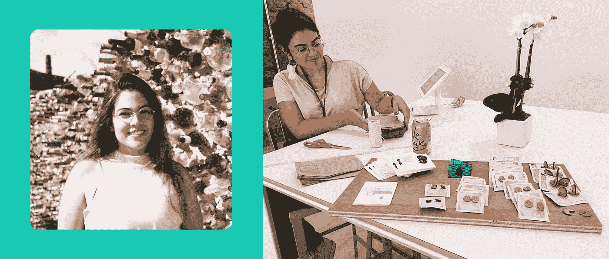
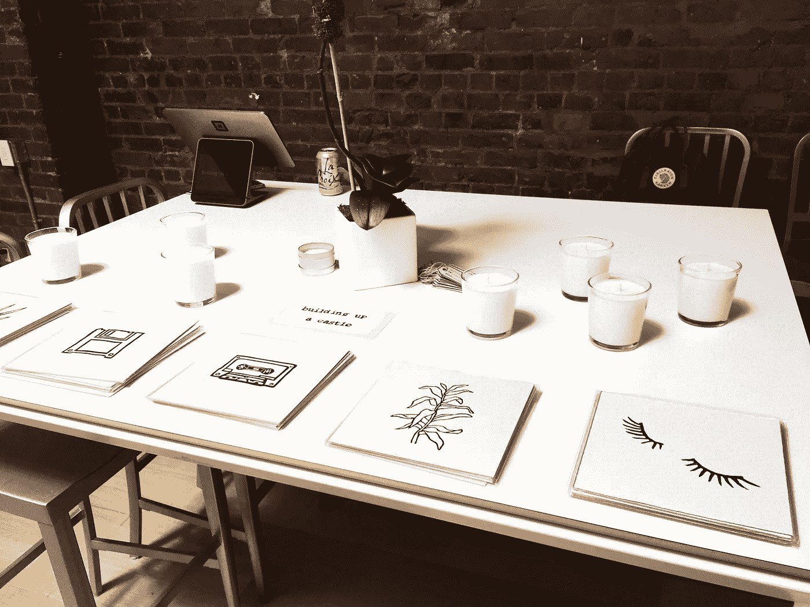

# 制造的女人(第二部分)

> 原文：<https://medium.com/square-corner-blog/women-who-make-part-2-f4a1b370a0d2?source=collection_archive---------6----------------------->

> 注意，我们已经行动了！如果您想继续了解 Square 的最新技术内容，请访问我们的新家[https://developer.squareup.com/blog](https://developer.squareup.com/blog)

在 Square，我们的每个社区团体都有一个聚焦月。广场的 WomEng 聚光灯月贯穿整个 7 月，庆祝广场内外的女工程师。我们在旧金山办公室组织了一个广场卖家，我们在制作的[女性的第一部分中提到过，展示了女性工程师和设计师，她们碰巧也有自己的事业。](/square-corner-blog/women-who-make-376b94742dc5)

Square 的纽约办公室通过组织自己的卖家弹出窗口，以当地女性科技创作者为特色，结束了 WomEng 聚光灯月。以下是他们的故事。

# [萨曼莎·戈尔茨坦 ](http://samanthagoldste.in/)

Samantha Goldstein 是 Etsy 的高级软件工程师。在工作中，她建立支持数百万其他制造商。在家里，她制作结合了她对电脑和工艺的热情的东西，将粘土和木材等有机材料与硬件、微控制器和小芯片混合在一起。

# [**艾米莉·格里芬**](https://www.daybrighten.com/)

艾米丽是一名自由插画家和艺术家，也是布鲁克林一名自豪的德州人。虽然她目前主要以数字格式工作，但她的作品受到传统水彩背景的启发，侧重于柔和的色彩、光线和“受控的不完美”感。她感兴趣的是画天空和风景，以及用轻松幽默的方式鼓励情感脆弱的漫画。她的作品曾被 Tumblr、Buzzfeed、Brooklyn Magazine 和 business 等媒体报道，她还经常与技术领域的个人合作，美化他们的演示文稿，并配上可爱的插图(例如莎拉·格罗夫——巴勒莫的[《v buffer 历险记》](https://www.youtube.com/watch?v=WhE2TUZXQQU))。

# [丽贝卡·梅迪纳·卢娜](https://www.etsy.com/shop/buildingupacastle)

Rebeca 是 Etsy 的高级软件工程师。她制作亚麻版画、蜡烛和针织品，并在她的 Etsy 商店出售。