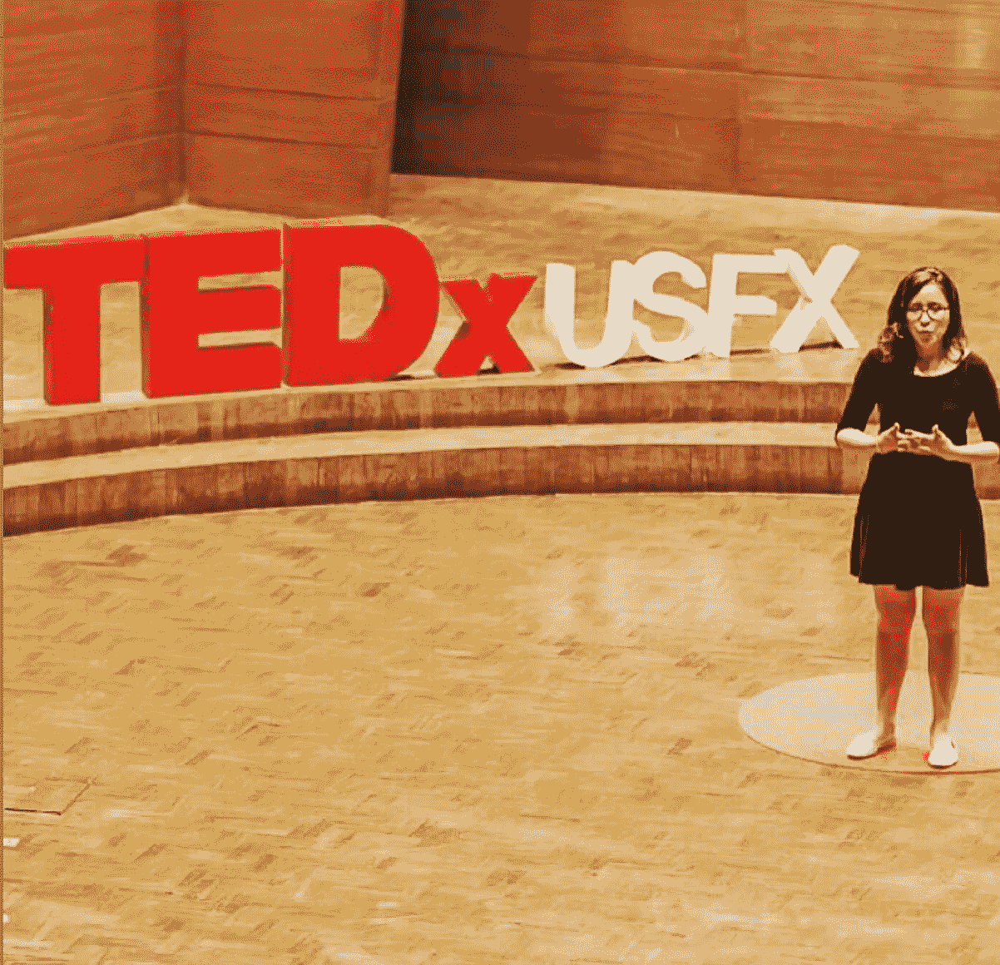

# #女性专家:分享我的历史

> 原文：<https://medium.com/google-developer-experts/womenareexperts-sharing-my-history-4ae0f91da425?source=collection_archive---------1----------------------->

2019 年，我成为了机器学习领域的谷歌开发者专家 GDE。在这里，我想分享我的旅程，加入我吧:)

[*谷歌开发者专家*](https://developers.google.com/community/experts) *是一个充满激情的开发者社区，他们喜欢与他人分享他们的知识。*

这个社区有 150 多名女性。***# WomenAreExperts****是一个以她们的故事和成就为特色的系列，旨在激励更多的女性追随她们的道路。*

# 决定学工程，出国留学&成为第一位玻利维亚女性 GDE

2007 in Washington, DC

我在玻利维亚的苏克雷出生和长大。在高中的时候，我对选择哪个专业有点困惑和焦虑，因为我真的什么都喜欢。在我高中的最后一年，我被挑选去美国参加一个为期两周的教育和文化项目:青年大使。🇧🇴 🇺🇸:在这个节目中，我了解了美国的文化和教育，也分享了我的玻利维亚传统。我们参观了大学和高中，我很惊讶能接触到很棒的化学和物理实验室。

当我回到玻利维亚时，我决定攻读工程学位。我非常热爱数学和物理，我知道这些将会成为日后成就伟业的工具。🤓

几年后，我以最高荣誉和全额奖学金从电信工程专业毕业。像每个人一样，我不确定下一步该做什么，我的专业有很多专业发展的选择。🤔但是好消息是，同年，我第一次发现了谷歌开发者小组和周末创业公司。

2013 年，我在玻利维亚最大的移动电信公司之一找到了我的第一份技术工作，担任电信软件工程师。这确实非常具有挑战性，而且很难看到我的开发者职业道路，但是技术社区给了我很大的帮助！

2015 年，经过多次尝试，我拿到了全额奖学金，被比利时计算机科学与工程硕士录取。我出国学习技术的梦想实现了！那是我第一次去欧洲！我真的很感谢有机会在那里学习，并与来自技术社区的人们一起玩，他们总是渴望分享他们学到的东西。

2018 年，我拿着硕士学位和许多项目搬回玻利维亚，为我的当地社区做贡献。找到一份人工智能相关的工作很有挑战性，但我开始在当地大学工作，作为一名工程学教授，和一些朋友一起做软件开发。同年，我开始和一些人见面，分享人工智能和科技领域的性别差距。我的一个好朋友也是一名软件工程师，我们开始在玻利维亚的不同城市举办研讨会，向年轻女性展示其他女性工程师和科学家。这个想法是… *提高对科技行业性别差距问题的认识，以及数字素养和数据驱动思维的重要性。*

那一年活动满满！比如第一次参加 [Latinity](/@leslysandra/girls-tech-colombia-latinity-2018-2cf8865a3d3e) 和[格蕾丝·赫柏会议](/@leslysandra/ghc19-my-fav-part-the-ai-side-efb643db80ff)，结识其他杰出的科技界女性，并在我还在研究数据时受到启发，这要感谢 [Udacity 数据挑战赛](/@leslysandra/by-now-i-have-completed-this-challenge-bertelsmann-udacity-data-science-scholarship-85890cf57a6)，后来我成为了 Udacity 学生的导师。

最近，我开始教授更多关于人工智能的课程，用西班牙语录制课程，并为拉丁美洲的大型科技平台创作内容。

所有这些活动、实践、研讨会和内容创作最终让我申请了 GDE 项目(顺便说一句，我真的受到了朋友们的鼓励！经过考试和面试，我成为了第一位来自玻利维亚的 GDE 女性。

去年，我在公共部门工作，领导不同的项目。这是一次有趣的旅程！从一开始，我就是新冠肺炎紧急事件委员会的一员。

# 支持科技领域的女性

老实说，在大学的头几年，我并没有太意识到科技领域的性别差距。直到我意识到，我的大多数教授都是男性，而且在工作中，所有的决定似乎都是由我的男同事做出的。

我开始怀疑:为什么没有女教授教科技课程？为什么我身边看不到女性科技领袖？

从我的主人那里回到玻利维亚后，我开始参与科技社区，鼓励女性进入科技行业和/或在她们的科技职业生涯中前进。作为第一步，我会见了玻利维亚的几个朋友，我们决定开始与我们地区的科技女性举行会议。

我们从拉巴斯、科恰班巴和苏克雷的一些研讨会开始，这些研讨会非常简单:我们会见了其他一些科技界的女性，让她们谈论自己的科技之旅:她们如何决定攻读 STEM 专业，如何克服困难，以及从中学到了什么。我们遇到了很多想听这些故事的女孩。

One of our first workshops in La Paz, Bolivia 2018

Running a TensorFlow workshop at International Women Day in 2018

这些聚会一直在进行，我们称这个社区为 [**导师**](https://www.facebook.com/mentorHerBo) ，因为我们想继续指导年轻女士。2019 年，作为导师，我们的项目获得了美国大使馆的小额赠款:[导师营](https://planetachatbot.com/queremos-m%C3%A1s-chicas-en-tecnolog%C3%ADa-mentor-her-camp-dce70c8fd9ba)，该项目在数据科学和人工智能的基础上培训了 50 多名玻利维亚女孩

目前，我正在领导玻利维亚的 TensorFlow 用户组，并作为演讲人参加不同的活动，以及创建关于人工智能、学习语言的技巧和旅行的内容。

我认识到，技术可以应用于当今世界的任何事物，它引领我们去做新的有趣的工作和任务。在拉丁美洲，许多妇女从事着对社会很重要的工作，以低工资养家糊口。但是，如果他们能有一份工资更公平、更高的工作——比如在科技行业——我们所有的经济作为国家本身都会更好，这可能会让我们在教育和卫生领域进行更好的投资。

女性可以做任何 STEM 工作，并渴望领导科技公司，每个人无论男女都应该意识到这一点。

我喜欢向年轻女孩和所有人分享经验和展示榜样的想法，这样他们就可以认识到 STEM 应该为所有人服务。男性应该鼓励女孩在科技领域追逐自己的梦想，并给她们实习或做任何其他实践的机会，以更多地了解真实的工作世界。女性应该鼓励年轻女孩为自己挺身而出，对自己的工作和技能充满信心。

# 积极参与社区活动、成为导师、TEDx 演讲者、内容创作者的动机

我喜欢活跃，喜欢与社区分享，也很好奇。

激励我继续做这些事情的是帮助其他人实现他们的目标并帮助他们在职业道路上发现新的选择的满足感。
我经常回想我的旅程，我看到一些令人惊叹的故事和了不起的人给了我灵感，他们让我看到了技术世界所提供的整个世界的机会。

让我对创建关于**机器学习**的课程、教程和研讨会充满热情的是这种知识在我们地区的力量，以及培训更多人[学习机器学习](/@leslysandra/teaching-online-from-latam-with-to-the-world-d5f77469655c)的重要性。
我们的地区——拉丁美洲——应该开始开发我们自己的由人工智能驱动的产品和服务。
最后，把 ML 介绍给不同背景的人很好玩！

# 当然啦！我向其他女性推荐谷歌开发者专家项目

这是一次很棒的经历，也是一个有趣的网络。作为一名机器学习者，GDE 一开始有点令人生畏，因为我遇到过才华横溢、鼓舞人心的人，他们做着令人敬畏的事情，比如写书、做研究、写论文、当首席执行官等等，但与此同时，为了做到最好而不断努力也真的很鼓舞人心。

GDE Summit 2019 in Silicon Valley

我决定充分利用这次经历，而不是感到害怕，我想受到他们对人工智能的热情的启发:不仅是为了他们的工作相关的目的，也是为了开发人工智能以帮助社区和社会公益。(还有 [GDE 峰会](/@leslysandra/gde-summit-2019-e36412fdb7ec)很棒！)
此外，我喜欢在拉丁美洲会见不同技术领域的 GDE 精英们！

GDE LATAM summit in 2020

*如果你有兴趣加入* [*Google 开发者专家*](https://developers.google.com/community/experts) *计划，* [*填写这份兴趣表*](https://docs.google.com/forms/d/e/1FAIpQLSf_erRFX8n2Vh_Nv23W0g7807HV01l0H8cZlh9eII190oIPSA/viewform) ***。***

*在*[*Twitter*](https://twitter.com/GoogleDevExpert)*和*[*Linkedin*](https://www.linkedin.com/showcase/experts-program/posts/?feedView=all)*上查看最新的节目。*