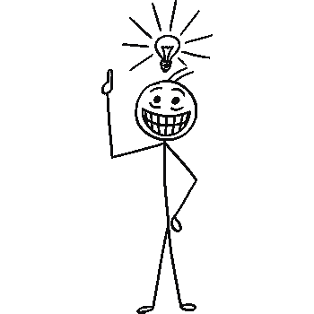
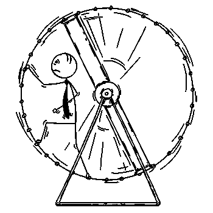
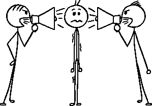
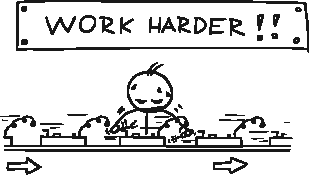

# 工作让您倍感压力？这是我控制混乱的秘密。

> 原文：<https://medium.com/walmartglobaltech/work-got-you-stressed-here-is-my-secret-to-controlling-the-chaos-c5d19c4d450f?source=collection_archive---------0----------------------->

[Zdenek Sasek](https://www.istockphoto.com/vector/conceptual-cartoon-of-depressed-businessman-with-help-sign-gm911645246-250998763)

# **我的启示**

[Zdenek Sasek](https://www.istockphoto.com/vector/vector-cartoon-of-man-with-light-bulb-above-his-head-who-got-great-idea-gm884183384-245855575)

艰难的环境是日常生活的一部分。但在某个时候，我们最终达到了一个心理阈值，在那里，情绪紧张和紧张变得如此压倒一切，以至于我们发现自己处于紧张的境地。

这些年来，我意识到我的大部分压力是自我诱发的。我没有采取积极主动的方法来处理身边的混乱，而是任由周围的环境支配我的生活。听起来熟悉吗？继续阅读。

# **仓鼠轮效应**

[Zdenek Sasek](https://www.istockphoto.com/vector/conceptual-cartoon-of-business-man-running-in-squirrel-wheel-gm901358940-248668559)

仓鼠轮子效应是我用来描述一个人被困在一个连续的例行公事。*仓鼠*代表一个人“被困”在一个混乱的环境中，试图无望地完成*轮所代表的无数任务。*

如果您容易受到以下三个因素的影响，您很容易成为仓鼠轮子效应的受害者:

1.  你允许外界的影响支配你的生活选择
2.  你让自己被不切实际的任务淹没
3.  你允许常规来阻止创新思维

现在想象一下，仓鼠轮子是一个用来完成一个目标的工具，你有能力在任何时候进出轮子，或者决定你想走多快或多慢。

将这一点应用到现实生活中:一旦*您*意识到您可以控制您的环境，就更容易识别您周围的工具以及如何利用它们来为您服务。

# **我控制压力和混乱的秘诀**

[Zdenek Sasek](https://www.istockphoto.com/vector/smiling-businessman-reading-book-and-four-other-business-people-behind-gm859453198-142115295)

在我的职业和个人生活中，有三条基本规则可以帮助我控制仓鼠轮效应。如果您有兴趣减少*生活中的压力和混乱，请继续阅读。*

> ****问题:*** *你任由外界影响决定你的生活选择*
> **解决方法:**规则 1——自我管理还是微观管理*

**

*[Zdenek Sasek](https://www.istockphoto.com/vector/cartoon-of-man-or-businessman-between-two-men-with-loud-speakers-gm931789524-255403459)*

*您是否厌倦了每一个动作都被仔细检查？微观管理是一件痛苦的事情，通往解剖学的最佳途径是在你的目标上取得一致，并就如何衡量你完成确定的任务达成一致。记住，积极主动是关键。如果你不能控制局面，别人会的。*

*自律提示:*

*   *了解自己的局限性**专注于自己的优势***
*   *确保经常与**沟通状态**以建立对进展的信心*
*   ***定义** **解决方案**而非请求许可*

> ****问题:*** *你让自己被不切实际的任务所淹没* **解决方法:**规则 2: —质量胜于数量*

**

*[Zdenek Sasek](https://www.istockphoto.com/vector/cartoon-illustration-of-unhappy-tired-clerk-businessman-office-worker-working-on-gm827787190-134679899)*

*这并不意味着你需要追求完美，而是要在不牺牲质量的情况下理解你的最大速度。简单地说，不要承担超出你能力范围的事情。记住，完成一堆任务的短期荣誉不值得长期认为你的工作不可靠。*

*自律提示:*

*   *了解**你需要完成什么**以及你计划如何完成它*
*   *从客户的角度理解**对质量**的定义*
*   *了解你需要完成工作的**时间框架***

> ****问题:*** *你允许常规阻碍创新思维* **解决方案:**规则三——更聪明地工作。不会更难。*

**

*[Zdenek Sasek](https://www.istockphoto.com/vector/cartoon-of-man-working-at-assembly-line-with-sign-above-gm656987058-119769747)*

*你听说过这样一句话吗，*“如果没坏就别修。”*？在某些情况下，这句话可能是正确的，但是，我相信在探索更聪明地工作的替代方法方面总是有机会的。*

*我最喜欢的聪明工作的例子之一是一项关于古埃及人如何移动巨石建造金字塔的研究。这项研究得出结论，水被用来湿润沙子，有助于减少穿越沙漠运输重物时的摩擦。一个巧妙的技巧(物理学)解开了巨石如何在没有机械辅助的情况下到达沙漠中央的谜团。*

*同样，挑战自己，找到一种更熟练的方法来完成任务。不要让重复扼杀你跳出框框思考的能力。*

*自律提示:*

*   ***有自知之明**。如果你发现自己停滞不前，转向一个新的方向。*
*   *和聪明的人在一起，T21 向别人学习。*
*   ***好奇**。不要总是看事物的表面价值。问为什么。*

# ***走出仓鼠轮***

**

*[Zdenek Sasek](https://www.istockphoto.com/vector/conceptual-cartoon-of-businessman-individuality-standing-out-of-crowd-gm901542052-248716094)*

*你可以选择压力和混乱如何影响你。通过组织你的生活，关注质量，确定完成任务的有效方法，采取积极主动的方法来管理你的环境。这样做，你很快就会从*仓鼠轮子*中走出来。*