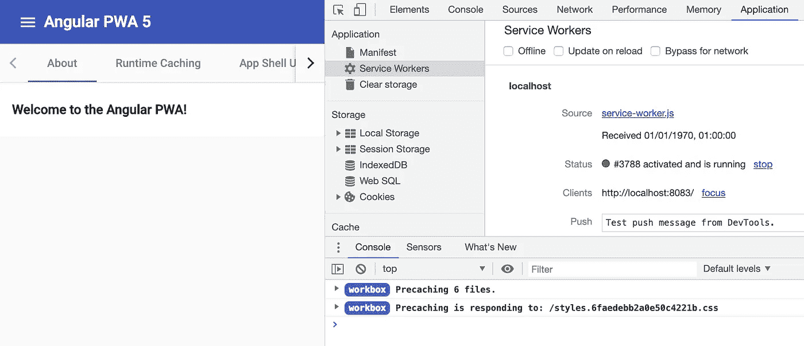
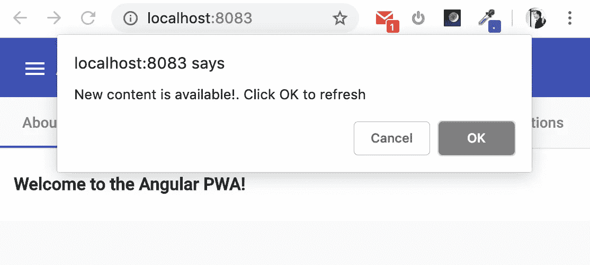

# 工具箱 4:使用工具箱窗口模块实现刷新到更新版本流程

> 原文：<https://medium.com/google-developer-experts/workbox-4-implementing-refresh-to-update-version-flow-using-the-workbox-window-module-41284967e79c?source=collection_archive---------1----------------------->


非常受欢迎的 PWA helper 库的下一个主要版本刚刚发布。工具箱 4 给现有的模块带来了许多有趣的增加，只有[一些小的突破性变化](https://developers.google.com/web/tools/workbox/guides/migrations/migrate-from-v3#breaking_changes)。此外，它还提供了一个名为 [*工具箱窗口*](https://developers.google.com/web/tools/workbox/modules/workbox-window) 的全新模块，以一种简单而强大的方式来满足开发人员的需求，以注册服务人员，挂钩到其生命周期，并提供与应用程序的双向通信渠道。这是在*窗口上下文*中使用的第一个 Workbox 模块，即在我们的应用程序(不是服务人员的)代码中使用。

让我们探索一下这个新模块，看看构建众所周知的“刷新到更新版本”技术(UX PWA 最佳实践之一)需要什么。因为我们在构建应用程序时经常使用这个流程，而 Workbox 现在公开了相应的工具，所以我们只需要找到一个简单且健壮的代码来构建这个流程。这篇文章是我试图找到代码:最小和稳定。但是首先，我所说的这种流动是什么？

# 刷新到更新版本 101

你打开一些网站。几秒钟后，它会显示一些提示/对话，说“该网站的新版本可用。[刷新页面获取]”。在大多数情况下，这意味着:

1.  这是一个服务工作者驱动的起源(如果它也有 Web App Manifest，我们可以称之为 PWA)，您看到的 UI 不是从网络上获取的，而是从浏览器的缓存中获取的
2.  你不久前使用这个浏览器访问了这个网站
3.  在上次访问和当前访问之间，部署的版本已更新

你看到的对话是一种权衡，一种是立即显示应用程序 UI 的可能性，而不是从网络上获取它(使用预缓存版本)，另一种是将应用程序的实际版本交付给用户的需要。那么妥协在哪里呢？事实上，我们仍然从缓存存储中加载应用的预缓存(“旧”)版本，但如果服务人员知道有新版本可用，它会获取更新的资源，更新缓存并向应用发送消息(使用广播频道 API 或 postMessage)。我们捕捉到这条消息，并显示出臭名昭著的“应用程序已更新。点击刷新上传”消息给用户。下一页加载—我们从缓存中提供“新”版本(当然，如果我们的服务人员以正确的方式执行了上面列出的所有操作)。

这种技术的另一个变体——我们不从服务人员那里发送任何信号，而是在我们的应用程序中监听其生命周期的变化。在我们的例子中，由读取字节不同的服务工作器导致的`onupdatefound`和`onstatechange`事件的组合可能意味着服务工作器中注入的“to precache”列表中提到的资源的散列和的改变。反过来，这意味着该应用程序的新版本已经建立——因此我们可以安全地显示“该应用程序已更新”的消息。

# 具有刷新到更新版本流程的 Workbox v3 选项

首先，让我们感谢工具箱维护人员，感谢他们为我们提供了可以在我们自己的服务人员中使用的神奇的`precacheAndRoute()`方法。这种方法处理预缓存、版本维护、获取更新的资源、更新缓存等所有的复杂性。我们只需传递带有资源及其散列和的对象(由来自 Workbox 系列的另一个助手构建——Workbox-build 模块),它就可以工作了。此外，service worker 中的另一行代码:

…我们可以在应用程序代码中收到有关预缓存资源已更新的信号，这正是我们需要向用户显示的信息:

如果需要，我们甚至可以在运行时将相同的插件添加到我们缓存的资源中，以跟踪它们的更新。

为什么我要在关于 Workbox 4 的文章中讲述我们在 Workbox 3 中使用的选项？因为它仍然工作得很好——来自 v3 的与这个流相关的代码不会中断。

第二个选项呢——当我们依赖服务人员生命周期事件时？在 v3 中，我们没有任何助手来在我们的应用程序代码中实际注册我们的工具箱驱动的服务工作者，并订阅它的事件。当然，我们总是可以自己写，或者使用尤雨溪的非常好的[注册服务工作者](https://github.com/yyx990803/register-service-worker)库，那么我们应用程序中的代码看起来会像这样:

但是现在我们有了更强大、更灵活和真正的 Workbox-native 的方式来实现它: [workbox-window 模块](https://developers.google.com/web/tools/workbox/modules/workbox-window)。如文档中所述，本模块的主要功能/目标是:

> 通过帮助开发人员确定服务人员生命周期中最关键的时刻，简化服务人员的注册和更新过程，并使其更容易响应这些时刻。
> 
> 帮助防止开发人员犯最常见的错误。
> 
> 以使在服务工作器中运行的代码和在窗口中运行的代码之间的通信更容易。

让我们使用这个模块来实现上面的 UX 技巧。

# 由 workbox-build 提供支持的刷新到更新版本流程

让我们从头开始。为了演示这个流程，我们需要实现一个服务工作器来预缓存和服务构成我们的应用程序外壳的资源。

以工作箱为动力的服务工作者源文件的极简版本可能看起来像这样:

> 第 8 行和第 9 行在本文的上下文中很重要。你稍后会读到我们为什么需要它们

为什么这是“源文件”？因为我们必须在每次构建应用程序后处理它。准确地说——我们必须将资源列表和它们的散列和作为参数注入到 precache 中用于`precacheAndRoute()`方法(而不是这个空数组)。为了把我们从这个无聊的任务中解救出来，Workbox 有 3 个选项可供选择:Workbox CLI、Webpack 插件和节点模块。最后一个是我的选择:它既不需要全局安装 CLI，也不需要暴露 Webpack 配置文件。安装 [*工具箱-构建*](https://developers.google.com/web/tools/workbox/modules/workbox-build) 模块:

```
npm install workbox-build --save-dev
```

现在，服务工作者构建脚本:

最后一部分是添加`npm run`脚本，一个接一个地结合我们的应用程序和服务人员的构建:

正如您可能注意到的，我在我的例子中使用了一个[Angular app](https://github.com/webmaxru/angular-pwa/tree/workbox-v4)(`ng build --prod`是它的一个构建命令)，但是我在那篇文章中描述的关于 Workbox 模块和 PWA 技术的一切都适用于任何 JavaScript 应用程序。

在我做了`npm run build-pwa`之后，我看到类似这样的东西

```
Generated dist/angular-pwa/service-worker.js, which will precache 6 files, totaling 735289 bytes.
```

分发文件夹中的服务人员现在包含了 Workbox 需要了解的关于我们应用程序的所有信息:

在工作箱 3 中也是如此。但是现在不同开始了:让我们使用*工具箱窗口*在我们的应用程序中注册这个服务人员。首先安装模块:

```
npm install workbox-window
```

> 提示:导入/使用/捆绑此模块有[种不同的场景](https://developers.google.com/web/tools/workbox/modules/workbox-window#importing_and_using_workbox-window)。

现在在我们的应用程序代码中:

一些需要注意的重要事项:

1.  在`register()`方法中没有服务工人特性检测，所以不要忘记在你的代码中有这个(第 3 行)。同时，包含了注册延迟到`window.onload`事件，所以我们不必添加这个额外的包装器。
2.  这段代码应该放在应用程序的什么位置？越晚越好。在您的应用程序完全呈现后使用它，以便服务人员不会与主线程争夺网络和 CPU 资源。对于 Angular 应用程序，最好的位置是在`main.ts`文件中的`bootstrapModule()`调用之后的`then()`块中。

是时候在任何静态 http 服务器上运行我们的应用程序了。我用[发球](https://www.npmjs.com/package/serve):



Running the PWA

这正是我们所期望的:服务人员被注册，一些文件被预缓存。现在，如果你关闭服务器或者在 DevTools 中勾选*离线*复选框，这个应用程序仍然可用。感谢我们的 Workbox-powered 服务人员从缓存存储中提供资源。

> 提示:要获得更详细的日志，只需在 DevTools 中设置相应的日志记录级别——参见截图右下角的*默认级别*下拉列表。

是时候更新我们应用中的一些内容了。我们把标题改成 *Angular PWA 6* 。构建/部署/服务/刷新页面:你仍然可以看到 *Angular PWA 5* 。再次点击浏览器的刷新按钮——现在你会看到新的标题。这是意料之中的，我们的目标是给用户一个提示，当他们看到旧版本时，应用程序实际上已经更新了。workbox-window 公开的一个名为`installed`的监听器将会有所帮助！

现在，每次应用程序更新时，我们都会看到提示:



Refresh-to-update-version

一些注意事项:

1.  我们在代码中有一个额外的条件——`event.isUpdate`。它在那里是因为我们不想在第一次服务人员安装时显示此消息，而只在更新的。这种情况的反转是一个很好的选项，可以显示类似“这个应用程序现在可以离线使用了”的消息
2.  所描述的方法只有在我们通过跳过等待阶段(参见我们的服务工作者代码中的第 8 行和第 9 行)很好地修改服务工作者生命周期时才有效。如果没有这种修改，新的服务人员将不会被激活，直到用户关闭该应用程序的所有打开的标签，因此，他们将看到旧版本。如果出于某种原因，您的项目无法跳过激活步骤，请使用文档中提到的更通用(也更复杂)的[选项。](https://developers.google.com/web/tools/workbox/guides/advanced-recipes#offer_a_page_reload_for_users)
3.  请不要在生产中使用 JavaScript 的`confirm()`方法:)它出现在示例代码中只是为了简单起见。使用您的应用程序所使用的 UI 库中不太显眼且不阻塞的 toast/snackbar。

厉害！现在我们有了非常简洁的代码来帮助我们注册服务人员，并在适当的时候显示新版本可用的消息。

当然，workbox-window 有[许多其他有用的事件](https://developers.google.com/web/tools/workbox/modules/workbox-window#important_service_worker_lifecycle_moments)帮助我们完全控制服务工作者:包括“内部的”(由 workbox-window 注册的)和“外部的”——所有其他的，例如来自一些提供推送通知的第三方服务。此外，它为[与服务人员](https://developers.google.com/web/tools/workbox/modules/workbox-window#window_to_service_worker_communication)的通信提供了一个方便的选项，该选项将通过发布[工作箱-消息](https://github.com/GoogleChrome/workbox/issues/1848)模块进行扩展和标准化。

总而言之:

1.  发布了 workbox 4——用于 PWA 主要网络任务自动化的生产就绪库
2.  新的模块 workbox-window 为开发人员提供了一种便捷的方式来注册服务工作者并监听其生命周期中的事件
3.  我们发现了向用户显示刷新到更新版本流的消息的适当事件

所以，让我们试试全新的[工具箱 4](https://developers.google.com/web/tools/workbox/) 和它的工具箱窗口模块！如果您发现任何问题，[请报告](https://github.com/GoogleChrome/workbox/issues)。如果你想知道所有关于 Workbox 和 PWA 的最新消息，请在 Twitter 上关注我并加入 PWA Slack 团队。我的直接信息随时欢迎您的技术问题，并邀请您在您的会议上谈论 PWA/Workbox 或为您的会议/公司举办 PWA 研讨会。