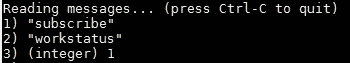
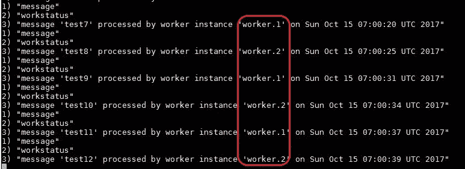

# 在 Oracle 应用容器云上使用工作应用进行异步处理

> 原文：<https://medium.com/oracledevs/worker-applications-on-oracle-application-container-cloud-f449eaa77c39?source=collection_archive---------1----------------------->

这篇博客借助一个例子展示了 Oracle 云上的*工人应用*

1.  Redis 作为一个作业队列(部署在[Oracle Cloud infra structure class I](https://cloud.oracle.com/en_US/compute-classic)c 上)，以及
2.  一个基于 Java 的服务，充当部署到 [Oracle 应用容器云](https://cloud.oracle.com/en_US/application-container-cloud)的异步处理器(也称为工作器)

# 工人应用？

传统上，部署到 Oracle 应用容器云的任何服务都需要绑定到`$PORT`，并获得一个公共 URL。但这实际上并不是所有工作负载/应用类型都需要的——所以你不得不为批处理应用公开一个 REST 端点(我知道我有；-) )

工作者应用程序就是为了解决这类(以及更多)问题而构建的，它们不同于传统的 ACCS 应用程序

*   它们不能通过公共 URL 访问
*   它们不需要[绑定到$PORT 环境变量](https://docs.oracle.com/en/cloud/paas/app-container-cloud/dvcjv/design-considerations.html)

他们将继续享受 ACCS 平台的所有其他功能，如[服务绑定](https://docs.oracle.com/en/cloud/paas/app-container-cloud/csjse/exploring-application-deployments-page.html#GUID-BCD4C8AA-0E1C-490D-92E8-6BAE003F5F5C)等。

> *详见* [*文档*](https://www.oracle.com/pls/topic/lookup?ctx=en/cloud/paas/app-container-cloud/jsewn&id=DVCJV-GUID-3052AEC3-E29F-4341-AB0C-B3D0D415FECA)

## 我应该什么时候使用它们？

*   **异步处理**例如，消费者应用程序处理来自 Oracle Event Hub Cloud Service(Kafka)主题的事件
*   **批处理**例如，定期从 Oracle 数据库云服务中提取和处理数据

在此过程中，您可以使用员工应用程序来

*   调用部署在 Oracle 应用容器云上的传统/常规 web 应用
*   调用外部应用程序和 API

> 展望未来，工作者应用程序将得到丰富，以便与其他公共(和同事)应用程序紧密集成

这篇博客的示例应用程序演示了如何使用工作应用程序进行异步处理

# 示例应用程序

> *代号是* [*可在 Github*](https://github.com/abhirockzz/accs-worker-redis) 上获得

## 概观

它有两个组成部分

*   Redis —充当(工作/作业)队列，帮助将生产者与工人分离。Redis 中的列表数据结构和发布-订阅通道功能得到了利用
*   **Worker apps** —一组消费者应用程序实例，它们从 Redis 队列(列表)中获取消息并处理它们

从平台的角度来看

*   Redis 部署在 Oracle Cloud infra structure Classic 上，使用了针对 Oracle Cloud Marketplace 的 Bitnami 集成
*   如前所述，工作应用运行在 Oracle 应用容器云上


High level system overview

## 流动

*   部署完成后，worker 应用程序将建立一个到 Redis 的(阻塞)连接，在这里它使用`[BRPOP](https://redis.io/commands/brpop)`监听列表/队列中的消息
*   当收到消息时，worker 应用程序处理它并向 Redis 通道发送通知(`[PUBLISH](https://redis.io/commands/publish)`)——订阅(`[SUBSCRIBE](https://redis.io/commands/subscribe)`)该通道的任何侦听器都可以获得处理状态

> *详见* ***测试*** *章节*

## 履行

非常简单——逻辑由两个类组成

*   **Worker.java**—实现`Runnable`，使用`Jedis`客户端与 Redis 交互
*   **自举。Java**——连接一切，充当应用程序的入口点

# 构建和部署

## 建设

*   `git clone [https://github.com/abhirockzz/accs-worker-redis](https://github.com/abhirockzz/accs-worker-redis).git`
*   `mvn clean install`

构建过程将在`target` 目录中创建`accs-worker-redis.zip`

## 推至云

借助 Oracle Application Container Cloud，您在部署应用程序方面有多种选择，从[控制台/UI](http://docs.oracle.com/en/cloud/paas/app-container-cloud/csjse/creating-application.html) 、 [REST API](http://docs.oracle.com/en/cloud/paas/app-container-cloud/apcsr/index.html) 、Oracle 开发人员云( [CI/CD](http://docs.oracle.com/en/cloud/paas/developer-cloud/csdcs/deploying-application-oracle-developer-cloud-service.html#GUID-6FE6D850-65DC-471D-A249-F7CCA9CAB56F) )

这篇博客将利用**PSM CLI**——一个用于管理 Oracle 云服务的强大命令行界面。首先在您的机器上下载并设置 PSM CLI(使用`psm setup` ) — [详细信息请点击](https://docs.oracle.com/en/cloud/paas/java-cloud/pscli/using-command-line-interface-1.html)

然后，

*   `cd <code_directory>`
*   `psm accs push -n workedup -r java -s hourly -m manifest.json -d deployment.json -p target/accs-worker-redis.zip`

一旦执行，异步进程就会启动，CLI 会返回其作业 ID，以便您跟踪应用程序的创建


Push to cloud using PSM CLI

## 检查您的应用程序

您的应用程序应该部署在 Oracle Application Container Cloud 上(注意突出显示的应用程序类型，即 **worker** )


**Worker Application** on Oracle Application Container Cloud

# 测试应用程序

**订阅 Redis 发布订阅频道**

为了接收处理通知，您需要订阅该(Redis)频道。为此，我们将使用`[redis-cli](https://redis.io/topics/rediscli)`

如果你不熟悉`redis-cli`，你可以参考它的文档

*   将 CLI 指向您的 Redis 实例`redis-cli -h redis_host -p redis_port`
*   `subscribe **workstatus**` (其中*工作状态*是通道的名称)



**将项目推送到 red 工作队列**

*   (在新窗口/外壳中)使用`redis-cli`将项目添加到列表(工作队列)`**lpush** workQ “test1”`(其中 *workQ* 是列表的名称)
*   您应该会在发布子频道窗口中看到通知

> *注意消息*中的工人应用程序节点(实例)标识符( ***工人. 1***

**

*Channel notification*

***继续前进……***

*在进入下一步之前，再发送一些消息——您将在发布-订阅通知 shell 中看到响应*

```
*lpush workQ “test2”
lpush workQ “test3”
lpush workQ “test4”
lpush workQ “test5”
lpush workQ “test6”*
```

**

***向外扩展***

*让我们横向扩展到两个实例，以演示工作负载平衡特性，即来自 Redis 列表(工作队列)的消息将由单个工作应用实例处理*

**

*Scaling **out** to two instances*

*将邮件发布到 Redis 列表*

```
*lpush workQ “test7”
lpush workQ “test8”
lpush workQ “test9”
lpush workQ “test10”
lpush workQ “test11”
lpush workQ “test12”*
```

**

*Worker load balancing in action*

> **节点标识符(****worker . n****)被突出显示—注意，不同的实例处理处理，因此负载是平衡的**

# *不要忘记…*

*   *查看 Oracle 应用容器云的教程[——每个运行时都有一些内容！](https://docs.oracle.com/en/cloud/paas/app-container-cloud/create-first-applications.html)*
*   *[应用容器云上的其他博客](http://bit.ly/2gR3nrV)*

*干杯！*

> *本文表达的观点是我个人的观点，不一定代表甲骨文的观点。*