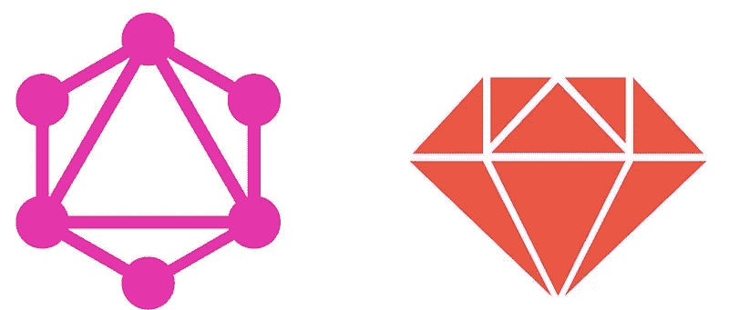
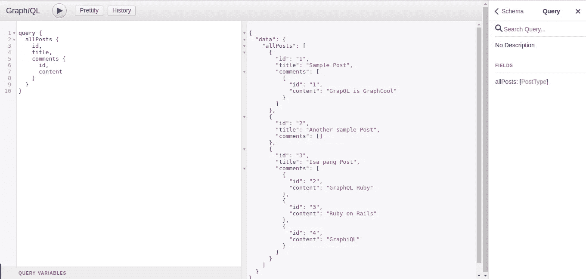
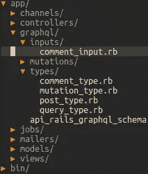
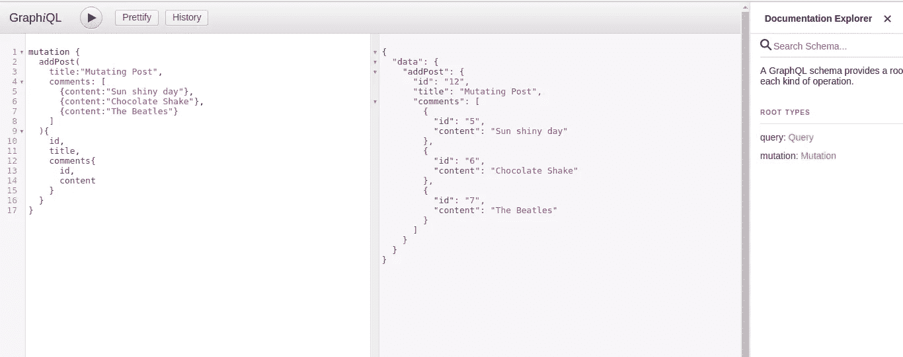

# 在 GraphQL Ruby 中使用数组

> 原文：<https://medium.com/quick-code/working-with-arrays-in-graphql-ruby-d3321fb7a910?source=collection_archive---------0----------------------->



这是一个关于如何在 Ruby 的 graphQL 中用数组 mutate 查询的快速教程。

## 先决条件

本教程假设您正在使用 gem[*graphQL-ruby*](https://github.com/rmosolgo/graphql-ruby)在[*ruby on rails*](http://rubyonrails.org/)*中开发 graph QL。并且正在使用 rails 的 app 内 graphiQL 客户端或者一个 [*单独的 graphiQL 客户端*](https://github.com/graphql/graphiql) *。**

**完整的代码示例在* [***这里***](https://github.com/moseslucas/working-with-arrays-graphql) *。**

# *模型*

**场景*:让我们有一个**帖子**模型和一个**评论**模型，一个**帖子**可以有多个***评论**。**

*****岗位型号*****

```
**# models/post.rbfield :title, type: Stringhas_many :comments**
```

*****评论模式*****

```
**# models/comment.rbfield :content, type: Stringbelongs_to :post**
```

# **GraphQL 类型**

*****岗位类型*****

```
**# app/graphql/types/post_type.rbTypes::PostType = GraphQL::ObjectType.define do
  name "PostType"
 field :id, !types.ID
  field :title, types.String  
end**
```

> **`PostType`将返回一个`id`和`title`字段。**

*****注释类型*****

```
**# app/graphql/types/comment_type.rbTypes::CommentType = GraphQL::ObjectType.define do
  name "CommentType"
 field :id, !types.ID
  field :content, types.String

end**
```

> **`CommentType`将返回一个`id`和`content`字段。**

# **询问**

**让我们有一个返回所有`Post`记录的 graphQL 查询。**

**`***allPosts***`查询**查询查询****

```
**# app/graphql/types/query_type.rb Types::QueryType = GraphQL::ObjectType.define do
  name "Query"field :allPosts, types[Types::PostType] do
    resolve -> (obj, args, ctx) {
      Post.all
    }
end**
```

**上面有一个返回散列数组的查询`Post.all`，将`types[Types::PostType]`声明为返回类型。这意味着，我们将返回一个 **ObjectType** `PostType`的**列表**。Ruby 仍然是十大编程语言之一。因此，强烈推荐[在 2021 年学习 Ruby 编程](https://coursesity.com/free-tutorials-learn/ruby)。**

> **将一个**对象类型**放入`types[]`中，将其作为一个列表。**

**因此，如果我们运行我们的查询:**

```
**query {
  allPosts {
    id,
    title
  }
}**
```

**它将返回一个包含`id`和`title`字段的`Post`记录列表。**

*****样本查询结果*****

```
**{
  "data": {
    "allPosts": [  
      {
        "id": 1,
        "title": "Sample Post"
      },
      {
        "id": 2,
        "title": "Another Post"
      },
      {
        "id": 3,
        "title": "Isa pang Post"
      }
    ]
  }
}**
```

# **用数组查询**

**上面的`allPosts`查询只返回`id`和`title`字段。**

**现在，我们想根据`Post`显示**评论**记录。由于`Post`模型与`Comment`模型相关联，我们应该能够通过向`PostType`添加一个新的`comments`字段来实现这一点。但是没有用标量类型*(例如* `*String*` *，* `*Float*` *，* `*Integer*` *)来定义它，*我们将类型定义为`CommentType`。**

**向`PostType`添加一个新的`comments`字段:**

```
**field :comments, types[Types::CommentType]**
```

> ****重要**:字段名称应该是关联模型的名称。在我们的`Post`模型中，它具有关联:`has_many :comments`因此，我们必须将我们的字段命名为`:comments`。**

**我们的`PostType`现在应该是这样的:**

```
**# app/graphql/types/post_type.rbTypes::PostType = GraphQL::ObjectType.define do
  name "PostType"
 field :id, !types.ID
  field :title, types.String
  field :comments, types[Types::CommentType]

end**
```

**`PostType`现在将返回一个`id`、`title`和一个`comments`的列表。**

**就是这样！测试我们的查询:**

```
**query {
  allPosts {
    id,
    title,
    comments {
      id,
      content
    }
  }
}**
```

*****样本查询结果*****

```
**{
  "data": {
    "allPosts": [
      {
        "id": 1,
        "title": "Sample Post",
        "comments": [
          {
            "id": 1,
            "content": "GraphQL is GraphCool"
          }
        ]
      },
      {
        "id": 2,
        "title": "Another Post",
        "comments": [
          {
            "id": 2,
            "content": "GraphQL Ruby"
          },
          {
            "id": 3,
            "content": "Ruby on Rails"
          },
          {
            "id": 4,
            "content": "GraphiQL"
          }
        ]
      },
      {
        "id": 3,
        "title": "Isa pang Post"
      }
    ]
  }
}**
```

****

# **变化**

**让我们为`Post`设计一个 graphQL 变体，它接受一个`String`的`title`参数。**

**`***addPost***` ***突变*****

```
**# app/graphql/types/mutation_type.rbTypes::MutationType = GraphQL::ObjectType.define do 
  name "Mutation" field :addPost, Types::PostType do
    argument :title, types.String resolve -> (obj, args, ctx) {   
      Post.create title: args[:title]
    }
  end
end**
```

**运行我们的突变:**

```
**mutation {
  addPost (title: "New Post"){
    id,
    title,
    comments{
      id,
      content
    }
  }
}**
```

*****样本突变结果:*****

```
**{
  "data": {
    "addPost": {
      "id": "5",
      "title": "New Post",
      "comments": []
    }
  }
}**
```

**上面的`addPost`突变只保存`title`到`Post`记录。但是如果我们想同时保存很多评论到`Post`呢？**

# **数组变异**

**与我们之前的查询类似，我们可以向`addPost`添加一个新的`comments` **参数**。但是这一次，我们不能给它分配一个**对象类型**。我们需要的是一个接受注释参数的对象类型。我们需要的是一个[**input object type**](http://www.rubydoc.info/github/rmosolgo/graphql-ruby/GraphQL/InputObjectType)**。****

**在`app/graphql`中创建一个名为`inputs`的新文件夹/目录，然后添加一个新文件`comment_input.rb`。**

****

**`***comment_input***` ***突变*****

```
**# app/graphql/inputs/comment_input.rbInputs::CommentInput = GraphQL::InputObjectType.define do
  name "CommentInput" argument :content, !types.String
end**
```

**现在我们可以将这个[**input object type**](http://www.rubydoc.info/github/rmosolgo/graphql-ruby/GraphQL/InputObjectType)赋值给一个参数。**

*****添加*** `***comments***` ***自变量到*** `***addPost***` ***突变*****

```
**# app/graphql/types/mutation_type.rbTypes::MutationType = GraphQL::ObjectType.define do 
  name "Mutation" field :addPost, Types::PostType do argument :title, types.String
      argument :comments, types[Inputs::CommentInput] resolve -> (obj, args, ctx) {   
        Post.create title: args[:title]
      }
  end
end**
```

**现在我们的`addPost`将接受一个`comment_input`数组，其中每个`comment_input`都有一个`content`参数。**

*****重构*** `***addPost***` ***保存评论:*****

```
**Types::MutationType = GraphQL::ObjectType.define do 
  name "Mutation"

  field :addPost, Types::PostType do argument :title, types.String   
    argument :comments, types[Inputs::CommentInput] resolve -> (obj, args, ctx) {   
      post = Post.create title: args[:title] 

      # if comments arguments are not empty, save it to post      if args[:comments]
        args[:comments].each do |comment|
          post.comments.create content: comment.content
        end
      end #returns post 
      post
    }
  end
end** 
```

**现在，让我们试试我们的突变:**

```
**mutation {
  addPost(
    title:"Mutating Post",
    comments: [
      {content:"Sun shiny day"},
      {content:"Chocolate Shake"},
      {content:"The Beatles"}
    ]
  ){
    id,
    title,
    comments{
      id,
      content
    }
  }
}**
```

*****结果:*****

```
**{
  "data": {
    "addPost": {
      "id": "6",
      "title": "Mutating Post",
      "comments": [
        {
          "id": "8",
          "content": "Sun shiny day"
        },
        {
          "id": "9",
          "content": "Chocolate Shake"
        },
        {
          "id": "10",
          "content": "The Beatles"
        }
      ]
    }
  }
}**
```

****

# ****总结****

1.  **查询数组-使用**对象类型**作为字段类型。然后将其放入`types[]`中声明为列表。例:`field :comments, types[Types::CommentType]`。**
2.  **变异数组-使用 **InputObjectType** 作为参数类型。然后将其封装在`types[]`中，作为列表。如`argument :comments, types[Inputs::CommentInput]`。**

****

> **就是这样！幸福的 graphQL。谢谢！\m/**